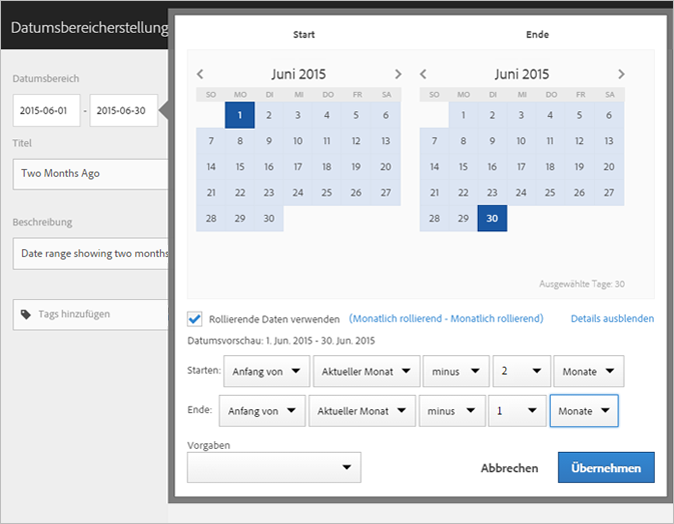
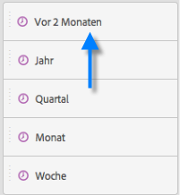
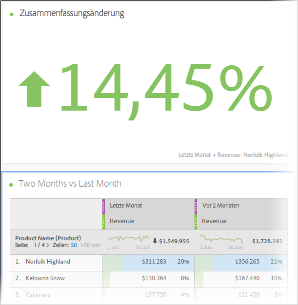
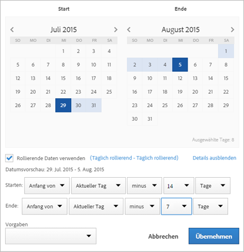

# Benutzerdefinierte Datumsbereiche erstellen

Erstellen Sie benutzerdefinierte Datumsbereiche in Analysis Workspace und speichern Sie sie als Zeitkomponenten.

**[!UICONTROL Komponenten]** > **[!UICONTROL Neuer Datumsbereich]**

Ein Datumsbereich wird auf der Bereichsebene angewendet. Klicken Sie, um einen Datumsbereich zu Ihrem Projekt hinzuzufügen, auf **Bedienfelder** > *`<select panel>`* und legen Sie einen neuen Datumsbereich fest.

## Datumsbereich für „Vor zwei Monaten“ {#section_C4109C57CB444BB2A79CC8082BD67294}

Der folgende benutzerdefinierte Datumsbereich zeigt den Bereich vor zwei Monaten mit einer Visualisierung der Zusammenfassungsänderung, die eine Trend-Entwicklung anzeigt.

Der benutzerdefinierte Datumsbereich wird in Ihrem Projekt oben auf dem Komponentenbereich für den [!UICONTROL Datumsbereich] angezeigt:

Sie können diesen benutzerdefinierten Datumsbereich auf eine Spalte neben einem benutzerdefinierten, monatlichen rollierenden Datumsbereich ziehen und die Voreinstellung für den letzten Monat für den Vergleich nutzen. Fügen Sie eine Visualisierung der Sammeländerung hinzu und wählen Sie die Gesamtsummen der einzelnen Spalten aus, um eine Trendentwicklung zu zeigen:

## Verwenden eines 7-Tage-Datumsbereichs {#section_7EF63B2E9FF54D2E9144C4F76956A8DD}

Ein Datumsbereich wird auf der Bereichsebene angewendet. Klicken Sie, um einen Datumsbereich zu Ihrem Projekt hinzuzufügen, auf **Aktionen** > **Bereich hinzufügen** und geben Sie einen neuen Datumsbereich an.

Im Datumsbereich-Builder können Sie einen benutzerdefinierten Datumsbereich erstellen, der zusammen mit anderen Datumsbereichen im Komponentenbereich angezeigt wird.

Sie können z. B. einen Datumsbereich erstellen, der ein rollierendes Zeitfenster von 7 Tagen anzeigt, das vor einer Woche endet:

Verwenden Sie *`rolling daily`*.

* Die Starteinstellung lautet *`current day minus 14 days`*.

* Die Endeinstellung lautet *`current day minus 7 days`*.

Dieser Datumsbereich kann eine Komponente sein, die Sie auf eine beliebige Freiformtabelle ziehen können.
