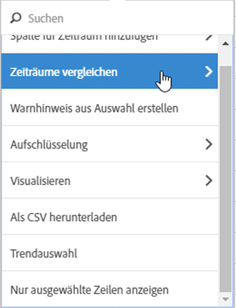
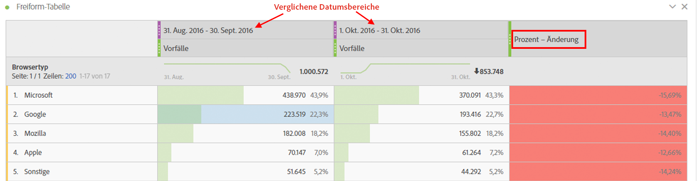
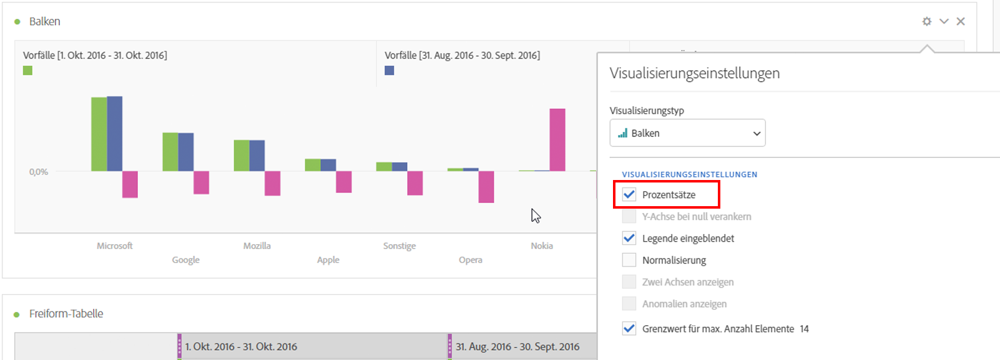
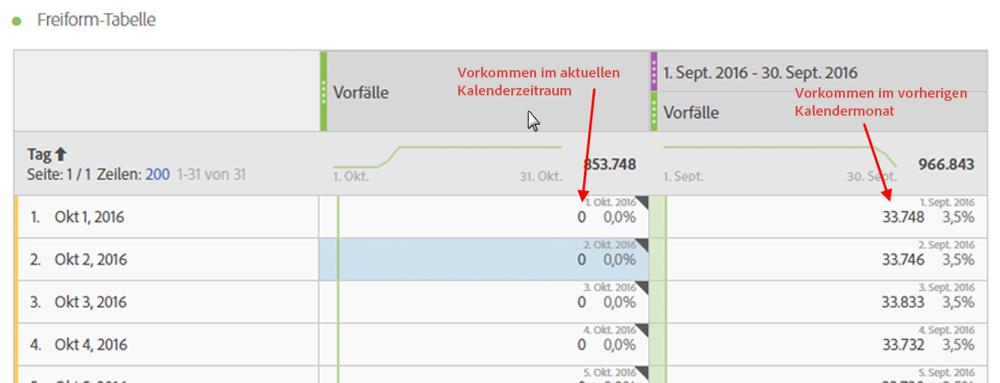
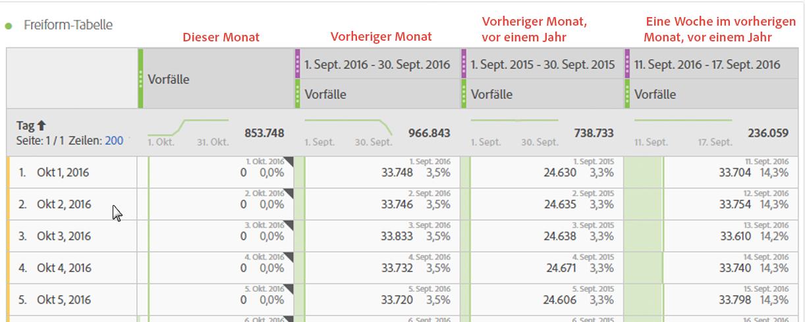
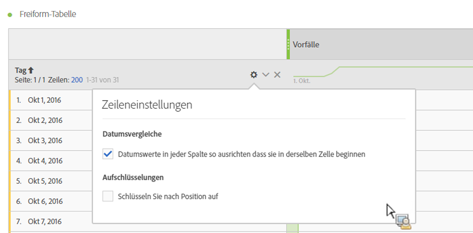

# Datumsvergleich

Mit dem Datumsvergleich in Analysis Workspace können Sie mit einer Spalte, die einen Datumsbereich enthält, einen standardmäßigen Datumsvergleich erstellen, z. B. Jahres-, Quartals-, Monatsvergleich usw.

## Zeiträume vergleichen {#section_C4E36BFE0F5C4378A74E705747C9DEE4}

Für Analysen wird Kontext benötigt, der oft durch einen vorherigen Zeitraum bereitgestellt wird. Beispielsweise ist „Wie viel besser/schlechter geht es uns als zu diesem Zeitpunkt letztes Jahr?“ eine Kernfrage, um Ihr Geschäft zu verstehen. Der Datumsvergleich enthält automatisch eine Spalte „Differenz“, die die prozentuale Veränderung im Vergleich zu einem bestimmten Zeitraum angibt.

1. Erstellen Sie eine Freiformtabelle mit beliebigen Dimensionen und Metriken, die Sie mit einem bestimmten Zeitraum vergleichen möchten.
1. Klicken Sie mit der rechten Maustaste auf eine Tabellenzeile und wählen Sie **[!UICONTROL Compare Time Periods]**.

   

   >[!IMPORTANT]
   >
   >Diese Rechtsklickoption ist für Metrikzeilen, Datumsbereichzeilen und Zeitdimensionszeilen deaktiviert.

1. Je nachdem, wie Sie den Datumsbereich der Tabelle festgelegt haben, stehen die folgenden Optionen zum Vergleich zur Verfügung:

   | Option | Beschreibung |
   |---|---|
   | **[!UICONTROL Prior week/month/quarter/year to this date range]** | Vergleich mit der Woche/dem Monat usw. unmittelbar vor diesem Datumsbereich. |
   | **[!UICONTROL This week/month/quarter/year last year]** | Vergleich mit demselben Datumsbereich vor einem Jahr. |
   | **[!UICONTROL Select range]** | Ermöglicht die Auswahl eines benutzerdefinierten Datumsbereichs. |

   >[!NOTE]
   >
   >Wenn Sie eine benutzerdefinierte Anzahl von Tagen auswählen, z. B. 7. Oktober bis 20. Oktober (ein Zeitraum von 14 Tagen), erhalten Sie nur 2 Optionen: **[!UICONTROL Prior 14 days before this date range]** und **[!UICONTROL Select range]**.

1. Der resultierende Vergleich sieht wie folgt aus:

   

   Zeilen in der Spalte „Prozentwertänderung“ sind rot bei negativen Werten und grün bei positiven Werten.

1. (Optional) Wie bei allen anderen Workspace-Projekten können Sie basierend auf diesen Zeitvergleichen Visualisierungen erstellen. Hier ist z. B. ein Balkendiagramm:

   

   Note that in order to show the percentage change in the bar chart, you have to have the [!UICONTROL Percentages] setting checked in the [!UICONTROL Visualization Settings].

## Eine Zeitraumspalte zum Vergleich hinzufügen {#section_93CC2B4F48504125BEC104046A32EB93}

Sie können jetzt Zeiträume zu allen Spalten in einer Tabelle hinzufügen. So können Sie einen Zeitraum hinzufügen, der von dem abweicht, auf den Ihr Kalender eingestellt ist. Dies ist eine weitere Möglichkeit, um Daten zu vergleichen.

1. Klicken Sie mit der rechten Maustaste auf eine Spalte in der Tabelle und wählen Sie **[!UICONTROL Add Time Period Column]**

1. Je nachdem, wie Sie den Datumsbereich der Tabelle festgelegt haben, stehen die folgenden Optionen zum Vergleich zur Verfügung:

   | Option | Beschreibung |
   |---|---|
   | **[!UICONTROL Prior week/month/quarter/year to this date range]** | Fügt eine Spalte mit der Woche/dem Monat usw. unmittelbar vor diesem Datumsbereich hinzu. |
   | **[!UICONTROL This week/month/quarter/year last year]** | Fügt denselben Datumsbereich des Vorjahres hinzu. |
   | **[!UICONTROL Select range]** | Ermöglicht die Auswahl eines benutzerdefinierten Datumsbereichs. |

   >[!NOTE]
   >
   >Wenn Sie eine benutzerdefinierte Anzahl von Tagen auswählen, z. B. 7. Oktober bis 20. Oktober (ein Zeitraum von 14 Tagen), erhalten Sie nur 2 Optionen: **[!UICONTROL Prior 14 days before this date range]** und **[!UICONTROL Select range]**.

1. Der Zeitraum wird am Anfang der ausgewählten Spalte eingefügt:

   

1. Sie können so viele Zeitspalten hinzufügen, wie Sie möchten, sowie verschiedene Datumsbereiche kombinieren:

   

1. Sie können außerdem nach jeder Spalte sortieren. Dadurch wird die Reihenfolge der Tage abhängig von der jeweiligen Spalte geändert.

## Beginn der Spaltendaten an derselben Zeile ausrichten {#section_5085E200082048CB899C3F355062A733}

Mit einer neuen Einstellung für alle Tabellen können Sie **[!UICONTROL Align Dates from each column to all start on the same row (applies to entire table)]** arbeiten. „Wird auf die gesamte Tabelle angewendet“ bedeutet, dass, wenn Sie z. B. eine Aufschlüsselung in der Tabelle durchführen und diese Einstellung für die Aufschlüsselung ändern, die Einstellung für die gesamte Tabelle geändert wird.

>[!IMPORTANT]
>
>Diese Einstellung ist für alle bestehenden Projekte **deaktiviert** und für alle neuen Projekte **aktiviert**.

Beispiel: Wenn Sie die Daten in einem Monatsvergleich zwischen Oktober und September 2016 ausrichten, beginnt die linke Spalte mit dem 1. Oktober und die rechte Spalte mit dem 1. September:

<!-- 

See Jonny Moon's email from November 3. 

 -->

