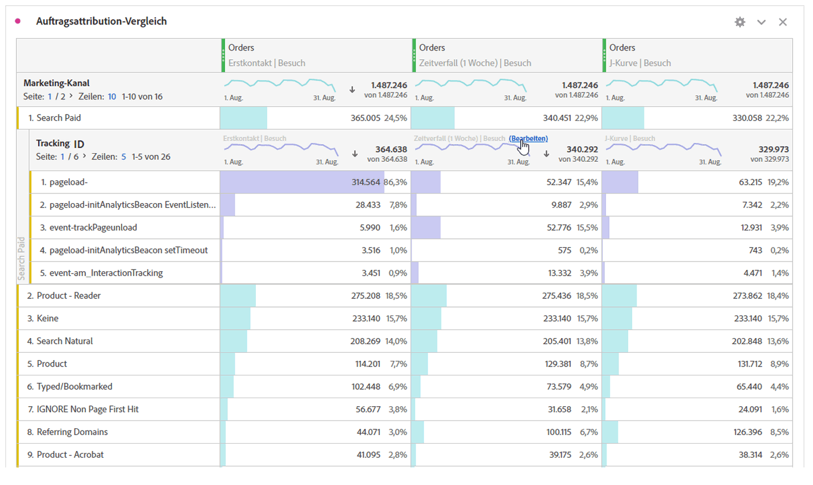

# Dimensionen aufschlüsseln

Schlüsseln Sie Dimensionen und Dimensionselemente in Analysis Workspace auf.

Sie können Ihre Daten für Ihre spezifischen Anforderungen unbegrenzt aufschlüsseln. Erstellen Sie Abfragen mithilfe relevanter Metriken, Dimensionen, Segmente, Zeitachsen und anderer Aufschlüsselungswerte für die Analyse.

1. [Erstellen Sie ein Projekt](/help/analyze/analysis-workspace/home.md) mit einer Datentabelle.
1. Klicken Sie in der Datentabelle mit der rechten Maustaste auf einen Zeileneintrag und wählen Sie **[!UICONTROL Aufschlüsselung]** > *`<item>`* aus.

   

   Sie können Metriken nach Dimensionselementen oder Zielgruppensegmenten über ausgewählte Zeiträume aufschlüsseln. Sie können auch noch granularer aufschlüsseln.

   >[!NOTE]
   >
   >Die Anzahl der in der Tabelle angezeigten Aufschlüsselungen ist auf 200 beschränkt. Für das Exportieren von Aufschlüsselungen ist diese Einschränkung höher.

[Hinzufügen von Dimensionen und Metriken zu Ihrem Projekt in Analysis Workspace](https://docs.adobe.com/content/help/en/analytics-learn/tutorials/analysis-workspace/metrics/adding-dimensions-and-metrics-to-your-project-in-analysis-workspace.html) (11:39)

[Arbeiten mit Dimensionen in einer Freiformtabelle](https://docs.adobe.com/content/help/en/analytics-learn/tutorials/analysis-workspace/building-freeform-tables/working-with-dimensions-in-a-freeform-table.html) (15:35)

## Attributionsmodelle auf Aufschlüsselungen anwenden

Auf jede Aufschlüsselung innerhalb einer Tabelle kann auch ein beliebiges Attributionsmodell angewandt werden. Dieses Attributionsmodell kann mit der übergeordneten Spalte identisch sein oder sich von ihr unterscheiden. Sie können beispielsweise lineare Bestellungen in Ihrer Dimension „Marketing-Kanäle“ analysieren, jedoch U-förmige Bestellungen auf spezifische Trackingcodes in einem Kanal anwenden. Bewegen Sie zum Bearbeiten des auf eine Aufschlüsselung angewendeten Attributionsmodells einfach den Mauszeiger auf das Aufschlüsselungsmodell und klicken Sie auf **[!UICONTROL Bearbeiten]**:

