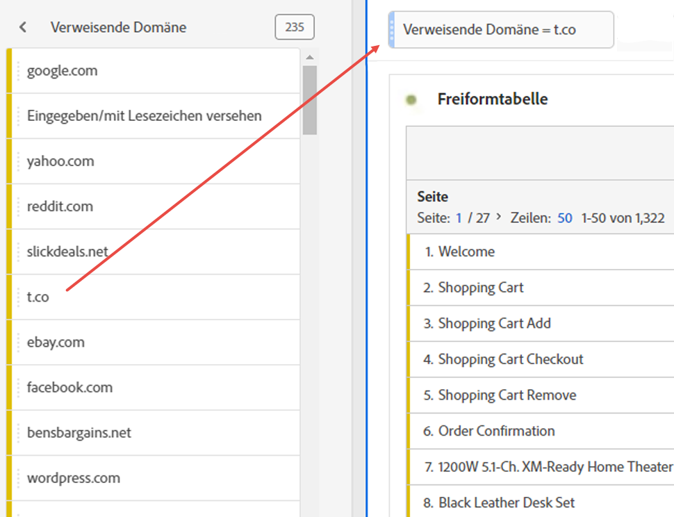

# Ad-hoc-Projektsegmente

Mit Ad-hoc-Projektsegmenten können Sie beliebige Komponenten direkt in die Dropzone des Bedienfelds ziehen, um ein Segment zu erstellen. Das Segment wird zu einem [Segment auf Projektebene](https://experienceleague.adobe.com/docs/analytics/analyze/analysis-workspace/components/segments/quick-segments.html?#what-are-project-only-segments%3F) lokal auf das aktuelle Projekt verweist.

Hier finden Sie ein Video zum Erstellen von Ad-hoc-Projektsegmenten:

>[!VIDEO](https://video.tv.adobe.com/v/23978/?quality=12)

1. Legen Sie einen beliebigen Komponententyp (Dimension, Dimensionselement, Ereignis, Metrik, Segment, Segmentvorlage, Datumsbereich) oben in einem Panel in der Ablagefläche für Segmente ab. Komponententypen werden automatisch in Ad-hoc-Segmente oder [Schnellsegmente](https://experienceleague.adobe.com/docs/analytics/analyze/analysis-workspace/components/segments/quick-segments.html) wenn kompatibel.
Hier ist ein Beispiel für das Erstellen eines Segments für die Twitter-Referrer-Domain:

   

   In Ihrem Panel wird dieses Segment automatisch angewendet und Sie können die Ergebnisse sofort sehen.

1. Sie können einem Bedienfeld eine unbegrenzte Anzahl von Segmenten hinzufügen.
1. Wie Sie dieses Segment speichern können, lesen Sie im folgenden Abschnitt.

Beachten Sie:

* Folgende Komponenten können Sie **nicht** im Segmentbereich ablegen: berechnete Metriken und Dimensionen/Metriken, aus denen Sie keine Segmente erstellen können.
* Bei vollständigen Dimensionen und Ereignissen erstellt Analysis Workspace Hit-Segmente mit „vorhanden“. Beispiele: `Hit where eVar1 exists` oder `Hit where event1 exists`.
* Wenn „nicht angegeben“ oder „keine“ im Segmentablagebereich abgelegt werden, werden sie automatisch in ein Segment mit „nicht vorhanden“ umgewandelt, damit sie bei der Segmentierung korrekt gehandhabt werden.

Einen Vergleich der verschiedenen Segmente, die Sie in einem Projekt erstellen und anwenden können, finden Sie unter [here](/help/analyze/analysis-workspace/components/segments/t-freeform-project-segment.md).

## Speichern von Ad-hoc-Segmenten {#ad-hoc-save}

Ad-hoc-Segmente können anderen Projekten durch Speichern zur Verfügung gestellt werden.

1. Bewegen Sie den Mauszeiger auf das Segment im Ablagebereich und klicken Sie auf das Symbol „i“.
1. Klicken Sie auf den Stift &quot;Bearbeiten&quot;, um zum Segment Builder zu wechseln.
1. Aktivieren Sie die Option **[!UICONTROL Für alle Projekte verfügbar machen und der Komponentenliste hinzufügen]**.
1. Klicken Sie auf **[!UICONTROL Speichern]**.

Nach dem Speichern ist das Segment in der Komponentenliste der linken Leiste verfügbar und kann mit anderen Benutzern über den Segment-Manager freigegeben werden.
