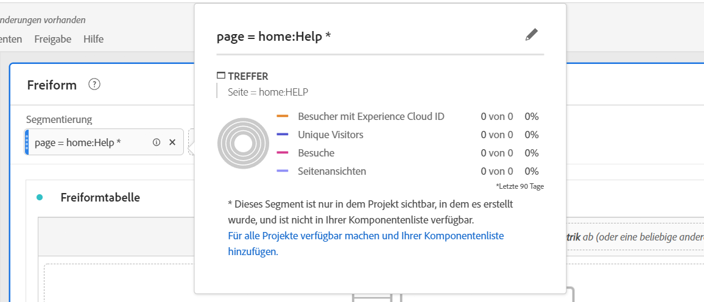

# Ad-hoc-Projektsegmente

Hier finden Sie ein Video zum Erstellen von Ad-hoc-Projektsegmenten:

>[!VIDEO](https://video.tv.adobe.com/v/23978/?quality=12)

Mit Ad-hoc-Projektsegmenten können Sie schnell feststellen, wie sich ein Segment auf Ihr Projekt auswirken könnte, ohne den Segment Builder aufrufen zu müssen. Stellen Sie sich diese Segmente als temporäre Segmente auf Projektebene vor. Sie sind nicht Teil Ihrer Segmentbibliothek wie Komponentensegmente in der linken Leiste. Sie können sie jedoch wie unten dargestellt speichern.

Einen Vergleich zwischen Ad-hoc-Projektsegmenten und vollständigen Komponentensegmenten finden Sie [hier](/help/analyze/analysis-workspace/components/segments/t-freeform-project-segment.md).

1. Legen Sie einen beliebigen Komponententyp (Dimension, Dimensionselement, Ereignis, Metrik, Segment, Segmentvorlage, Datumsbereich) oben in einem Panel in der Ablagefläche für Segmente ab. Komponententypen werden automatisch in Segmente umgewandelt.
Hier ist ein Beispiel für das Erstellen eines Segments für die Twitter-Referrer-Domain:

   

   In Ihrem Panel wird dieses Segment automatisch angewendet und Sie können die Ergebnisse sofort sehen.

1. Sie können einem Panel eine unbegrenzte Anzahl von Komponenten hinzufügen.
1. Wie Sie dieses Segment speichern können, lesen Sie im folgenden Abschnitt.

Beachten Sie:

* Folgende Komponenten können Sie **nicht** im Segmentbereich ablegen: berechnete Metriken und Dimensionen/Metriken, aus denen Sie keine Segmente erstellen können.
* Bei vollständigen Dimensionen und Ereignissen erstellt Analysis Workspace Hit-Segmente mit „vorhanden“. Beispiele: `Hit where eVar1 exists` oder `Hit where event1 exists`.
* Wenn „nicht angegeben“ oder „keine“ im Segmentablagebereich abgelegt werden, werden sie automatisch in ein Segment mit „nicht vorhanden“ umgewandelt, damit sie bei der Segmentierung korrekt gehandhabt werden.

>[!NOTE]
>
>Auf diese Weise erstellte Segmente sind interne Segmente des Projekts.

## Ad-hoc-Projektsegmente speichern {#ad-hoc-save}

Sie können diese Segmente wie folgt speichern:

1. Bewegen Sie den Mauszeiger auf das Segment im Ablagebereich und klicken Sie auf das Symbol „i“.
1. Klicken Sie dann im angezeigten Informations-Panel auf **[!UICONTROL Speichern]**.

   

## Was sind reine Projektsegmente?

Reine Projektsegmente sind entweder Schnellsegmente oder Workspace-Projektsegmente. Wenn Sie sie in Segment Builder bearbeiten/öffnen, wird das Feld „Nur Projekt“ angezeigt. Wenn ein Schnellsegment in Builder angewendet wird, aber das Kontrollkästchen „Verfügbar machen“ nicht aktiviert wird, ist es weiterhin ein reines Projektsegment, kann aber nicht mehr im Quick Segment Builder geöffnet werden. Wenn das Kontrollkästchen markiert und das Segment gespeichert wird, wird es zu einem Segment der Komponentenliste.