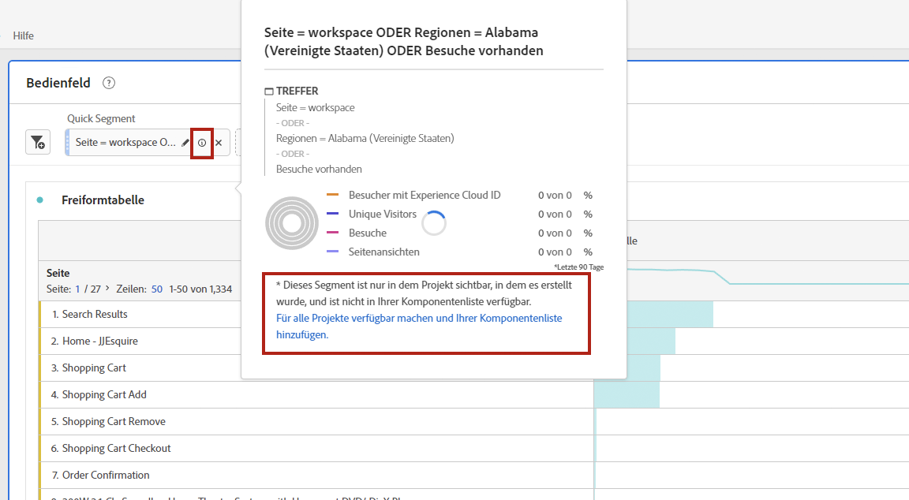
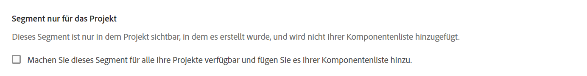

# Schnellsegmente

Sie können innerhalb eines Projekts schnelle Segmente erstellen, um die Komplexität des vollständigen [Segment Builders](/help/components/segmentation/segmentation-workflow/seg-build.md) zu umgehen. Einen Vergleich dessen, was Schnellsegmente im Vergleich zu vollständigen Komponentensegmenten tun können, finden Sie unter [hier](/help/analyze/analysis-workspace/components/segments/t-freeform-project-segment.md). Schnellsegmente ermöglichen bis zu 3 Regeln und berücksichtigen keine verschachtelten Container oder sequenziellen Segmente.

>[!IMPORTANT]
> Schnellsegmente werden derzeit nur eingeschränkt getestet und sind noch nicht allgemein verfügbar.

## Schnellsegmente erstellen

Klicken Sie in einer Freiformtabelle auf das Symbol filter+ in der Bedienfeldüberschrift:

| Einstellung | Beschreibung |
| --- | --- |
| Name | Der Standardname eines Segments ist eine Kombination der Regeln im Segment. Sie können das Segment umbenennen. |
| Ein-/Ausschließen | Sie können Komponenten in Ihrer Segmentdefinition ein- oder ausschließen, nicht jedoch in beidem. |
| Treffer-/Besuchs-/Besucherbehälter | Schnellsegmente enthalten nur einen [Segmentcontainer](https://experienceleague.adobe.com/docs/analytics/components/segmentation/seg-overview.html?lang=en#section_AF2A28BE92474DB386AE85743C71B2D6) , mit dem Sie eine Dimension/Metrik/einen Datumsbereich in das Segment einbeziehen (oder daraus ausschließen) können.  Besucher enthält übergreifende Daten, die für den Besucher über Besuche und Seitenansichten hinweg spezifisch sind. Mit einem [!UICONTROL Besuchsbehälter] können Sie Regeln festlegen, mit denen die Besucherdaten auf der Grundlage von Besuchen aufgeschlüsselt werden, und einen [!UICONTROL Trefferbehälter] , mit dem die Besucherinformationen auf der Grundlage einzelner Seitenansichten aufgeschlüsselt werden. Der Standardcontainer ist [!UICONTROL Hit]. |
| Komponenten (Dimension/Metrik/Datumsbereich) | Definieren Sie bis zu 3 Regeln, indem Sie Komponentendimensionen und/oder Metriken und/oder Datumsbereiche hinzufügen. Es gibt 3 Möglichkeiten, die richtige Komponente zu finden:<ul><li>Beginnen Sie mit der Eingabe und der [!UICONTROL Schnellsegment]-Builder findet automatisch die entsprechende Komponente.</li><li>Verwenden Sie die Dropdownliste, um die Komponente zu finden.</li><li>Ziehen Sie Komponenten per Drag-and-Drop aus der linken Leiste.</li></ul> |
| Operator | Verwenden Sie das Dropdown-Menü, um Standardoperatoren wie `contains` und [!UICONTROL Distinct Count]-Operatoren zu finden. |
| Pluszeichen (+) | Eine weitere Regel hinzufügen |
| Und/Oder-Kennzahlen | Sie können den Regeln &quot;AND&quot;- oder &quot;OR&quot;-Kennungen hinzufügen, aber Sie können &quot;AND&quot;und &quot;OR&quot;nicht in einer Segmentdefinition kombinieren. |
| Übernehmen | Wenden Sie dieses Segment auf das Bedienfeld an. |
| Builder öffnen | Öffnet den Segment Builder. |
| Abbrechen | Abbrechen dieses Schnellsegments - wenden Sie es nicht an. |
| Datumsbereich | Der Validator verwendet den Datumsbereich des Bedienfelds für die Datensuche. Jeder Datumsbereich, der in einem Schnellsegment angewendet wird, überschreibt jedoch den Datumsbereich des Bedienfelds oben im Bedienfeld. |
| Vorschau (oben rechts) | Hiermit können Sie sehen, ob Sie über ein gültiges Segment verfügen und wie breit das Segment ist. Stellt die Aufschlüsselung des Datensatzes dar, den Sie bei Anwendung dieses Segments erwarten können. |

Hier ist ein Beispiel für ein Segment, das Dimensionen und Metriken kombiniert:

Das Segment wird oben angezeigt. Beachten Sie die graue Seitenleiste im Gegensatz zur blauen Seitenleiste für Segmente auf Komponentenebene in der Segmentbibliothek auf der linken Seite.

## Schnellsegmente bearbeiten

1. Bewegen Sie den Mauszeiger über das Schnellsegment und wählen Sie das Stiftsymbol aus.
1. Bearbeiten Sie die Segmentdefinition oder den Segmentnamen.

## Schnellsegmente speichern

Sie können Schnellsegmente entweder im Schnellsegmentaufbau oder durch die folgenden Schritte speichern.

>[!IMPORTANT]
>Nachdem Sie das Segment gespeichert oder angewendet haben, können Sie es nicht mehr im Quick Segment Builder bearbeiten, sondern nur noch im regulären Segment Builder.

1. Bewegen Sie den Mauszeiger über das Schnellsegment und wählen Sie das Infosymbol (&quot;i&quot;) aus.
1. Wählen Sie **[!UICONTROL Segment speichern]**

   

1. Belassen Sie den Namen unverändert oder benennen Sie das Segment um.

   Gehen Sie zurück zu Workspace und sehen Sie, wie das Segment jetzt über eine blaue Seitenleiste verfügt. Dies weist darauf hin, dass es nicht mehr im Schnellsegmentaufbau bearbeitet/geöffnet werden kann. Und durch Speichern wird sie Teil der Komponentenliste.

   

Nachdem Sie das Segment angewendet haben, können Sie es Ihrer Segmentkomponentenliste hinzufügen und für alle Ihre Projekte verfügbar machen.

1. Bewegen Sie den Mauszeiger über das gespeicherte Segment und wählen Sie das Stiftsymbol aus.

1. Beachten Sie dieses Dialogfeld oben im Segment Builder:

   

1. Aktivieren Sie das Kontrollkästchen neben **[!UICONTROL Stellen Sie dieses Segment für alle Projekte zur Verfügung und fügen Sie es zur Komponentenliste hinzu.]**
1. Klicken Sie auf **[!UICONTROL Speichern]**.
1. Das Segment wird jetzt in Ihrer Segmentkomponentenliste für alle Ihre Projekte angezeigt.
1. Sie können auch [das Segment](/help/components/segmentation/segmentation-workflow/t-seg-share.md) für andere Personen in Ihrer Organisation freigeben.

## Was sind reine Projektsegmente?

Nur-Projekt-Segmente sind entweder Schnellsegmente oder Ad-hoc-Workspace-Projektsegmente. Wenn Sie sie im Segment Builder bearbeiten/öffnen, wird das Feld &quot;Nur Projekt&quot;angezeigt. Wenn sie ein kurzes Segment im Builder anwenden, aber nicht das Kontrollkästchen &quot;Verfügbar machen&quot;aktivieren, ist es weiterhin ein reines Projekt-Segment, kann jedoch nicht mehr im QS-Builder geöffnet werden. Wenn sie das Kontrollkästchen aktivieren und SPEICHERN, ist es jetzt ein Komponentensegment.