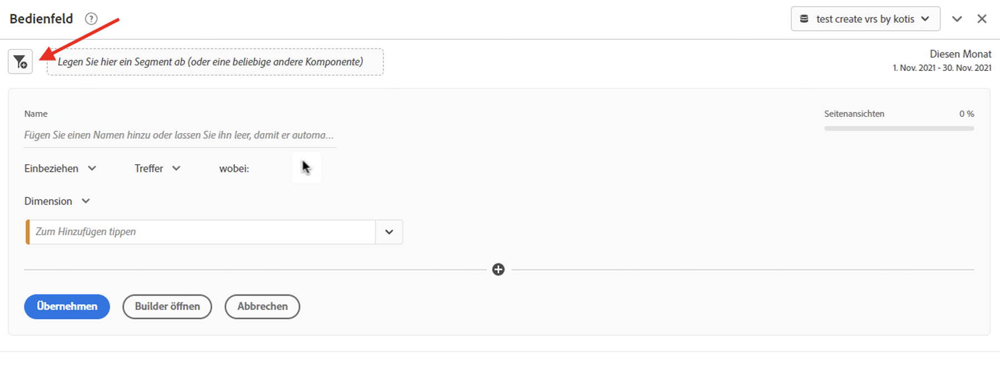
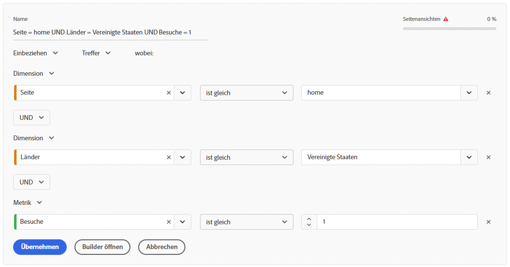
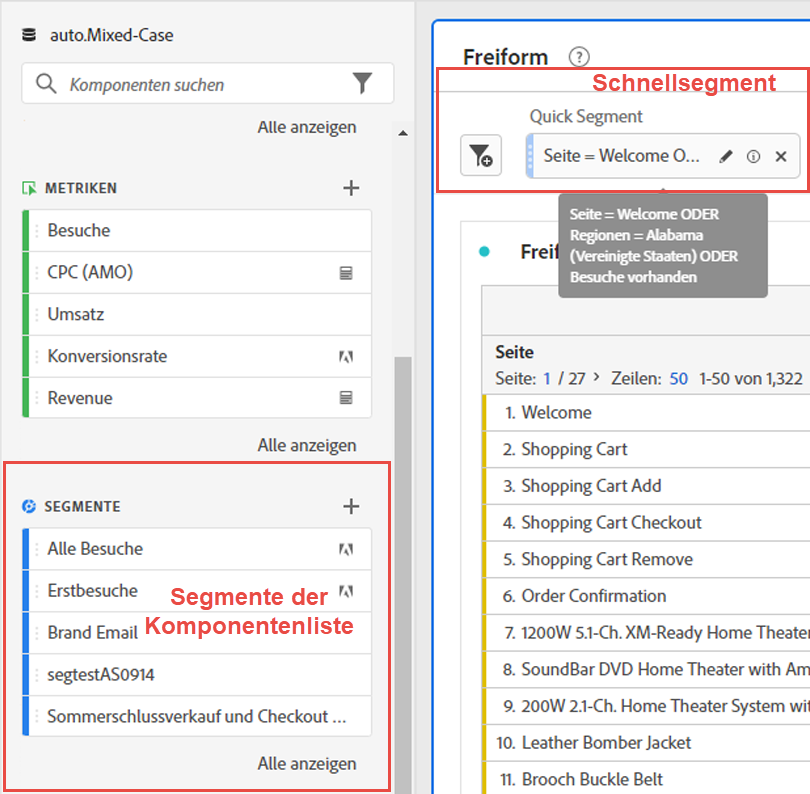
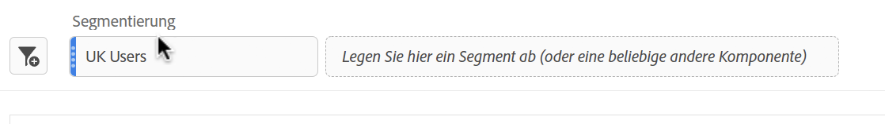

# Schnellsegmente

Sie können innerhalb eines Projekts schnelle Segmente erstellen, um die Komplexität des vollständigen [Segment Builders](/help/components/segmentation/segmentation-workflow/seg-build.md) zu umgehen. Einen Vergleich dessen, was Schnellsegmente im Vergleich zu vollständigen Komponentensegmenten tun können, finden Sie unter [hier](/help/analyze/analysis-workspace/components/segments/t-freeform-project-segment.md).

>[!IMPORTANT]
> Schnellsegmente werden derzeit nur eingeschränkt getestet und sind noch nicht allgemein verfügbar.

## Schnellsegmente erstellen

1. Klicken Sie in einer Freiformtabelle auf das Symbol filter+ in der Bedienfeldüberschrift:

   

   Beachten Sie, dass:

   - Es gibt nur einen Segmentbehälter, mit dem Sie eine Dimension/Metrik/einen Datumsbereich in das Segment einbeziehen (oder daraus ausschließen) können.
   - Sie können den Behälter auf Treffer-, Besuchs- oder Besucherebene festlegen. Der Standardwert ist &quot;Treffer&quot;.

1. Fügen Sie eine Dimension/Metrik/einen Datumsbereich auf 3 Arten hinzu:

   - Beginnen Sie mit der Eingabe und der Schnellsegment-Builder findet automatisch die entsprechende Komponente.
   - Verwenden Sie die Dropdownliste, um die Komponente zu finden.
   - Ziehen Sie Komponenten per Drag-and-Drop aus der linken Leiste.

1. Geben Sie die erste Regel an, z. B. `Page equals workspace`. Sie können bis zu drei Regeln in den Segmentdefinitionen haben. Klicken Sie einfach auf das &quot;+&quot;-Zeichen, um eine weitere Regel hinzuzufügen. Sie können den Regeln &quot;AND&quot;- oder &quot;OR&quot;-Kennungen hinzufügen, aber Sie können &quot;AND&quot;und &quot;OR&quot;nicht in einer Segmentdefinition kombinieren.

   Hier ist ein Beispiel für ein Segment, das Dimensionen und Metriken kombiniert:

   

1. Klicken Sie auf **[!UICONTROL Anwenden]** , um dieses Segment auf das Bedienfeld anzuwenden.
Das Segment wird oben angezeigt. Beachten Sie die graue Seitenleiste im Gegensatz zur blauen Leiste für Segmente auf Komponentenebene auf der linken Seite.

   

## Veröffentlichen von Schnellsegmenten

Sie können diese Segmente wie folgt öffentlich (global) machen:

1. Bewegen Sie den Mauszeiger über das Schnellsegment und klicken Sie auf das Symbol &quot;i&quot;.
1. Klicken Sie auf **[!UICONTROL Open Builder]**.
Dadurch wird das Segment im Segment Builder geöffnet.
   >[!NOTE]
   >Nachdem Sie das Segment im Segment Builder angewendet oder gespeichert haben, können Sie es nicht mehr im Schnellsegmentaufbau bearbeiten.
1. Klicken Sie auf **[!UICONTROL OK]**.
1. Klicken Sie im Segment Builder auf **[!UICONTROL Apply]**.
1. Kehren Sie zu Workspace zurück und sehen Sie, wie das Segment jetzt eine blaue Seitenleiste aufweist, die anzeigt, dass es Teil der Komponentenbibliothek ist.

   

