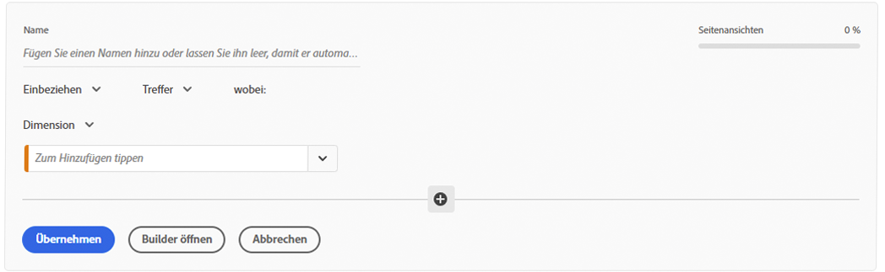
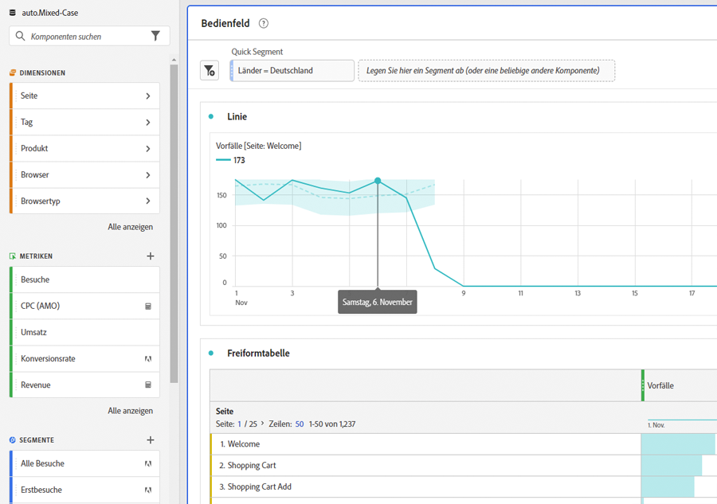
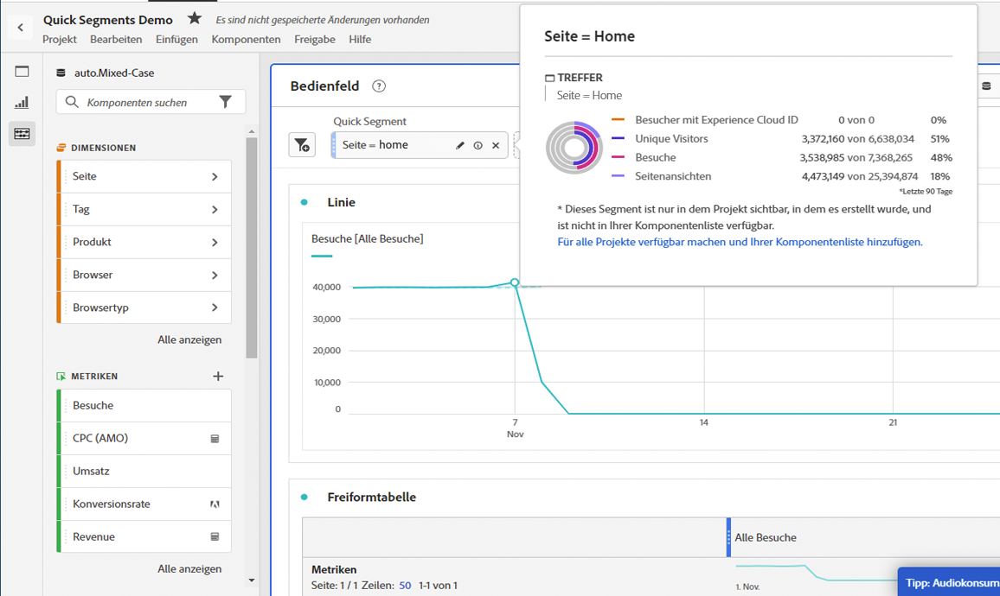
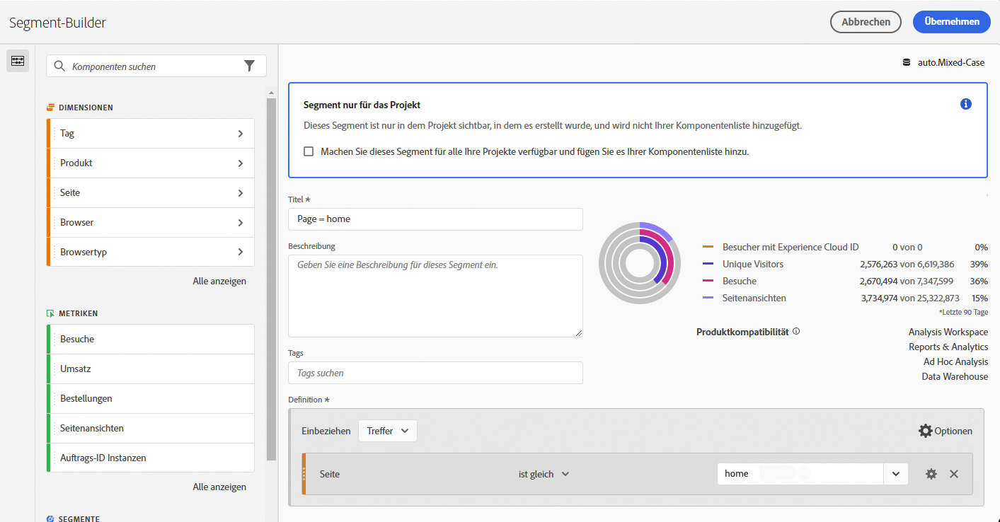
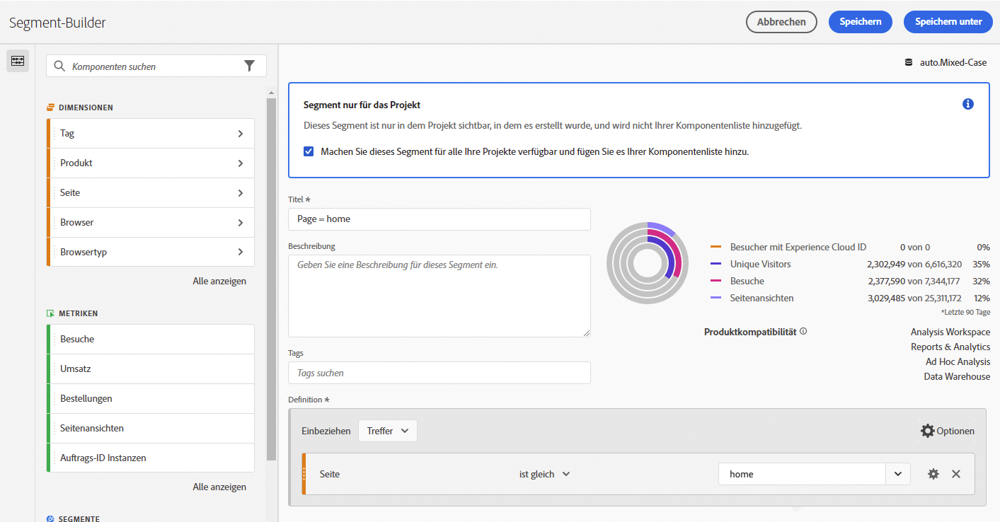

# Schnellsegmente

Sie können innerhalb eines Projekts Schnellsegmente erstellen, anstatt den komplexeren [Segment Builders](/help/components/segmentation/segmentation-workflow/seg-build.md) aufzurufen. Schnellsegmente

* Nur anwendbar auf Projekte, in denen sie erstellt wurden (Sie können dies ändern).
* Mit bis zu drei Regeln.
* Verschachtelte Container oder sequenzielle Regeln werden nicht unterstützt.
* Für die Arbeit in Projekten mit mehreren Report Suites.

Einen Vergleich zwischen Schnellsegmenten und vollständigen Segmenten in der Komponentenliste finden Sie [hier](/help/analyze/analysis-workspace/components/segments/t-freeform-project-segment.md).

>[!IMPORTANT]
> Schnellsegmente werden derzeit nur eingeschränkt getestet und sind ab dem 21. Oktober 2021 allgemein verfügbar.

## Voraussetzungen

Jeder kann ein [!UICONTROL Schnellsegment] erstellen. Sie benötigen jedoch die Berechtigung [!UICONTROL Segmenterstellung] in [Adobe Admin Console](https://experienceleague.adobe.com/docs/analytics/admin/admin-console/permissions/summary-tables.html?lang=de#analytics-tools), um die Schnellsegmente speichern oder in [!UICONTROL Segment Builder] öffnen zu können.

## Schnellsegmente erstellen

Klicken Sie in einer Freiformtabelle in der Panel-Überschrift auf das Symbol „Filter +“:

Konfigurieren Sie das Schnellsegment aus dieser leeren Tabelle:

| Einstellung | Beschreibung |
| --- | --- |
| Name | Der Standardname eines Segments besteht aus der Kombination der Regelnamen im Segment. Sie können das Segment umbenennen. |
| Ein-/Ausschließen | Sie können Komponenten in Ihrer Segmentdefinition entweder ein- oder ausschließen, aber nicht beides. |
| Treffer-/Besuchs-/Besucher-Container | Schnellsegmente enthalten nur einen [Segment-Container](https://experienceleague.adobe.com/docs/analytics/components/segmentation/seg-overview.html?lang=de#section_AF2A28BE92474DB386AE85743C71B2D6), mit dem Sie eine Dimension/eine Metrik/einen Datumsbereich in das Segment einbeziehen (oder daraus ausschließen) können. [!UICONTROL Besucher] enthält für den Besucher spezifische übergreifende Daten zu allen Besuchen und Seitenansichten. Mit dem [!UICONTROL Besuchs-Container] können Sie Regeln festlegen, mit denen die Besucherdaten auf der Grundlage von Besuchen aufgeschlüsselt werden. Mit dem [!UICONTROL Treffer-Container] können Sie die Besucherinformationen auf der Grundlage einzelner Seitenansichten aufschlüsseln. Der Standard-Container ist [!UICONTROL Treffer]. |
| Komponenten (Dimension/Metrik/Datumsbereich) | Definieren Sie bis zu 3 Regeln, indem Sie Komponenten (Dimensionen und/oder Metriken und/oder Datumsbereiche) und deren Werte hinzufügen. Es gibt drei Möglichkeiten, die richtige Komponente zu finden:<ul><li>Beginnen Sie mit der Eingabe und der [!UICONTROL Quick Segment] Builder findet automatisch die entsprechende Komponente.</li><li>Verwenden Sie die Dropdown-Liste, um die Komponente zu finden.</li><li>Ziehen Sie Komponenten aus der der linken Leiste.</li></ul> |
| Operator | Verwenden Sie das Dropdown-Menü, um Standardoperatoren und [!UICONTROL Einzelzählungs]-Operatoren zu finden. [Weitere Infos](https://experienceleague.adobe.com/docs/analytics/components/segmentation/segment-reference/seg-operators.html?lang=de) |
| Pluszeichen (+) | Weitere Regel hinzufügen |
| AND/OR-Kennzeichung | Sie können den Regeln „AND“ oder „OR“ hinzufügen, aber Sie können „AND“ und „OR“ aber nicht in einer Segmentdefinition kombinieren. |
| Anwenden | Dieses Segment auf das Panel anwenden. Wenn das Segment keine Daten enthält, werden Sie gefragt, ob Sie fortfahren möchten. |
| Builder öffnen | Öffnet Segment Builder. Nachdem Sie das Segment im Segmentaufbau gespeichert oder angewendet haben, wird es nicht mehr als &quot;Schnellsegment&quot;betrachtet. Es wird Teil der Segmentbibliothek der Komponentenliste. |
| Abbrechen | Abbrechen dieses Schnellsegments. Es wird nicht angewendet. |
| Datumsbereich | Der Validator verwendet den Datumsbereich des Panels für die Datensuche. Doch jeder in einem Schnellsegment angewendete Datumsbereich überschreibt den Datumsbereich des Panels im oberen Bereich des Panels. |
| Vorschau (oben rechts) | Ermöglicht festzustellen, ob ein gültiges Segment vorhanden ist und wie groß es ist. Stellt eine Aufschlüsselung des Datensatzes dar, der bei der Anwendung dieses Segments zu erwarten ist. Möglicherweise erhalten Sie einen Hinweis, der anzeigt, dass dieses Segment über keine Daten verfügt. In diesem Fall können Sie die Segmentdefinition fortsetzen oder ändern. |

Hier ist ein Beispiel für ein Segment, in dem Dimensionen und Metriken kombiniert werden:

Das Segment wird oben angezeigt. Beachten Sie die blau gestreifte Seitenleiste des Segments im Gegensatz zu der auf der linken Seite befindlichen blauen Seitenleiste für Segmente auf Komponentenebene in der Segmentbibliothek.

## Schnellsegmente bearbeiten

1. Bewegen Sie den Mauszeiger über das Schnellsegment und wählen Sie das Stiftsymbol aus.
1. Bearbeiten Sie die Segmentdefinition und/oder den Segmentnamen.
1. Klicken Sie auf [!UICONTROL Anwenden].

## Schnellsegmente speichern

>[!IMPORTANT]
>Nachdem Sie das Segment gespeichert oder angewendet haben, können Sie es nicht mehr im Quick Segment Builder bearbeiten, sondern nur noch im regulären Segment Builder.

1. Nachdem Sie das Schnellsegment angewendet haben, halten Sie den Mauszeiger darüber und wählen Sie das Infosymbol („i“) aus.

   

1. Klicken Sie auf **[!UICONTROL Für alle Projekte verfügbar machen und der Komponentenliste hinzufügen]**.
1. Optional: Benennen Sie das Segment um.
1. Klicken Sie auf **[!UICONTROL Speichern]**.

Beachten Sie, dass die Seitenleiste des Segments nicht mehr blau gestreift, sondern blau ist. Jetzt wird es in der Komponentenliste in der linken Leiste angezeigt.

## Was sind reine Projektsegmente?

Reine Projektsegmente sind entweder Schnellsegmente oder Ad-hoc-Workspace-Projektsegmente. Beim Bearbeiten/Öffnen im [!UICONTROL Segment Builder], wird das Feld &quot;Nur Projekt&quot;angezeigt. Wenn Sie ein Schnellsegment in Segment Builder anwenden, aber das Kontrollkästchen „Verfügbar machen“ nicht aktivieren, ist es weiterhin ein reines Projektsegment, kann jedoch nicht mehr in [!UICONTROL Quick Segment Builder] geöffnet werden.

Wenn Sie das Kontrollkästchen aktivieren und auf **[!UICONTROL Speichern]** klicken, wird es zu einem Komponentensegment.

