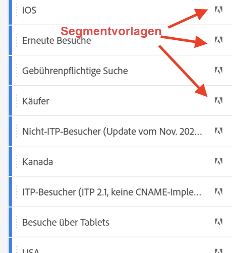

# Segmente {#topic_DC2917A2E8FD4B62816572F3F6EDA58A}

Sie können verschiedene Arten von Segmenten in Workspace erstellen, je nachdem, wie komplex sie sein müssen, ob sie nur für dieses Projekt gelten sollen usw. Im Folgenden finden Sie eine Zusammenfassung der Segmenttypen:

| Segmenttyp | Wo erstellt? | Wo finde ich Anwendung? | Verwendungsbereiche |
| --- | --- | --- | --- |
| Komponentensegment | [Segmentaufbau](/help/components/segmentation/segmentation-workflow/seg-build.md) | Global/public | Für komplexe Segmente, sequenzielle Segmente |
| Schnellsegment | [Quick Segment Builder](/help/analyze/analysis-workspace/components/segments/quick-segments.md) | Projektebene, kann aber öffentlich machen | Flexibilität und Kontrolle beim Hinzufügen/Bearbeiten von Regeln, Namen und mehreren Regeln |
| Ad-hoc-Segmente: |  |  |  |
| - Ad-hoc-Workspace-Projektsegment | [Ziehen und Ablegen in den Segmentablagebereich eines Projekts](/help/analyze/analysis-workspace/components/segments/ad-hoc-segments.md) | Projektebene, kann aber öffentlich machen | Für Standardsegmente mit einer Regel |
| - Berechnetes metrikbasiertes Segment | [Generator für berechnete Metriken](https://experienceleague.adobe.com/docs/analytics/components/calculated-metrics/calcmetric-workflow/metrics-with-segments.html) | So definieren Sie einzelne berechnete Metriken | Anwenden von Segmenten in Ihrer Metrikdefinition |
| - VRS-basiertes Segment | [Virtual Report Suite Builder](https://experienceleague.adobe.com/docs/analytics/components/virtual-report-suites/vrs-workflow/vrs-create.html) | Einzelne Virtual Report Suite | Anwenden von Segmenten in Ihrer VRS-Definition |

Eine ausführliche Diskussion der Segmentierung in Adobe Analytics finden Sie [hier](/help/components/segmentation/seg-overview.md).

## Segmente erstellen {#section_693CFADA668B4542B982446C2B4CF0F5}

Sie können in Analysis Workspace verschiedene Segmenttypen erstellen:

* [Schnellsegmente](/help/analyze/analysis-workspace/components/segments/quick-segments.md)
* [Ad-hoc-Segmente](/help/analyze/analysis-workspace/components/segments/ad-hoc-segments.md)
* Regelmäßige Komponentensegmente, die in der Segmentbibliothek enden (siehe unten)

### Erstellen von Komponentensegmenten {#section_3B07D458C43E42FDAF242BB3ACAF3E90}

Die Segmentleiste im Menü „Komponenten“ zeigt Segmente sowie Segmentvorlagen, die anhand dieser Symbole erkannt werden können:

[Verwendung von Segmenten in Analysis Workspace](https://experienceleague.adobe.com/docs/analytics-learn/tutorials/analysis-workspace/applying-segments/using-segments-in-analysis-workspace.html?lang=de) (6:46)

### Andere Methoden für das Anwenden von Segmenten {#section_10FF2E309BA84618990EA5B473015894}

>[!VIDEO](https://video.tv.adobe.com/v/30994/?quality=12)

Es gibt verschiedene weitere Methoden für das Anwenden von Segmenten auf ein Freiformprojekt.

| Aktion | Beschreibung |
|--- |--- |
| Segment aus Auswahl erstellen | Erstellt ein Inline-Segment. Dieses Segment wird nur auf das geöffnete Projekt angewendet und nicht als Analytics-Segment gespeichert. 1. Zeilen auswählen.  2. Rechtsklick auf die Auswahl.  3. Klick auf *Segment aus Auswahl erstellen*. |
| Komponenten > Neues Segment | Zeigt den Segment Builder an Weitere Informationen zur Segmentierung finden Sie unter [Segmente erstellen](https://experienceleague.adobe.com/docs/analytics/components/segmentation/segmentation-workflow/seg-build.html?lang=de). |
| „Freigeben“ > „Projekt freigeben“ oder „Freigeben“ > „Projektdaten kuratieren“ | In [Kuratieren und freigeben](https://experienceleague.adobe.com/docs/analytics/analyze/analysis-workspace/curate-share/curate.html?lang=de#concept_4A9726927E7C44AFA260E2BB2721AFC6) werden Segmente, die Sie auf das Projekt anwenden, in freigegebenen Analysen für den Empfänger verfügbar. |
| Segmente als Dimensionen verwenden | Video: [Verwenden von Segmenten als Dimensionen in Analysis Workspace](https://experienceleague.adobe.com/docs/analytics-learn/tutorials/analysis-workspace/applying-segments/using-segments-as-dimensions-in-analysis-workspace.html?lang=de) |

## Segment IQ

Segment IQ umfasst die folgenden Funktionen:

* [Bedienfeld „Segmentvergleich“:](/help/analyze/analysis-workspace/c-panels/c-segment-comparison/segment-comparison.md) Die Kernfunktion in Segment IQ. Ziehen Sie zwei Segmente in das Bedienfeld und zeigen Sie einen umfassenden Bericht an, der statistisch signifikante Unterschiede und Überschneidungen zwischen den beiden Zielgruppen zeigt.
* [Vergleich von Segmenten hinsichtlich Fallout:](/help/analyze/analysis-workspace/visualizations/fallout/compare-segments-fallout.md) Sehen Sie sich einen Vergleich verschiedener Zielgruppen im Kontext einer Fallout-Visualisierung an.
