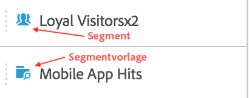
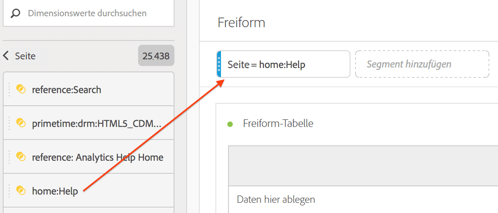

# Segmente {#topic_DC2917A2E8FD4B62816572F3F6EDA58A}

## Segmentleiste {#section_3B07D458C43E42FDAF242BB3ACAF3E90}

Die Segmentleiste im Menü „Komponenten“ zeigt Segmente sowie Segmentvorlagen, die anhand dieser Symbole erkannt werden können:

[Verwendung von Segmenten in Analysis Workspace](https://docs.adobe.com/content/help/de-DE/analytics-learn/tutorials/analysis-workspace/applying-segments/using-segments-in-analysis-workspace.html) (6:46)

## Segmente erstellen {#section_693CFADA668B4542B982446C2B4CF0F5}

Sie können sofort Segmente erstellen, indem Sie einen beliebigen Komponententyp (Dimension, Dimensionselement, Ereignis, Metrik, Segment, Segmentvorlage, Datenreichweite) in die Ablagefläche für Segmente oben in einem Bereich ablegen.

Komponententypen werden automatisch in Segmente umgewandelt. Alternativ können Sie auf das „+“-Symbol im Ablagefeld „Segment hinzufügen“ klicken.

Bedenken Sie Folgendes:

* Folgende Komponenten können Sie **nicht** im Segmentbereich ablegen: berechnete Metriken und Dimensionen/Metriken, aus denen Sie keine Segmente erstellen können.
* Bei vollständigen Dimensionen und Ereignissen erstellt Analysis Workspace Hit-Segmente mit „vorhanden“. Beispiele: „Hit, wenn eVar1 vorhanden ist“ oder „Hit, wenn event1 vorhanden ist“.
* Wenn „nicht angegeben“ oder „keine“ im Segmentablagebereich abgelegt werden, werden sie automatisch in ein Segment mit „nicht vorhanden“ umgewandelt, damit sie bei der Segmentierung korrekt behandelt werden.

>[!NOTE]
>
>Auf diese Weise erstellte Segmente sind interne Segmente des Projekts.

Sie können diese Segmente wie folgt öffentlich (global) machen:

1. Bewegen Sie den Mauszeiger auf das Segment in der Dropzone und klicken Sie auf das Symbol „i“.
1. Klicken Sie dann im angezeigten Informationsfeld auf **[!UICONTROL Als öffentlich einstellen]**.

   

## Andere Methoden für das Anwenden von Segmenten {#section_10FF2E309BA84618990EA5B473015894}

Es gibt verschiedene weitere Methoden für das Anwenden von Segmenten auf ein Freiformprojekt.

| Aktion | Beschreibung |
|--- |--- |
| Segment aus Auswahl erstellen | Erstellt ein Inline-Segment. Wählen Sie Zeilen aus, klicken Sie mit der rechten Maustaste auf die Auswahl und erstellen Sie ein Inline-Segment. Dieses Segment wird nur auf das geöffnete Projekt angewendet und nicht als Analytics-Segment gespeichert. 1. Zeilen auswählen.  2. Rechtsklick auf die Auswahl.  3. Klick auf *Segment aus Auswahl erstellen*. |
| Komponenten > Neues Segment | Zeigt den Segment Builder an Weitere Informationen zur Segmentierung finden Sie unter [Segmente erstellen](https://docs.adobe.com/content/help/de-DE/analytics/components/segmentation/segmentation-workflow/seg-build.html). |
| „Freigeben“ > „Projekt freigeben“ oder „Freigeben“ > „Projektdaten kuratieren“ | In [Kuratieren und freigeben](https://docs.adobe.com/content/help/de-DE/analytics/analyze/analysis-workspace/curate-share/curate.html#concept_4A9726927E7C44AFA260E2BB2721AFC6) werden Segmente, die Sie auf das Projekt anwenden, in freigegebenen Analysen für den Empfänger verfügbar. |
| Segmente als Dimensionen verwenden | Video: [Verwenden von Segmenten als Dimensionen in Analysis Workspace](https://docs.adobe.com/content/help/de-DE/analytics-learn/tutorials/components/segmentation/using-segments-as-dimensions-in-analysis-workspace.html) |
