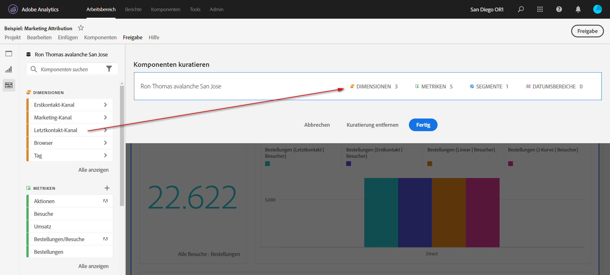
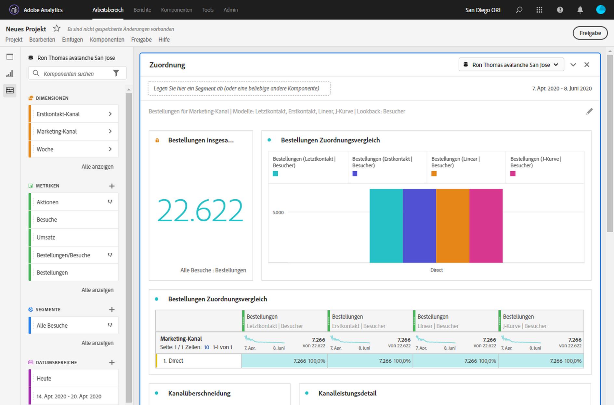

# Kuratieren von Projekten

Mit der Kuratierung können Sie die Komponenten (Dimensionen, Metriken, Segmente, Datumsbereiche) vor der Freigabe eines Projekts einschränken. Wenn ein Empfänger das Projekt öffnet, wird ihm eine begrenzte Anzahl von Komponenten angezeigt, die Sie für ihn kuratiert haben. Die Kuratierung ist ein optionaler, aber empfehlenswerter Schritt, bevor Sie ein Projekt freigeben.

>[!NOTE]
> Produktprofile bestimmen als Hauptmechanismen, welche Komponenten ein Anwender sehen kann. Sie werden über die Adobe Experience Cloud Admin Console verwaltet. Kuratierung ist ein Sekundärfilter.

## Anwenden der Projektkuratierung

1. Klicken Sie auf **[!UICONTROL Freigeben]** > **[!UICONTROL Projektdaten kuratieren]**.
Die im Projekt verwendeten Komponenten werden automatisch hinzugefügt.
   **Hinweis**: Wenn ein Projekt mehrere Report Suites hat, wird für jede Report Suite im Projekt ein Feld zum Kuratieren angezeigt.
1. (Optional) Um weitere Komponenten hinzuzufügen, ziehen Sie die freizugebenden Komponenten aus der linken Leiste in das Feld [!UICONTROL Komponenten kuratieren].
1. Klicken Sie auf **[!UICONTROL Fertig]**.

Eine Kuratierung kann auch über das Menü [!UICONTROL Freigeben] angewendet werden, indem Sie auf **[!UICONTROL Kuratieren und freigeben]** klicken. Diese Option kuratiert das Projekt automatisch auf die im Projekt verwendeten Komponenten. Sie können weitere Komponenten hinzufügen, wie oben beschrieben.

## Ansicht des kuratierten Projekts

Wenn ein Empfänger ein kuratiertes Projekt öffnet, wird ihm nur der ausgewählte Satz der von Ihnen definierten Komponenten angezeigt:

## Entfernen der Projektkuratierung

So entfernen Sie die Projektkuratierung und stellen Sie den vollständigen Satz der Komponenten in der linken Leiste wieder her:

1. Klicken Sie auf **[!UICONTROL Freigeben]** > **[!UICONTROL Projektdaten kuratieren]**.
1. Klicken Sie auf **[!UICONTROL Kuratierung entfernen]**.
1. Klicken Sie auf **[!UICONTROL Fertig]**.

## Virtual Report Suite (VRS)-Kuratierung

Um die Kuratierung auf Report Suite-Ebene anzuwenden, sodass sie für viele Projekte gleichzeitig gilt, können Sie Komponenten in einer [Virtual Report Suite (VRS) kuratieren](https://docs.adobe.com/content/help/de-DE/analytics/components/virtual-report-suites/vrs-components.html).

>[!NOTE]
> Die VRS-Kuratierung wird immer vor der Projektkuratierung ausgeführt. Das bedeutet, dass selbst wenn Ihr kuratiertes Projekt bestimmte Komponenten enthält, werden diese herausgefiltert, wenn die kuratierte VRS diese nicht enthält.

## Option „Alle anzeigen“ für Komponenten

In einem kuratierten Projekt oder einer VRS wird dem Empfänger die Option **[!UICONTROL Alle anzeigen]** für Komponenten in der linken Leiste angezeigt. [!UICONTROL Alle anzeigen] zeigt verschiedene Komponentensätze an, je nach:

* Berechtigungsebene des Benutzers (Administrator oder Nicht-Administrator)
* Projektrolle (Inhaber/Bearbeiter oder nicht)
* Art der angewendeten Kuratierung (VRS oder Projekt)
* Komponenten, die dem Benutzer gehören oder für ihn freigegeben wurden. Zu den eigenen/freigegebenen Komponenten gehören Segmente, berechnete Kennzahlen und Datumsbereiche. Sie enthalten keine implementierten Komponenten wie eVars, Props und benutzerdefinierte Ereignisse.

Hinweis: Rollen ohne Administratoransicht haben keinen Zugriff auf die linke Leiste in einem Projekt, daher wurden sie in der unten stehenden Tabelle weggelassen.

| Kuratierungstyp | Admins | Inhaber- oder Bearbeiterrolle, kein Admin | Duplizierte Rolle „Nicht-Administrator“ |
|---|---|---|---|
| Kuratierte VRS | Alle nicht kuratierten VRS-Komponenten | Nicht kuratierte VRS-Komponenten, die diese Rolle besitzt oder die für diese Rolle freigegeben wurden | Nicht kuratierte VRS-Komponenten, die diese Rolle besitzt oder die für diese Rolle freigegeben wurden |
| Kuratierte Projekte | Alle nicht kuratierten Projektkomponenten | Alle nicht kuratierten Projektkomponenten | Nicht kuratierte Projektkomponenten, die diese Rolle besitzt oder die für diese Rolle freigegeben wurden |
| Kuratierte Projekte in kuratierte VRS | Alle nicht kuratierten Komponenten, aufgeführt unter **[!UICONTROL Nicht kuratierte Projektkomponenten]** und **[!UICONTROL Nicht kuratierte VRS-Komponenten]** | Alle nicht kuratierten Projektkomponenten UND nicht kuratierten VRS-Komponenten, die dieser Rolle gehören oder für sie freigegeben wurden | Nicht kuratierte VRS- und Projektkomponenten, die diese Rolle besitzt oder die für diese Rolle freigegeben wurden |
