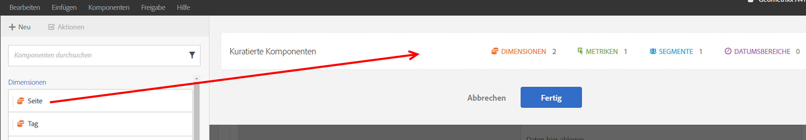
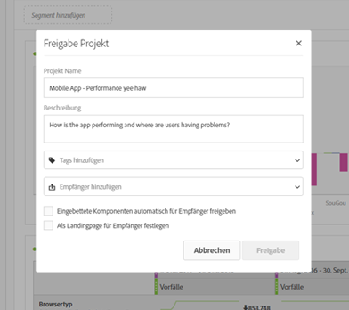

# Übersicht über die Kuratierung/Freigabe

Durch Kuratierung können Sie die Komponenten einschränken, bevor Sie ein Projekt freigeben. Sie können ein Projekt und seine Komponenten für Vermarkter und andere Mitarbeiter ohne Analyseerfahrung in Ihrem Unternehmen freigeben, Anmerkungen hinzufügen und Tags auf Projekte anwenden.

**Videoüberblick**

>[!VIDEO](https://www.youtube.com/watch?v=LJJRskdmlOg&amp;index=79&amp;t=0s&amp;list=PL2tCx83mn7GuNnQdYGOtlyCu0V5mEZ8sS)

**[!UICONTROL Workspace]** > **[!UICONTROL Share]**> **[!UICONTROL Curate Project Data]**

## Projekt kuratieren

1. Legen Sie die Berechtigung zum Erstellen und Kuratieren von Projekten fest.

   Before creating or curating an Analysis Workspace project, administrators must add you to a [group](https://marketing.adobe.com/resources/help/de_DE/reference/groups.html) with the **[!UICONTROL Analysis Workspace Access]** permission enabled, or to the **[!UICONTROL All Report Access]** user group. ( **[!UICONTROL Admin]** > **[!UICONTROL User Management]** > **[!UICONTROL Groups]**).

1. [Erstellen und speichern](/help/analyze/analysis-workspace/build-workspace-project/t-freeform-project.md) Sie ein Projekt und klicken Sie dann auf **[!UICONTROL Share]** > **[!UICONTROL Curate Project Data]**.
1. Drag components you want to share from the draggable component stack on the left to the **[!UICONTROL Curated Components]** field.

   

   >[!IMPORTANT]
   >
   >Um ein Projekt freizugeben, ist es nicht erforderlich, Komponenten zu kuratieren. Sie können ein Projekt mit allen verfügbaren Standardkomponenten oder mit den ausgewählten Komponenten freigeben. To preserve all of the default components in a project, a best practice is to create a copy of a project for yourself (using **[!UICONTROL Save As]**) prior to curating components. Nach dem Kuratieren der Komponenten in einem Projekt sind die anderen Komponenten für das Projekt nicht mehr für Sie verfügbar.

1. Klicken Sie auf **[!UICONTROL Done]**.

Das resultierende Projekt verhält sich in Analysis Workspace wie ein normales Projekt, bietet jedoch nur die festgelegten Komponenten zur Auswahl an.

## Freigeben eines kuratierten Projekts

Durch Freigabe können Sie dieses Projekt anderen Benutzern des Analysis Workspace in Ihrer Organisation zur Verfügung stellen. Wenn Sie Komponenten kuratiert haben, wirkt sich das aus, wenn andere Benutzer das Projekt verwenden.

1. After you curate the components of a report, click **[!UICONTROL Share]** > **[!UICONTROL Share Project]**.

   

1. Fügen Sie Empfänger hinzu.
1. (Optional) Sie können eingebettete Projektkomponenten (Segmente, berechnete Metriken und Datumsbereiche) für alle Empfänger freigeben. Nach der Freigabe werden diese Komponenten im Dropdown-Menü „Komponenten“ im Workspace des Empfängers angezeigt.

   >[!IMPORTANT]
   >
   >Diese Einstellung wird nicht beibehalten. Es handelt sich um eine einmalige Aktion zum Zeitpunkt der Freigabe.

1. Optional können Sie diese Seite als Landingpage für Empfänger festlegen.

   >[!IMPORTANT]
   >
   >Diese Einstellung wird nicht beibehalten. Es handelt sich um eine einmalige Aktion zum Zeitpunkt der Freigabe.

1. Klicken Sie auf **[!UICONTROL Share]**.

<!-- 

 <b>Annotate and tag a project</b> 
 

An alternative way to collaborate on a project is to use the Information panel. This panel will be re-introduced in an upcoming release. 
 

 
 
<ul id="ul_EFD045FD9F3B4BF8A70637B00EE0BC9C"> 
 <li id="li_EC6C5EAF9C234E76BDA7FF0226B82083">Tag reports for sharing. </li> 
 <li id="li_CF6A438C55F847F8890F8CB674CAA4F7">Specify the recipient (filter by permission group or user name), the storage folder. In-product notifications let users know that they have a shared report waiting. </li> 
 <li id="li_C8E088DA43024277908705CB0F3A142A">Write messages or report descriptions for recipients. </li> 
 <li id="li_342EB4758C344B859757E23691068FA3"> Select the dimensions, metrics, and segments to recommend to a non-analyst colleague, who can view the report you are curating and sharing. Curating the component gives the recipient access to those components, based on their permission settings. </li> 
 <li id="li_6487500F9315481599B7F3897998879F"> Add suggested items to a previously configured report. These new items exist as recommended selectable options. </li> 
</ul>

 -->

