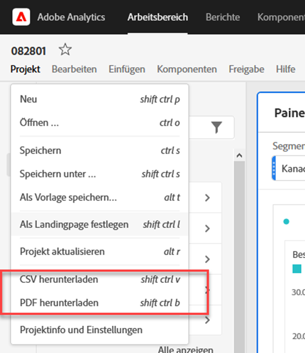
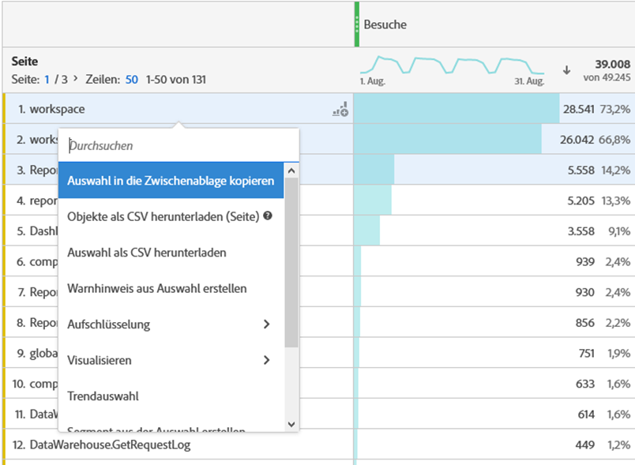
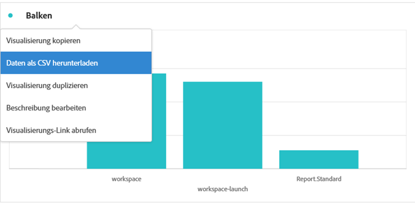
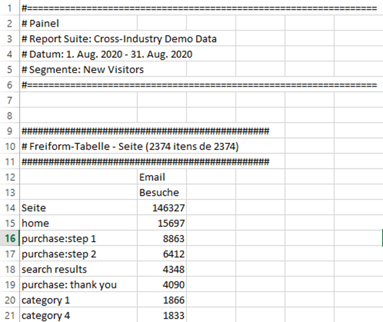

# PDF- oder CSV-Dateien herunterladen aus Workspace

Es gibt verschiedene Möglichkeiten, Daten aus Analysis Workspace zu exportieren, je nachdem, welcher Datensatz außerhalb des Tools analysiert werden soll und wer die Informationen erhalten muss. Exportierte Daten können in Form kopierter Daten, CSV- oder PDF-Dateien vorliegen. Eine PDF-Datei wird in der Regel bevorzugt, wenn Sie in der Datei enthaltene Visualisierungen verwenden möchten, während eine CSV-Datei (oder kopierte Daten) bevorzugt wird, wenn Sie einfach Daten im Klartext benötigen.

>[!IMPORTANT]
>
> Einige auf dieser Seite verwiesene Optionen, wie **Download-Elemente als CSV**, werden derzeit nur eingeschränkt getestet. [Weitere Infos](https://docs.adobe.com/content/help/de-DE/analytics/landing/an-releases.html)

## Projekt als CSV oder PDF herunterladen {#download-project}

Sie können ein vollständiges Projekt herunterladen, indem Sie **[!UICONTROL Projekt > Als PDF herunterladen (oder als CSV)]** wählen. Die heruntergeladene Datei enthält alle angezeigten (sichtbaren) Tabellen und Visualisierungen im Projekt. Eine PDF-Datei wird in der Regel bevorzugt, wenn Sie in der Datei enthaltene Visualisierungen verwenden möchten, während eine CSV-Datei bevorzugt wird, wenn Sie einfach Daten mit normalem Text wünschen.

Beachten Sie beim Herunterladen von Projekten Folgendes:

* Das Projekt kann gespeichert oder nicht gespeichert werden, wenn Sie einen Projektdownload anfordern. Es können jedoch nur gespeicherte Projekte [geplant](https://docs.adobe.com/content/help/en/analytics/analyze/analysis-workspace/curate-share/t-schedule-report.html)werden.
* Der Export von im Browser heruntergeladenen PDF-Dateien kann mehrere Minuten dauern, da das Projekt auf den Adoben-Servern erneut ausgeführt wird, bevor es im PDF-Format wiedergegeben wird. Wir empfehlen, das Projekt nicht zu verlassen, bis die PDF-Datei in Ihren Browser heruntergeladen wurde. Sie können jedoch beim Warten weiterhin Änderungen am Projekt vornehmen. Wenn die Wiedergabe einer PDF-Datei länger als 5 Minuten dauert, werden Sie aufgefordert, stattdessen eine E-Mail-Nachricht zu senden.
* PDF-Downloads werden als einzelne Seite ohne Seitenumbruch gerendert.
* Wenn ein Projekt als PDF wiedergegeben wird, wird das gerendert, was sich auf der Seite befindet. Wenn ein Projekt Visualisierungen und Bedienfelder in benutzerdefinierter Größe enthält, müssen Sie diese so ändern, dass die Größe automatisch bestimmt wird (Schaltfläche in der oberen rechten Ecke), damit der Inhalt nicht abgeschnitten wird.

## Daten in die Zwischenablage kopieren (Hotkey: Strg+C) {#copy-data}

Mit der Option &quot;In Zwischenablage **[!UICONTROL kopieren]** &quot;können Sie Daten schnell aus Workspace kopieren und an einer anderen Stelle einfügen.

* Wenn die angezeigte Tabelle kopiert werden soll, klicken Sie mit der rechten Maustaste auf die Kopfzeile der Tabelle und wählen Sie &quot;Angezeigte Daten in Zwischenablage **kopieren&quot;**.
* Wenn Sie möchten, dass eine Teilmenge der Daten kopiert wird, wählen Sie die Tabelle aus und klicken Sie dann mit der rechten Maustaste auf > Auswahl in die Zwischenablage **kopieren**.

Darüber hinaus wird Ihre Auswahl mit dem Hotkey in die Zwischenablage `Ctrl+C` kopiert. Nach dem Kopieren können Sie in ein anderes Werkzeug gehen und die Informationen (oder Treffer) einfügen `Ctrl+V`.

## Daten als CSV herunterladen {#download-data}

Mit der Rechtsklick-Option Daten als CSV **** herunterladen können Sie eine Datentabelle oder die Datenquelle einer beliebigen Visualisierung als CSV herunterladen.

* Klicken Sie in der Kopfzeile einer Tabelle mit der rechten Maustaste auf Angezeigte Daten als CSV **[!UICONTROL herunterladen]**. Dadurch werden die in der Tabelle angezeigten Daten als CSV heruntergeladen.
* Wenn eine Auswahl in der Tabelle vorgenommen wird, wird als Option &quot; **[!UICONTROL Herunterladen&quot;als CSV]** ausgewählt. Mit dieser Option wird nur die Auswahl heruntergeladen, nicht die vollständige, angezeigte Tabelle.
* Klicken Sie in der Kopfzeile einer beliebigen Visualisierung mit der rechten Maustaste auf Daten als CSV **[!UICONTROL herunterladen]**. Dadurch wird die Datenquellentabelle für eine Visualisierung als CSV heruntergeladen. Hinweis: Diese Option wird von der Imagemap-Visualisierung nicht unterstützt.

## Download items as CSV {#download-items}

Wenn Sie mehr als die 400 Zeilen mit Daten in einer Tabelle analysieren möchten, klicken Sie mit der rechten Maustaste auf die Tabellenkopfzeile oder eine beliebige Zeile und wählen Sie Elemente als CSV **herunterladen (Dimension)**. Diese Option exportiert bis zu 50.000 Dimensionselemente (basierend auf der Tabellensortierung) für die ausgewählte Dimension, wobei Filter und Segmente angewendet werden. Wenn Sie diese Option oben in der Tabelle auswählen, wird die erste Dimension in der Tabelle exportiert. Obwohl in der Freiform-Tabelle keine Beschränkungen erzwungen werden, wird empfohlen, die Option &quot;Elemente herunterladen&quot;in Tabellen mit weniger als 20 Spalten zu verwenden, um eine optimale Leistung sicherzustellen.

>[!TIP]
>
> Wenn Ihre Dimension 50.000 Elemente überschreitet, laden Sie die Datei mit unterschiedlichen Sortiermetriken herunter oder wenden Sie einen Filter an. Sortieren Sie zum Beispiel absteigend nach Besuchen in einem Download und dann aufsteigend nach Besuchen in einem zweiten Download. Dieser Tipp hilft Ihnen beim Abrufen von Elementen mit längerem Tail.

Sie können mehrere Aufgaben im Projekt ausführen und sogar zu einem neuen Workspace-Projekt auf derselben Registerkarte navigieren, während der Download läuft. Der Download wird angehalten, wenn Sie eine neue Browserregisterkarte öffnen. Der Download wird abgebrochen, wenn Sie Workspace vollständig verlassen oder die Browser-Registerkarte schließen.

### Datei mit heruntergeladenen Elementen

Die Funktionen der Tabelle werden wie folgt auf die heruntergeladene Datei angewendet:

* Alle Bereichssegmente werden als Filter angewendet.
* Aufschlüsselungen **über** der ausgewählten Dimension in der Tabelle werden als Filter über jeder Spalte angewendet.
* Aufschlüsselungen **unterhalb** der ausgewählten Dimension in der Tabelle werden entfernt.

Im obigen Beispiel werden Seitenelemente mit dem Bedienfeldsegment (Neue Besucher Kunden) und den oben aufgeführten Komponenten (Marketing Kanal = E-Mail) als Filter heruntergeladen und die unten aufgeführten Komponenten (Mobilgerätetyp) aus der heruntergeladenen CSV entfernt.

### Benachrichtigungen herunterladen

Beim Herunterladen der Datei wird eine Benachrichtigung mit dem Fortschritt angezeigt. Sie können den Download jederzeit abbrechen, indem Sie auf Download **[!UICONTROL abbrechen]** klicken. Das Schließen des Toastes **wird den Download nicht** abbrechen.

Sobald die Datei abgeschlossen ist, wird eine Benachrichtigung angezeigt und die Datei wird in Ihren Browser heruntergeladen.

Wenn Sie mehrere Downloads gleichzeitig anfordern, erhalten Sie eine Benachrichtigung, dass jeder weitere Download in die Warteschlange gestellt wird, bis der vorherige Download abgeschlossen ist.

## Häufig gestellte Fragen {#faq}

| Frage | Antwort |
| --- | --- |
| Warum ist meine heruntergeladene PDF-Datei eine Seite? | In Workspace werden heruntergeladene PDFs derzeit nicht paginiert. |
| Kann ich mehr als 50.000 Elemente mit der Option &quot;Elemente als CSV herunterladen&quot;exportieren? | Während jeder Download bis zu 50.000 Dimensionselemente enthalten kann, können Sie die Art der Tabelle ändern, um längere Endelemente abzurufen, oder einen Filter anwenden, um spezifischere Elemente herunterzuladen. |
| Was bewirkt die **[!UICONTROL Kopiervisualisierung]** ? | **[!UICONTROL Visualisierung]** kopieren ist keine Exportoption. Damit können Sie eine Visualisierung oder einen Bereich von einem Ort in Workspace an einen anderen kopieren. Beispielsweise von einem Bereich zum anderen im selben Projekt oder von einem Projekt zu einem anderen. [Video ansehen](https://www.youtube.com/watch?v=lvmAdKNfWQw) |

