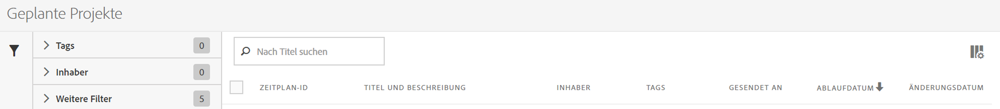

# Manager für geplante Projekte

Verwalten Sie geplante Projekte in Analysis Workspace.

**[!UICONTROL Analytics]** > **[!UICONTROL Komponenten]** > **[!UICONTROL Geplante Projekte]**.

Im Manager für geplante Projekte können regelmäßige Projektlieferungen bearbeitet und gelöscht werden. Sie können Bereitstellungspläne erstellen, die Ihre Berichte per E-Mail an eine festgelegte Adresse senden. Sie können diese Pläne zum automatischen Versand der Berichte in bestimmten befristeten oder unbefristeten Intervallen konfigurieren oder die Bereitstellung eines sich wiederholenden Projekts stoppen.

Im Manager für geplante Projekte werden die Elemente angezeigt, die von einem bestimmten Benutzer erstellt wurden. Wenn das Benutzerkonto in der Anwendung deaktiviert wird, werden alle geplanten Bereitstellungen gestoppt.

* Bearbeiten geplanter Projekte
* Zeitplan-ID eines Projekts anzeigen (hauptsächlich für Debug-Zwecke)
* Suchen nach geplanten Projekten
* Taggen geplanter Projekte
* Spezifizieren/Ändern des Eigentümers eines geplanten Projekts
* Hinzufügen anderer Filter wie „Genehmigt“, „Fehlgeschlagen“, „Favoriten“, „Meine“, „Alle anzeigen“ und „Abgelaufene Projekte“

* Definieren eines Ablaufdatums für geplante Projekte

