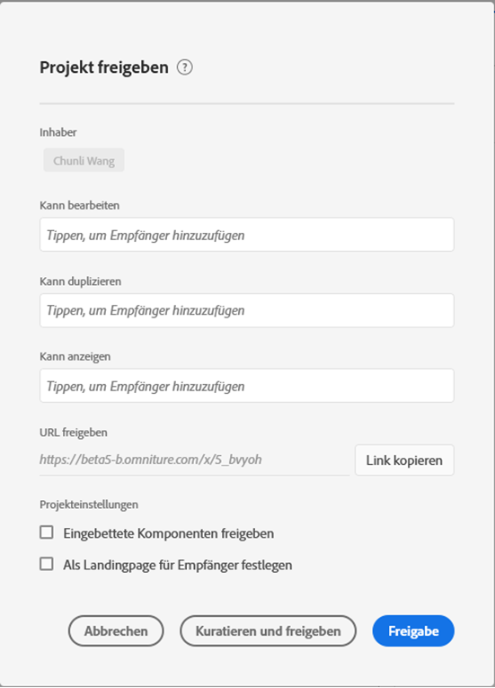
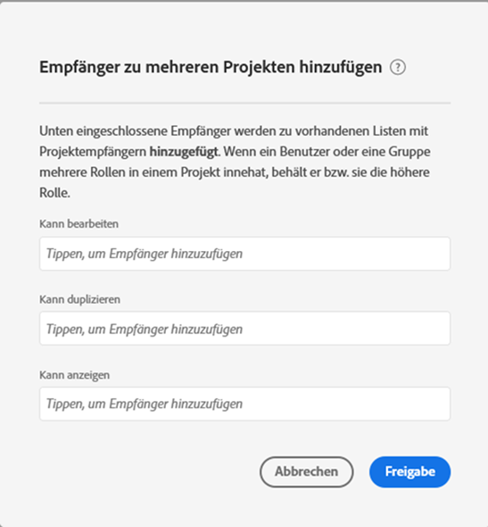

# Projekte freigeben

Durch Freigeben können Sie ein Projekt anderen Analysis Workspace-Benutzern in Ihrer Organisation zur Verfügung stellen. Jede [Kuration](curate.md), die Sie vorgenommen haben, wird beim Öffnen des Projekts durch die Empfänger angezeigt.

## Projektrollen {#Roles}

Sie können einer von drei Projektrollen Empfänger hinzufügen. Projektrollen sind mit dem Benutzer und der spezifischen Projekt-ID verknüpft. Projektrollen sind unabhängig von Benutzerberechtigungen, die in der [Adobe Experience Cloud Admin Console](https://docs.adobe.com/content/help/de-DE/core-services/interface/manage-users-and-products/admin-getting-started.html) verwaltet werden.

| Rolle | Projektsteuerung |
|---|---|
| Kann bearbeiten | Empfänger können Änderungen an einem Projekt **[!UICONTROL speichern]** und als Miteigentümer auftreten. Diese Rolle ist nützlich, wenn Sie ein Projekt mit anderen Kollegen gemeinsam verwalten möchten. Dazu gehören das Bearbeiten, Löschen und Bearbeiten von Empfängerlisten für ein freigegebenes Projekt.  Hinweis: Analysis Workspace unterstützt derzeit keine Live-Zusammenarbeit. Es wird daher empfohlen, dass zu jedem Zeitpunkt nur ein Benutzer ein Projekt bearbeitet. Wenn Projekte zum gleichen Zeitpunkt gespeichert werden, wird die letzte Version beibehalten. |
| Kann duplizieren | Empfänger können **[!UICONTROL Speichern unter]** verwenden und auf die linke Navigationsleiste zugreifen. Projektinteraktionen sind in dieser Rolle nicht beschränkt. Diese Rolle ist nützlich, wenn Sie ein Projekt für Benutzer freigeben möchten, die die Daten Ihres Unternehmens und die Verwendung von Analysis Workspace verstehen, Ihr Projekt jedoch nicht ändern möchten. |
| Kann anzeigen | Empfänger können „Speichern unter“ nicht verwenden und auch nicht auf die linke Navigationsleiste zugreifen. Auch die Projektinteraktionen sind begrenzt. Diese Rolle ist hilfreich, wenn Sie ein Projekt für Benutzer freigeben möchten, die mit der Datenstruktur Ihres Unternehmens, Analysis Workspace oder Adobe Analytics im Allgemeinen nicht so vertraut sind. Sie möchten jedoch, dass sie Daten und Erkenntnisse in einer sicheren Umgebung einsehen können. Weitere Informationen zum [Projekterlebnis „Kann anzeigen“](/help/analyze/analysis-workspace/curate-share/view-only-projects.md). |

>[!IMPORTANT]
> Vor dem 18. Juni 2020 hinzugefügte Empfänger wurden in eine Projektrolle migriert. Admin-Benutzer wurden in die Rolle **[!UICONTROL Kann bearbeiten]** und Nicht-Admin-Benutzer in die Rolle **[!UICONTROL Kann duplizieren]** migriert. Diese Rollen bieten dasselbe Projekterlebnis wie zuvor. Außerdem wurden alle Gruppen (einschließlich „Alle“) in die Rolle **[!UICONTROL Kann duplizieren]** migriert.

### Keine Rolle zugewiesen (Empfänger des Projekt-Links)

Wenn einem Empfänger keine Rolle zugewiesen wurde und er einen [Link](https://docs.adobe.com/content/help/de-DE/analytics/analyze/analysis-workspace/curate-share/shareable-links.html) zum Projekt erhält (**[!UICONTROL Freigeben]>[!UICONTROL Projekt-Link abrufen]**), wird er standardmäßig in eine Rolle eingefügt. Administratoren erhalten die Rolle **[!UICONTROL Kann bearbeiten]** und Nicht-Administratoren erhalten **[!UICONTROL Kann duplizieren]**.

### Mehrere Rollen zugewiesen

Wenn einem Empfänger mehrere Rollen zugewiesen werden, erhält er immer das höchste Erlebnis. Dies kann vorkommen, wenn ein Empfänger sowohl als Einzelperson als auch als Gruppenmitglied hinzugefügt wird. Wenn einem Empfänger beispielsweise die Rolle **[!UICONTROL Kann bearbeiten]** als Einzelperson und die Rolle **[!UICONTROL Kann anzeigen]** als Gruppenmitglied zugewiesen wird, erhält er das Projekterlebnis **[!UICONTROL Kann bearbeiten]**.

### Administratoren und Rollen

Administratoren, die in die Rolle **[!UICONTROL Kann duplizieren]** oder **[!UICONTROL Kann anzeigen]** aufgenommen werden, erhalten diese eingeschränkten Erlebnisse, wenn sie ein Projekt öffnen. Falls gewünscht, kann ein Administrator seine Rolle jederzeit auf **[!UICONTROL Kann bearbeiten]** erhöhen, indem er **[!UICONTROL Komponenten]>[!UICONTROL Projekte]** wählt.

## Hinzufügen von Empfängern zu einem freigegebenen Projekt {#Add}

So fügen Sie Ihrem freigegebenen Projekt Empfänger hinzu:

1. Klicken Sie auf **[!UICONTROL Freigeben]** > **[!UICONTROL Projekt freigeben]**.
Wenn es nicht gespeicherte Änderungen gibt, werden Sie aufgefordert, das Projekt zuerst zu speichern.
1. Fügen Sie Empfänger oder Gruppen von Empfängern hinzu.
Beschreibungen der einzelnen Rollen finden Sie über das Hilfesymbol oben.
1. (Optional) Geben Sie eingebettete Projektkomponenten (Segmente, berechnete Metriken und Datumsbereiche) für alle Empfänger frei.
Nach der Freigabe werden diese Komponenten im Dropdown-Menü „Komponenten“ im Workspace des Empfängers angezeigt. Beachten Sie, dass diese Einstellung nicht beibehalten wird. Es handelt sich um eine einmalige Aktion zum Zeitpunkt der Freigabe.
1. (Optional) Legen Sie diese Seite als die Landingpage für Empfänger fest.
Diese Einstellung wird nicht beibehalten. Es handelt sich um eine einmalige Aktion zum Zeitpunkt der Freigabe.
1. Klicken Sie auf „Freigeben“.
Sie können auch auf **[!UICONTROL Kuratieren und freigeben]** klicken, um die Projektkuratierung automatisch anzuwenden. Wenn ein Projekt bereits freigegeben wurde, werden für diese Schaltflächen **[!UICONTROL Aktualisieren]** und **[!UICONTROL Kuratieren und aktualisieren]** angezeigt. Weitere Informationen zur [Projektkuratierung](https://docs.adobe.com/content/help/de-DE/analytics/analyze/analysis-workspace/curate-share/curate.html).

## Freigeben für eine Gruppe von Empfängern {#Groups}

Alle Benutzer können Projekte für Gruppen freigeben, also für eine Sammlung von Empfängern. In Adobe Analytics werden Gruppen durch Produktprofile in der [Adobe Experience Cloud Admin Console](https://docs.adobe.com/content/help/de-DE/core-services/interface/manage-users-and-products/admin-getting-started.html) definiert.

* Administratoren können für jede Gruppe freigeben, einschließlich „Alle“.
* Nicht-Administratoren können für Gruppen freigeben, denen sie angehören (mit Ausnahme von „Alle“).

## Projekt-Link freigeben {#Links}

Sie können einen Link zu einem Projekt unter **[!UICONTROL Freigeben]>[!UICONTROL Projekt-Link]** abrufen. Nach dem Klicken müssen sich die Empfänger vor dem Einstieg in das Projekt anmelden. Wenn der Empfänger nicht in eine Rolle aufgenommen wurde, erhält er eine Standardrolle. Administratoren erhalten die Rolle **[!UICONTROL Kann bearbeiten]** und Nicht-Administratoren erhalten **[!UICONTROL Kann duplizieren]**. [Erfahren Sie mehr](https://docs.adobe.com/content/help/de-DE/analytics/analyze/analysis-workspace/curate-share/shareable-links.html) über das Erstellen von freigebbaren Links zu Workspace-Projekten.

## Freigeben von Projekten im Projekt-Manager {#Manager}

Projekte können auch über **[!UICONTROL Komponenten]>[!UICONTROL Projekte]** freigegeben werden. Ein einzelnes Projekt kann wie oben beschrieben freigegeben werden.  Wenn mehrere Projekte zum Freigeben ausgewählt wurden, werden die Empfänger für jedes Projekt der bestehenden Empfängerliste hinzugefügt.

Beispiel:

* Projekt A wird für die Empfänger 1, 2 und 3 freigegeben
* Projekt B wird für die Empfänger 4, 5 und 6 freigegeben

Während Projekt A und B ausgewählt sind, werden die Empfänger 4 und 7 den Freigabelisten hinzugefügt. Die neue Freigabeliste für jedes Projekt lautet nun:

* Projekt A: 1, 2, 3, 4, 7
* Projekt B: 4, 5, 6, 7

## Häufig gestellte Fragen (FAQ) {#FAQs}

| Frage | Antwort |
|---|---|
| Was passiert, wenn zwei Bearbeiter ein Projekt gleichzeitig speichern? | Die Änderungen werden nicht zusammengeführt und die zuletzt gespeicherte Projektversion bleibt erhalten. Analysis Workspace unterstützt derzeit keine Live-Zusammenarbeit. |
| Welches Projekterlebnis sehe ich als Administrator? | Administratoren, die in die Rolle **[!UICONTROL Kann duplizieren]** oder **[!UICONTROL Kann anzeigen]** aufgenommen werden, erhalten diese eingeschränkten Erlebnisse, wenn sie ein Projekt öffnen. Falls gewünscht, kann ein Administrator seine Rolle jederzeit auf **[!UICONTROL Kann bearbeiten]** erhöhen, indem er **[!UICONTROL Komponenten]>[!UICONTROL Projekte]** wählt. |
| Was passiert, wenn ein Empfänger als Einzelperson einer Rolle und als Gruppenmitglied einer weiteren Rolle zugewiesen wird? | Wenn einem Empfänger mehrere Rollen zugewiesen werden, erhält er immer das höhere Erlebnis. Wenn einem Empfänger beispielsweise die Rolle **[!UICONTROL Kann bearbeiten]** als Einzelperson und die Rolle **[!UICONTROL Kann anzeigen]** als Gruppenmitglied zugewiesen wird, erhält er das Projekterlebnis **[!UICONTROL Kann bearbeiten]**. |
| Welches Erlebnis erhält ein Empfänger, wenn er einen Projekt-Link öffnet? | Empfänger erhalten die Rolle, die Sie ihnen im Freigabe-Modal zugewiesen haben. Wenn einem Empfänger keine Rolle zugewiesen wurde und er einen Link zum Projekt erhält (**[!UICONTROL Freigeben]>[!UICONTROL Projekt-Link abrufen]**), wird er standardmäßig in eine Rolle eingefügt. Administratoren erhalten die Rolle **[!UICONTROL Kann bearbeiten]** und Nicht-Administratoren erhalten **[!UICONTROL Kann duplizieren]**. |
