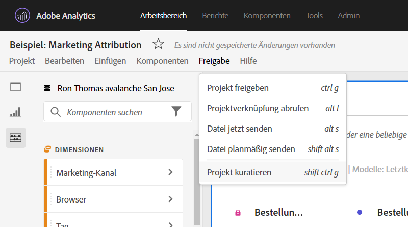
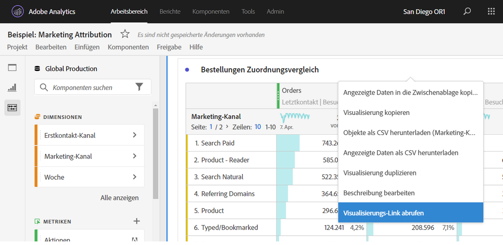

# Erstellen von freigebbaren Links

Analysis Workspace bietet viele Möglichkeiten, ein Projekt für Ihre Benutzer freizugeben, einschließlich der Möglichkeit, einen Link zu einem Projekt oder einem bestimmten Teil eines Projekts absurufen. Benutzer, die einen Link erhalten, müssen sich bei Adobe Analytics anmelden, bevor sie zum Projekt gelangen können.

## Projekt-Link abrufen {#project-link}

Um einen Link zum vollständigen Projekt freizugeben, klicken Sie auf **[!UICONTROL Freigeben > Projekt-Link abrufen]**. Wenn dem Empfänger des Links keine [Projektrolle](https://docs.adobe.com/content/help/de-DE/analytics/analyze/analysis-workspace/curate-share/share-projects.html)zugewiesen wurde, erhalten Administratoren **[!UICONTROL Kann bearbeiten]**- und Nicht-Administratoren erhalten **[!UICONTROL Kann duplizieren]**-Erlebnisse.

## Bedienfeld- oder Visualisierungs-Link abrufen {#panel-link}

Sie können auch einen Link zu einem bestimmten Teil eines Projekts freigeben, z. B. einem Bedienfeld oder einer individuellen Visualisierung. Dies wird manchmal auch als Intra-Linking bezeichnet. Dies kann nützlich sein, um die Aufmerksamkeit Ihrer Benutzer auf wichtige Erkenntnisse im Projekt zu lenken.

* Klicken Sie in der Kopfzeile eines Bedienfelds mit der rechten Maustaste auf **[!UICONTROL Bedienfeld-Link abrufen]**.
* Klicken Sie in einer Tabellen- oder Visualisierungskopfzeile mit der rechten Maustaste auf **[!UICONTROL Visualisierungs-Link abrufen]**.

[Sehen Sie sich das Video an](https://www.youtube.com/watch?v=lvmAdKNfWQw), wie Sie Links erstellen und diese verwenden, um Empfänger zu bestimmten Teilen Ihres Projekts zu führen.

## Links in Inhaltsverzeichnissen verwenden {#TOC}

Ein Tipp für die Nutzung der verschiedenen Link-Optionen besteht darin, immer ein Inhaltsverzeichnis am Anfang Ihres Workspace-Projekts einzufügen. Im Inhaltsverzeichnis können Sie Links zu anderen relevanten Projekten, spezifischen Bedienfeldern und spezifischen Visualisierungen erstellen. Dies erleichtert dem Empfänger des Projekts die Navigation.

[Sehen Sie sich das Video an](https://www.youtube.com/watch?v=Xo6fTguWm-M), wie Sie mithilfe von Links und dem Rich-Text-Editor von Workspace ein Inhaltsverzeichnis erstellen.

