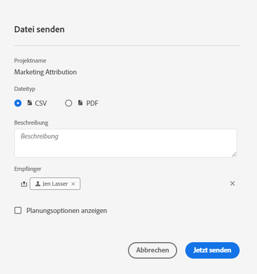
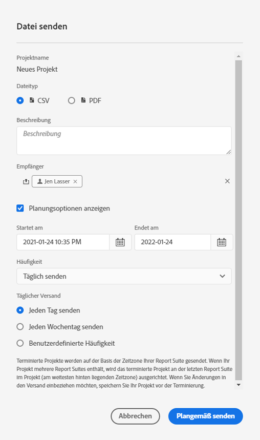
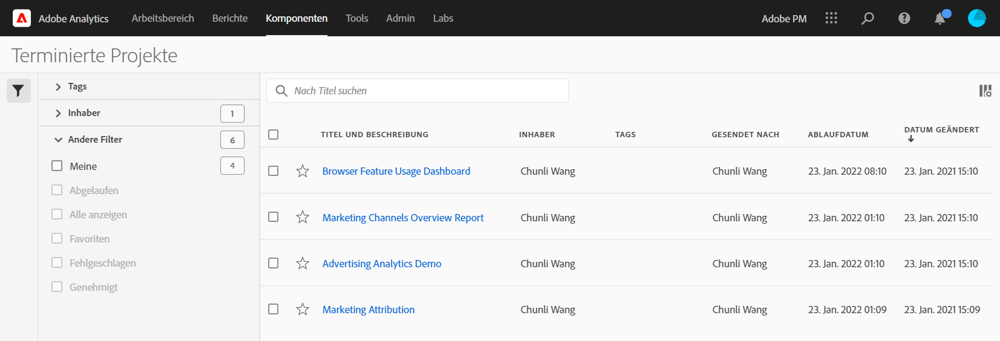

# Geplante Projekte

Über das Menü &quot; **Freigeben&quot;in Workspace können Sie Analysis Workspace-Projekte per E-Mail an ausgewählte Empfänger senden**. Dateien können im CSV- oder PDF-Format gesendet werden.

## Datei jetzt senden

So senden Sie eine Datei sofort per E-Mail an Empfänger:

1. Click **Share > Send File Now**.
1. Geben Sie den Dateityp an (CSV oder PDF).
1. (Optional) Hinzufügen eine Beschreibung, die in der E-Mail enthalten ist, um die empfangene Datei zu erklären.
1. hinzufügen Empfänger oder Gruppen. E-Mail-Adressen können auch eingegeben werden.
1. Klicken Sie auf **Jetzt senden**.
1. (Optional) Klicken Sie auf Planungsoptionen **anzeigen** , um einen Zeitplan für den Versand festzulegen.

## Datei planmäßig senden

So senden Sie eine Datei regelmäßig per E-Mail an Empfänger:

1. Click **Share > Send File on Schedule**.
1. Geben Sie den Dateityp an (CSV oder PDF).
1. (Optional) Hinzufügen eine Beschreibung, die in der E-Mail enthalten ist, um die empfangene Datei zu erklären.
1. hinzufügen Empfänger oder Gruppen. E-Mail-Adressen können auch eingegeben werden.
1. Geben Sie den Bereich an, über den der Zeitplan bereitgestellt werden soll, indem Sie die Einstellungen &quot;Start am&quot;und &quot;Ende bei Eingabe&quot;ändern. Das Enddatum muss innerhalb eines Jahres ab dem Tag liegen, an dem der Plan erstellt oder geändert wird.
1. Geben Sie die Häufigkeit des Versands an. Jede Frequenz ermöglicht unterschiedliche Anpassungen.
1. Klicken Sie auf Planmäßig **senden**.

## Manager für geplante Projekte

Geplante Analysis Workspace-Projekte können unter **Analytics > Komponenten > Geplante Projekte** verwaltet werden.

Im Manager für geplante Projekte können Sie wiederholte Projektpläne bearbeiten und löschen. Suchen Sie nach einem Zeitplan in der Suchleiste oder mithilfe der Filteroptionen in der linken Leiste. Sie können nach Tag, genehmigten Zeitplänen, Inhabern und mehr filtern.

Im Manager für geplante Projekte werden häufig folgende Aktionen ausgeführt:

| Aktion | Beschreibung |
|---|---|
| **Zeitplan bearbeiten** | Klicken Sie auf den Titel des Zeitplans, um seine Versand-Einstellungen zu aktualisieren. |
| **Zeitplan löschen** | Wählen Sie das geplante Projekt in der Liste aus und klicken Sie dann im Menü auf Löschen. Dadurch wird der ausgewählte Zeitplan für das Projekt gelöscht. das Projekt selbst wird nicht gelöscht. |
| **hinzufügen** | Wählen Sie das geplante Projekt in der Liste aus und wählen Sie dann &quot;Taggen&quot;oder &quot;Genehmigen&quot;, um Ihre Zeitpläne zu organisieren und die Suche zu vereinfachen. |
| **Ansicht fehlgeschlagene Zeitpläne** | Navigieren Sie zur linken Leiste > Andere Filter > Fehlgeschlagene Zeitpläne. |
| **Ansicht abgelaufen** | Navigieren Sie zur linken Leiste > Andere Filter > Abgelaufen, um abgelaufene Zeitpläne anzuzeigen. Klicken Sie auf den Titel des Zeitplans, um einen neuen Bereitstellungsplan einzurichten. |
| **Ansichten-Zeitplan-ID** | Navigieren Sie oben rechts zu den Spaltenoptionen und fügen Sie der Tabelle die Spalte &quot;Zeitplan-ID&quot;hinzu. Die geplante ID ist häufig zum Debugging nützlich. |

Im Manager für geplante Projekte werden die Elemente angezeigt, die von einem bestimmten Benutzer erstellt wurden. Wenn das Benutzerkonto in der Anwendung deaktiviert wird, werden alle geplanten Bereitstellungen gestoppt. Das geplante Projekteigentum kann unter **Admin > Analytics-Benutzer und -Assets > Assets übertragen** werden ****.
