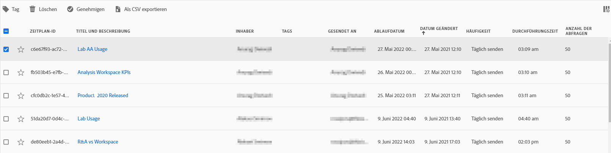

# Planen von Projekten

Über das Menü **Freigeben** in Workspace können Sie Analysis Workspace-Projekte per E-Mail an ausgewählte Empfänger senden. Dateien können im CSV- oder PDF-Format gesendet werden.

## Datei jetzt senden

So senden Sie eine Datei sofort per E-Mail an die Empfänger:

1. Klicken Sie auf **Freigeben > Datei jetzt senden**.
1. Geben Sie den Dateityp an (CSV oder PDF).
1. (Optional) Fuegen Sie eine Beschreibung hinzu, die in der E-Mail enthalten sein wird, um die empfangene Datei zu erklären.
1. Fügen Sie Empfänger oder Gruppen hinzu. E-Mail-Adressen können auch eingegeben werden.
1. Klicken Sie auf **Jetzt senden**.
1. (Optional) Klicken Sie auf **Planungsoptionen anzeigen**, um einen Zeitplan für den Versand festzulegen.

## Datei planmäßig senden

So senden Sie eine Datei basierend auf einem wiederkehrenden Zeitplan per E-Mail an die Empfänger:

1. Klicken Sie auf **Freigeben > Datei planmäßig senden**.
1. Geben Sie den Dateityp an (CSV oder PDF).
1. (Optional) Fuegen Sie eine Beschreibung hinzu, die in der E-Mail enthalten sein wird, um die empfangene Datei zu erklären.
1. Fügen Sie Empfänger oder Gruppen hinzu. E-Mail-Adressen können auch eingegeben werden.
1. Geben Sie den Datumsbereich an, über den anhand des Zeitplans gesendet werden soll, indem Sie die Einstellungen „Start am“ und „Ende am“ ändern. Das Enddatum muss innerhalb eines Jahres ab dem Tag liegen, an dem der Zeitplan erstellt oder geändert wurde.
1. Geben Sie die Versandhäufigkeit an. Jede Häufigkeit ermöglicht unterschiedliche Anpassungen.
1. Klicken Sie auf **Planmäßig senden**.

## Manager für geplante Projekte

Geplante Analysis Workspace-Projekte können unter **Analytics > Komponenten > Geplante Projekte** verwaltet werden.

Im Manager für geplante Projekte können wiederkehrende Projektzeitpläne bearbeitet und gelöscht werden. Suchen Sie in der Suchleiste oder mithilfe der Filteroptionen in der linken Leiste nach einem Zeitplan. Sie können nach Tag, genehmigten Zeitplänen, Inhabern und mehr filtern.

| Feld | Beschreibung |
| --- | --- |
| Favoriten | Wenn Sie das Sternsymbol auswählen, wird dieser Zeitplan zu einem Favoriten. |
| Zeitplan-ID | Diese ID wird hauptsächlich zum Debugging verwendet. |
| Titel und Beschreibung | Titel und Beschreibung dieses Projekts. |
| Verantwortlicher | Die Person, die das Projekt erstellt hat und dafür verantwortlich ist. |
| Tags | (Optional) Mit Tagging können Projekte praktisch organisiert werden. Alle Benutzer können Tags erstellen und eines oder mehrere Tags auf ein Projekt anwenden. Sie sehen Tags jedoch nur für die Projekte, deren Verantwortlicher Sie sind oder die für Sie freigegeben wurden. |
| Gesendet an | Der/die Empfänger dieses geplanten Projekts. |
| Ablaufdatum | Standardmäßig liegt das Ablaufdatum ein Jahr nach dem Erstellungsdatum. |
| Häufigkeit | Wie oft Sie dieses geplante Projekt an den/die Empfänger senden möchten. |
| Durchführungszeit | Zu welcher Tageszeit dieses geplante Projekt gesendet wird.  |
| Anzahl der Abfragen | Die Anzahl der Abfragen für dieses Projekt. |

## Allgemeine Aktionen

Die folgenden Aktionen werden im Manager für geplante Projekte häufig ausgeführt:

| Aktion | Beschreibung |
|---|---|
| **Zeitplan bearbeiten** | Klicken Sie auf den Titel des Zeitplans, um seine Versandeinstellungen zu aktualisieren. |
| **Zeitplan löschen** | Wählen Sie das geplante Projekt in der Liste aus und klicken Sie dann im Menü auf „Löschen“. Dadurch wird der ausgewählte Zeitplan für das Projekt gelöscht. Das Projekt selbst wird nicht gelöscht. |
| **Tags hinzufügen** | Wählen Sie das geplante Projekt in der Liste aus und wählen Sie dann „Taggen“ oder „Genehmigen“ aus, um Ihre Zeitpläne zu organisieren und die Suche zu vereinfachen. |
| **Fehlgeschlagene Zeitpläne anzeigen** | Navigieren Sie zur linken Leiste > „Andere Filter“ > „Fehlgeschlagen“, um Zeitpläne anzuzeigen, die fehlgeschlagen sind. |
| **Abgelaufene Zeitpläne anzeigen** | Navigieren Sie zur linken Leiste > „Andere Filter“ > „Abgelaufen“, um Zeitpläne anzuzeigen, die abgelaufen sind. Klicken Sie auf den Titel des Zeitplans, um einen neuen Versandplan einzurichten. |
| **Zeitplan-ID anzeigen** | Navigieren Sie oben rechts zu den Spaltenoptionen und fügen Sie der Tabelle die Spalte „Zeitplan-ID“ hinzu. Die Zeitplan-ID ist oft zum Debugging nützlich. |

Im Manager für geplante Projekte werden die Elemente angezeigt, die von einem bestimmten Benutzer erstellt wurden. Wenn das Benutzerkonto in der Anwendung deaktiviert wird, werden alle geplanten Bereitstellungen gestoppt. Die Eigentuemerschaft eines geplanten Projekts kann unter **Admin > Analytics-Benutzer und -Assets > Assets übertragen** **übertragen** werden.
