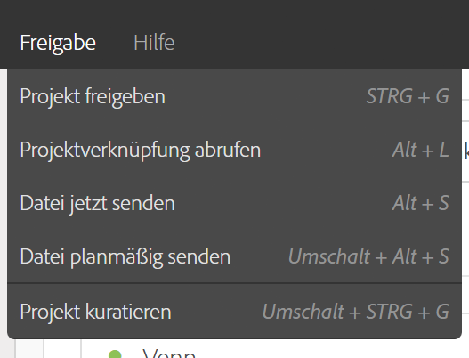
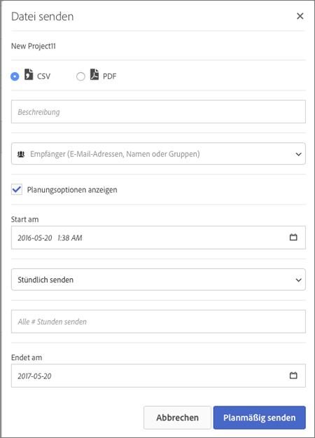

# Datei senden - Bereitstellung eines Projekts planen

Versenden Sie ein Projekt aus dem Analysis Workspace per E-Mail oder planen Sie die Bereitstellung.

1. [Erstellen Sie ein Analysis Workspace-Projekt](https://marketing.adobe.com/resources/help/en_US/analytics/analysis-workspace/t_freeform_project.html) und speichern Sie es.
1. Click **[!UICONTROL Share]** &gt; **[!UICONTROL Send File On Schedule]**.

   

1. Geben Sie auf der Seite [!UICONTROL Datei senden] den Dateityp (CSV oder PDF) an. 

   

1. Add recipients email addresses or names, the click **[!UICONTROL Send Now]**.
1. (Optional) Click **[!UICONTROL Show Scheduling Options]** to specify a delivery schedule, then click **[!UICONTROL Send on Schedule]**.
1. Manage scheduled projects in **[!UICONTROL Components]** &gt; [Scheduled Projects](../../../analyze/analysis-workspace/curate-share/schedule-projects.md#concept_A7B9856EF2504BD791FE5A9E8AA7C29C).