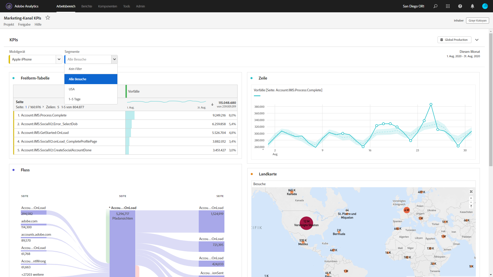

# Arbeitsbereich-Projekte, die nur für Ansichten gedacht sind

Sie können Projekte über den [Projektfreigabe-Arbeitsablauf](/help/analyze/analysis-workspace/curate-share/share-projects.md)als &quot;nur Ansicht&quot;für Empfänger freigeben. Empfänger, die in der Rolle &quot;Kann Ansicht&quot;platziert wurden, erhalten eine eingeschränktere Projekterfahrung. Dies ist ggf. wünschenswert, wenn Sie ein Projekt für Benutzer freigeben, die mit der Datenstruktur Ihres Unternehmens, dem Arbeitsbereich für Analysen oder Adobe Analytics im Allgemeinen weniger vertraut sind. Sie möchten jedoch dennoch, dass diese Benutzer Daten und Erkenntnisse in einer sicheren Umgebung nutzen.

## Deaktivierte Interaktionen

Deaktivierte Interaktionen in einem Nur-Ansicht-Projekt umfassen:

* Ausgeblendete linke Leiste
* Report Suites
* Datumsbereich des Bereichskalenders. Hinweis: Wenn Sie Empfängern Kalendersteuerung gewähren möchten, fügen Sie einen [Dropdownfilter mit Datumsbereichen](https://docs.adobe.com/content/help/en/analytics-learn/tutorials/analysis-workspace/using-panels/using-drop-down-filters.html)hinzu.
* Freiformfilterung
* Freiformanzahl der sichtbaren Zeilen
* Freiformzeilen-, Spalten- oder Visualisierungseinstellungen
* Bereichssegmente
* Menüs &quot;Bearbeiten&quot;, &quot;Einfügen und Komponenten&quot;
* Tipps zum Arbeitsbereich

## Aktivierte Interaktionen

Zu den bemerkenswerteren aktivierten Interaktionen in einem Nur-Ansicht-Projekt gehören:

| Bereich | Aktivierte Interaktionen |
|---|---|
| Freiformtabellen | <ul><li>Paginierung und Sortierung</li><li>Bewegen</li><li>Zellauswahl, die verknüpfte Visualisierungen aktualisiert</li><li>Rechtsklick > Visualisierungslink abrufen</li><li>Klicken Sie mit der rechten Maustaste > In Zwischenablage kopieren</li></ul> |
| Visualisierungen | <ul><li>Klicken zum Aktivieren/Deaktivieren der Legende</li><li>Bewegen</li><li>Rechtsklick > Visualisierungslink abrufen</li><li>Reduzieren/erweitern</li><li>Fluss - Flussknoten erweitern</li><li>Map - Zoom</li></ul> |
| Bedienfelder | <ul><li>Interaktive Dropdown-Filter</li><li>Klicken Sie mit der rechten Maustaste > Bedienfeldlink abrufen</li><li>Reduzieren/erweitern</li></ul> |
| Projekt  | <ul><li>Alle Infosymbole überprüfen</li><li>Projektmenü - Neu, Öffnen, Als Landingpage festlegen, Aktualisieren, CSV/PDF herunterladen, Projektinfo und Einstellungen begrenzen</li><li>Menü &quot;Freigeben&quot;- Projektverknüpfung, Datei jetzt senden</li><li>Menü &quot;Hilfe&quot;: Alle Aktionen mit Ausnahme der Optionen &quot;Tipps und Debugger&quot;</li></ul> |
