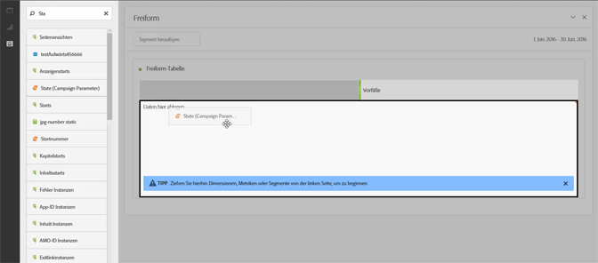
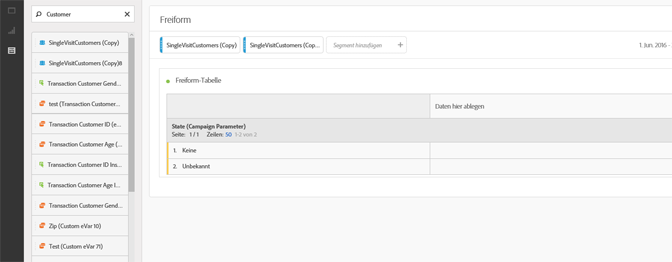
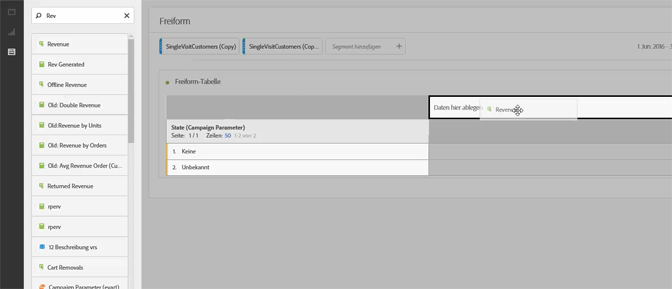
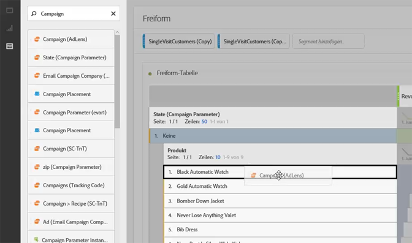
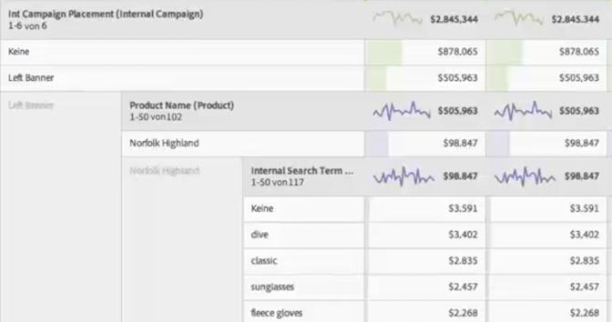

# Anwendungsfälle von Analysis Workspace

Beispiele zur Verwendung von Datentabellen und Segmenten sowie exemplarische Anwendungsfälle für Analysis Workspace.

Sie können Ihre gesamten Daten im Hinblick auf spezifische Fragen untersuchen und Berichte zu den Interaktionen Ihrer Kunden und den Interessen der Zielgruppe zusammenstellen. In einer Freiformumgebung können Sie Dimensionen, Metriken und Segmente über einen Zeitraum hinweg anwenden, um die gewünschten Daten direkt abzurufen. Entwerfen Sie Ihre Analyse so, dass sie spezifische Fragen beantwortet, und veröffentlichen Sie die Informationen dann in komplexen Berichten und Visualisierungen, die freigegeben und auch von Geschäftsanwendern mit hohem Zeitdruck problemlos interpretiert werden können.

**Beispiele**

* Als Medienunternehmen möchten Sie vielleicht Ihre neuen Besucher, Ihre wiederholten Besucher und Ihre treusten Besucher vergleichen, um zu sehen, wie sich der Gebrauch des Inhalts für die einzelnen Segmente im Lauf der Zeit verändert.
* Vergleich der Konversionsraten für firmenspezifische und nicht firmenspezifische Keywords.
* Aufschlüsseln der Seitenansichten nach interner Suche, externer Suche, Landingpages und so weiter, um herauszufinden, welche firmenspezifischen und nicht firmenspezifischen Begriffe unterschiedlich gut laufen.
* Vergleich eines Tages mit dem nächsten Tag, um Spalten oder Zeilen zu vergleichen und das Wachstum über mehrere Metriken hinweg zu analysieren.
* Durchführen einer einfachen Abfrage wie die nach Rücksendungen für eine Dimension.

## Beispiel aus dem Einzelhandel {#section_9EFDEF038CAD4954BCFB118A8F33A96F}

Angenommen Sie sind Marketinganalyst eines Einzelhändlers für Outdoor-Ausrüstung und sollen die Leistung einer kürzlich durchgeführten Aktion untersuchen sowie Empfehlungen für die Verbesserung von Onsite-Kampagnen abgeben. Dieses Beispiel zeigt auf, wie Sie die Kampagnenumsatzdaten für verschiedene Segmente vergleichen und Aufschlüsselungen hinzufügen können, um tiefere Einblicke in die Kampagne zu erhalten.

1. Wählen Sie die gewünschte Report Suite aus.
1. Suchen Sie z. B. nach Ihrer Dimension für die interne Kampagnenplatzierung und ziehen Sie diese in den linken Bereich der Tabellenarbeitsfläche (diese Daten bilden die Tabellenzeilen).

   

1. Klicken Sie jetzt links oben auf das Segment-Symbol und ziehen Sie verschiedene Segmente für die Kundenloyalität in die rechte Hälfte der Arbeitsfläche. Sie können die Segmente direkt miteinander vergleichen. Diese bilden die Tabellenspalten.

   

1. Klicken Sie links oben auf das Symbol für die Ereignisse (Metriken) und fügen Sie unter allen Segmenten die Umsatzmetrik hinzu. Beachten Sie, dass der Bericht automatisch erstellt wird. Sie können jetzt anfangen, den Kampagnenumsatz für diese Kundensegmente zu vergleichen.

   

1. Wenn Sie jetzt sehen möchten, welche Produkte im linken Banner-Bereich auf Ihren Seiten am effektivsten waren, können Sie die linken Banner nach Produktname aufschlüsseln. Klicken Sie einfach auf das Dimensionen-Symbol und ziehen Sie die Produktnamensdimension auf das linke Banner.

   

1. Sie können jedoch noch mehr aufschlüsseln Vielleicht fragen Sie sich, welche Suchbegriffe die Leute benutzt haben, um zu Ihrem umsatzstärksten Produkt „Norfolk Highland“ zu gelangen. Hierzu müssen Sie lediglich die Dimension für den internen Suchbegriff auf den Produktnamen ziehen:

   

   Eine neue Aufschlüsselung wird angezeigt:

   

   Jetzt haben Sie die Daten bereits auf eine Weise aufgeschlüsselt, die Empfehlungen und Cross-Sells ermöglicht, die Ihre Verkaufsteams in andere Kampagnen implementieren können. Auf diese Weise können Sie noch mehr Umsatz für Ihr Unternehmen erzielen. Sie können weiter aufschlüsseln, bis Sie die gesuchten Ergebnisse erhalten.

   Jetzt können Sie den Bericht für diese Merchandising-Teams  [freigeben](/help/analyze/analysis-workspace/curate-share/curate.md).

