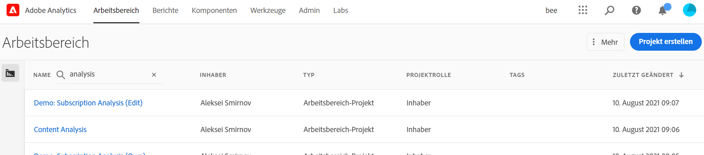
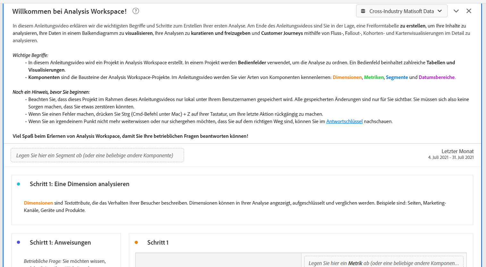
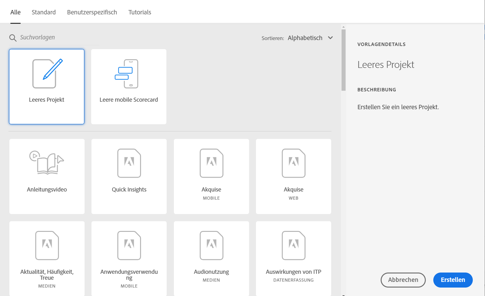
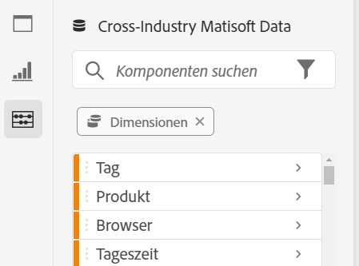
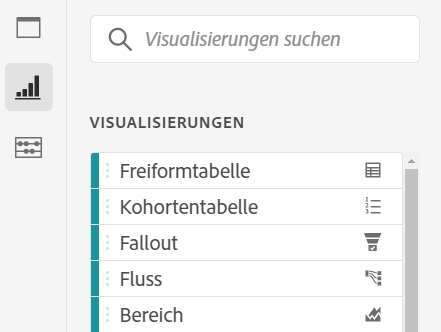
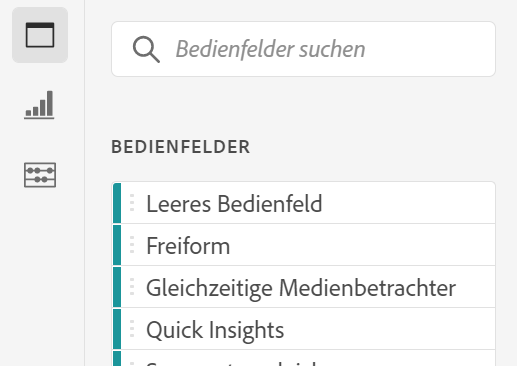

# Analysis Workspace – Übersicht

Analysis Workspace ist ein flexibles Browser-Tool, mit dem Sie schnell Analysen erstellen und Insights austauschen können. Mithilfe der Drag-and-Drop-Oberfläche können Sie Ihre Analyse gestalten, Visualisierungen hinzufügen, um Daten optisch darzustellen, einen Datensatz kuratieren sowie Projekte für andere in Ihrer Organisation freigeben und planen.

Wenn Sie nur wenige Minuten Zeit haben, sehen Sie sich diese kurze Übersicht an, um zu sehen, was möglich ist.

>[!VIDEO](https://video.tv.adobe.com/v/26266/?quality=12)

## Melden Sie sich bei Adobe Analytics {#login}

Um mit Analysis Workspace zu beginnen, melden Sie sich unter [experience.adobe.com/analytics](http://experience.adobe.com/analytics) bei Adobe Analytics an. Sie landen auf der Homepage der Workspace-Projektliste, wenn noch kein bestimmtes Projekt für Sie ausgewählt wurde.

## Verwenden des Tutorials {#training-tutorial}

Nach der Anmeldung sollten Sie als Erstes das Analysis Workspace-Tutorial besuchen, das Sie durch die gängige Terminologie und die Schritte zum Aufbau Ihrer ersten Analyse in Workspace führt. Um mit dem Tutorial zu beginnen, klicken Sie auf **[!UICONTROL Neues Projekt erstellen]** und wählen Sie dann **Tutorial** im neuen Projektmodell aus.

## Neues Projekt erstellen {#new-project}

Nach Abschluss des Tutorials können Sie mit der Erstellung Ihres ersten Projekts beginnen. Das **neue Projektmodell** bietet verschiedene Optionen zum Starten Ihrer Analyse. Je nachdem, ob Sie Ihre Analyse über den Browser oder die Adobe Analytics Dashboards-Mobile-App freigeben möchten, können Sie mit einem leeren Projekt oder einer [leeren mobilen Scorecard](https://docs.adobe.com/content/help/de-DE/analytics/analyze/mobapp/curator.html) beginnen.

Sie können Ihre Analyse auch mit vordefinierten **Vorlagen** beginnen, entweder mit von Adobe bereitgestellten Standardvorlagen oder mit benutzerdefinierten Vorlagen, die von Ihrem Unternehmen erstellt wurden. Je nach Analyse oder Anwendungsfall stehen verschiedene Vorlagen zur Verfügung. [Hier erhalten Sie weitere Informationen](https://docs.adobe.com/content/help/de-DE/analytics/analyze/analysis-workspace/build-workspace-project/starter-projects.html) über die verschiedenen verfügbaren Vorlagenoptionen.

## Analyse erstellen {#analysis}

In Ihrem Workspace-Projekt können Sie von der linken Leiste aus auf **Bereiche, Tabellen, Visualisierungen und Komponenten** zugreifen. Das sind Ihre Projektbausteine.

### Komponenten

**Komponenten** sind Dimensionen, Metriken, Segmente oder Datumsbereiche, die alle in einer **[!UICONTROL Freiformtabelle]** kombiniert werden können, um Sie bei der Beantwortung Ihrer betrieblichen Frage zu unterstützen. Machen Sie sich mit jedem [Komponententyp](/help/analyze/analysis-workspace/components/analysis-workspace-components.md) vertraut, bevor Sie mit Ihrer Analyse fortfahren. Wenn Sie die Terminologie der Komponenten kennen, können Sie mit dem Ziehen und Ablegen beginnen, um [Ihre Analyse ](https://docs.adobe.com/content/help/de-DE/analytics/analyze/analysis-workspace/build-workspace-project/t-freeform-project.html)in einer **[!UICONTROL Freiform-Tabelle]** zu erstellen.

### Visualisierungen

**Visualisierungen** wie Balken- oder Liniendiagramme werden dann über den Daten hinzugefügt, um sie visuell darzustellen. Wählen Sie in der linken Leiste das mittlere Symbol **[!UICONTROL Visualisierungen]** aus, um die vollständige Liste der verfügbaren [Visualisierungen](https://docs.adobe.com/content/help/de-DE/analytics/analyze/analysis-workspace/visualizations/freeform-analysis-visualizations.html) anzuzeigen.

### Bedienfelder

**Bedienfelder** dienen zur Organisation Ihrer Analyse in einem Projekt und können viele Tabellen und Visualisierungen enthalten. Viele der in Analysis Workspace bereitgestellten Bedienfelder generieren einen vollständigen Satz von Analysen auf der Grundlage einiger Benutzereingaben. Wählen Sie in der linken Leiste das Symbol **[!UICONTROL Bedienfelder]** oben aus, um eine vollständige Liste der verfügbaren [Bedienfelder](https://docs.adobe.com/content/help/de-DE/analytics/analyze/analysis-workspace/panels/panels.html) anzuzeigen.

## Zusätzliche Ressourcen {#resources}

* Adobe bietet Hunderte von [Analytics-Video-Tutorials](https://docs.adobe.com/content/help/de-DE/analytics-learn/tutorials/overview.html).
* [Neuerungen in Analysis Workspace](/help/analyze/analysis-workspace/new-features-in-analysis-workspace.md) enthält aktuelle Informationen zu neuen Funktionen.
