# Neuerungen in Analysis Workspace

## April 2020

Am 16. April 2020 veröffentlichte neue Funktion.

| Funktion | Beschreibung |
|--- |--- |
| Automatisch [!UICONTROL Freeform Tables] aus einem leeren Status erstellen | Zuvor war es nicht möglich, Komponenten direkt in ein leeres Projekt oder ein leeres Bedienfeld zu verschieben. Sie mussten zuerst eine Freiformtabelle hinzufügen. Sie können jetzt Komponenten direkt in einem leeren Projekt oder Fenster ablegen. Eine Freiform-Tabelle wird automatisch in einem empfohlenen Format erstellt. Darüber hinaus wurden Verbesserungen daran vorgenommen, wie gemischte Komponententypen (z. B. Dimensionen und Metriken) behandelt werden, wenn sie [!UICONTROL Freeform Table] zusammen in ein leeres Feld fallen. |

## März 2020

Am 12. März 2020 veröffentlichte neue Funktionen.

| Funktion | Beschreibung |
|--- |--- |
| Unterstützung mehrerer Report Suites in Workspace | Sie können jetzt Daten aus mehreren Report Suites in ein einzelnes Projekt zur Ansicht nebeneinander einfügen. [Mehr Infos...](https://docs.adobe.com/content/help/de-DE/analytics/analyze/analysis-workspace/build-workspace-project/multiple-report-suites.html) |
| Übungsvorlage | Diese neue Standardvorlage führt Sie durch die gängige Terminologie und Schritte zum Aufbau Ihrer ersten Analyse in Workspace. Sie ist als Standardvorlage im Modul „Neues Projekt“ enthalten und ersetzt das Beispielprojekt, das bislang neuen Anwendern angeboten wurde, die keine anderen Projekte in ihrer Liste haben. [Mehr Infos...](/help/analyze/analysis-workspace/build-workspace-project/starter-projects.md) |

## Februar 2020

Am 20. Februar 2020 veröffentlichte neue Funktionen.

| Funktion | Beschreibung |
|--- |--- |
| Neue Workspace-Vorlage für Organisationen, die geräteübergreifende Analysen verwenden | Diese Vorlage zeigt, wie effektiv CDA beim Zusammenfügen von Besuchen ist, und informiert Sie über CDA-exklusive Dimensionen und Metriken. Eine Report Suite, die CDA verwendet, ist erforderlich. Weitere Informationen finden Sie unter [Einrichten von geräteübergreifenden Analysen](https://docs.adobe.com/content/help/de-DE/analytics/components/cda/cda-setup.html). |
| Neue Hotkeys in Workspace | <ul><li>Alle Bereiche reduzieren/erweitern: `alt + m`</li><li>Aktiven Bereich reduzieren/erweitern: `alt + ctrl + m`</li><li>Linke Leiste durchsuchen: `ctrl + /`</li><li>Zum nächsten Bereich wechseln: `alt + Right Key`</li><li>Zum vorherigen Bereich wechseln: `alt + Left Key`</li></ul>[Mehr Info...](https://docs.adobe.com/content/help/de-DE/analytics/analyze/analysis-workspace/build-workspace-project/fa-shortcut-keys.html) |
| Weitere Neuerungen in Workspace | <ul><li>Wenn ein Bedienfeld oder eine Visualisierung in Workspace abgelegt wird, wechselt die linke Leiste jetzt automatisch zu Komponenten, um einen nahtlosen Arbeitsablauf zu gewährleisten.</li><li>Vorlagenkomponenten können nun mit Aktionen versehen werden (z. B. mit Tags, Favoriten, Genehmigt).</li><li>Gefilterte Metriken und Segmentkomponenten Angebot der Schaltfläche +, um eine neue Liste hinzuzufügen, wenn Sie nicht finden, was Sie benötigen.</li></ul> |
| Workspace-Debugger | Der Workspace-Debugger wurde dem Menü „Hilfe“ hinzugefügt, sodass Sie ihn nahtloser zum Debuggen von Workspace-Anforderungen aktivieren können. [Mehr Infos...](https://www.adobe.io/apis/experiencecloud/analytics/docs.html#!AdobeDocs/analytics-2.0-apis/master/reporting-tricks.md) |

## Januar 2020

Am 16. Januar 2020 veröffentlichte neue Funktion.

| Funktion | Beschreibung |
|--- |--- |
| [Freiformtabellen-Builder](https://docs.adobe.com/content/help/de-DE/analytics/analyze/analysis-workspace/visualizations/freeform-table.html) | Wenn die Tabellenerstellung aktiviert ist, können Sie für komplexe Geschäftsszenarien Tabellen mit vielen Dimensionen, Unterteilungen, Metriken und Segmenten per Drag &amp; Drop erstellen. Daten werden nicht sofort aktualisiert. Instead, updates occur after you click **[!UICONTROL Build]**, saving you time once you know what table you want to construct. Zusätzlich bietet diese Funktion Folgendes:<ul><li>**Vorschau**: Sie können eine Vorschau des Tabellenformats anzeigen, bevor Sie echte Daten rendern.</li><li>**Flexible Zeilen- und Aufschlüsselungseinstellungen**: Sie können für jede Zeile einer Dimension Zeilen- und Aufschlüsselungsebenen festlegen. Zuvor wurden im Workspace Standardwerte verwendet, die erst geändert werden konnten, nachdem die Daten zurückgegeben wurden.</li><li>**Aufschlüsselung nach Position**: Sie können Dimensionszeilen so einstellen, dass sie immer _nach Position_ und nicht nach einem _bestimmten Element_ (Standard) aufgeschlüsselt werden.</li><li>**Manuelle Anordnung statischer Zeilen**: Sie können statische Zeilen manuell sortieren, damit die Tabellenzeilen genau nach Bedarf angezeigt werden. Zuvor konnten statische Zeilen nur nach einer Metrikspalte oder alphabetisch sortiert werden.</li></ul> |

## Oktober 2019

Am 10. Oktober 2019 veröffentlichte Verbesserungen.

| Verbesserung | Beschreibung |
|--- |--- |
| Update der Gesamtwerte der Freiformtabelle | Freiformtabellen enthalten jetzt zwei Summen, eine **[!UICONTROL Table total]** und eine **[!UICONTROL Grand total]**. In der Tabellenzeile „Gesamt“ werden angewendete [Berichtsfilter](https://docs.adobe.com/content/help/de-DE/analytics/analyze/analysis-workspace/build-workspace-project/pagination-filtering-sorting.html) berücksichtigt. Zuvor wirkte sich nur die Segmentierung auf die Gesamtwerte aus. [Weitere Informationen](https://docs.adobe.com/content/help/de-DE/analytics/analyze/analysis-workspace/build-workspace-project/workspace-totals.html) Darüber hinaus wurden **[!UICONTROL Show Totals]** und **[!UICONTROL Show Grand Total]** Optionen hinzugefügt **[!UICONTROL Column Settings]**. Mit dieser Änderung an den Freiformsummen werden abhängige Visualisierungen (z. B. verknüpfte **[!UICONTROL Summary Number]** Visualisierungen) sowie exportierte CSV- und PDF-Daten aktualisiert. |
| Option zum Entfernen von „Nicht angegeben (keine)“ | Den Berichtsfiltern wurde eine einfache Funktion zum Entfernen von „Nicht angegeben (keine)“ hinzugefügt. |
| Wegfall der lilafarbenen Zeitkomponenten | Die lilafarbenen Zeitkomponenten (Minute, Stunde, Tag, Woche, Monat, Quartal, Jahr) wurden entfernt. Diese Zeitkomponenten haben sich immer exakt wie ihre orangefarbenen Dimensionspendants verhalten. Durch diese Änderung wird das Erlebnis also optimiert. Wenn Sie zuvor die lilafarbenen Zeitkomponenten genutzt haben, ist **keine Änderung** erforderlich. Mit dieser Änderung wurde auch der violette **[!UICONTROL Time]** Abschnitt in **[!UICONTROL Date Ranges]** umbenannt. |

## August 2019

Verbesserung veröffentlicht am 8. August 2019.

| Verbesserung | Beschreibung |
|--- |--- |
| Erhöhung der Anzahl der Elemente im Dropdown-Filter von 50 auf 200 | Wir haben die Anzahl der Elemente von 50 auf 200 erhöht, die in einem Dropdown-Filter platziert werden können. Dank dieser Verbesserung sind jetzt zahlreiche Anwendungen möglich, z. B. das Hinzufügen aller Länder (195) zu einem Filter oder aller US-Bundesstaaten und Provinzen (52). |

## Juli 2019

Am 18. Juli 2019 veröffentlichte Verbesserungen.

| Verbesserung | Beschreibung |
|--- |--- |
| Verbesserungen der Kohortenanalyse | Zur [Kohortenanalyse wurden neue Einstellungen](https://docs.adobe.com/content/help/de-DE/analytics/analyze/analysis-workspace/visualizations/cohort-table/t-cohort.html) hinzugefügt: <ul><li>Nur Prozentwert anzeigen</li><li>Prozentwert auf nächste Ganzzahl runden</li><li>Zeile mit durchschnittlichem Prozentwert anzeigen</li></ul> |
| Elemente der letzten 18 Monate anzeigen | In der linken Leiste haben Benutzer jetzt die Möglichkeit, _Elemente aus den letzten 18 Monaten anzuzeigen_. Zuvor betrug der Anzeigezeitraum maximal 6 Monate. Dies erleichtert den Vergleich mit Seiten oder Kampagnen aus dem Vorjahr bzw. bis vor maximal 18 Monaten. |
| Neue Vorlage für Analysis Workspace | Wir haben Analysis Workspace eine neue Vorlage mit dem Namen [Magento: Marketing &amp; Commerce](https://docs.adobe.com/content/help/de-DE/analytics/analyze/analysis-workspace/build-workspace-project/starter-projects.html) hinzugefügt. Sie wurde speziell für E-Commerce-Kunden von Magento konzipiert, aber alle anderen Einzelhändler können sie ebenfalls verwenden, um nützliche Einblicke in ihre Commerce-Aktivitäten zu erhalten. |

## Juni 2019

Verbesserung veröffentlicht am 13. Juni 2019.

| Verbesserung | Beschreibung |
|--- |--- |
| Neue Standardfilter | Es wurden neue Standardfilter zur linken Leiste hinzugefügt. Über das hinaus, was Sie heute sehen (Dimensionen, Metriken, Genehmigt usw.), wurden neue Filter wie „Berechnete Metriken“, „Kundenattribute“, „eVars“, „Eigenschaften“, „Video“ usw. hinzugefügt, damit die benötigten Komponenten leichter gefunden werden können. |

## Mai 2019

Verbesserung veröffentlicht am 9. Mai 2019.

| Verbesserung | Beschreibung |
|--- |--- |
| Eine neue Einstellung wurde zu den Fluss-Visualisierungseinstellungen hinzugefügt: Wiederholungsinstanzen einschließen. | [Flusseinstellungen](/help/analyze/analysis-workspace/visualizations/c-flow/flow-settings.md) |

## April 2019

Verbesserung veröffentlicht am 11. April 2019.

| Verbesserung | Beschreibung |
|--- |--- |
| Verbesserungen der Best Practices zur Optimierung | [Leistung optimieren](/help/analyze/analysis-workspace/new-features-in-analysis-workspace.md) |

## Januar 2019

Am 17. Januar 2019 veröffentlichte neue Funktionen und Verbesserungen.

| Funktion | Beschreibung |
|--- |--- |
| [Kohortenanalyse](/help/analyze/analysis-workspace/visualizations/cohort-table/cohort-analysis.md) | Die wichtigsten Verbesserungen bei der Kohorten-Analyse ermöglichen Ihnen Folgendes:<ul><li>Wenden Sie eine Segmenteinbeziehungs- und Rückgabemetrik separat an. </li><li>Zeige die Kehrtwende anstelle der Rettung.</li><li>Latenztabellen anzeigen (Ereignis vor und nach dem Einschluss).</li><li>Anpassen der Kohortendimension (zum Gruppieren von Besuchern basierend auf einer eVar, nicht nur zeitbasiert).</li><li>Führen Sie eine rollierende Kohortenberechnung durch: Berechnung von Bindung/Abwanderung basierend auf dem vorherigen Zeitraum, nicht auf der ursprünglichen Kohorte. </li><li>Hinzufügen mehrerer Metriken in Aufnahme- und Rückkehrfeldern sowie Anwendung von Segmenten. (Berechnete Metriken werden nicht unterstützt)</li></ul> |
| [Dichte anzeigen](/help/analyze/analysis-workspace/build-workspace-project/view-density.md) | Mit dieser neuen Einstellung können Sie mehr Daten auf einem einzigen Bildschirm anzeigen, indem Sie den vertikalen Abstand der linken Schiene, Freiformtabellen und Kohortentabellen reduzieren. Zugriff erhalten Sie über „Projekt“ > „Projektinfo und Einstellungen“. |
| [Unterstützung für Mehrwert-Variablen in Attribution IQ](attribution-iq.md) | Einige Dimensionen in Analytics können mehrere Werte für einen Hit enthalten, zum Beispiel listVars, die Produktvariable, Listen-Props oder Merchandising-eVars. Mit Analysis Workspace können Sie Attribution IQ auf jede dieser Arten von Variablen auf der Hit-Ebene anwenden. |
| Leistungsverbesserungen | Schnellere Verbesserung der Darstellung von Aufschlüsselungen - Projekte mit vielen Aufschlüsselungen werden schneller geladen. |

## November 2018

Am 1. November 2018 veröffentlichte neue Funktionen und Verbesserungen.

| Funktion | Beschreibung |
|--- |--- |
| [VRS und Projektkuratierung – Verbesserungen](/help/analyze/analysis-workspace/curate-share/curate-projects-vrs.md) | Diese Änderungen wurden bereits im Oktober 2018 eingeführt. Die Änderungen betreffen die Komponenten, die Administratoren und Benutzer ohne diese Rolle in kuratierten Workspace-Projekten und kuratierten Virtual Report Suites (VRSs) anzeigen können.  Vor dieser Änderung konnten alle Benutzer nicht kuratierte Komponenten anzeigen, und zwar durch Klicken auf „Alle Komponenten anzeigen“. Die aktualisierte Kuratierungserfahrung bietet umfassendere Möglichkeiten, festzulegen, welche Komponenten sichtbar sind.  |

## Oktober 2018

Am 11. Oktober 2018 veröffentlichte neue Funktionen und Verbesserungen.

<table id="table_3DDC812B2F66416F868004416D248BF3"> 
 <thead> 
  <tr> 
   <th colname="col1" class="entry"> Funktion </th> 
   <th colname="col2" class="entry"> Beschreibung </th> 
  </tr> 
 </thead>
 <tbody> 
  <tr> 
   <td colname="col1"> 
<b>Bedienfeld-Dropdown-Verwaltung</b> 
 </td> 
   <td colname="col2"> 
Wir haben einige Änderungen an der Verwaltung der Dropdown-Listen vorgenommen, die im September MR eingeführt wurden. Wenn Sie mit der rechten Maustaste auf das Dropdown-Feld klicken, können Sie jetzt 
 
    <ul id="ul_4BDEC66EEB2243628FE32B43E377E5BD"> 
     <li id="li_EF8277BE972540D3B2604D82BC7C0918">Löschen Sie ein Dropdown-Feld (diese Option ist immer vorhanden). </li> 
     <li id="li_6A991208F2744274817DBE1E9D1B443F">Löschen Sie eine Beschriftung (wenn eine Beschriftung angezeigt wird). </li> 
     <li id="li_5C1CFC465C2E41D2B35E8841EFDC82AA">Hinzufügen einer Beschriftung (wenn keine Beschriftung angezeigt wird) </li> 
    </ul> </td> 
  </tr> 
  <tr> 
   <td colname="col1"> 
<b>Links in QuickInfos für Bedienfelder und Visualisierungen</b> 
 </td> 
   <td colname="col2"> 
Den QuickInfos zu Bedienfeldern und Visualisierungen wurden Links zu relevanten Videos und Dokumentation hinzugefügt. 
 </td> 
  </tr> 
 </tbody> 
</table>

## September 2018

Am 13. September 2018 veröffentlichte neue Funktionen und Verbesserungen.

<table id="table_137719BFA03C44A78FDE872DF8B228A4"> 
 <thead> 
  <tr> 
   <th colname="col1" class="entry"> Funktion </th> 
   <th colname="col2" class="entry"> Beschreibung </th> 
  </tr> 
 </thead>
 <tbody> 
  <tr> 
   <td colname="col1"> 
<b>Panel-Dropdownmenüs</b> 
 </td> 
   <td colname="col2"> 
Die Dropzone des Bereichs verfügt jetzt über Dropdown-Funktionen. Dropdown-Listen ermöglichen es Endbenutzern, mit den Daten in einem Projekt auf kontrollierte Weise zu interagieren. Beispiel: Angenommen, Sie haben mehrere Projektversionen, um länderspezifischen Berichte bereitzustellen. Sie können diese Projekte jetzt in einem einzigen Projekt zusammenfassen und stattdessen in einer Dropdown-Liste "Land"hinzufügen. 
 </td> 
  </tr> 
  <tr> 
   <td colname="col1"> 
<b>Farbpaletten</b> 
 </td> 
   <td colname="col2"> 
Sie können jetzt das Farbschema in Workspace ändern, indem Sie eine andere Farbpalette auswählen oder eine eigene Palette angeben. Dies wirkt sich auf viele Dinge in Workspace aus, einschließlich der meisten Visualisierungen. Die Zusammenfassungsänderung, die bedingte Formatierung in Freiformtabellen und die Zuordnungsvisualisierung sind davon <b>NICHT</b> betroffen. 
 
Hinweis: Die Farbpalettenunterstützung ist für Internet Explorer 11 nicht aktiviert. 
 </td> 
  </tr> 
  <tr> 
   <td colname="col1"> 
<b>Neue Vorlage: Audionutzung</b> 
 </td> 
   <td colname="col2"> 
Siehe <a href="https://marketing.adobe.com/resources/help/de_DE/sc/appmeasurement/hbvideo/media-workspace-templates.html"  >Audioanalysen</a>. 
 </td> 
  </tr> 
 </tbody> 
</table>
## August 2018

Am 9. August 2018 veröffentlichte neue Funktionen und Verbesserungen.

<table id="table_DD77C02344414DCD9AC0A6A22E648B72"> 
 <thead> 
  <tr> 
   <th colname="col1" class="entry"> Funktion </th> 
   <th colname="col2" class="entry"> Beschreibung </th> 
  </tr> 
 </thead>
 <tbody> 
  <tr> 
   <td colname="col1"> 
<b>Dropzone-Guides</b> 
 </td> 
   <td colname="col2"> 
Mithilfe dieser Leitfäden können Sie leichter nachvollziehen, was die einzelnen Drag-and-Drop-Aktionen bewirken. Wenn Sie beispielsweise den Mauszeiger über eine Spalte bewegen, werden Elemente wie Hinzufügen, Ersetzen, Filtern nach und Aufschlüsselung angezeigt. 
 
Wir haben außerdem gelbe/rote Hilfslinien hinzugefügt, die Sie warnen, wenn Sie eine Aktion durchführen, die nicht empfohlen oder verboten ist, z. B. wenn Sie zwei Metriken übereinander stapeln (was zu ungültigen Daten führt). 
 </td> 
  </tr> 
  <tr> 
   <td colname="col1"> 
<b>Option für leeres Bedienfeld Hinzufügen</b> 
 </td> 
   <td colname="col2"> 
Unter dem Startbereich wurde ein +-Symbol hinzugefügt, um das Hinzufügen zusätzlicher Bedienfelder zu vereinfachen. 
 </td> 
  </tr> 
 </tbody> 
</table>

## Juli 2018

Am 19. Juli 2018 veröffentlichte neue Funktionen und Verbesserungen.

<table id="table_336E121310204DC492EA004F40830B0F"> 
 <thead> 
  <tr> 
   <th colname="col1" class="entry"> Funktion </th> 
   <th colname="col2" class="entry"> Beschreibung </th> 
  </tr> 
 </thead>
 <tbody> 
  <tr> 
   <td colname="col1"> 
<b> <a href="attribution-iq.md"  > Attribution IQ </a> </b> 
 </td> 
   <td colname="col2"> 
Mit Attribution IQ können Sie komplexere und intelligentere Analysen Ihrer Marketing-Performance durchführen. Neue Attributionsmodelle können auf Metriken in Analysis Workspace (auf jede Tabelle oder jede Aufschlüsselung) und in berechneten Metriken angewendet werden. Der neue Attributionsbereich sorgt für bessere Darstellung und Vergleichsmöglichkeiten. 
 </td> 
  </tr> 
  <tr> 
   <td colname="col1"> 
<b> Verbesserungen an der linken Leiste </b> 
 </td> 
   <td colname="col2"> 
Die linke Leiste wurde verbessert, um sie intuitiver und benutzerfreundlicher zu gestalten: 
 
    <ul id="ul_087BEDF4338946DA857CD82CB69F98C2"> 
     <li id="li_C751AACAC60442DC93118F0819F8EEA7"> Die Funktion Erstellen (+) für Komponenten (Metriken, Segmente, Datumsangaben) wurde mit den Kopfzeilen inline erstellt. </li> 
     <li id="li_DE2EB184A02D4CE58C23F518DB85EFDD"> Es wurde "+ Siehe Alle"am Ende jeder Abschnittszeile hinzugefügt, um zu verdeutlichen, dass es mehr als 5 Optionen gibt. </li> 
     <li id="li_5208F3C6026647B09F4A85131B175175">Überdeckte Aktionen (wie Tag, Favorit) mit Symbolen, wenn Komponenten ausgewählt werden. </li> 
     <li id="li_11E601488A844515928231E09889BC54">Ästhetische Verbesserungen an der Benutzeroberfläche vorgenommen. </li> 
    </ul> </td> 
  </tr> 
  <tr> 
   <td colname="col1"> 
<b>Gesamtwerte für berechnete Metriken </b> 
 </td> 
   <td colname="col2"> 
Wenn möglich, zeigen wir jetzt Summen für berechnete Metriken an, auch für Prozentwerte 
 </td> 
  </tr> 
  <tr> 
   <td colname="col1"> 
<b>Neue Vorgabe für Datumsbereiche </b> 
 </td> 
   <td colname="col2"> 
Die Vorgaben für Datumsbereiche im Arbeitsbereich für Analysen wurden um "Letzte 13 volle Wochen"ergänzt. 
 </td> 
  </tr> 
 </tbody> 
</table>

## Juni 2018

Am 14. Juni 2018 veröffentlichte neue Funktionen und Verbesserungen.

<table id="table_57035A06D99447A6BE6ED825A648ED3F"> 
 <thead> 
  <tr> 
   <th colname="col1" class="entry"> Funktion </th> 
   <th colname="col2" class="entry"> Beschreibung </th> 
  </tr> 
 </thead>
 <tbody> 
  <tr> 
   <td colname="col1"> 
<b> <a href="/help/analyze/analysis-workspace/components/dimensions/view-dimensions.md"  > Dynamische Dimensionsspalten </a> </b> 
 </td> 
   <td colname="col2"> 
Bisher wurden beim Ablegen einer Dimension in einer Spalte die Top-5-Werte für Nicht-Zeitdimensionen (und 15 für Zeitdimensionen) angezeigt und diese Werte statisch gehalten (d. h. die 5 ausgewählten Werte wurden nie geändert). 
 
Ab sofort zeigen wir standardmäßig dynamische Werte anstelle statischer Werte an, mit der Option, sie in statische Werte umzuwandeln. Andere Aspekte: 
 
    <ul id="ul_C802BC32CB084E30B4E58E9E90B9A63D"> 
     <li id="li_452466AB416F4737B532849C604BD4CC">Klicken Sie auf (i) auf die dynamische Dimension und Sie sehen die Rangfolge (oben 1 von 5) und den Dimensionstyp. </li> 
     <li id="li_588F6199E38D47869AC855A4C2A4D1B7">Während Ihre Daten aktualisiert werden, werden die Spalten der dynamischen Dimension aktualisiert, um die aktuellen Elemente der 5/15-Dimension anzuzeigen. </li> 
     <li id="li_19D47638D4D94416B0DAD2B2FB835ABE">Eine Spalte der dynamischen Dimension, die kopiert oder verschoben wird, wird statisch. </li> 
     <li id="li_B95411689AE04774B7B9BA128F2DB96F">Wenn Sie den Mauszeiger über eine Spalte mit der statischen Dimension bewegen, wird ein Sperrsymbol angezeigt, das angibt, dass die Dimension statisch ist. </li> 
    </ul> </td> 
  </tr> 
  <tr> 
   <td colname="col1"> 
<b>Neue Workspace-Funktionen - modal </b> 
 </td> 
   <td colname="col2"> 
Ähnlich wie die im vergangenen Monat eingeführten Tipps des Tages werden in diesem Modal neue Arbeitsbereichsfunktionen dargestellt, wenn Sie sich in einer neuen Version das erste Mal an Ihrem Workspace anmelden. 
 </td> 
  </tr> 
 </tbody> 
</table>

## Mai 2018

Am 10. Mai 2018 veröffentlichte neue Funktionen und Verbesserungen.

<table id="table_EE4C690A178B4F80BDAF2BB4424D6020"> 
 <thead> 
  <tr> 
   <th colname="col1" class="entry"> Funktion </th> 
   <th colname="col2" class="entry"> Beschreibung </th> 
  </tr> 
 </thead>
 <tbody> 
  <tr> 
   <td colname="col1"> 
<b>Tipps zum Tag</b> 
 </td> 
   <td colname="col2"> 
Wir stellen Tips des Tages (zusammen mit einem kurzen Video) in der unteren rechten Ecke der Oberfläche zur Verfügung. Diese Tipps sollen Sie mit einer Vielzahl von Funktionen im Arbeitsbereich für Analysen vertraut machen. Sie können diese Tipps einfach ignorieren oder jederzeit über Hilfe &gt; Tipps auf sie zugreifen. 
 
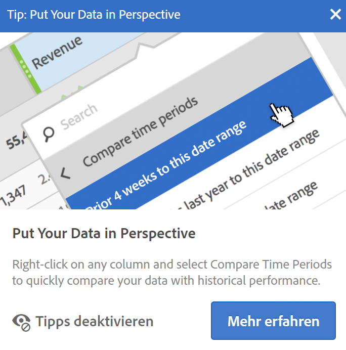 
 </td> 
  </tr> 
  <tr> 
   <td colname="col1"> 
<b> <a href="/help/analyze/analysis-workspace/components/t-freeform-project-segment.md"  >Vorlagen für Segmente</a> und <a href="/help/analyze/analysis-workspace/components/apply-create-metrics.md"  >Vorlagen für berechnete Metriken</a></b> 
 </td> 
   <td colname="col2"> 
Die linke Leiste zeigt jetzt Segmentvorlagen und Vorlagen für berechnete Metriken an. 
 </td> 
  </tr> 
  <tr> 
   <td colname="col1"> 
<b>Möglichkeit zum Bildlauf beim Ziehen von Komponenten</b> 
 </td> 
   <td colname="col2"> 
Sie können jetzt einen Bildlauf nach oben und unten durchführen, während Sie Komponenten an eine neue Position ziehen. 
 </td> 
  </tr> 
  <tr> 
   <td colname="col1"> 
<b>Zusätzliche Informationen zu  <a href="/help/analyze/analysis-workspace/virtual-analyst/c-anomaly-detection/view-anomalies.md"  > Anomalien </a></b> 
 </td> 
   <td colname="col2"> 
Wenn Sie den Mauszeiger über eine Anomalie in einem Liniendiagramm bewegen, zeigen die Informationen jetzt das Datum und den Rohwert der Anomalie an. 
 </td> 
  </tr> 
 </tbody> 
</table>

## April 2018

Am 12. April 2018 veröffentlichte neue Funktionen und Verbesserungen.

<table id="table_B9E784CD14A1453EB360FCCDC612250F"> 
 <thead> 
  <tr> 
   <th colname="col1" class="entry"> Funktion </th> 
   <th colname="col2" class="entry"> Beschreibung </th> 
  </tr> 
 </thead>
 <tbody> 
  <tr> 
   <td colname="col1"> 
 <a href="/help/analyze/analysis-workspace/build-workspace-project/column-row-settings/column-settings.md"  >„Kopfzeilentext umbrechen“ standardmäßig aktiviert</a> 
 </td> 
   <td colname="col2"> 
Die Spalteneinstellung Kopfzeilentext umbrechen ist nun standardmäßig für Freiformtabellen aktiviert. 
 </td> 
  </tr> 
  <tr> 
   <td colname="col1"> 
 <a href="/help/analyze/analysis-workspace/build-workspace-project/column-row-settings/table-settings.md"  >Neue Zeileneinstellung</a> 
 </td> 
   <td colname="col2"> 
Die neue Einstellung Prozentsatz pro Zeile berechnen erzwingt, dass die Freiformtabelle die Zellprozentsätze über die Zeile anstatt für die Spalte berechnet. Das ist besonders hilfreich, wenn Sie Trends der Prozentsätze ermitteln wollen, z. B. wie sich ein Dimensionswert mit der Zeit im Vergleich zu den anderen Werten entwickelt. Die Funktion ist standardmäßig aktiviert, wenn Sie auf das Symbol Visualisieren klicken. 
 </td> 
  </tr> 
  <tr> 
   <td colname="col1"> 
 <a href="/help/analyze/analysis-workspace/visualizations/freeform-analysis-visualizations.md#section_D3BB5042A92245D8BF6BCF072C66624B"  >Visualisierungseinstellung „100 % gestapelt“</a> 
 </td> 
   <td colname="col2"> 
Mit der neuen Visualisierungseinstellung für die Visualisierungen „Bereich gestapelt“, „Balken gestapelt“ und „Horizontalbalken gestapelt“ erhalten Sie eine zu „100 % gestapelte“ Visualisierung, damit Sie relative Anteile messen können. 
 
 
 </td> 
  </tr>
  <tr> 
   <td colname="col1"> 
 <a href="/help/analyze/analysis-workspace/virtual-analyst/overview.md"  > Anomalieerkennung und Beitragsanalyse</a> jetzt nur über Analysis Workspace verfügbar 
 </td> 
   <td colname="col2"> 
Anomalieerkennung und Beitragsanalyse wurden aus dem Funktionsumfang von Reports &amp; Analytics entfernt und sind nun nur noch über Analysis Workspace verfügbar. 
 
Beachten Sie, dass Kunden von Adobe Analytics Select und Adobe Analytics Foundation in Workspace nur Zugriff auf die Anomalieerkennung „tägliche Granularität“ haben. 
 </td> 
  </tr> 
 </tbody> 
</table>

## März 2018

Am 8. März 2018 veröffentlichte neue Funktionen und Verbesserungen.

<table id="table_580CF2C1322E4FB78870BE2B1F497B2F"> 
 <thead> 
  <tr> 
   <th colname="col1" class="entry"> Funktion </th> 
   <th colname="col2" class="entry"> Beschreibung </th> 
  </tr> 
 </thead>
 <tbody> 
  <tr> 
   <td colname="col1"> 
 <a href="/help/analyze/analysis-workspace/build-workspace-project/column-row-settings/column-settings.md"  >Kopfzeilentext umbrechen</a> 
 </td> 
   <td colname="col2"> 
Sie können nun den Kopfzeilentext in Freiformtabellen umbrechen, damit Kopfzeilen besser lesbar und Tabellen einfacher freizugeben sind. Wir haben den Spalteneinstellungen eine Option namens „Kopfzeilentext umbrechen“ hinzugefügt. Diese Funktion ist besonders beim .pdf-Rendering und für Metriken mit langen Namen nützlich. 
 </td> 
  </tr> 
  <tr> 
   <td colname="col1"> 
 <a href="/help/analyze/analysis-workspace/components/apply-create-metrics.md"  > Rechtsklick zur Erstellung von Metriken </a> 
 </td> 
   <td colname="col2"> 
Um das schnelle Erstellen berechneter Metriken zu vereinfachen, wurde dem Kontextmenü von Freiformtabellen die Option Metrik aus Auswahl erstellen hinzugefügt. Diese Option wird angezeigt, wenn mindestens eine Spaltenüberschriftszelle ausgewählt ist. 
 </td> 
  </tr> 
  <tr> 
   <td colname="col1"> 
 <a href="/help/analyze/analysis-workspace/visualizations/map-visualization.md"  > Verbesserungen bei der Zuordnungsvisualisierung </a> 
 </td> 
   <td colname="col2"> 
Um in der Visualisierung der Karte Vergleiche von Zeiträumen (z. B. von Jahren zu Jahr) anzeigen zu können, haben wir die folgenden Erweiterungen hinzugefügt: 
 
    <ul id="ul_F570E6AB174C45788620CF50E2742A08"> 
     <li id="li_746E329037764644A9CCF79161C26350">Die Imagemap-Visualisierung kann jetzt negative Zahlen anzeigen. Wenn Sie z. B. eine Metrik im Jahresvergleich zeichnen, kann die Karte in New York -33 % anzeigen. </li> 
     <li id="li_E05F0380627044E6A4E8A60C98494BF7">Bei Metriken vom Typ "Prozent"werden beim Clustering die Prozentwerte gemeinsam berechnet. </li> 
     <li id="li_44C04306EA1B413E91B8256B340D5296">Ein neues Farbschema: Positiv/Negativ (grün/rot) </li> 
    </ul> </td> 
  </tr> 
  <tr> 
   <td colname="col1"> 
 <a href="/help/analyze/analysis-workspace/build-workspace-project/starter-projects.md"  > Aktualisierungen der benutzerdefinierten Vorlage </a> 
 </td> 
   <td colname="col2"> 
Für die kürzlich veröffentlichten benutzerdefinierten Vorlagen haben wir 
 
    <ul id="ul_787F48253F454163B99F6DD50F199FE2"> 
     <li id="li_828DD547DDB54A81B9FFB9FE92790F6C">Es wurde ein Vorlagensymbol am Anfang des Projekts (nahe dem Titel) hinzugefügt, um den Bearbeitungsvorlagenmodus von der Verwendung einer Vorlage als Ausgangspunkt für ein Projekt zu unterscheiden. </li> 
     <li id="li_EEAA4D115CB74A57BABD524B2561E0CC">Nicht-Administratoren dürfen Projektvorlagen im Arbeitsbereich erstellen (speichern unter) und bearbeiten, sofern ihnen die Berechtigung zum Erstellen/Kuratieren von Projekten im Arbeitsbereich für Analysen erteilt wurde. (   Admin &gt; Benutzerverwaltung &gt; Gruppen &gt; Zugriff auf alle Berichte bearbeiten &gt; Analytics-Tools anpassen &gt; Projekte im Analysis Workspace erstellen/kuratieren  ). </li> 
    </ul> </td> 
  </tr> 
 </tbody> 
</table>

## Februar 2018

Am 8. Februar 2018 veröffentlichte neue Funktionen und Verbesserungen.

<table id="table_824BBE4A554B4DB092ADA9044383D0FA"> 
 <thead> 
  <tr> 
   <th colname="col1" class="entry"> Funktion </th> 
   <th colname="col2" class="entry"> Beschreibung </th> 
  </tr> 
 </thead>
 <tbody> 
  <tr> 
   <td colname="col1"> 
 <a href="/help/analyze/analysis-workspace/build-workspace-project/starter-projects.md#create-custom-template"  > Benutzerdefinierte Workspace-Vorlagen </a> 
 </td> 
   <td colname="col2"> 
Sie können nun eigene Workspace-Vorlagen erstellen und speichern, damit andere Benutzer in Ihrer Organisation mit Daten beginnen können, die für sie relevant sind. 
 </td> 
  </tr> 
  <tr> 
   <td colname="col1"> 
 <a href="/help/analyze/analysis-workspace/build-workspace-project/t-freeform-project.md"  > Launch-Modal für neue Projekte </a> 
 </td> 
   <td colname="col2"> 
Wenn Sie auf „Neues Projekt“ klicken, wird ein neues Fenster geöffnet, in dem Sie mit folgenden Optionen beginnen können: 
 
    <ul id="ul_FE90E6B9AF334A029D66A43901F8FA0B"> 
     <li id="li_F1DFD9AE140C4E5B849D4C522D5968DB">leeres Projekt </li> 
     <li id="li_23BD391D68674C299858A97BFE10598B">eine (integrierte) Standard-Workspace-Vorlage oder </li> 
     <li id="li_04D84FE375B84BF88843AA0D43A234BF">eine benutzerdefinierte Workspace-Vorlage (siehe oben) </li> 
    </ul> </td> 
  </tr> 
  <tr> 
   <td colname="col1"> 
Unterstützung für das Kopieren durch Rechtsklick 
 </td> 
   <td colname="col2"> 
Wir haben eine Option mit der rechten Maustaste auf "In Zwischenablage kopieren"hinzugefügt, mit der Sie Zellen/Tabellen konsistent kopieren können. 
 </td> 
  </tr> 
  <tr> 
   <td colname="col1"> 
 <a href="/help/analyze/analysis-workspace/build-workspace-project/column-row-settings/column-settings.md"  >Optimierung des Spaltenprozentsatzes</a> 
 </td> 
   <td colname="col2"> 
Der in den Spalten angezeigte Prozentsatz des Gesamtwerts war auf 100 % begrenzt, auch wenn bestimmte Szenarien dazu führten, dass Zeilen mehr als 100 % des Gesamtwerts aufwiesen (z. B. bei Durchschnittswerten). 
 
Wir zeigen jetzt Prozentsätze über 100 %, um genauer zu sein. Wir verschieben auch die obere Grenze auf 1.000%, um sicherzustellen, dass Spalten in der Breite zu groß wachsen können. 
 </td> 
  </tr> 
  <tr> 
   <td colname="col1"> 
 <a href="/help/analyze/analysis-workspace/build-workspace-project/column-row-settings/column-settings.md#section_3DD847151DA14914888A70FC4FD7BDFB"  > Aktivierung bedingter Formatierung bei Aufschlüsselungen </a> 
 </td> 
   <td colname="col2"> 
Das Anwenden bedingter Formatierung (Farben etc.) in Freiformtabellen ist bei Aufschlüsselungen nun automatisch aktiviert, wenn keine benutzerdefinierten Beschränkungen ausgewählt sind. 
 </td> 
  </tr> 
  <tr> 
   <td colname="col1"> 
Änderungen an der <a href="/help/analyze/analysis-workspace/components/calendar-date-ranges/calendar.md"  >Standardkalenderansicht</a> 
 </td> 
   <td colname="col2"> 
Standardmäßig zeigt der Workspace-Kalender jetzt den aktuellen Monat und den letzten Monat anstelle des aktuellen Monats und des nächsten Monats an. 
 </td> 
  </tr> 
  <tr> 
   <td colname="col1"> 
Verbesserte Hover-/Auswahlfarben in Workspace-Tabellen 
 </td> 
   <td colname="col2"> 
Der Unterschied in den Farben beim Bewegen des Mauszeigers über eine Freiform-Tabellenzelle im Vergleich zum Klicken auf eine Zelle wurde deutlicher. 
 </td> 
  </tr> 
 </tbody> 
</table>

## Januar 2018

Am 18. Januar 2018 veröffentlichte neue Funktionen und Verbesserungen.

<table id="table_7A2E678577F94BDABB1276C826E6554F"> 
 <thead> 
  <tr> 
   <th colname="col1" class="entry"> Funktion </th> 
   <th colname="col2" class="entry"> Beschreibung </th> 
  </tr> 
 </thead>
 <tbody> 
  <tr> 
   <td colname="col1"> 
Mehr <a href="/help/analyze/analysis-workspace/build-workspace-project/pagination-filtering-sorting.md"  >Filteroptionen</a> für Dimensionselemente in Freiformtabellen 
 </td> 
   <td colname="col2"> 
Diese (erweiterten) Filteroptionen für Dimensionselemente wurden hinzugefügt (neben den vorhandenen Optionen "enthält"und "enthält nicht"): 
 
    <ul id="ul_869B3E943E304C0282D56AD96BB79E18"> 
     <li id="li_81A49BA0CA3041C7AB892FAD2D129E5A">Enthält alle Begriffe </li> 
     <li id="li_2AB564F917844F82839A91949D0B684A">Enthält einen der Begriffe </li> 
     <li id="li_16C7938EDC8F422EA006FB63F2881EF1">Enthält die Wortgruppe </li> 
     <li id="li_5130EBE9A7A54CCFA313F3C3C268B367">Enthält keine Begriffe </li> 
     <li id="li_861825154EDC49EBA57514FD0A2AE462">Enthält nicht die Wortgruppe </li> 
     <li id="li_5364BFB73ECF4B92A6663693ABD4BCF5">Gleich </li> 
     <li id="li_1EBF3119B6364842A35D39BAD645F4AF">Ist nicht gleich </li> 
     <li id="li_487886E0A6EC4245A0E85D2E8B4A20FB">Beginnt mit </li> 
     <li id="li_A73F54DFBAAB44D4A4134342A3124E47">Endet mit </li> 
    </ul> </td> 
  </tr> 
  <tr> 
   <td colname="col1"> 
 <a href="/help/analyze/analysis-workspace/visualizations/freeform-analysis-visualizations.md#section_05B7914D4C9E443F97E2BFFDEC70240C"  > Kopieren und Einfügen von Visualisierungen/Bedienfeldern</a> über Bedienfelder und Projekte hinweg 
 </td> 
   <td colname="col2"> 
Sie können nun mit der rechten Maustaste auf eine Visualisierung oder ein Bedienfeld klicken und dann das kopierte Element an eine andere Stelle im Projekt oder in ein anderes Projekt einfügen ("Einfügen"). 
 
Mit dieser Funktion können Sie "Bausteine"- vordefinierte Visualisierungen/Bereiche - erstellen, die in andere Projekte kopiert werden können, um schneller mit unternehmensspezifischen Daten zu beginnen. 
 </td> 
  </tr> 
  <tr> 
   <td colname="col1"> 
 <a href="/help/analyze/analysis-workspace/build-workspace-project/starter-projects.md"  >Neue Mobile-Vorlagen für „Messaging“ und „Standort“</a> 
 </td> 
   <td colname="col2"> 
Es wurden zwei neue Projektvorlagen hinzugefügt: 
 
    <ul id="ul_2F5976C849474A2B8A6BCDA2559F2855"> 
     <li id="li_51B7830E062A4CFDBDF219C56249A733">Eine neue Mobile-Projektvorlage für "Messaging", die sich auf die Leistung von In-App- und Push-Nachrichten konzentriert. </li> 
     <li id="li_D2FB258EF3AF4EB19CEB258D08F4EBBE">Eine neue Mobile-Projektvorlage für "Position", die eine Karte mit Standortdaten enthält. </li> 
    </ul> </td> 
  </tr> 
  <tr> 
   <td colname="col1"> 
Verbesserung der Spaltengrößenänderung 
 </td> 
   <td colname="col2"> 
Beim Ändern der Größe der Spalte ganz links behält Workspace jetzt die Breitenprozentwerte der übrigen Spalten bei (nicht einfach die nächste Spaltenbreite rechts anpassen). Diese Änderung beschleunigt die Tabellenerstellung für Analyse und Freigabe. 
 </td> 
  </tr> 
  <tr> 
   <td colname="col1"> 
Anzeigen von <a href="/help/analyze/analysis-workspace/visualizations/freeform-table.md"  >400 Zeilen</a> in einer Tabelle 
 </td> 
   <td colname="col2"> 
Sie können nun 400 Zeilen (statt 200) in einer Tabelle und damit Trends über 365 Tage hinweg anzeigen. 
 </td> 
  </tr> 
  <tr> 
   <td colname="col1"> 
 Unterstützung der <a href="/help/analyze/analysis-workspace/visualizations/map-visualization.md"  >Zuordnungsvisualisierung</a> im PDF-Format 
 </td> 
   <td colname="col2"> 
Die im Oktober 2017 eingeführte Zuordnungsvisualisierung kann nun im PDF-Format gerendert werden. 
 </td> 
  </tr> 
  <tr> 
   <td colname="col1"> 
 <a href="/help/analyze/analysis-workspace/build-workspace-project/t-freeform-project.md"  > Bezug interner Links</a> beim Kopieren/Speichern eines Projekts 
 </td> 
   <td colname="col2"> 
Beim Kopieren eines Projekts bzw. bei der Verwendung der Funktion „Speichern unter“ führten bisher alle im Projekt gespeicherten internen Links zum Originalprojekt und nicht zum kopierten Projekt. 
 
Die internen Links beziehen sich nach dem Kopieren/Speichern nun auf das Projekt, in dem sie sich befinden. 
 </td> 
  </tr> 
  <tr> 
   <td colname="col1"> 
Beitragsanalyse: <a href="https://marketing.adobe.com/resources/help/de_DE/analytics/contribution/ca_main.html"  >Token-Benachrichtigung </a> 
 </td> 
   <td colname="col2"> 
Wenn Ihre Firma über eine begrenzte Anzahl von Token für die Beitrags-Analyse verfügt, zeigt die Benutzeroberfläche von Analyse Workspace jetzt eine Benachrichtigung an, wenn Sie ein Token verwenden. Sie werden darüber informiert, wie viele Token noch vorhanden sind.  
 
(Admin-Benutzer: Durch die Bearbeitung der Gruppenberechtigung können Sie einschränken, wer diese Token verwenden darf. Die Berechtigung lautet „Anomalieerkennung und Beitragsanalyse“. Sie finden Sie unter Analytics &gt; Admin &gt; Benutzerverwaltung &gt; Gruppen bearbeiten &gt; Zugriff auf alle Berichte bearbeiten &gt; Report Suite-Werkzeuge anpassen &gt; Werkzeuge und Berichte.)  
 </td> 
  </tr> 
  <tr> 
   <td colname="col1"> 
CSV-Dateien mit mehreren Zeichen 
 </td> 
   <td colname="col2"> E-Mail-CSV-Dateien mit Multibyte-Zeichen können jetzt in MS Excel geöffnet werden. </td> 
  </tr> 
  <tr> 
   <td colname="col1"> 
Änderungen an Ereignis#, eVar# und prop# 
 </td> 
   <td colname="col2"> 
Ereignis#, eVar# und prop#, die den Dimensionsnamen in der linken Leiste hinzugefügt wurden (2017), werden nur angezeigt, wenn Sie nach der Komponente <b>suchen</b> . 
 
(Gilt auch für Virtual Report Suite Builder.) 
 </td> 
  </tr> 
  <tr> 
   <td colname="col1"> 
Änderungen an Keine/Nicht angegeben 
 </td> 
   <td colname="col2"> 
Die Funktionsweise von "Keine/Nicht angegeben"im Arbeitsbereich für Analysen wurde geändert, sodass sie mit Reports &amp; Analysen, dem Segmentaufbau und dem Menü für Dimensionswerte im Arbeitsbereich für Analysen konsistent ist. 
 
Dies bedeutet, dass der Wert in den meisten Projekten in Analyse Workspace als "Nicht angegeben"anstatt als "Keine"angezeigt wird. 
 </td> 
  </tr> 
 </tbody> 
</table>

## November 2017

Neue Funktion, die am 09. November 2017 veröffentlicht wurde.

<table id="table_C502E81253634E6CBAE7F12C7B62F7B6"> 
 <thead> 
  <tr> 
   <th colname="col1" class="entry"> Funktion </th> 
   <th colname="col2" class="entry"> Beschreibung </th> 
  </tr> 
 </thead>
 <tbody> 
  <tr> 
   <td colname="col1"> 
Liste inkompatibler Komponenten 
 </td> 
   <td colname="col2"> 
Manchmal sind nicht alle Komponenten eines Projekts in der Report Suite enthalten. In der resultierenden Meldung „Nicht kompatible Report Suite“, die beim Laden eines Projekts oder Wechseln zu einer Report Suite angezeigt wird, sind nun alle Komponenten aufgeführt, die nicht kompatibel sind. 
 </td> 
  </tr> 
 </tbody> 
</table>

## Oktober 2017

Am 26. Oktober 2017 veröffentlichte neue Funktionen.

<table id="table_892279F2B4AF4DB38C64AA9AFC5657A7"> 
 <thead> 
  <tr> 
   <th colname="col1" class="entry"> Funktion </th> 
   <th colname="col2" class="entry"> Beschreibung </th> 
  </tr> 
 </thead>
 <tbody> 
  <tr> 
   <td colname="col1"> 
 <a href="/help/analyze/analysis-workspace/visualizations/map-visualization.md"  > Zuordnungsvisualisierung </a> 
 </td> 
   <td colname="col2"> 
Mit der neuen Funktion „Zuordnungsvisualisierung“ können Sie mühelos die Interaktionen Ihrer Kunden im Zusammenhang mit ihren Standorten anzeigen. Sie können mühelos zwischen verschiedenen Hierarchieebenen der Visualisierung wechseln, um regionsübergreifend Benutzergruppierungen anzuzeigen – von einer Makroansicht (global) bis zu einer Mikroansicht (Stadt). 
 
Sie können Standortdaten per IP-Adresse (für nichtmobile Datensätze) visualisieren oder für Kunden, die Mobile SDK verwenden, Längen- und Breitengraddaten in Analysis Workspace nutzen.  
 </td> 
  </tr> 
  <tr> 
   <td colname="col1"> 
 <a href="/help/analyze/analysis-workspace/visualizations/line.md"  > Granularitätsselektor für Trend-Visualisierungen </a> 
 </td> 
   <td colname="col2"> 
Sie können jetzt einfach zwischen Zeitgranularitäten umschalten, wenn die Dimension in der Datenquelle eine Zeitdimension ist. Sie können die Granularitäten von einer Dropdown-Liste in den Visualisierungseinstellungen wechseln. 
 </td> 
  </tr> 
  <tr> 
   <td colname="col1"> 
 <a href="/help/analyze/analysis-workspace/components/t-freeform-project-segment.md"  > Vollständige Dimensionen und Ereignisse im Segmentablagebereich </a> 
 </td> 
   <td colname="col2"> 
Zuvor konnten Sie nur Dimensionselemente, Datumsbereiche oder Segmente in Segment-Dropzonen ablegen. Sie können jetzt eine vollständige Dimension oder ein Ereignis in die Segment-Dropzone ablegen. In beiden Fällen erstellt Analysis Workspace Hit-Segmente für „vorhandene Variablen“. 
 
Beispiele: „Hit, wenn eVar1 vorhanden ist“ oder „Hit, wenn event1 vorhanden ist“. 
 
Hinweis: Sie können keine berechneten Metriken in einem Segmentbereich ablegen. Nur Dimensionen/Metriken, für die Sie Segmente erstellen können, sind für den Segmentbereich qualifiziert. 
 </td> 
  </tr> 
  <tr> 
   <td colname="col1"> 
 <a href="/help/analyze/analysis-workspace/visualizations/t-sync-visualization.md"  > In Datenquelleneinstellungen aufgelistete verbundene Visualisierungen </a> 
 </td> 
   <td colname="col2"> 
Wenn Visualisierungen mit einer Freiform- oder Kohortentabelle verbunden sind, werden die verbundenen Visualisierungen jetzt am oberen linken Punkt (Datenquelleneinstellungen) Liste. Wenn Sie den Mauszeiger darüber bewegen, wird die verknüpfte Visualisierung hervorgehoben. Wenn Sie darauf klicken, gelangen Sie dazu. 
 
Außerdem gibt es ein Kontrollkästchen "Datentabelle ein-/ausblenden", mit dem Sie die Datentabelle ein- oder ausblenden können. 
 </td> 
  </tr> 
  <tr> 
   <td colname="col1"> 
 <a href="/help/analyze/analysis-workspace/build-workspace-project/t-freeform-project.md"  > Ereignisnummer zu Ereignisnamen in der linken Leiste hinzugefügt </a> 
 </td> 
   <td colname="col2"> 
Vor Oktober 2017 wurden den Dimensionsnamen evar# und prop# angehängt, und Sie konnten nach diesen Zahlen suchen. Für Ereignis steht nun dieselbe Funktionalität zur Verfügung. 
 
Beispiel: "Abonnements"wird jetzt in der linken Leiste als "Abonnement (Ereignis1)"angezeigt. 
 
Beachten Sie: 
 
    <ul id="ul_5DF85C65F7004539949DDC4F23922296"> 
     <li id="li_A685834B4914460D87568583BB39C474">Die Nummer des Ereignisses wird nicht in der Tabelle angezeigt (um die Titel kurz zu halten). </li> 
     <li id="li_D742D04470244633900335B7F5A79FD9">Aus Gründen der Konsistenz zeigen Props und eVars ihre Zahlen auch nicht mehr in Tabellen an. </li> 
    </ul> </td> 
  </tr> 
  <tr> 
   <td colname="col1"> 
 <a href="/help/analyze/analysis-workspace/build-workspace-project/t-freeform-project.md"  > Vorkonfigurierte Dimensionen, die standardmäßig in logischer Reihenfolge sortiert sind </a> 
 </td> 
   <td colname="col2"> 
Die standardmäßige Sortierreihenfolge für einige vordefinierte Dimensionen wurde in folgenden Fällen aktualisiert: 
 
    <ul id="ul_B9C0C761F39E43A4977EC028F4D4525C"> 
     <li id="li_FE72ADDCD32A4FF7907462726D6E7758">Wenn sie in eine Freiformtabelle gezogen werden. </li> 
     <li id="li_5D78DD0DCB7347AC85E260F53109010C">Wenn sie in der linken Leiste angezeigt werden. </li> 
    </ul> 
Wenn beispielsweise "Stunde des Tages"in eine Tabelle abgelegt wird, wird sie von 12.00 Uhr bis 11.00 Uhr sortiert. Sie haben weiterhin die Möglichkeit, nach jeder Metrikspalte zu sortieren. 
 </td> 
  </tr> 
  <tr> 
   <td colname="col1"> 
 <a href="/help/analyze/analysis-workspace/virtual-analyst/c-anomaly-detection/view-anomalies.md"  > Möglichkeit, festzulegen, dass das Konfidenzintervall erneut ein Diagramm skaliert </a> 
 </td> 
   <td colname="col2"> 
Das Konfidenzintervall der Anomalieerkennung skaliert nicht automatisch die Y-Achse einer Visualisierung, um das Diagramm nach Möglichkeit lesbarer zu machen. 
 
Sie können jetzt festlegen, dass das Konfidenzintervall das Diagramm skaliert. 
 </td> 
  </tr> 
  <tr> 
   <td colname="col1"> 
 <a href="/help/components/c-alerts/alert-manager.md"  > Warnhinweise: Hinzugefügte Option <b>Verlängern</b> </a> 
 </td> 
   <td colname="col2"> 
Wenn im Warnhinweis-Manager ein oder mehrere Warnhinweise ausgewählt sind, können sie durch Klicken auf Verlängern verlängert werden. 
 
Dadurch wird ihr Ablaufdatum auf ein Jahr nach dem Tag, an dem auf Verlängern geklickt wurde, verlängert, ungeachtet des ursprünglichen Ablaufdatums. 
 </td> 
  </tr> 
  <tr> 
   <td colname="col1"> 
Verbesserungen der Benutzeroberfläche 
 </td> 
   <td colname="col2"> 
    <ul id="ul_645B43AC6F554353B887DD58F0AA86E8"> 
     <li id="li_05B16A84008E4DA3A5DE91AF3C942D55">Leeres Bedienfeld: Wir zeigen Ihnen nun alle Visualisierungen, die Sie dem Bedienfeld hinzufügen können, wie "Map", "Trichteranalyse", "Fluss", "Histogramm", "Kohorte"und "Venn", an, um einen Beginn zu machen. Sie haben die Möglichkeit, dieses Bedienfeld als Standard-Projektstartstatus zu speichern. </li> 
     <li id="li_9F1ED138DB0E453DA6BD4B4A512492CC">Die neue linke Leiste macht Bedienfelder, Visualisierungen und Komponenten auf der linken Leiste sichtbarer und benutzerfreundlicher. </li> 
     <li id="li_5DF6177F0EFD4D4D9D432768DEA3F37D">Freiformtabelle: Leere Freiformtabellen zeigen jetzt eine GIF-Animation zur Veranschaulichung der Drag-und-Drop-Funktion von Analysis Workspace. </li> 
    </ul> </td> 
  </tr> 
 </tbody> 
</table>

## September 2017

Am 21. September 2017 veröffentlichte neue Funktionen.

<table id="table_DC0DA93B8A3B481080FCB2BA8F985753"> 
 <thead> 
  <tr> 
   <th colname="col1" class="entry"> Funktion </th> 
   <th colname="col2" class="entry"> Beschreibung </th> 
  </tr> 
 </thead>
 <tbody> 
  <tr> 
   <td colname="col1"> 
 <a href="/help/analyze/analysis-workspace/components/dimensions/time-parting-dimensions.md"  >Dimensionen für die Zeitunterteilung in Analysis Workspace</a> 
 </td> 
   <td colname="col2"> 
Dimensionen, die auf einem Zeitstempel basieren, wurden vordefinierte Dimensionen zu Analyse Workspace hinzugefügt. Zu den Dimensionen gehören: 
 
    <ul id="ul_9BDBC0B344504E85840040E493873A47"> 
     <li id="li_826A8CBF4FDB4C98AC176C7145C09DB2">Stunde des Tages (z. B. 01, 12, 15, 23) </li> 
     <li id="li_FD6AAD4D3F544224A757D8124F973BE5">AM/PM (z. B. AM PM) </li> 
     <li id="li_5CAE35FB8E3E490A8FCF72DF8AC619CC">Wochentag (z. B. Montag, Dienstag, Mittwoch usw.) </li> 
     <li id="li_930DFC6BFCC740A392EC7FA859FF0E73">Wochenend/Wochentag (z.B. Wochenend, Wochentag) </li> 
     <li id="li_C09F8BF8C598498392732C183C5BB720">Tag des Monats (z.B. 1, 2, .... 30, 31) </li> 
     <li id="li_E80A8932C32B4410A9BC703090FB5CFF">Monat des Jahres (z. B. Januar, Februar, März) </li> 
     <li id="li_67620F09B58244B2B17317E0DB97067A">Tag des Jahres (z.B. Tag 1, Tag 2 usw.) </li> 
     <li id="li_A96CD77357064FC19D92EFA8244560D6">Quartal des Jahres (z. B. Q1, Q2 usw.) </li> 
    </ul> </td> 
  </tr> 
  <tr> 
   <td colname="col1"> 
 <a href="/help/analyze/analysis-workspace/build-workspace-project/column-row-settings/column-settings.md"  > Mehrere Spalten gleichzeitig in Freiformtabellen verwalten </a> 
 </td> 
   <td colname="col2"> 
Sie können jetzt die Einstellungen für mehrere Spalten gleichzeitig ändern. Wählen Sie einfach mehrere Spalten aus und klicken Sie auf das Einstellungssymbol einer dieser Spalten. Alle Änderungen, die Sie vornehmen, gelten für alle Spalten, in denen Zellen ausgewählt sind. 
 </td> 
  </tr> 
  <tr> 
   <td colname="col1"> 
 <a href="/help/analyze/analysis-workspace/visualizations/c-flow/multi-dimensional-flow.md"  > Fluss: Interdimensionale Bezeichnung </a> 
 </td> 
   <td colname="col2"> 
Eine neue Dimensionsbezeichnung jeweils oben in der Spalte „Fluss“ vereinfacht die Verwendung mehrerer Dimensionen in einer Flussvisualisierung. 
 </td> 
  </tr> 
  <tr> 
   <td colname="col1"> 
 <a href="/help/analyze/analysis-workspace/visualizations/histogram.md#section_09D774C584864D4CA6B5672DC2927477"  > Zählmethode „Hit“ für Histogramm </a> 
 </td> 
   <td colname="col2"> 
Zuvor gab es zwei Zählmethoden in einer Histogramm-Visualisierung: Besuch und Besucher (Standard). 
 
Sie können nun eine dritte Zählmethode namens „Hit“ als Segmentcontainer verwenden. „Vorkommen“ wird in der Freiformtabelle als Metrik der Y-Achse verwendet. 
 </td> 
  </tr> 
  <tr> 
   <td colname="col1"> 
 Schaltfläche Alle löschen für Konfiguration von Segmentvergleich und Beitragsanalyse 
 </td> 
   <td colname="col2"> 
Anstatt jedes Element manuell zu löschen, können Sie nun in folgenden Workspace-Bereichen alle Elemente löschen: 
 
    <ul id="ul_73E06D64CDCA4E83B9FEC2FD99D41CD3"> 
     <li id="li_A51EF8FADFA04CC19FD79C1675597659"> <a href="/help/analyze/analysis-workspace/virtual-analyst/contribution-analysis/run-contribution-analysis.md#section_F6932F4BF74544B5872164E7B1E0C6FC"  > Beitragsanalyse – Ausgeschlossene Komponenten </a> </li> 
     <li id="li_30E612D5A7584484967260931DB9E30E"> <a href="/help/analyze/analysis-workspace/c-panels/c-segment-comparison/segment-comparison.md"> Segmentvergleich – Ausgeschlossene Komponenten </a> </li> 
    </ul> </td> 
  </tr> 
  <tr> 
   <td colname="col1"> 
 <a href="/help/analyze/analysis-workspace/visualizations/summary-number-change.md"  >Aktualisierte Namen für die Anzeigetypen der Zusammenfassungsänderung</a> 
 </td> 
   <td colname="col2"> 
Zwei aktuelle Optionen für Zusammenfassungsänderungen wurden umbenannt, um ihre Bedeutung zu verdeutlichen: 
 
    <ul id="ul_7301D1C73E72424F911EE8DAAD9247A0"> 
     <li id="li_89D94632E0C94263A84887AF5B360E27">Änderung anzeigen &gt; Prozentsatzänderung anzeigen </li> 
     <li id="li_D48EB4055019449DAF2998CB9A5D23DF">Differenz anzeigen &gt; Rohdifferenz anzeigen </li> 
    </ul> </td> 
  </tr> 
  <tr> 
   <td colname="col1"> 
 <a href="/help/analyze/analysis-workspace/visualizations/summary-number-change.md"  >Erweiterte Dezimalstellen für abgekürzte Zusammenfassungsnummer/-änderungen</a> 
 </td> 
   <td colname="col2"> 
Zuvor wurden in abgekürzten Zusammenfassungs-/Änderungsvisualisierungen 0 Dezimalstellen angezeigt. 
 
Sie können jetzt zwischen 0 und 3 Dezimalstellen wählen, um Ihren Berichte zu verbessern. 
 </td> 
  </tr> 
 </tbody> 
</table>

## August 2017

Am 17. August 2017 veröffentlichte neue Funktionen.

<table id="table_C29887097C894B1C91AD7086F0DAEC73"> 
 <thead> 
  <tr> 
   <th colname="col1" class="entry"> Funktion </th> 
   <th colname="col2" class="entry"> Beschreibung </th> 
  </tr> 
 </thead>
 <tbody> 
  <tr> 
   <td colname="col1"> 
 <a href="/help/analyze/analysis-workspace/build-workspace-project/t-freeform-project.md"  > Projekt beim Speichern taggen </a> 
 </td> 
   <td colname="col2"> 
Sie können beim Speichern des Projekts nun Tags hinzufügen. 
 </td> 
  </tr> 
  <tr> 
   <td colname="col1"> 
 <a href="/help/analyze/analysis-workspace/build-workspace-project/freeform-overview.md"  > Spalte „Tags“ auf der Seite mit der Projektliste </a> 
 </td> 
   <td colname="col2"> 
Auf der Workspace-Seite mit der Projektliste wurde die Spalte Tags hinzugefügt. Dieser Spalte können Sie die Tags eines jeden Projekts entnehmen. 
 </td> 
  </tr> 
  <tr> 
   <td colname="col1"> 
 <a href="/help/analyze/analysis-workspace/visualizations/c-flow/flow.md"  > Flussvisualisierungen als CSV-Dateien exportieren </a> 
 </td> 
   <td colname="col2"> 
Sie können Flussvisualisierungen als CSV-Dateien herunterladen, um Flussergebnisse z. B. in Microsoft Excel zu analysieren (Visualisierung im Tabellenformat). 
 </td> 
  </tr> 
  <tr> 
   <td colname="col1"> 
 <a href="/help/components/c-alerts/intellligent-alerts.md"  > Intelligente Warnhinweise: Zusätzliche Konfidenzintervalle </a> 
 </td> 
   <td colname="col2"> 
Für Warnhinweise auf der Grundlage der Anomalieerkennung wurden zwei neue Vertrauensniveaus (99,75 % und 99,9 %) hinzugefügt. Die Standardwerte für einige Granularitätsauswahlen wurden ebenfalls geändert: 
 
    <ul id="ul_EB1F07A4D2204D57B2DDD9838CE4F5D9"> 
     <li id="li_542AAACE703F4EBFBD91F11F5ABC2929">stündlich: jetzt 99,75% </li> 
     <li id="li_D01E4598FB33473FAAC5D60441FD081B"> täglich: jetzt 99% </li> 
    </ul> </td> 
  </tr> 
 </tbody> 
</table>

## Juli 2017

Am 20. Juli 2017 veröffentlichte neue Funktionen.

<table id="table_64E3A9960F314E2F9FFC738696EACDF7"> 
 <thead> 
  <tr> 
   <th colname="col1" class="entry"> Funktion </th> 
   <th colname="col2" class="entry"> Beschreibung </th> 
  </tr> 
 </thead>
 <tbody> 
  <tr> 
   <td colname="col1"> 
<b> <a href="/help/analyze/analysis-workspace/visualizations/text.md"  > Rich-Text-Editor </a></b> 
 </td> 
   <td colname="col2"> 
Ermöglicht es Ihnen, die Schrifteinstellungen (fett, kursiv usw.) und den Hyperlink in Textfeldvisualisierungen und Bereichs-/Visualisierungsbeschreibungen zu ändern. 
 </td> 
  </tr> 
  <tr> 
   <td colname="col1"> 
<b> <a href="/help/analyze/analysis-workspace/analysis-workspace-features.md#section_253EA04E067F4A29A8B54CE2B7631086"  > Intra-Linking (Links für schnelle Visualisierung) </a></b> 
 </td> 
   <td colname="col2"> 
<b>Über die Intra-Verknüpfung</b> können Sie Links zu bestimmten Bereichen und Visualisierungen in einem Projekt aus einem Textfeld erstellen, z. B. zum Erstellen eines Projektinhaltsverzeichnisses. Sie können diese Verknüpfungen dann wie eine Projektverknüpfung freigeben, um eine Person an eine bestimmte Visualisierung oder einen Bereich innerhalb eines Projekts weiterzuleiten. Die neuen Rechtsklickoptionen „Bereichslink abrufen“ und „Visualisierungslink abrufen“ wurden hinzugefügt. 
 </td> 
  </tr> 
  <tr> 
   <td colname="col1"> 
<b> <a href="/help/analyze/analysis-workspace/visualizations/freeform-analysis-visualizations.md#section_94F1988CB4B9434BA1D9C6034062C3DE"  > Bearbeiten der Legendenbeschriftung </a></b> 
 </td> 
   <td colname="col2"> 
Hiermit können Sie Seriennamen in Visualisierungslegenden umbenennen (Trichteranalyse, Bereich, Stapel, Balken, Stapel, Donut, Histogramm, Horizontaler Balken, Horizontaler Balken, Linien, Streuung und Venn), um Visualisierungen benutzerfreundlicher zu gestalten. 
 
Die Bearbeitung von Legenden <b>gilt nicht</b> für: Treemap-, Aufzählungs-, Zusammenfassungs- oder Zahlenvisualisierungen, Text-, Freiform-, Histogramm-, Kohorte- oder Flussvisualisierungen. 
 </td> 
  </tr> 
  <tr> 
   <td colname="col1"> 
<b> <a href="/help/analyze/analysis-workspace/visualizations/t-sync-visualization.md"  >Aktualisierungen von „Data Sources verwalten“</a></b> 
 </td> 
   <td colname="col2"> 
Die Verwaltung von Datenquellen (auf denen Visualisierungen beruhen) wurde geändert. Es gibt keine getrennten, ausgeblendeten Tabellen mehr, wenn Sie die Datenquelle an einer Tabelle sperren. 
 
Stattdessen werden wir die visuelle Bindung an die Tabelle behalten, aus der Sie sie erstellt haben. Dadurch wird auch ein Fehler bei Live-verknüpften Tabellen behoben, durch den Sie die Granularität ändern und beim nächsten Laden des Projekts zur alten Granularität zurückkehren. 
 </td> 
  </tr> 
  <tr> 
   <td colname="col1"> 
<b> <a href="/help/analyze/analysis-workspace/virtual-analyst/contribution-analysis/run-contribution-analysis.md"  > Funktion zum Hervorheben einer bestimmten Anomalie </a></b> 
 </td> 
   <td colname="col2"> 
Wir heben nun die Anomalie mit einem blauen Punkt in der Beitragsarbeit-Analyse und den damit verbundenen intelligenten Warnprojekten hervor. Dadurch ist die gerade analysierte Anomalie leichter zu erkennen. 
 </td> 
  </tr> 
  <tr> 
   <td colname="col1"> 
<b>„Projektverknüpfung abrufen“ bei Experience Cloud-Anmeldungen</b> 
 </td> 
   <td colname="col2"> 
Wenn Sie sich bisher mit Ihren Experience Cloud-Anmeldeinformationen angemeldet und zu Analytics navigiert haben, konnten Sie die Funktion   Freigabe &gt; Projektverknüpfung abrufen   nicht nutzen. Das Problem wurde behoben. Sie müssen das Projekt immer noch speichern, bevor Sie auf diese Option klicken können. 
 </td> 
  </tr> 
  <tr> 
   <td colname="col1"> 
<b><a href="/help/analyze/analysis-workspace/curate-share/schedule-projects.md"  >Filter für abgelaufene Projekte im Manager für geplante Projekte</a></b> 
 </td> 
   <td colname="col2"> 
Sie können abgelaufene Projekte jetzt im Manager für geplante Projekte filtern. Sie können dann entscheiden, ob diese Projekte neu gestartet oder gelöscht werden sollen. 
 </td> 
  </tr> 
 </tbody> 
</table>

## Juni 2017

Am 8. Juni 2017 veröffentlichte neue Funktionen.

<table id="table_5B859A64363A44A98FC55E7AFB3C1D0C"> 
 <thead> 
  <tr> 
   <th colname="col1" class="entry"> Funktion </th> 
   <th colname="col2" class="entry"> Beschreibung </th> 
  </tr> 
 </thead>
 <tbody> 
  <tr> 
   <td colname="col1"> <b> <a href="/help/analyze/analysis-workspace/visualizations/fallout/configuring-fallout.md"  > Fallout </a></b>-Verbesserungen </td> 
   <td colname="col2"> 
    <ul id="ul_8A979BC0BE0F4D008F68B019A2D83A08"> 
     <li id="li_C8093834980B43A094FA9E2A7906E135">Unbegrenzte Segmente für Vergleich </li> 
     <li id="li_45D709C9B04F4E6A9BD94FD03E0C80FA">Möglichkeit, Touchpoint-Gruppen zu benennen und einfacher zu verwalten (Hinzufügen, Entfernen, Verschieben usw.) </li> 
     <li id="li_BC609CDFD9AA4EB081987922DB318040">Rechtsklick auf Trend für Touchpoint-Prozentsatz: Trend für den gesamten Fallout-Prozentsatz </li> 
     <li id="li_C72BB725368644DDA3FCE479A918CDB3">Rechtsklick auf Trend für alle Touchpoint-Prozentsätze: Trend für alle Touchpoint-Prozentsätze im Fallout (außer Alle Besuche, falls vorhanden) im selben Diagramm </li> 
     <li id="li_40D0A8B481B04F21BEC0A4E421C77865">Funktion zum Eingrenzen einzelner Touchpoints auf den nächsten Hit (statt am Ende) im Pfad </li> 
    </ul> </td> 
  </tr> 
  <tr> 
   <td colname="col1"> <a href="/help/analyze/analysis-workspace/visualizations/c-flow/flow-settings.md"  > <b>Fluss</b> </a>-Verbesserungen </td> 
   <td colname="col2"> 
    <ul id="ul_54675DB3F59E4B24AF0C8F6E6AB2F3C1"> 
     <li id="li_DEF7D9BF03CD4A2D86A4BDD89FB3731A">Es wurde eine neue Visualisierungseinstellung namens Bezeichnungskürzung deaktivieren hinzugefügt (Standard = deaktiviert). </li> 
    </ul> </td> 
  </tr> 
  <tr> 
   <td colname="col1"> <b> <a href="/help/analyze/analysis-workspace/components/calendar-date-ranges/calendar.md"  > Kalenderänderungen</a></b> </td> 
   <td colname="col2"> Es wurden Änderungen am Kalender vorgenommen, um eine Übereinstimmung mit dem Reports &amp; Analytics-Kalender zu erreichen: 
    <ul id="ul_BD706B07369F4339BF4925F22FEC1C7F"> 
     <li id="li_33A47BAAD3C04C8784D2FC00A6F6782E">Beim ersten Klick wird ein Datumsbereich Beginn. Markieren Sie dann den Bereich in beide Richtungen bis zum zweiten Klick, der das Ende des Datumsbereichs auswählt. Wenn die Umschalttaste beim Klicken auf das erste Datum gedrückt gehalten wird (oder ein Rechtsklick verwendet wird), wird der Bereich angehängt. </li> 
     <li id="li_C3BEC56ABCED482C82A41EA0550B3077">Erweiterte Rückblickzeiten für die verschiedenen rollierenden Datumsbereiche (z. B. Tage können bis zu zwei Jahre zurückgehen) </li> 
    </ul> </td> 
  </tr> 
  <tr> 
   <td colname="col1"> 
<b>Verbesserte Suche nach Dimensionselementen</b> 
 </td> 
   <td colname="col2"> 
    <ul id="ul_E955585818FF4553A869003B94DDB697"> 
     <li id="li_A37D2DB6290842578FE752DD8E712B73">Verbesserte Geschwindigkeit </li> 
     <li id="li_BADFD0FF3D574F1C8F19EFB37F95969C">Option Topelemente der letzten 6 Monate anzeigen, mit der bei Bedarf weitere Daten angezeigt werden können </li> 
    </ul> </td> 
  </tr> 
  <tr> 
   <td colname="col1"> 
<b><a href="/help/analyze/analysis-workspace/build-workspace-project/column-row-settings/column-settings.md"  >Kontrollkästchen „Prozentbeschränkungen verwenden“</a></b> 
 </td> 
   <td colname="col2"> 
    <ul id="ul_7B6B794EDF874A4D87770AB9BAB42F33"> 
     <li id="li_0B403D892320434FBAD9A7F7B808947C"> Es wurde ein Kontrollkästchen hinzugefügt, mit dem Prozentwerte der Abgänge gekennzeichnet werden können, insbesondere für Prozentsatzbasierte Metriken (funktioniert auch bei nicht prozentualen Metriken). </li> 
    </ul> </td> 
  </tr> 
  <tr> 
   <td colname="col1"> 
<b>Komponenten-Manager- </b>Verbesserungen 
 </td> 
   <td colname="col2"> 
    <ul id="ul_BB22F84ABFB04685A9752AD4BDE6E60A"> 
     <li id="li_B3D460C15C454911A9D7254F50815355">Hinzugefügte Ablaufdaten für Warnungen und geplante Projekte </li> 
    </ul> </td> 
  </tr> 
  <tr> 
   <td colname="col1"> 
<b> <a href="/help/components/c-alerts/alert-manager.md"  > Verbesserungen für Warnhinweis-Manager</a></b> 
 </td> 
   <td colname="col2"> 
    <ul id="ul_72464DC499744290BA37DB3B1E143F74"> 
     <li id="li_C687F0A3A99F4CC39B482BDA0F7B75DD">Warnhinweise können nun aktiviert/deaktiviert werden. </li> 
     <li id="li_F7415EE7DF29417FAF416594E36A38A4">Eine Spalte „Aktiviert/Deaktiviert“ wurde hinzugefügt. </li> 
     <li id="li_61B3A60A2AFB4BD0AA4D83803AB95B1E">Es wurde ein Filter für aktivierte/deaktivierte Warnhinweise hinzugefügt. </li> 
    </ul> </td> 
  </tr> 
  <tr> 
   <td colname="col1"> 
Neue <b> <a href="/help/analyze/analysis-workspace/build-workspace-project/fa-shortcut-keys.md"  > Tastaturbefehle </a></b> 
 </td> 
   <td colname="col2"> 
Folgende Tastaturbefehle wurden hinzugefügt: 
 
    <ul id="ul_5AE965D910DA4883BC2067CDFDBBA75A"> 
     <li id="li_6DBD6DFB9CA54F89B9A0627F3B1D5928">ALT + UMSCHALT + 1 = Zum Bedienfeld wechseln </li> 
     <li id="li_1B7E7C1115A84DB8A1BC07EA1C3AB15F">ALT + UMSCHALT + 2 = Zu Visualisierungsbereich wechseln </li> 
     <li id="li_1BDB09DDEEDC4E7DB0D1C08A4E02A613">ALT + UMSCHALT + 3 = Zu Komponentenbereich wechseln </li> 
    </ul> </td> 
  </tr> 
 </tbody> 
</table>

## April 2017

Am 20. April 2017 veröffentlichte neue Funktionen.

<table id="table_53EEFB870ED943F5BFD71FAB2DBCE49B"> 
 <thead> 
  <tr> 
   <th colname="col1" class="entry"> Funktion </th> 
   <th colname="col2" class="entry"> Beschreibung </th> 
  </tr> 
 </thead>
 <tbody> 
  <tr> 
   <td colname="col1"> 
 <a href="/help/analyze/analysis-workspace/build-workspace-project/starter-projects.md"  > Personenvorlage </a> 
 </td> 
   <td colname="col2"> 
Hinweis: Die Personenvorlage und die zugehörige Metrik für Personen sind nur im Rahmen von <a href="https://marketing.adobe.com/resources/help/de_DE/mcdc/mcdc-people.html"  >Adobe Experience Cloud Device Co-op</a> verfügbar. 
 
Die Vorlage basiert auf der Metrik "Personen", bei der es sich um eine deduplizierte Version der Metrik "Individuelle Besucher"handelt. Die Metrik "Personen"gibt Aufschluss darüber, wie oft Verbraucher, die mehrere Geräte verwenden, mit Ihrer Marke interagieren. 
 </td> 
  </tr> 
  <tr> 
   <td colname="col1"> 
Verbesserungen der Option "Rückgängig/Wiederholen" 
 </td> 
   <td colname="col2"> 
In diesen Listen wird angezeigt, was Sie  <a href="/help/analyze/analysis-workspace/build-workspace-project/undo-redo.md"  > in Analysis Workspace rückgängig machen/wiederherstellen</a> können und was nicht. 
 </td> 
  </tr> 
 </tbody> 
</table>

## Februar 2017

Neue Funktion, die am 16. Februar 2017 veröffentlicht wurde:

<table id="table_227D3668E9FD4FF4A1906FC619DCAFBF"> 
 <thead> 
  <tr> 
   <th colname="col1" class="entry"> Funktion </th> 
   <th colname="col2" class="entry"> Beschreibung </th> 
  </tr> 
 </thead>
 <tbody> 
  <tr> 
   <td colname="col1"> 
 <a href="/help/analyze/analysis-workspace/build-workspace-project/column-row-settings/table-settings.md"  > Aufschlüsselung nach Position </a> 
 </td> 
   <td colname="col2"> 
Ermöglicht die Aufschlüsselung nach Tabellenposition. Beispiel: „Die ersten 7 Zeilen in einer Freiformtabelle sollen immer aufgeschlüsselt werden.“ Beim Erstellen einer Freiformtabelle können Sie jetzt über ein Kästchen „Aufschlüsselung nach Position“ aktivieren. Diese Einstellung ist standardmäßig deaktiviert. 
 
Zuvor war die Liste mit den Werten in der Aufschlüsselung „gesperrt“. Dies konnte z. B. dazu führen, dass Sie eine Aufschlüsselung des Datums nach Seite durchführten und die ersten 50 Seiten für den ausgewählten Datumsbereich erhielten. 
 
Wenn Sie diesen Bericht speicherten und ihn einen Monat später erneut durchführen wollten, hätten sich die ersten 50 Seiten wahrscheinlich geändert. Analyse Workspace hat jedoch die Ergebnisse der ursprünglichen Aufschlüsselung als "vertrauenswürdig"eingestuft und dieselben Seiten zurückgegeben, jedoch mit dem aktuellen Monat als Datumsbereich. 
 </td> 
  </tr> 
 </tbody> 
</table>

## Januar 2017

Am 19. Januar 2017 veröffentlichte neue Funktion:

<table id="table_0AB06B81BFA34521A9BF1150E64663C3"> 
 <thead> 
  <tr> 
   <th colname="col1" class="entry"> Funktion </th> 
   <th colname="col2" class="entry"> Beschreibung </th> 
  </tr> 
 </thead>
 <tbody> 
  <tr> 
   <td colname="col1"> 
 <a href="/help/analyze/analysis-workspace/curate-share/download-send.md"  >PDF-Dateien ohne Speichern des Projekts senden und herunterladen</a> 
 </td> 
   <td colname="col2"> 
Sie können jetzt eine PDF-Datei in Workspace senden und herunterladen, ohne das Projekt speichern zu müssen. Der Name der PDF-Datei entspricht dem aktuellen Namen des Projekts. Die heruntergeladene PDF-Datei enthält die nicht gespeicherten Änderungen im Projekt. Beachten Sie, dass Sie nicht gespeicherte Projekte nicht planen können. (Sie können auch nicht gespeicherte CSV-Dateien senden und herunterladen, sie können jedoch nicht geplant werden.) 
 </td> 
  </tr> 
  <tr> 
   <td colname="col1"> 
 <a href="/help/analyze/analysis-workspace/curate-share/curate.md"  >Automatische Freigabe von Projektkomponenten</a> 
 </td> 
   <td colname="col2"> 
Jetzt haben Sie die Möglichkeit der automatischen Freigabe von Projektkomponenten (Segmenten, berechneten Metriken und Datumsbereichen) für alle Empfänger. Nach der Freigabe werden diese Komponenten im Dropdown-Menü „Komponenten“ im Workspace des Empfängers angezeigt. 
 </td> 
  </tr> 
  <tr> 
   <td colname="col1"> 
Fallout-Visualisierung im CSV-Format 
 </td> 
   <td colname="col2"> 
Unterstützung für Fallout-Visualisierung im CSV-Format hinzugefügt. 
 </td> 
  </tr> 
  <tr> 
   <td colname="col1"> 
 <a href="/help/analyze/analysis-workspace/components/t-freeform-project-segment.md"  > Datumsbereiche in Segmenten </a> 
 </td> 
   <td colname="col2"> 
Sie können Datumsbereiche auf Segment-Dropzonen ablegen (z. B. Ablagebereiche für Bereichssegmente, Ablageflächen für Fallout-Visualisierungssegmente usw.). Die Datumsbereiche werden automatisch in Segmente umgewandelt. Die Datumsbereiche können benutzerspezifisch und nicht benutzerspezifisch sein, jedoch keine Granularitäten wie Stunde/Tag/Woche/Monat/Quartal/Jahr. 
 </td> 
  </tr> 
  <tr> 
   <td colname="col1"> 
 <a href="/help/analyze/analysis-workspace/components/calendar-date-ranges/time-comparison.md"  > Zeiträume zu allen Spalten einer Tabelle hinzufügen </a> 
 </td> 
   <td colname="col2"> 
Sie können nun jeder Spalte in einer Tabelle einen Zeitraum hinzufügen, der sich von dem Zeitraum unterscheidet, auf den der Kalender eingestellt ist. Diese Funktion bietet eine weitere Möglichkeit zum Datumsvergleich. Sie können Datumsangaben aus jeder Spalte auch an allen Beginn in derselben Zeile ausrichten. 
 </td> 
  </tr> 
 </tbody> 
</table>

## November 2016

Neue Funktion, die am 10. November 2016 veröffentlicht wurde:

<table id="table_9B2B9CC7A3574A99A716BF1C9745E32B"> 
 <thead> 
  <tr> 
   <th colname="col1" class="entry"> Funktion </th> 
   <th colname="col2" class="entry"> Beschreibung </th> 
  </tr> 
 </thead>
 <tbody> 
  <tr> 
   <td colname="col1"> 
 <a href="/help/analyze/analysis-workspace/components/calendar-date-ranges/time-comparison.md"  > Datumsvergleich </a> 
 </td> 
   <td colname="col2"> 
Mit der neuen Funktion für den Datumsvergleich können Sie für jede Spalte einen allgemeinen Datumsvergleich durchführen, z. B. Jahres-, Quartals-, Monatsvergleich usw. 
 
Datumsvergleiche enthalten automatisch eine Spalte  , die die Änderung in Prozent angibt. 
 </td> 
  </tr> 
 </tbody> 
</table>

## Oktober 2016

Am 20. Oktober 2016 veröffentlichte neue Funktionen:

<table id="table_56258080C60F480AA83E1D5DE7D2C782"> 
 <thead> 
  <tr> 
   <th colname="col1" class="entry"> Neue Funktion </th> 
   <th colname="col2" class="entry"> Verwendungsmöglichkeiten </th> 
  </tr> 
 </thead>
 <tbody> 
  <tr> 
   <td colname="col1"> <b> <a href="/help/analyze/analysis-workspace/visualizations/fallout/fallout-flow.md"  > Fallout-Analyse </a></b> </td> 
   <td colname="col2"> 
Die neue Fallout-Funktion bringt die Funktion des Marketing-Trichters in Analyse Workspace. Mithilfe eines Trichters können Sie identifizieren, wo Kunden eine Marketing-Kampagne verlassen oder von einem definierten Konversionspfad abweichen, während sie mit Ihrer Website oder Ihrer Kanal-übergreifenden Kampagne interagieren. Mit der Fallout-Analyse können Sie robuste Trichter mit neuen Visualisierungen und der Flexibilität erstellen, die Analyse Workspace bietet, um Konversionen für wichtige Erfolgsmetriken zu identifizieren. Mit der Trichteranalyse-Analyse können Sie 
 
 
 
    <ul id="ul_E7C8255BA5D84F74ABBC6CC0E148DFB0"> 
     <li id="li_B7AC104F2A9348DCB2BCAA2FC9D3F3E6">Trichterschritte (Touchpoints) ziehen, ablegen und neu anordnen </li> 
     <li id="li_CC85524BC64546CD84794CC02C24CF21">Analysieren des multidimensionalen Trichters (Mischen und Abgleichen von Werten aus verschiedenen Dimensionen und Metriken) </li> 
     <li id="li_FA59CEE0211E4894B9109FF6A2FA3F80">Identifizieren Sie die nächsten Schritte, um zu wissen, wohin Kunden unmittelbar nach dem Ausscheiden gehen. </li> 
    </ul> 
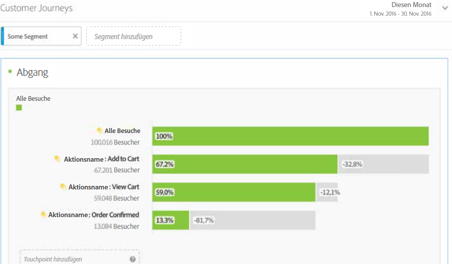 
 </td> 
  </tr> 
  <tr> 
   <td colname="col1"> <b> <a href="/help/analyze/analysis-workspace/visualizations/c-flow/flow.md"  > Flussvisualisierung </a></b> </td> 
   <td colname="col2"> 
Die neue Flussfunktion ermöglicht es Ihnen, den Kundenfluss/die Customer Journey über neue, aktualisierte und flexible Visualisierungen in Analyse Workspace Ansicht, um herauszufinden, wie Kunden sich bewegen und durch ihre Sites/Apps gehen. Mithilfe von Fluss können Sie 
 
 
 
    <ul id="ul_F1D4A99743664CB3B17E9485CF5E72FC"> 
     <li id="li_0F7AF953EAB746DC95032FF9A533E560">Visualisieren der Customer Journey durch Assets </li> 
     <li id="li_697A47BE06CF4284ACA3DBE4CA4012BF">Analysieren Sie die unmittelbar nächsten Schritte ab dem Einstieg, Ausstieg oder einem bestimmten Dimensionselement auf der Customer Journey. </li> 
     <li id="li_D13AD928AC434D599D43836FB334B14D">Dynamisches Erstellen eines Segments von Benutzern durch Angabe eines bestimmten Punktes in einem ausgewählten Pfad </li> 
    </ul> 
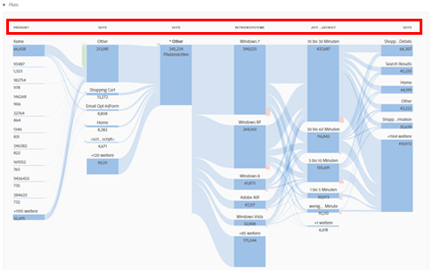 
 </td> 
  </tr> 
  <tr> 
   <td colname="col1"> <b><a href="/help/components/c-alerts/intellligent-alerts.md"  >Intelligente Warnhinweise</a></b> </td> 
   <td colname="col2"> 
Intelligente Warnhinweise, das neue Warnhinweissystem für sämtliche Bereiche von Adobe Analytics, erlauben das Erstellen und Verwalten von Warnhinweisen im Analysis Workspace, inklusive Warnhinweis-Vorschau und Regelbeiträgen. Sie können: 
 
 
 
    <ul id="ul_02BD64D3047942009880B8F1DA1F2A40"> 
     <li id="li_01504AABBC514DF38354683843222541">Warnhinweise auf der Grundlage von Anomalien (Schwellenwerte von 90 %, 95 % oder 99 %) erstellen; Veränderung in %; oben/unten). </li> 
     <li id="li_9BFE2B4C429D441287F1A37A08E62A40">In einer Vorschau anzeigen, wie oft ein Warnhinweis ausgelöst wird. </li> 
     <li id="li_08D310196581483DB499C00358835B73">Warnhinweise per E-Mail oder SMS mit Links zu automatisch erstellten Projekten in Analysis Workspace verschicken. </li> 
     <li id="li_2ADF9465EE474CDB839ED867662CCE6F">„Gestapelte“ Warnhinweise erstellen, die mehrere Metriken in einem Warnhinweis vereinen. </li> 
    </ul> 
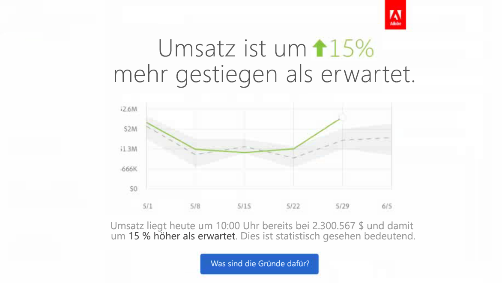 
 </td> 
  </tr> 
  <tr> 
   <td colname="col1"> <b> <a href="/help/analyze/analysis-workspace/virtual-analyst/c-anomaly-detection/anomaly-detection.md"  > Anomalieerkennung und Beitragsanalyse </a></b> </td> 
   <td colname="col2"> 
Teilt Ihnen mit, wenn eine wichtige Veränderung in Trenddaten auftritt und wodurch sie verursacht wurde. 
 
Sowohl die Anomalieerkennung als auch die Beitragsanalyse sind jetzt Kernarbeitsabläufe in Analysis Workspace. 
 
Wichtig: Beitragsanalyse ist nur für Adobe Analytics Premium-Kunden verfügbar. 
 
Sie können: 
 
 
 
    <ul id="ul_9CEE47788F3640838D8598F2E2C020D6"> 
     <li id="li_787236BB5EA545B8833B311C06C24337">statistisch signifikante Datenanomalien in Ihren Daten automatisch erkennen. </li> 
     <li id="li_2FB3D94DEEF14DD5ADA6AD69E15F243D">Führen Sie die Contribution-Analyse gegen jede tägliche Anomalie aus und betten Sie sie in Ihr Analyse Workspace-Projekt ein. </li> 
    </ul> 
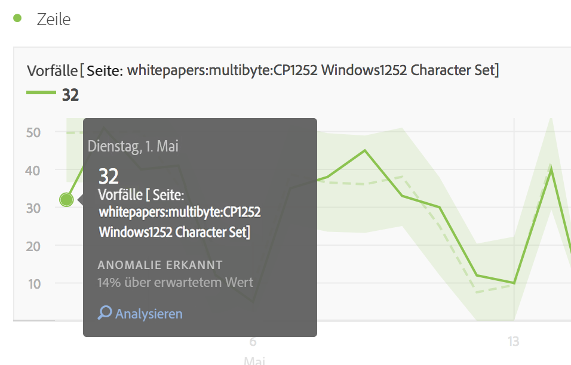 
 
 
 </td> 
  </tr> 
  <tr> 
   <td colname="col1"> <b> <a href="/help/analyze/analysis-workspace/build-workspace-project/starter-projects.md"  > Starterprojekte </a></b> </td> 
   <td colname="col2"> Um den Einstieg in Analyse Workspace zu erleichtern, haben wir einige vordefinierte Projektvorlagen für häufige Geschäftsprobleme erstellt, wie zum Beispiel 
 
 
    <ul id="ul_603F5ACC16F74D53AEB9F762FAC91656"> 
     <li id="li_6B3F2E5D4B044EC19D45E5501E33DB91">Benutzerbindung </li> 
     <li id="li_7240EE8852FC4642B3AD4837C990A775">Mobile App – Akquise </li> 
    </ul> 
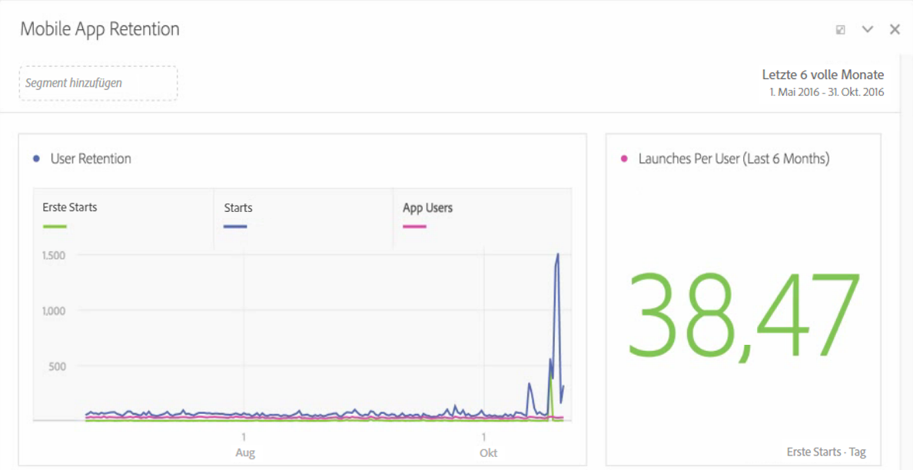 
 </td> 
  </tr> 
  <tr> 
   <td colname="col1"> <b><a href="/help/analyze/analysis-workspace/visualizations/freeform-analysis-visualizations.md">Histogrammvisualisierung</a></b> </td> 
   <td colname="col2"> 
Mit Histogrammen können Benutzer die Verteilung der Benutzer über jedes Erfolgsereignis-Ereignis hinweg sehen. Sie können die Behälter und Behältergrößen so anpassen, dass sie für jede Verteilung geeignet sind und Benutzer mit hohem und niedrigem Wert identifiziert werden können. 
 
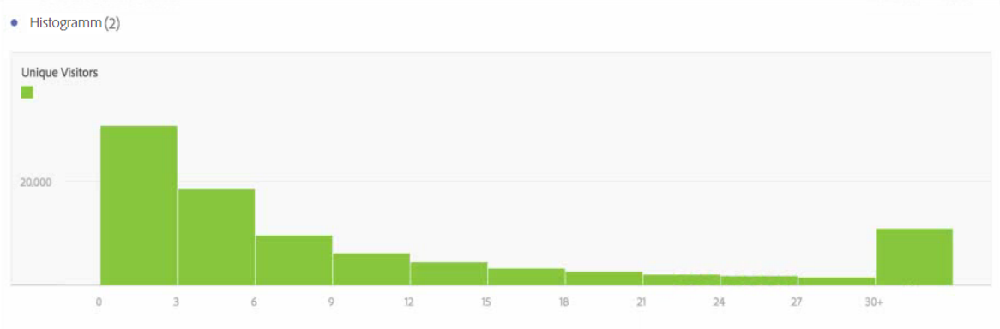 
 </td> 
  </tr> 
  <tr> 
   <td colname="col1"> Verschiedene Aktualisierungen </td> 
   <td colname="col2"> 
    <ul id="ul_2585F74DC7754C819017F280E16BF06F"> 
     <li id="li_412446013E7F42DBB1BF50F9E2C4D92F"> 
      <!--AN-124610: -->„Wiederholte Instanzen zählen“ wurde als Einstellung auf Projektebene hinzugefügt (Projekt &gt; Projektinfo und Einstellungen). Diese Einstellung gibt an, ob wiederholte Instanzen in Berichten gezählt werden. Wenn Sie mehrere sequenzielle Werte für dieselbe Variable haben, können Sie diese entweder als eine oder mehrere Instanzen der Variablen zählen. </li> 
     <li id="li_480E1B307C62418CBC2F50ADE32B9EE9">Es wurde eine neue Schaltfläche mit dem Namen "Auf alle Bereiche anwenden"neben "Abbrechen"und "Ausführen"im Kalender hinzugefügt. "Ausführen"wurde zu "Übernehmen"geändert. Wenn Sie auf die neue Schaltfläche klicken, wird nicht nur der ausgewählte Datumsbereich für den aktuellen Bereich geändert, sondern auch für alle anderen Bereiche im Projekt. </li> 
     <li id="li_4D10DFE307344D06AA60792FABE5B57E"> 
      <!--AN-124168: -->Neue Schaltfläche „Aktion“ in der linken Navigationsschiene hinzugefügt, die die folgenden Aktionen ermöglicht: Tags, Favorit, Bestätigen, <b>Teilen (neu!)</b>, <b>Löschen (neu!)</b>. </li> 
     <li id="li_946EC05568D4447193E9307546DF6F9B">Der Suchleiste wurde ein Filter hinzugefügt, mit dem Sie nach Tags, Favoriten, genehmigten Elementen und Komponenten filtern können. </li> 
     <li id="li_4EA118ACCD3B4F88B0ECF72717F631FA">Es wurde ein Symbol zur Vorschau zu manuellen Zeilen hinzugefügt (nicht zu dynamischen Zeilen, die Dimensionselemente der Liste enthalten), mit dem Sie Segmente, Metriken und Datumsbereiche Vorschau haben. </li> 
     <li id="li_81D5241EA3FD49CEA0E9F412837D87A8"> 
      <!--AN-128702: -->Link zu den YouTube-Tutorials für Analysis Workspace aktualisiert auf: <a href="https://www.youtube.com/playlist?list=PL2tCx83mn7GuNnQdYGOtlyCu0V5mEZ8sS"  >https://www.youtube.com/playlist?list=PL2tCx83mn7GuNnQdYGOtlyCu0V5mEZ8sS</a>. </li> 
     <li id="li_D81DB98C49664D2884CCCC1DB0058CD8"> 
      <!--AN-124004:-->Für Visualisierungen wurde eine Rechtsklickoption namens Neustart im Kontextmenü hinzugefügt (funktioniert für Fluss, Venn, Histogramm), die die Konfiguration für die aktuelle Visualisierung löscht und einen neuen Bereich öffnet, in dem Sie sie neu konfigurieren können. </li> 
     <li id="li_84632BFCE1794B49A31FF45067FA04B7">Mit der neuen Visualisierungseinstellung „Legende eingeblendet“ können Sie die Filterdetails für die Visualisierung von Zusammenfassungsnummer/Zusammenfassungsänderung ausblenden. </li> 
     <li id="li_EE8C48642DD54A04B08F4222F9565BF6">Mit einer neuen Visualisierungseinstellung für Zusammenfassungsänderungen können Sie Unterschiede zwischen 2 Prozentwerten anzeigen. Bei nichtprozentualen Werten zeigt die Funktion „Unterschiede anzeigen“ einen numerischen Wert. </li> 
     <li id="li_17AAABCA7B3A477182FB70453CA2EEBB">Die Anzahl der Zeilen für Zeitdimensionen wurde angepasst. </li> 
     <li id="li_35A91D50CD514CD0B939C24AEEC64BF4">Das Erscheinungsbild der linken Navigationsleiste im Segmentaufbau und im Generator für berechnete Metriken wurde aktualisiert und sieht nun wie im Arbeitsbereich für Analysen aus. </li> 
    </ul> </td> 
  </tr> 
 </tbody> 
</table>

## Juni 2016

Am 16. Juni 2016 veröffentlichte neue Funktionen:

* [Neue Gruppenberechtigungen](https://marketing.adobe.com/resources/help/de_DE/reference/groups.html) , die Administratoren den Zugriff auf die Registerkarte **[!UICONTROL Analytics]** > erlauben oder verweigern **[!UICONTROL Workspace]** . Ab dem 16. Juni 2016 haben alle Benutzer Zugriff auf diese Registerkarte. Um den Zugriff zu verweigern, entfernen Sie einfach Benutzer aus der Analyse Workspace Access-Gruppe.
* The [Segment Comparison Panel](/help/analyze/analysis-workspace/c-panels/c-segment-comparison/segment-comparison.md)discovers the most statistically significant differences between any two segments through an automated analysis of every single metric and dimension you have access to.
* [Neue Menüstruktur](/help/analyze/analysis-workspace/build-workspace-project/freeform-overview.md) für Projekte, die das obere Menü neu anordnet und erweiterbarer macht. Zum Erstellen eines **neuen Kohortenfelds** müssen Sie jetzt beispielsweise ein leeres Bedienfeld erstellen und eine Kohortentabellenvisualisierung ziehen.
* [Neue linke Leiste](/help/analyze/analysis-workspace/build-workspace-project/freeform-overview.md): Bedienfelder, Visualisierungen, Komponenten
* Eine neue [Venn-Visualisierung](/help/analyze/analysis-workspace/visualizations/venn.md), in der Sie bis zu 3 Segmente und eine Metrik ablegen und ein Venn-Diagramm erstellen können.
* [Trendauswahl](/help/analyze/analysis-workspace/analysis-workspace-features.md#section_34930C967C104C2B9092BA8DCF2BF81A) (Liniendiagramm) für eine bewertete Tabelle ist jetzt verknüpft.
* [Symbol „Visualisierung erstellen“](/help/analyze/analysis-workspace/visualizations/freeform-analysis-visualizations.md): Wenn Sie auf dieses Symbol klicken, versucht das System, Ihre nächste Aktion zu erraten (Balkendiagramm, Venn ...).
* Erweiterte [Funktion &quot;Manuelle Zeilen](/help/analyze/analysis-workspace/build-workspace-project/column-row-settings/manual-vs-dynamic-rows.md) &quot;
* [Ablagebereich Hinzufügen](/help/analyze/analysis-workspace/components/t-freeform-project-segment.md) Segment
* Kleinere Aktualisierungen:

   * Möglichkeit zum Löschen aller Visualisierungen in einem Bereich und aller Bereiche in einem Projekt. (Bisher mussten Sie mindestens eine Visualisierung oder ein Bedienfeld beibehalten.)
   * Changes to the [shortcut keys](/help/analyze/analysis-workspace/build-workspace-project/fa-shortcut-keys.md) (hotkeys) that can facilitate work with Analysis Workspace.
   * Stiländerungen: Kleinere Schriftarten in Visualisierungen, Farbfelder in Zeilen, Datumsauswahl wurde (in Bedienfeldern) nach unten verschoben.

## April 2016

Am 21. April 2016 veröffentlichte neue Funktionen:

<table id="table_2649645FDED84B71952F741ABB3FC20E"> 
 <thead> 
  <tr> 
   <th colname="col1" class="entry"> Funktion </th> 
   <th colname="col2" class="entry"> Beschreibung </th> 
  </tr> 
 </thead>
 <tbody> 
  <tr> 
   <td colname="col1"> Datei senden </td> 
   <td colname="col2"> 
Versenden Sie ein Projekt aus Analysis Workspace per E-Mail oder planen Sie die Bereitstellung. Siehe <a href="/help/analyze/analysis-workspace/curate-share/t-schedule-report.md"  >Datei senden – Bereitstellung eines Projekts planen</a>. 
 </td> 
  </tr> 
  <tr> 
   <td colname="col1"> PDF herunterladen </td> 
   <td colname="col2"> 
Sie können über das Menü „Aktion“ ein Projekt aus Analysis Workspace im PDF-Format (ähnlich dem Herunterladen im CSV-Format) herunterladen. 
 </td> 
  </tr> 
 </tbody> 
</table>

## Januar 2016

Am 21. Januar 2016 veröffentlichte neue Funktionen.

* [Rückgängigmachen von Aktionen](/help/analyze/analysis-workspace/new-features-in-analysis-workspace.md#section_12890C393D5E4FC8A3CF050318BD8482)
* [Link zu diesem Projekt](/help/analyze/analysis-workspace/new-features-in-analysis-workspace.md#section_453E70F7409F4501B8E976A0D18C9A46)
* [Lineardiagramm-, Streudiagramm- und Treemap-Visualisierungen](/help/analyze/analysis-workspace/new-features-in-analysis-workspace.md#section_B19EA50EBF5546E99D3A142827153FD6)
* [„Speichern unter“ für Segmente, Metriken und Datumswerte](/help/analyze/analysis-workspace/new-features-in-analysis-workspace.md#section_04C8B10A0751453AAE5F1BC35938C6CE)
* [Schaltfläche „Neues Segment hinzufügen“](/help/analyze/analysis-workspace/new-features-in-analysis-workspace.md#section_85CC88C02C79456EA2B41F2BFBB64FC4)
* [Bedingte Formatierung](/help/analyze/analysis-workspace/new-features-in-analysis-workspace.md#section_5775B505D83041408B8C3EAEC5D7C32B)
* [Dimensionsvorschau](/help/analyze/analysis-workspace/new-features-in-analysis-workspace.md#section_F519EBF889B244E8B25BB6BA2833325A)
* [Legende eingeblendet](/help/analyze/analysis-workspace/new-features-in-analysis-workspace.md#section_28D10D86CAE343AB838808C1DD2E7983)
* [Y-Achse bei null verankern](/help/analyze/analysis-workspace/new-features-in-analysis-workspace.md#section_83DF5DE79EF04F9F8DCB3154F5E799B3)
* [Projektname auf dem Registerkartentitel](/help/analyze/analysis-workspace/new-features-in-analysis-workspace.md#section_497C61A030984BCCA2CEA553312C3226)
* [Eigentum von Projekten übertragen](/help/analyze/analysis-workspace/new-features-in-analysis-workspace.md#section_989C2CCB80B5408EB85E6B12C8D943E3)

## Rückgängigmachen von Aktionen {#section_12890C393D5E4FC8A3CF050318BD8482}

Sie können nun die meisten Aktionen, die Sie in Analysis Workspace ausführen, rückgängig machen.

To undo, click **[!UICONTROL Undo]** from the action menu.

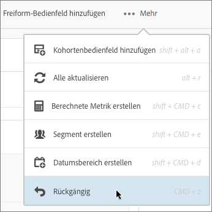

Sie können auch die standardmäßigen Windows- und Mac- [Tastaturbefehle](/help/analyze/analysis-workspace/build-workspace-project/fa-shortcut-keys.md) (Strg/Befehl+Z) für „Rückgängig“ verwenden.

*`Undo`* ist besonders hilfreich, wenn Sie Aufschlüsselungen in der Tabelle rückgängig machen möchten.

Aktionen, die *`not`* rückgängig gemacht werden können:

* Changing the configuration of a [!UICONTROL Cohort Table] (such as dragging metrics, changing values). Sie können jedoch **[!UICONTROL Undo]** nach dem Klicken auf **[!UICONTROL Run]**.

* Ändern der Größe oder Verschiebung von Feldern und Unterfeldern.

Aktionen, die den Rückgängig-Verlauf löschen:

* Speichern des Projekts.
* Ändern der Report Suite.

## Link zu diesem Projekt {#section_453E70F7409F4501B8E976A0D18C9A46}

In a project, click **[!UICONTROL Link to This Project]** from the Actions menu to email a saved project&#39;s URL to other users. Administratoren können ein auf diese Weise freigegebenes Projekt bearbeiten und speichern. Andernfalls sind diese Projekte schreibgeschützt.

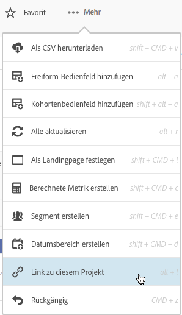

>[!NOTE] Sie können keine Links zu Berichten teilen, wenn Ihr Unternehmen Single Sign-On verwendet (dies gilt für Legacy-Single-Sign-On und für die Anmeldung über Experience Cloud).

## Lineardiagramm-, Streudiagramm- und Treemap-Visualisierungen {#section_B19EA50EBF5546E99D3A142827153FD6}

Die folgenden neuen Visualisierungen sind in der Januar 2016-Version verfügbar.

**Lineardiagramm**

Sie können sehen, wie ein Wert, den Sie interessieren, mit anderen Leistungsbereichen (Zielen) verglichen wird oder diese misst.

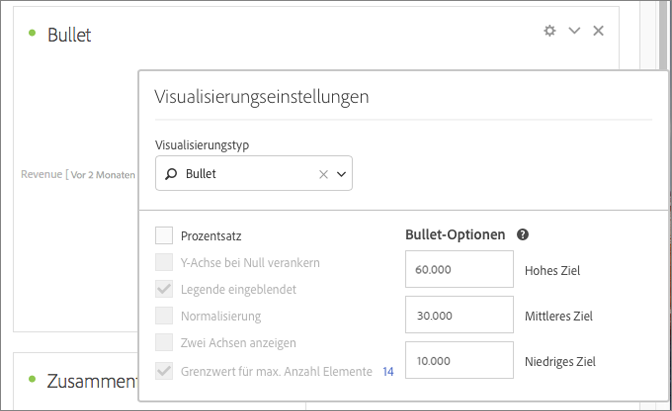

Das Aufzählungsdiagramm enthält einen einzigen primären Messwert (z. B. aktueller Umsatz), vergleicht diesen mit einem oder mehreren anderen Messwerten, um seine Bedeutung zu vergrößern (z. B. im Vergleich zu einem Umsatz in der Zielgruppe), und zeigt ihn im Kontext qualitativer Leistungsbereiche wie z. B. hoch, mittel und niedrig an. You can specify goal ranges in [!UICONTROL Visualization Settings].

**Streudiagramm**

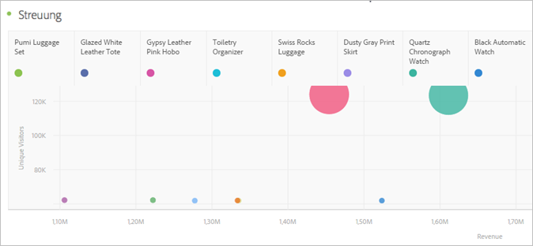

Zeigt Impressionen an und wie viele Unique Users diese Impressionen gesehen haben. Die Größe der einzelnen Datenpunkte liefert einen visuellen Hinweis darauf, wie oft ein Betrachter durchschnittlich einer Anzeige ausgesetzt wurde. Die Größe und die Daten variieren je nach den ausgewählten Dimensionen, Datumsbereichen und Filtern.

>[!NOTE]Eine zu einem Streudiagramm zugeordnete Tabelle muss mindestens zwei Säulen enthalten. Die erste Spalte definiert die X-Achse und die zweite Spalte die Y-Achse. Wenn eine dritte Spalte verfügbar ist, bestimmt das Streudiagramm anhand dieses Diagramms den Radius des Punkts. Mit anderen Worten, die Spalten *1*, *2* und *3* sind *X*-, *Y***- undPunkt-Radius zugeordnet.

**Treemap**

Zeigt hierarchische (Baumstrukturierte) Daten als Satz verschachtelter Rechtecke an. Jeder Zweig des Baums erhält ein Rechteck, das dann mit kleineren Rechtecken, die Unterzweigungen darstellen, gekachelt wird.

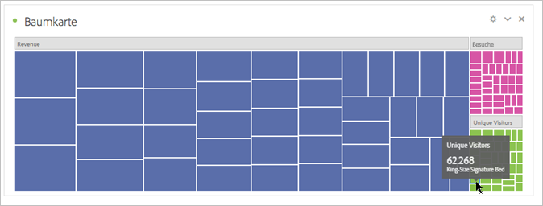

Wenn die Farb- und Größendimensionen in irgendeiner Weise mit der Baumstruktur korreliert werden, kann man häufig Muster erkennen, die auf andere Weise schwer zu erkennen wären, z. B. wenn eine bestimmte Farbe besonders relevant ist. Ein zweiter Vorteil von Treemaps besteht darin, dass sie durch Konstruktion den Raum effizient nutzen.

## „Speichern unter“ für Segmente, Metriken und Datumswerte  {#section_04C8B10A0751453AAE5F1BC35938C6CE}

When editing an existing (saved) segment the Analysis Workspace Segment Builder, click **[!UICONTROL Save As]** to make a copy.

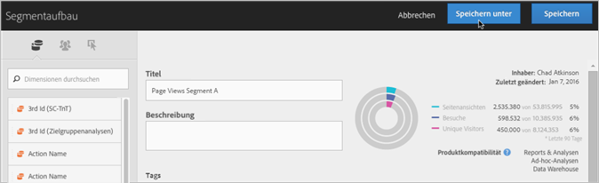

The new segment displays in the [!UICONTROL Segments] group in the [!UICONTROL Components] panel.

*`Save As`* ist auch für die [!UICONTROL Calculated Metric Builder] und [!UICONTROL Date Range Builder].

## Schaltfläche „Neues Segment hinzufügen“ {#section_85CC88C02C79456EA2B41F2BFBB64FC4}

The **[!UICONTROL Add New Segment]** button has been added to the location where you drag-and-drop segments onto a project.

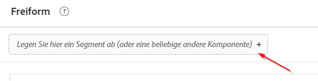

Diese Verbesserung ist insbesondere dann hilfreich, wenn Sie beim Bearbeiten eines Projekts direkt Segmente erstellen möchten, statt den [!UICONTROL Segment]-Bereich zum Erstellen von Segmenten zu verwenden.

## Bedingte Formatierung {#section_5775B505D83041408B8C3EAEC5D7C32B}

In den Spalteneinstellungen können Sie bedingte Formatierungen auf Zelldaten anwenden.

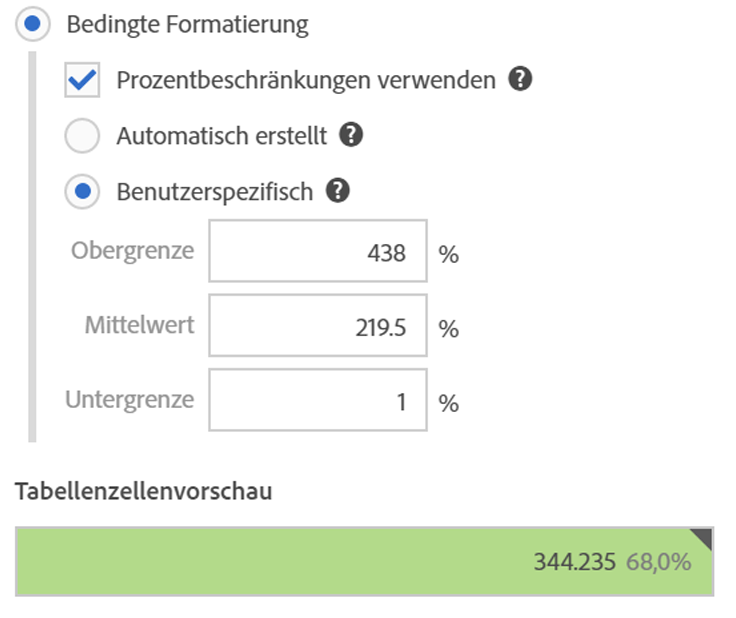

<table id="table_4285E6982FBD4B66AC95AAF6C5C7B347"> 
 <thead> 
  <tr> 
   <th colname="col1" class="entry"> Element </th> 
   <th colname="col2" class="entry"> Beschreibung </th> 
  </tr> 
 </thead>
 <tbody> 
  <tr> 
   <td colname="col1"> Bedingte Formatierung </td> 
   <td colname="col2"> 
 Wendet die folgenden Farben auf Zellen basierend auf Datenwerten an: 
 
    <ul id="ul_97E3AD5F6B41460C882D8B4EE0A8C77A"> 
     <li id="li_88874B4250224DE781C03E4A5931D6A2">Grün: hohe Werte </li> 
     <li id="li_B4863F967C7544D7AA2847696FB85525">Gelb: Mittelwerte </li> 
     <li id="li_5B06D7CD0C39437898DA55EA653A1124">Rot: niedrige Werte </li> 
    </ul> 
Wenn Sie eine Dimension in der Tabelle ersetzen, werden die Grenzwerte für die bedingte Formatierung zurückgesetzt. Wenn Sie eine Metrik ersetzen, werden die Grenzwerte für diese Spalte zurückgesetzt (dabei wird eine Metrik auf der X-Achse und eine Dimension auf der Y-Achse dargestellt). 
 </td> 
  </tr> 
  <tr> 
   <td colname="col1"> Automatisch generiert </td> 
   <td colname="col2"> 
Generiert automatisch Beschränkungen für die bedingte Formatierung. Die Obergrenze ist der größte Wert in dieser Spalte. Die untere Grenze ist die niedrigste, und der Mittelpunkt ist der Durchschnitt der oberen und unteren Grenzen. 
 </td> 
  </tr> 
  <tr> 
   <td colname="col1"> Benutzerspezifisch </td> 
   <td colname="col2"> 
Sie können die Werte für die Felder Obergrenze, Mittelpunkt und Untergrenze für die bedingte Formatierung manuell festlegen. So können Sie flexibel bestimmen, ob der Wert einer Säule gut, durchschnittlich oder schlecht ist. 
 </td> 
  </tr> 
 </tbody> 
</table>

## Dimensionsvorschau  {#section_F519EBF889B244E8B25BB6BA2833325A}

In the [!UICONTROL Dimensions] component panel, you can hover over the information icon next to a dimension and see a top-five preview.

## Legende eingeblendet  {#section_28D10D86CAE343AB838808C1DD2E7983}

In [!UICONTROL Visualization Settings] der **[!UICONTROL Legend Visible]** Option wird die Legende einer Visualisierung ein- oder ausgeblendet.

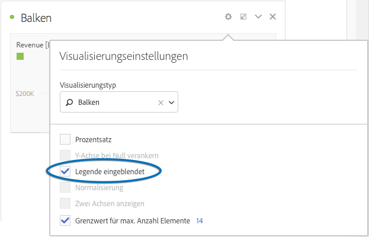

## Y-Achse bei null verankern {#section_83DF5DE79EF04F9F8DCB3154F5E799B3}

Je nachdem, wie die Zahlen für Linien- und Flächendiagramme lauten, liegt das untere Ende der Y-Achse möglicherweise nicht bei null. Die Aktivierung **[!UICONTROL Anchor Y Axis at Zero]** der Y-Achse auf Null [!UICONTROL Visualization Settings] erzwingt eine genauere Ansicht der Trends. Die folgenden Beispiele zeigen, wie sich ein Umsatzdiagramm ändert, wenn diese Einstellung aktiviert und deaktiviert ist:

**Y-Achse bei Null verankern deaktiviert**

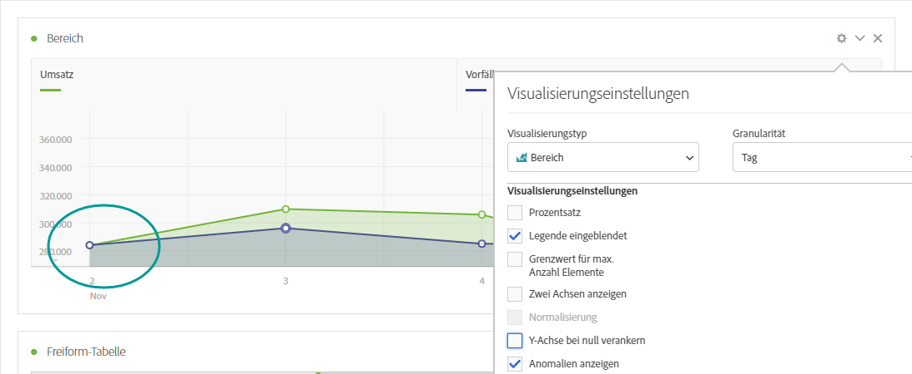

**Y-Achse bei null verankern aktiviert**

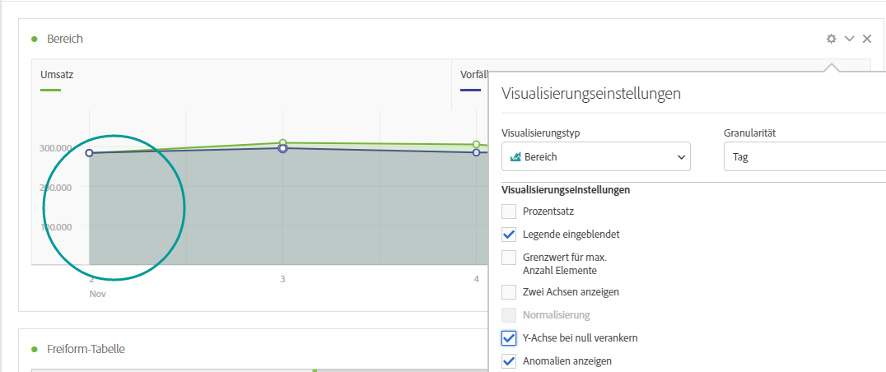

## Projektname auf dem Registerkartentitel  {#section_497C61A030984BCCA2CEA553312C3226}

Beim Speichern eines Projekts wird der Titel auf der Registerkarte des Browsers als „`<Project Name>` - Analysis Workspace“ angezeigt. Diese Optimierung ist besonders hilfreich, wenn Sie mehrere Projekte in mehreren Browser-Registerkarten öffnen.

## Eigentum von Projekten übertragen  {#section_989C2CCB80B5408EB85E6B12C8D943E3}

Administratoren haben die Möglichkeit, Projekte in [!UICONTROL Analysis Workspace] von einem Benutzer an einen anderen zu übertragen.

Navigieren Sie zu **[!UICONTROL Admin]** > **[!UICONTROL User Management]** > **[!UICONTROL Transfer]** , um Projekte zu übertragen.
