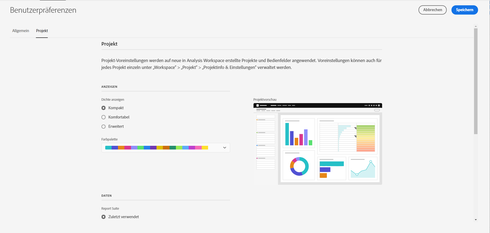

# Benutzerpräferenzen

>[!NOTE]
>
>Diese Funktion kommt bald. Die allgemeine Verfügbarkeit ist der 25. März 2021.

Auf der Seite [!UICONTROL Komponenten] > [!UICONTROL Benutzervoreinstellungen] können Sie die Analysis Workspace-Einstellungen und die zugehörigen Komponenten für Ihre Benutzer verwalten. Benutzervoreinstellungen gelten für *alle* neuen Projekte oder Bereiche.

## Allgemeine Voreinstellungen

Allgemeine Voreinstellungen gelten für Ihr Adobe Analytics-Erlebnis im Browser.

| Einstellung | Optionen |
| --- | --- |
| Landing page | <ul><li>Project Liste (Standard)</li><li>Leeres Projekt</li><li>Spezifisches Projekt</li></ul> |
| Tipps | <ul><li>Aktiviert (Standard)</li><li>Deaktiviert</li></ul> |

## Projektvoreinstellungen

Die Projektvoreinstellungen gelten für neue Projekte und in Analysis Workspace erstellte Bereiche. Voreinstellungen können auch pro Projekt unter &quot;Arbeitsbereich&quot;> &quot;Projekt&quot;> &quot;Projektinfo und Einstellungen&quot;verwaltet werden.

| Abschnitt | Einstellung | Optionen |
| --- | --- | --- |
| **Anzeigen** |  |  |
|  | [Dichte anzeigen](https://experienceleague.adobe.com/docs/analytics/analyze/analysis-workspace/build-workspace-project/view-density.html?lang=de) | <ul><li>Kompakt</li><li>Komfortabel</li><li>Erweitert (Standard)</li></ul> |
|  | [Farbpalette](https://experienceleague.adobe.com/docs/analytics/analyze/analysis-workspace/build-workspace-project/color-palettes.html?lang=de) | <ul><li>Paletten mit Adobe (Standard)</li><li>Benutzerdefinierte Paletten</li></ul> |
| **Daten** |  |  |
|  | [Report Suites](https://experienceleague.adobe.com/docs/analytics/analyze/analysis-workspace/panels/panels.html?#report-suite) | <ul><li>Zuletzt verwendet (Standard)</li><li>Spezifisch - Auswahl aus einer Liste</li></ul> |
|  | [Kalender](https://experienceleague.adobe.com/docs/analytics/analyze/analysis-workspace/panels/panels.html?#calendar) | Liste der vordefinierten Datumsbereiche, einschließlich **[!UICONTROL Diesen Monat]** (Standard) |
|  | [Bereichstyp](https://experienceleague.adobe.com/docs/analytics/analyze/analysis-workspace/panels/panels.html) | <ul><li>Freiform (Standard)</li><li>Leer</li><li>Quick Insights</li></ul> |
|  | Zahlenformat | <ul><li>1.000.00 (Standard)</li><li>1 000 000</li><li>1 000,00</li></ul> |
|  | CSV-Trennzeichen | <ul><li>Komma (Standard)</li><li>Semikolon</li><li>Doppelpunkt</li><li>Verkettungszeichen</li><li>Zeitraum</li><li>Leerzeichen</li><li>Tab</li></ul> |