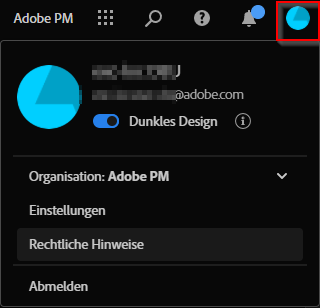

# Benutzerpräferenzen

Auf der Seite [!UICONTROL Komponenten] > [!UICONTROL Benutzereinstellungen] können Sie Einstellungen für Analysis Workspace und die zugehörigen Komponenten auf Benutzerebene verwalten. Benutzereinstellungen gelten für alle *neuen* Projekte oder Bedienfelder.

Im Folgenden finden Sie ein kurzes Video zu Benutzerpräferenzen:

>[!VIDEO](https://video.tv.adobe.com/v/332600/?quality=12)

## Allgemeine Voreinstellungen

Allgemeine Voreinstellungen gelten für Ihr Adobe Analytics-Erlebnis im Browser.

| Einstellung | Optionen |
| --- | --- |
| Landingpage | <ul><li>Projektliste (Standard)</li><li>Leeres Projekt</li><li>Spezifisches Projekt   ausgewählt aus einer Liste</li></ul> |
| Tipps | <ul><li>Aktiviert (Standard)</li><li>Deaktiviert</li></ul> |

## Projekteinstellungen

Die Projektvoreinstellungen gelten für neue Projekte und in Analysis Workspace erstellte Bedienfelder. Bestimmte Voreinstellungen können auch pro Projekt unter [!UICONTROL Arbeitsbereich] > [!UICONTROL Projekt] > [!UICONTROL Projektinformationen und -einstellungen] verwaltet werden.

| Abschnitt | Einstellung | Optionen |
| --- | --- | --- |
| **Anzeigen** |  |  |
|  | [Dichte anzeigen](https://experienceleague.adobe.com/docs/analytics/analyze/analysis-workspace/build-workspace-project/view-density.html?lang=de) | <ul><li>Kompakt</li><li>Komfortabel</li><li>Erweitert (Standard)</li></ul> |
|  | [Farbpalette](https://experienceleague.adobe.com/docs/analytics/analyze/analysis-workspace/build-workspace-project/color-palettes.html?lang=de) | <ul><li>Adobe-Paletten (Standard)</li><li>Benutzerdefinierte Paletten</li></ul> |
| **Daten** |  |  |
|  | [Report Suites](https://experienceleague.adobe.com/docs/analytics/analyze/analysis-workspace/panels/panels.html?lang=de#report-suite) | <ul><li>Zuletzt verwendet (Standard)</li><li>Spezifische Report Suite, die aus einer Liste ausgewählt wurde</li></ul> |
|  | [Kalender](https://experienceleague.adobe.com/docs/analytics/analyze/analysis-workspace/panels/panels.html?lang=de#calendar) | Wählen Sie aus einer Liste, die Folgendes enthält: <ul><li>Von Adobe bereitgestellte Bereiche (Standard ist „Diesen Monat“)</li><li>Benutzerdefinierte Bereiche</li></ul> |
|  | [Typ des Bedienfelds](https://experienceleague.adobe.com/docs/analytics/analyze/analysis-workspace/panels/panels.html?lang=de) | <ul><li>Freiform (Standard)</li><li>Leer</li><li>Quick Insights</li></ul> |
|  | Zahlenformat | <ul><li>1.000,00 (Standard)</li><li>1.000,00</li><li>1 000,00</li></ul> |
|  | CSV-Trennzeichen   Zeichen | <ul><li>Komma (Standard)</li><li>Semikolon</li><li>Doppelpunkt</li><li>Verkettungszeichen</li><li>Zeitraum</li><li>Leerzeichen</li><li>Tab</li></ul> |
|  | Freiformtabelle | <ul><li>Anomalien anzeigen </li><li>Sparklines anzeigen</li><li>Anmerkungen anzeigen</li></ul> |

## [!UICONTROL Dunkles Design]

Wenn Sie einen dunklen Hintergrund für Ihre Adobe Analytics-Benutzeroberfläche bevorzugen, können Sie zu [!UICONTROL Dunkles Design] wechseln.

1. Klicken Sie oben rechts auf das Experience Cloud-Benutzersymbol.

   

1. Schieben Sie den Umschalter **[!UICONTROL Dunkles Thema]** nach rechts.
