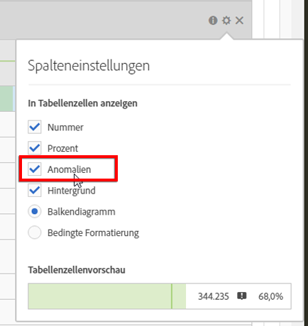

# Anomalieerkennung deaktivieren

Sie können die Anomalieerkennung auf Spaltenebene ausschalten, indem Sie in die Spalteneinstellungen wechseln und das Kontrollkästchen **[!UICONTROL Anomalien]** deaktivieren.

