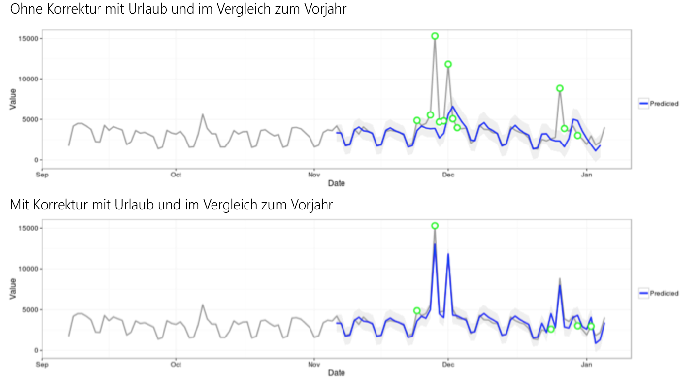

# In der Anomalieerkennung verwendete statistische Verfahren

Die Anomalieerkennung in Analysis Workspace setzt eine Reihe statistischer Verfahren ein, um festzustellen, ob eine Beobachtung als anormal anzusehen ist oder nicht.

Je nach der im Bericht verwendeten Datumsgranularität werden 3 verschiedene statistische Verfahren eingesetzt – für stündliche, tägliche, wöchentliche/monatliche Anomalieerkennung. Die statistischen Verfahren werden nachfolgend beschrieben.

## Anomalieerkennung für Granularität „Täglich“ {#section_758ACA3C0A6B4D399563ECABFB8316FA}

Für Berichte mit täglicher Granularität berücksichtigt der Algorithmus verschiedene wichtige Faktoren, um Ergebnisse mit höchstmöglicher Genauigkeit bereitzustellen. Zuerst bestimmt der Algorithmus anhand der verfügbaren Daten, welches Modell anzuwenden ist. Die Auswahl erfolgt zwischen zwei Klassen – einem zeitreihenbasierten Modell oder einem Modell zur Erkennung von Ausreißern (als funktionale Filterung bezeichnet).

Die Entscheidung für das zeitreihenbasierte Modell beruht auf den folgenden Kombinationen für den Typ ETS (Error, Trend and Seasonality = Fehler, Trend und Saisonabhängigkeit), wie von [Hyndman und Kollegen (2008)](https://www.springer.com/de/book/9783540719168) beschrieben. Dabei versucht der Algorithmus insbesondere die folgenden Kombinationen:

1. ANA (Additive error, No trend, Additive seasonality = Additiver Fehler, Kein Trend, Additive Saisonabhängigkeit)
1. AAA (Additive error, Additive trend, Additive seasonality = Additiver Fehler, Additiver Trend, Additive Saisonabhängigkeit)
1. MNM (Multiplicative error, No trend, Multiplicative seasonality = Multiplikativer Fehler, Kein Trend, Multiplikative Saisonabhängigkeit)
1. MNA (Multiplicative error, No trend, Additive seasonality = Multiplikativer Fehler, Kein Trend, Additive Saisonabhängigkeit)
1. AAN (Additive error, Additive trend, No seasonality = Additiver Fehler, Additiver Trend, Keine Saisonabhängigkeit)

Der Algorithmus testet die Tauglichkeit jeder dieser Kombinationen, indem er die Kombination mit dem besten MAPE-Wert (Mean Absolute Percentage Error, Mittlerer absoluter prozentualer Fehler) auswählt. Liegt jedoch der MAPE-Wert des besten Zeitreihenmodells über 15 %, wird funktionale Filterung angewendet. Bei einem Zeitreihenmodell passen meist Daten mit einem hohen Grad an Wiederholbarkeit am besten (z. B. von Woche zu Woche oder von Monat zu Monat).

Nach Auswahl des Modells passt der Algorithmus die Ergebnisse basierend auf Feiertagen und jährlicher Saisonalität an. Für Feiertage überprüft der Algorithmus, ob einer der folgenden Feiertage im Datumsbereich des Berichts vorhanden ist:

* Memorial Day (nur USA)
* 4. Juli
* Thanksgiving (nur USA)
* Black Friday (nur USA)
* Cyber Monday (nur USA)
* 24.–26. Dezember
* 1. Januar
* 31. Dezember

Diese Feiertage wurden anhand umfangreicher statistischer Analysen einer großen Anzahl von Datenpunkten ausgewählt, um die Feiertage zu ermitteln, die den größten Einfluss in den meisten Kunden-Trends gezeigt haben. Die Liste ist zwar nicht für alle Kunden oder Geschäftszyklen vollständig, wir haben jedoch festgestellt, dass eine Berücksichtigung dieser Feiertage die Zuverlässigkeit des Algorithmus insgesamt für fast alle Kundendatensätze stark verbessert hat.

Nach Auswahl des Modells und der Identifizierung der im Berichtszeitraum befindlichen Feiertage fährt der Algorithmus wie folgt fort:

1. Er erstellt den Anomaliereferenzzeitraum, der bis zu 35 Tage vor dem Berichtszeitraum umfasst, sowie einen passenden Vorjahreszeitraum (unter Berücksichtigung von Schalttagen wenn nötig sowie von Feiertagen, die möglicherweise im vorangegangenen Jahr auf einen anderen Kalendertag gefallen sind).
1. Er testet, ob im aktuellen Zeitraum (außer dem Vorjahr) Feiertage vorhanden sind, die laut den aktuellsten Daten eine Anomalität darstellen.
1. Wenn der Feiertag im aktuellen Datumsbereich als anormal betrachtet wird, passt der Algorithmus den erwarteten Wert und das Konfidenzintervall des aktuellen Feiertags an die Werte des Feiertags aus dem vergangenen Jahr an (unter Betrachtung von zwei Tagen vorher und nachher). Die Korrektur für den aktuellen Feiertag erfolgt auf Grundlage des niedrigsten MAPE-Wertes von:

   1. Additive Effekte
   1. Multiplikative Effekte
   1. Differenz zum Vorjahr

Beachten Sie im folgenden Beispiel die deutliche Verbesserung der Performance an Weihnachten und Neujahr:

## Anomalieerkennung für Granularität „Stündlich“ {#section_014C9E9209AF43F8A03D5D46E3B3AEE7}

Stündliche Daten basieren auf der gleichen Vorgehensweise des zeitreihenbasierten Algorithmus wie beim Algorithmus für tägliche Granularität: Allerdings setzt der Algorithmus hier primär auf zwei Trendmuster: den 24-Stunden-Zyklus sowie den Wochenende-Wochentag-Zyklus. Um diese beiden saisonalen Effekte zu erfassen, erstellt der stündliche Algorithmus zwei separate Modelle (für ein Wochenende und einen Wochentag), wobei er auf die gleiche Weise wie oben beschrieben vorgeht.

Das Trainingfenster für stündliche Trends basiert auf einem 336-Stunden rückwärts gerichteten Fenster.

## Anomalieerkennung für die Granularitäten „Wöchentlich“ und „Monatlich“ {#section_5D421576BFBC4B24A58DFCC0A6407545}

Da wöchentliche und monatliche Trends nicht die gleichen wöchentlichen oder täglichen Trends wie bei täglicher oder stündlicher Granularität aufweisen, wird ein separater Algorithmus verwendet. Für wöchentliche oder monatliche Granularität wird ein aus zwei Schritten bestehender Ausreißererkennungsalgorithmus eingesetzt, der als GESD-Test (Generalized Extreme Studentized Deviate, Generalisierte Extreme Studentisierte Abweichung) bezeichnet wird. Dieser Test betrachtet die maximale Anzahl der zu erwartenden Anomalien kombiniert mit dem angepassten Box-Plot-Ansatz (ein nichtparametrisches Verfahren zur Erkennung von Ausreißern), um die maximale Anzahl von Ausreißern zu ermitteln. Die beiden Schritte sehen wie folgt aus:

1. Angepasste Box-Plot-Funktion: Diese Funktion ermittelt die maximale Anzahl von Anomalien aus den eingegebenen Daten.
1. GESD-Funktion: Wird mit der Ausgabe aus Schritt 1 auf die eingegebenen Daten angewendet.

Dann zieht der Anomalieerkennungsschritt „Feiertag und Vorjahres-Saisonabhängigkeit“ die Daten aus dem Vorjahr von den Daten dieses Jahres ab, wobei der oben beschriebene zweistufige Prozess verwendet wird, um zu überprüfen, ob die Anomalien saisonal angemessen sind. Jede dieser Datumsgranularitäten verwendet ein 15 Zeiträume zurückliegendes Zeitfenster, in dem der für den Bericht ausgewählte Datumsbereich liegt (entweder 15 Monate oder 15 Wochen), sowie einen entsprechenden Datumsbereich, der 1 Jahr vor dem Trainingszeitraum liegt.
