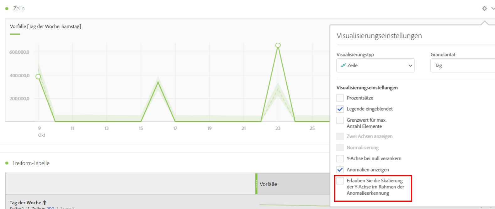

# Anomalien in Analysis Workspace anzeigen

Sie können Anomalien in einer Tabelle oder einem Liniendiagramm anzeigen.

## Anzeigen von Anomalien in einer Tabelle {#section_869A87B92B574A38B017A980ED8A29C5}

In einer Zeitreihen-Freiformtabelle wird nun jede Zeile automatisch mit einem dunkelgrauen Ausrufezeichen versehen, in der eine Datenanomalie erkannt wurde.

Die senkrechte graue Linie in jeder Zeile zeigt an, wo der erwartete Wert stehen sollte. Wenn Sie den Mauszeiger über ein Ausrufezeichen bewegen, wird angezeigt, wie weit die Anomalie vom erwarteten Wert abweicht (in + oder - %).

## Anzeigen von Anomalien in einem Liniendiagramm {#section_7C1192AFDB4345A8A2CCFB3AE0C47D82}

Das Liniendiagramm zeigt die anormalen Werte (weiße Punkte) in einem hellgrünen Konfidenzband an.

Wenn Sie auf einen weißen Punkt klicken, wird dieser grün und es wird Ihnen Folgendes angezeigt:

* Das Datum, an dem die Anomalie auftrat
* Der Rohdatenwert der Anomalie
* Der Prozentwert über oder unter dem erwarteten Wert, der durch eine durchgezogene grüne Linie dargestellt wird.
* Der Link „Analysieren“ zum Starten der [Beitragsanalyse](/help/analyze/analysis-workspace/virtual-analyst/contribution-analysis/ca-tokens.md).

Wenn das Liniendiagramm mehrere Metriken enthält, werden nur die Anomalien angezeigt und Sie müssen den Mauszeiger über die einzelnen Metriken bewegen, damit das Konfidenzband für diese Metrik eingeblendet wird.

Das Konfidenzintervall der Anomalieerkennung skaliert nicht automatisch die Y-Achse einer Visualisierung, um das Diagramm nach Möglichkeit lesbarer zu machen.

Sie können festlegen, dass das Konfidenzintervall das Diagramm skaliert. Klicken Sie einfach auf das Symbol „Einstellungen“ (Zahnrad) und aktivieren Sie die Option **[!UICONTROL Skalierung der Y-Achse im Rahmen der Anomalieerkennung erlauben]**.

