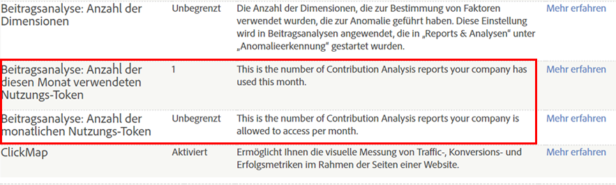

# Übersicht über die Beitragsanalyse

Die Beitragsanalyse erkennt versteckte Muster, mit denen sich statistische Anomalien erklären und Korrelationen für nicht erwartete Kundenaktionen, Wertbereichsüberschreitungen und plötzliche Anstiege oder Rückgänge für ausgewählte Metriken in konvergenten Zielgruppensegmenten feststellen lassen.

Etwas ist passiert. Warum? Ihr Anomalieerkennungsbericht zeigt einen ungewöhnlichen Anstieg bei Bestellungen und Sie möchten wissen, wie es dazu kommt. Was ist Außergewöhnliches passiert? Wer reagiert auf welche Kampagne oder welchen Verweis? Hat sich etwas viral verbreitet? Welche spezifischen Faktoren haben zu dieser Anomalie beigetragen? Und womöglich die wichtigste Frage: Wie kann ich wichtige Informationen zu meinem Kunden erfassen und diese Performance wiederholen? (Oder: Wie kann ich in Zukunft einen Rückgang bei einer Metrik oder einen Anstieg bei einer negativen Metrik vermeiden?)

Mithilfe der Beitragsanalyse können Sie Ihre Daten umgehend analysieren und so herausfinden, wie es zu einer Anomalie kam. Die Analyse ermittelt die beitragenden Faktoren zu einer Anomalie innerhalb weniger Sekunden anstatt in Wochen und stellt Ihnen Muster für Zielgruppensegmente bereit, sodass Sie die Interaktionen von Kunden besser nachvollziehen können. Sie können die Beitragsanalyse strategisch einsetzen, um aussagekräftige Verbindungen zu identifizieren und erfassen, anhand derer Sie neue Zielgruppensegmente entwickeln können. Die Beitragsanalyse lässt sich auch taktisch verwenden, um außergewöhnliche oder betrügerische Aktivitäten zu erkennen, die einen Warnhinweis auslösen.

Die [Anomalieerkennung](/help/analyze/analysis-workspace/virtual-analyst/c-anomaly-detection/anomaly-detection.md) identifiziert Datenspitzen und extreme statistische Rückgänge, basierend auf ausgewählten Metriken und Zielgruppensegmenten. Sie legt basierend auf einem Trainings-Zeitraum eine historische Norm fest und zeigt extreme Versatzwerte an, die mit spezifischen Ereignissen korrelieren. Die Erkennung kann einen steilen Anstieg bei einer positiven Bestellungsmetrik oder einen Anstieg bei einer negativen Absprungsmetrik melden oder Rückgänge bei beiden. Auf diese Weise werden statistisch relevante Datenpunkte erfasst, die bei der Beitragsanalyse ausgewertet werden. Wenn eine statistische Anomalie identifiziert wurde, können Sie mit der Beitragsanalyse für alle abweichenden Datenpunkte relevante Marketing- und Kampagnenvariablen einsehen und auswerten. Für die Auswertung von Verbindungen, die zu einer deutlichen Spitze bzw. einem deutlichen Tiefpunkt beigetragen haben, kommen fortschrittliche Algorithmen und maschinelles Lernen zum Einsatz. Diese Berechnungen werden dann in interaktiven Darstellungen angezeigt, die Ihnen unterschiedliche Perspektiven auf den Sachverhalt bieten. Auf diese Weise können Sie erkennen, warum etwas passiert ist und was dagegen zu unternehmen ist.

Mit Hilfe der Beitragsanalyse können Sie besser nachvollziehen, wie es zu einer Anomalie kam und wie Sie darauf reagieren. Zu diesem Zweck werden relevante Metriken erfasst und verborgene Punkte identifiziert, die einen allgemeinen Grund für die Interaktionen der Zielgruppe und Trends beim Kundeninteresse darstellen. Manchmal lässt sich eine Anomalie leicht erkennen und korrigieren. Das ist beispielsweise bei einer irrtümlichen Bestellung von 2000 Kajaks der Fall. Manchmal ist die Erkennung einer Anomalie dagegen recht schwierig, zum Beispiel bei einem aufkommenden Trend in einem bestimmten Zeitraum in einer Region, der nur in Reaktion auf eine spezifische zielgerichtete Kampagne erfolgt. Die Zusammenstellung beitragender Elemente in Metriken für unterschiedliche Dimensionen und ihre Verbindungen verschafft Ihnen einen allgemeinen Überblick über die Interaktionen Ihrer Zielgruppen und liefert wichtigen Kontext für abweichende Datenpunkte.

Im Folgenden finden Sie einige Anwendungsfälle:

* Identifizierung des Weitervermarktungspotenzials durch die Überwachung von Veränderungen bei der Produktnachfrage
* Optimierung des Kundenerlebnisses durch Reaktion auf spezifische Zielgruppeninteressen
* Frühe Identifizierung betrügerischer Bestellungen dank Anomalieberichten
* Schutz vor Industriespionage durch Identifikation hoher Auslastung und einer großen Anzahl an Downloads
* Überwachung von Vorgängen, z. B. Berichte zu fehlenden JavaScript-Tags

Nach der umfassenden Analyse einer Anomalie wird eine Beitragszusammenfassung für die wichtigsten Elemente erstellt. Die Elemente werden darin in einer Rangfolge angeordnet, die auf der Gesamtzahl der Vorkommen und dem Prozentsatz des Elements an den beitragenden Faktoren basiert. Anhand der normalisierten Beitragsbewertung können Sie einen beitragenden Faktor ganz unkompliziert mit anderen wichtigen Dimensionselementen vergleichen und verbinden.

## Beitragsanalyse-Token – Übersicht {#section_3EF8D2BBCE6E4C309D753BCF04A453D0}

>[!IMPORTANT]
>
>Wichtig: Die Beitragsanalyse wurde aus dem Funktionsumfang von Reports &amp; Analytics entfernt und ist nun nur noch über Analysis Workspace verfügbar.

Sämtliche Kunden mit einer Berechtigung für Beitragsanalysen können in Analysis Workspace pro Monat eine begrenzte Anzahl vollständiger Beitragsanalysen ausführen. **Ausgeschlossen** davon sind Spezialprodukt-Kunden (SiteCatalyst 15), Analytics Foundation-Kunden sowie Analytics Select-Kunden, die überhaupt keine Beitragsanalyse erhalten.

Die Anzahl von Ausführungen pro Unternehmen ist durch monatliche Token beschränkt, die auf der Basis des von Ihrem Unternehmen gekauften Adobe Analytics-Produkts zugeteilt werden. Dies schließt die Möglichkeit ein, die Beitragsanalyse zu beschränken, um einen Missbrauch von Token zu verhindern.

## Häufig gestellte Fragen {#section_11D0431AD2014B96AB9561CA66A367CE}

<table id="table_357775E5058644099E26B15A6790E8AF"> 
 <thead> 
  <tr> 
   <th colname="col1" class="entry"> Frage </th> 
   <th colname="col2" class="entry"> Antwort </th> 
  </tr>
 </thead>
 <tbody> 
  <tr> 
   <td colname="col1"> 
<b>Warum hat Adobe Token eingeführt? </b> 
 </td> 
   <td colname="col2"> 
Die Beitragsanalyse ist eine der beliebtesten Funktionen in Adobe Analytics. Durch eine geringe Anzahl „vollständiger“ Ausführungen pro Monat (anstelle der bisherigen 3 Dimensionen für einige Analytics-Produkte) haben Sie die Möglichkeit zu erkennen, was eine vollständige Beitragsanalyse für Sie leisten kann. 
 </td> 
  </tr> 
  <tr> 
   <td colname="col1"> 
<b>Wie funktionieren Token in der Beitragsanalyse? Kostet es ein Token, ein Projekt mit einer vorhandenen Beitragsanalyse zu laden, oder gilt dies nur für neue Ausführungen?</b> 
 </td> 
   <td colname="col2"> 
Jedes Anmeldeunternehmen (nicht jeder Benutzer) erhält eine bestimmte Anzahl an Token pro Monat, mit denen Sie eine „vollständige“ Beitragsanalyse in Analysis Workspace durchführen können. 
 
Jedes Mal, wenn Sie eine neue Beitragsanalyse erstellen, bezahlen Sie ein Token. Das Laden von Projekten mit bereits ausgeführten Beitragsanalysen kostet kein Token. 
 </td> 
  </tr> 
  <tr> 
   <td colname="col1"> 
<b>Werden für die Beitragsanalyse in Reports &amp; Analytics Token fällig?</b> 
 </td> 
   <td colname="col2"> 
Nein. Die Beitragsanalyse steht seit der Version vom April 2018 nicht mehr in Reports &amp; Analytics zur Verfügung. 
 </td> 
  </tr> 
  <tr> 
   <td colname="col1"> 
<b>Was können wir tun, wenn unser Unternehmen keine Token mehr hat, wir aber weitere Beitragsanalysen durchführen möchten?</b> 
 </td> 
   <td colname="col2"> 
Sie können ein Upgrade auf ein anderes Adobe Analytics-Produkt durchführen, z. B. von Standard (2 Token/Monat) auf Ultimate (20 Token/Monat). Es ist nicht möglich, einfach zusätzliche Token zu kaufen. Sie müssen ein Upgrade innerhalb der bestehenden Paketstruktur durchführen. 
 </td> 
  </tr> 
  <tr> 
   <td colname="col1"> 
<b>Wie kann ich den Zugriff auf die Beitragsanalyse beschränken?</b> 
 </td> 
   <td colname="col2"> 
Standardmäßig haben nur Administratoren Zugriff auf die Ausführung von Beitragsanalysen. Administratoren können jedoch anderen Benutzern Zugriff gewähren, indem sie eine Berechtigungsgruppe in der <a href="https://docs.adobe.com/content/help/de-DE/core-services/interface/manage-users-and-products/admin-getting-started.html"  >Admin Console</a> erstellen. Erteilen Sie nur jenen Benutzern die Berechtigung zur Verwendung der Beitragsanalyse, die einen Grund zu deren Nutzung haben und den Zugriff nicht missbrauchen werden. 
 
Die Berechtigung lautet „Beitragsanalyse“. Sie finden Sie unter Analytics &gt; Admin &gt; Benutzerverwaltung &gt; Gruppen bearbeiten &gt; Zugriff auf alle Berichte bearbeiten &gt; Report Suite-Tools anpassen &gt; Werkzeuge und Berichte. 
 </td> 
  </tr> 
  <tr> 
   <td colname="col1"> 
<b>Wie weiß ich, wie viele Token mein Unternehmen pro Monat erhält und wie viele wir im aktuellen Monat bereits verwendet haben?</b> 
 </td> 
   <td colname="col2"> 
Gehen Sie zu Admin &gt; Unternehmenseinstellungen &gt; Funktionszugriffsebenen anzeigen. Diese Seite enthält zwei Elemente: 
 
 
 </td> 
  </tr> 
 </tbody> 
</table>

## Anomalieerkennung und Beitragsanalyse – Berechtigungen {#section_9278D58F21A840AA9B1ED1BD07A1EF0A}

Weiter unten finden Sie eine ausführliche Liste der Berechtigungen für die Anomalieerkennung und Beitragsanalyse in Analysis Workspace.

>[!IMPORTANT]
>
>Anomalieerkennung und Beitragsanalyse wurden aus dem Funktionsumfang von Reports &amp; Analytics entfernt und sind nun nur noch über Analysis Workspace verfügbar. Beachten Sie, dass Kunden von Adobe Analytics Select und Adobe Analytics Foundation in Workspace nur Zugriff auf die Anomalieerkennung „tägliche Granularität“ haben.

<table id="table_5C9B7E4AE82640B5A913519E576889B5"> 
 <thead> 
  <tr> 
   <th colname="col1" class="entry"> Adobe Analytics-Berechtigung </th> 
   <th colname="col2" class="entry"> Anomalieerkennung </th> 
   <th colname="col3" class="entry"> Beitragsanalyse </th> 
  </tr>
 </thead>
 <tbody> 
  <tr> 
   <td colname="col1"> 
Foundation 
 </td> 
   <td colname="col2"> 
Nur nach Tagen 
 </td> 
   <td colname="col3" colsep="1"> 
Keine Token 
 </td> 
  </tr> 
  <tr> 
   <td colname="col1"> 
<a href="https://www.adobe.com/de/data-analytics-cloud/analytics/select.html?promoid=B4XQ3X7G&amp;mv=other"  >Select</a> 
 </td> 
   <td colname="col2"> 
Nur nach Tagen 
 </td> 
   <td colname="col3"> 
Keine Token 
 </td> 
  </tr> 
  <tr> 
   <td colname="col1"> 
<a href="https://www.adobe.com/de/data-analytics-cloud/analytics/prime.html?promoid=91BF51TR&amp;mv=other"  >Prime</a> 
 </td> 
   <td colname="col2"> 
Ja 
 </td> 
   <td colname="col3"> 
10 Token/Monat 
 </td> 
  </tr> 
  <tr> 
   <td colname="col1"> 
<a href="https://www.adobe.com/de/data-analytics-cloud/analytics/ultimate.html?promoid=8N4B5F1V&amp;mv=other"  > Ultimate</a> 
 </td> 
   <td colname="col2"> 
Ja 
 </td> 
   <td colname="col3"> 
20 Token/Monat 
 </td> 
  </tr> 
  <tr> 
   <td colname="col1"> 
+Predictive Workbench 
 </td> 
   <td colname="col2"> 
Ja 
 </td> 
   <td colname="col3"> 
Unbegrenzte Token 
 </td> 
  </tr> 
  <tr> 
   <td colname="col1"> 
Standard 
 
    <ul id="ul_73D52020793B44868C9CE0F90893075D"> 
     <li id="li_21EE0871C87E43C8B781219B2BA0FA74">Adobe Analytics Core </li> 
     <li id="li_AB3593200F33439BAEE8FEB13CAE57F4">Adobe Analytics OD </li> 
     <li id="li_2B7D625519BC4A4CB598C95F15D3029B">Adobe Analytics MA </li> 
    </ul> </td> 
   <td colname="col2"> 
Ja 
 </td> 
   <td colname="col3"> 
2 Token/Monat 
 </td> 
  </tr> 
  <tr> 
   <td colname="col1"> 
Premium (360, Attribution) 
 </td> 
   <td colname="col2"> 
Ja 
 </td> 
   <td colname="col3"> 
2 Token/Monat 
 </td> 
  </tr> 
  <tr> 
   <td colname="col1"> 
Premium (Complete, <a href="https://www.adobe.com/de/data-analytics-cloud/analytics/predictive-intelligence.html"  >Predictive Intelligence</a>) 
 </td> 
   <td colname="col2"> 
Ja 
 </td> 
   <td colname="col3"> 
Unbegrenzte Token 
 </td> 
  </tr> 
 </tbody> 
</table>
