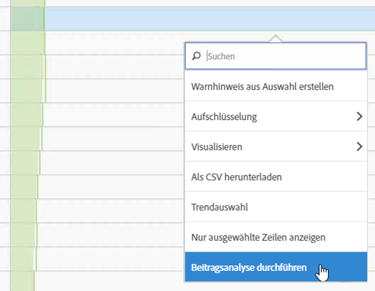
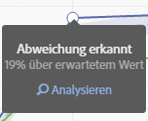
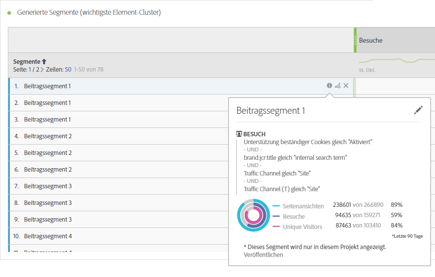
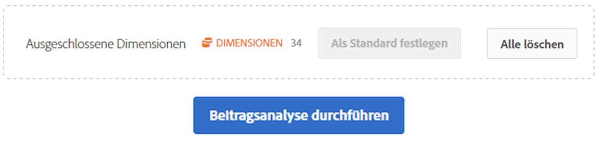
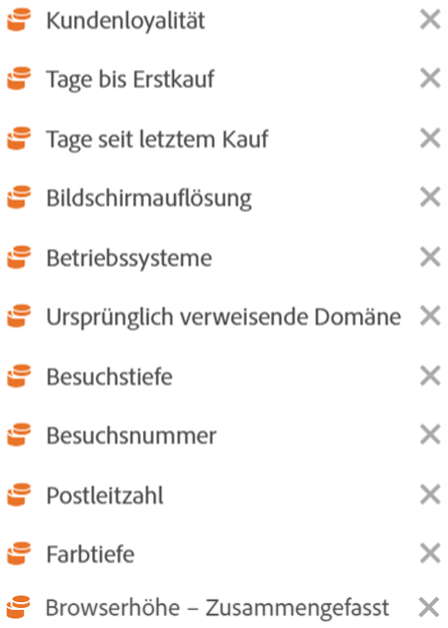

# Ausführen einer Beitragsanalyse

Die Beitragsanalyse ist ein intensiver maschineller Lernprozess, der helfen soll, Aspekte zu erkennen, die zu einer in Adobe Analytics festgestellten Anomalie mit beigetragen haben. Damit soll dem Benutzer geholfen werden, lohnenswerte Bereiche oder Gelegenheiten für weitere Analysieren viel schneller zu identifizieren.

## Ausführen einer Beitragsanalyse {#section_7D2C5E48A5664727941DF4C90976D9DC}

Es gibt zwei Möglichkeiten, die Beitragsanalyse in einem Projekt aufzurufen:

* In einer Freiformtabelle mit täglicher Granularität klicken Sie mit der rechten Maustaste auf eine beliebige Zeile und wählen Sie dann **[!UICONTROL Beitragsanalyse durchführen]** aus. Sie können die Analyse sogar für Zeilen durchführen, die nicht als anormal gekennzeichnet sind.

   >[!NOTE]
   >
   >Hinweis: Beitragsanalyse wird derzeit nur mit täglicher Granularität unterstützt.

   

* Zeigen Sie in einem Liniendiagramm auf einen anomalen Datenpunkt im Diagramm. Klicken Sie auf den Link **[!UICONTROL Analysieren]**, der erscheint.

   

1. (Optional) Nachdem Sie in einem Liniendiagramm oder einer Tabelle auf **[!UICONTROL Beitragsanalyse durchführen]** geklickt haben, können Sie die Analyse weiter eingrenzen (und damit beschleunigen), indem Sie [Dimensionen ausschließen](#section_F6932F4BF74544B5872164E7B1E0C6FC).

1. Warten Sie, während Ihre Beitragsanalyse geladen wird. Dieser Vorgang kann je nach der Größe Ihrer Report Suite und der Anzahl Ihrer Dimensionen einige Zeit in Anspruch nehmen. Die Beitragsanalyse erfolgt anhand der obersten 50.000 Elemente pro Dimension.
1. Anschließend lädt der Analysis Workspace ein neues Beitragsanalyse-Bedienfeld direkt in dieses Projekt. Wenn Sie die Beitragsanalyse schon früher in Reports &amp; Analytics genutzt haben, werden Ihnen etliche Bereiche vertraut vorkommen:

   * Eine Visualisierung, die die Anzahl der **Besuche** an diesem Tag anzeigt.
   * Eine monatliche **Besuchstrendlinie** für den Kontext.
   * **Oberste Elemente**, die zu dieser Anomalie beigetragen haben, sortiert nach der [Beitragsbewertung](https://docs.adobe.com/content/help/de-DE/analytics/analyze/analysis-workspace/virtual-analyst/contribution-analysis/ca-tokens.html), plus der fraglichen Metrik, und eine Metrik namens Unique Visitors, um die Metrik hinsichtlich der Größe in einen Kontext zu setzen.

   * Die Tabelle [Generierte Segmente](https://docs.adobe.com/content/help/de-DE/analytics/components/segmentation/segmentation-workflow/seg-build.html) (Wichtigste Element-Cluster) gibt die Zugehörigkeiten der obersten Elemente basierend auf der Beitragsbewertung, den ungewöhnlichen Vorkommen und dem gesamten prozentualen Beitrag zu der anormalen Metrik an. Dies wird dann als Zielgruppensegment (Beitragssegment 1, Beitragssegment 2 usw.) erfasst. Wenn Sie auf die Infoschaltfläche („i“) klicken, sehen Sie eine Ansicht mit der Definition des jeweiligen Segments inklusive der obersten Elemente, aus denen dieses besteht:

      

1. Da die Beitragsanalyse nun Bestandteil des Analysis Workspace ist, haben Sie über das Kontextmenü einer Tabelle Zugriff auf eine Reihe zugehöriger Funktionen, mit denen Sie Ihre Analysen noch aussagekräftiger gestalten können, beispielsweise:

   * [Aufschlüsseln der einzelnen Dimensionselemente nach einer anderen Dimension](/help/analyze/analysis-workspace/components/dimensions/t-breakdown-fa.md)
   * [Anzeigen von Trends für mindestens eine Zeile](/help/analyze/analysis-workspace/home.md#section_34930C967C104C2B9092BA8DCF2BF81A)
   * [Hinzufügen neuer Visualisierungen](/help/analyze/analysis-workspace/visualizations/freeform-analysis-visualizations.md)
   * [Erstellen von Warnhinweisen](/help/components/c-alerts/intellligent-alerts.md)
   * [Erstellen oder Vergleichen von Segmenten](/help/analyze/analysis-workspace/c-panels/c-segment-comparison/segment-comparison.md)

>[!NOTE]
>
>Die analysierte Anomalie wird durch einen blauen Punkt in der Beitragsanalyse und in den verknüpften intelligenten Benachrichtigungsprojekten markiert. Dadurch ist die gerade analysierte Anomalie leichter zu erkennen.

## Ausschluss von Dimensionen aus einer Beitragsanalyse {#section_F6932F4BF74544B5872164E7B1E0C6FC}

Es kann von Zeit zu Zeit erforderlich sein, einige Dimensionen bei der Beitragsanalyse auszuschließen. Hier ein Beispiel: Sie sind nicht an Dimensionen interessiert, die mit Browsern oder Hardware in Zusammenhang stehen, und möchten die Analyse beschleunigen, indem Sie die entsprechenden Dimensionen entfernen.

1. Nachdem Sie auf **[!UICONTROL Beitragsanalyse durchführen]** (oder in einem Liniendiagramm auf **[!UICONTROL Analysieren]**) geklickt haben, wird der Bereich **[!UICONTROL Ausgeschlossene Dimensionen]** angezeigt.

1. Ziehen Sie einfach alle nicht erforderlichen Dimensionen in den Bereich **[!UICONTROL Ausgeschlossene Dimensionen]** und speichern Sie dann die Liste, indem Sie auf **[!UICONTROL Als Standard festlegen]** klicken. Alternativ können Sie auch auf **[!UICONTROL Alle löschen]** klicken, um neue Dimensionen auszuwählen, die Sie ausschließen möchten.

   

1. Nachdem Sie Dimensionen hinzugefügt haben, die ausgeschlossen werden sollen, klicken Sie wieder auf **[!UICONTROL Beitragsanalyse durchführen]**.
1. Wenn Sie die Liste mit ausgeschlossenen Dimensionen verändern müssen, doppelklicken Sie einfach auf „Dimensionen“. Die Liste mit ausgeschlossenen Dimensionen wird dann angezeigt:

   

1. Löschen Sie einfach alle nicht erforderlichen Dimensionen, indem Sie auf das x-Symbol neben den einzelnen Dimensionen klicken. Speichern Sie dann die Liste, indem Sie auf **[!UICONTROL Als Standard festlegen]** klicken.

