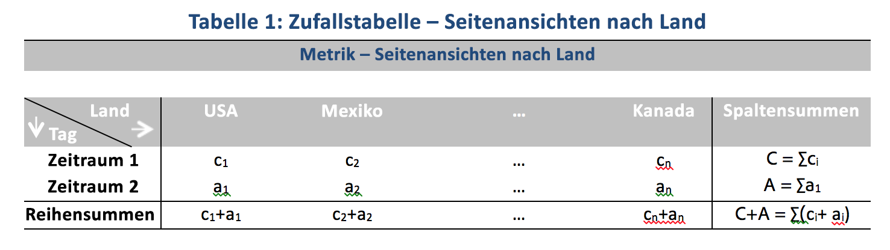

# In der Beitragsanalyse verwendete statistische Verfahren

Die Beitragsanalyse ist ein intensiver maschineller Lernprozess, der helfen soll, Aspekte zu erkennen, die zu einer in Adobe Analytics festgestellten Anomalie mit beigetragen haben. Damit soll dem Benutzer geholfen werden, lohnenswerte Bereiche oder Gelegenheiten für weitere Analysieren viel schneller zu identifizieren.

Die Beitragsanalyse erreicht dies durch Ausführung eines zweiteiligen Algorithmus für jedes einzelne Dimensionselement, das für den Beitragsanalysebericht des Benutzers verfügbar ist. Dabei geht der Algorithmus in der folgenden Reihenfolge vor:

1. Er berechnet für jede Dimension die V-Test-Statistik nach Cramer. Im folgenden Beispiel sehen Sie eine Kontingenztabelle mit Seitenansichten nach Ländern über zwei Zeitperioden:

   

   In Tabelle 1 kann mit Cramers V der Zusammenhang zwischen den Seitenansichten nach Ländern für den Zeitraum 1 (z. B. historische Daten) und den Zeitraum 2 (z. B. der Tag, an dem die Anomalie entstanden ist) gemessen werden. Ein niedriger Wert für Cramers V bedeutet einen niedrigen Grad an Zusammenhang. Werte für Cramers V liegen zwischen 0 (kein Zusammenhang) und 1 (vollständiger Zusammenhang). Die Cramer-V-Statistik kann wie folgt berechnet werden:

   

1. Für jedes Dimensionselement wird der PR-Wert (Person’s Residual, Restwert der Person) verwendet, um den Zusammenhang zwischen der anormalen Metrik und jedem Dimensionselement zu messen. Da der PR-Wert einer gewöhnlichen Normalverteilung folgt, kann der Algorithmus die PRs von zwei zufälligen Variablen miteinander vergleichen, selbst wenn die Abweichungen nicht vergleichbar sind. In der Praxis ist der Fehler nicht bekannt und wird mittels finiter Stichprobenkorrektur abgeschätzt.

   In der vorherigen Beispieltabelle 1 wird der PR mittels finiter Stichprobenkorrektur für das Land i und den Zeitraum 2 angegeben durch

   

   Hier,

   

   (Eine ähnliche Formel kann für den Zeitraum 1 genommen werden.)

   Für die Endergebnisse wird die Bewertung von jedem Dimensionselement dann mit dem Cramer-V-Messwert gewichtet und in einen Wert zwischen 0 und 1 skaliert, um den Verteilungswert zu erhalten.

