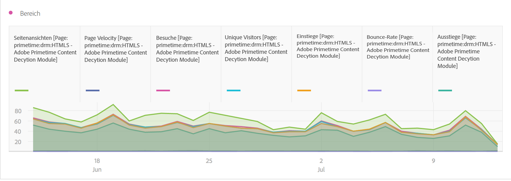
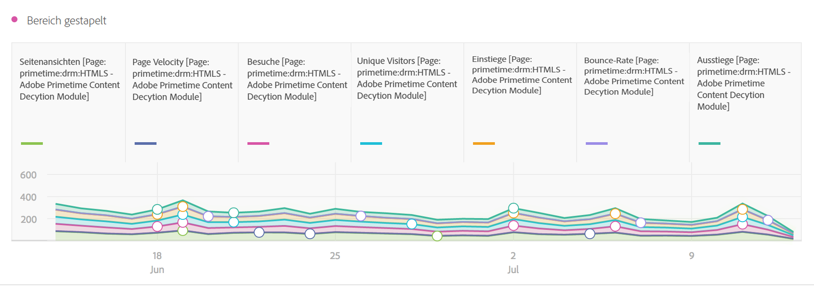
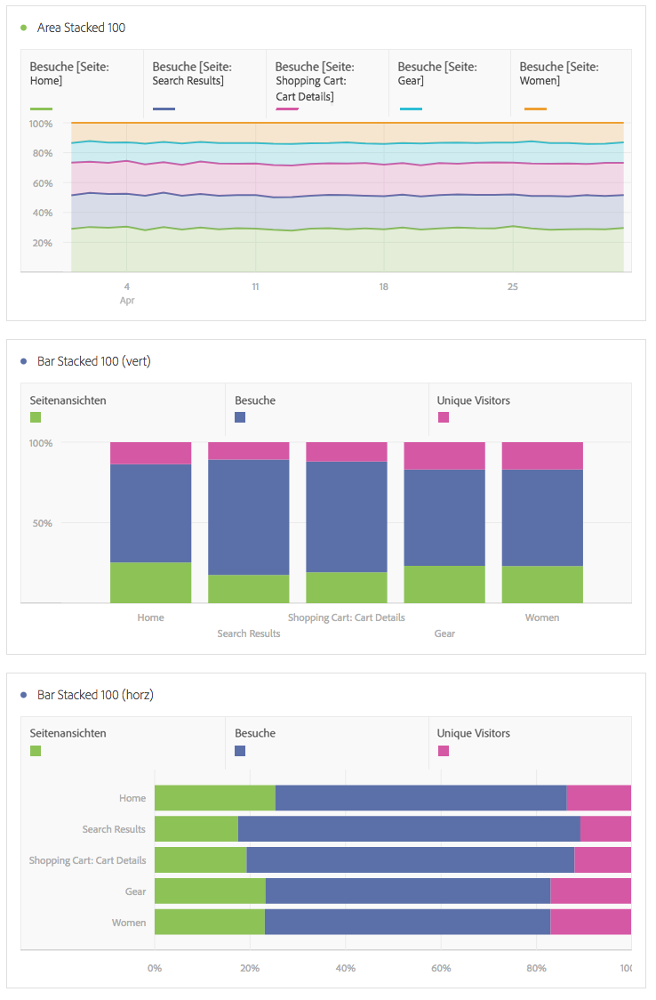

# Bereich und Bereich gestapelt

## Bereich {#section_FDC4B6AA944F4F8AAAEAA5E17359F28A}

Diese Visualisierung des ist wie ein Liniendiagramm, aber mit einem farbigen Bereich unterhalb der Linie. Verwenden Sie ein Flächendiagramm, wenn Sie mehrere Metriken darstellen und den Bereich visualisieren möchten, der durch die Schnittmenge von zwei oder mehr Metriken gebildet wird.

## Bereich gestapelt {#section_922BBC5A6D254778A050DF710B0BD8D9}

Diese Visualisierung entspricht einem Flächendiagramm, aber hier beginnt jede Serie über der vorherigen Serie.

Mit der neuen Einstellung für gestapelte Bereichsdiagramme erhalten Sie eine zu „100 % gestapelte“ Visualisierung.

