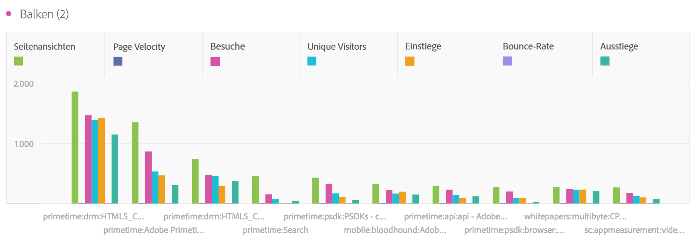
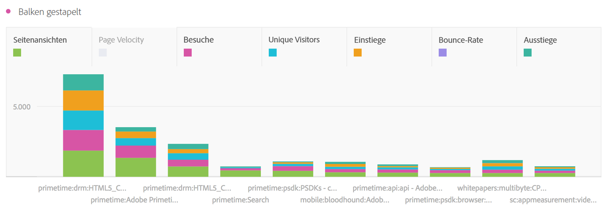

# Balken und Balken gestapelt

## Balken {#section_2E96E55D4E8E488CBCA6A3508DDF3918}

Diese Visualisierung zeigt vertikale Balken, die verschiedene Werte aus einer oder mehreren Metriken darstellen.

In den Visualisierungseinstellungen können Sie über ein Dropdown-Menü für die Granularität eine Trend-Visualisierung (z. B. Linie, Balken) von täglich zu wöchentlich zu monatlich usw. ändern.

## Bar stacked {#section_9EA83779AE964635907EE5031A785A49}

Diese Visualisierung entspricht einem Balkendiagramm, aber die Serienbalken sind hier übereinander gestapelt.

Mit der neuen Einstellung für gestapelte Balkendiagramme erhalten Sie eine zu „100 % gestapelte“ Visualisierung.

