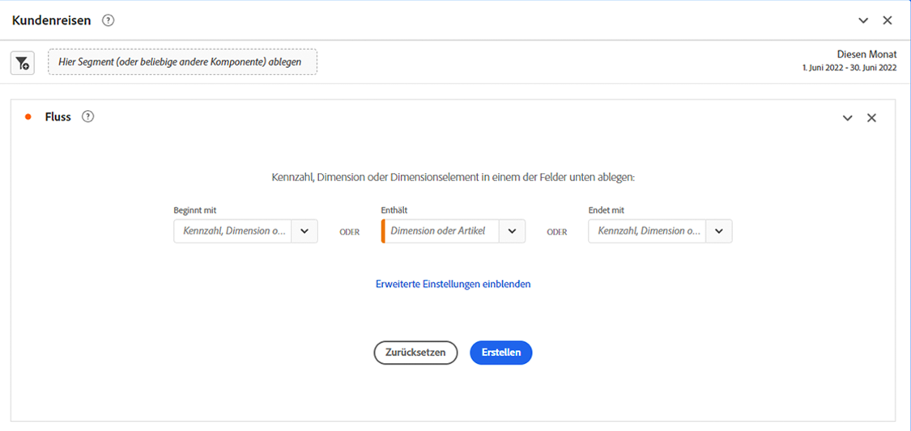
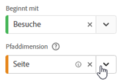
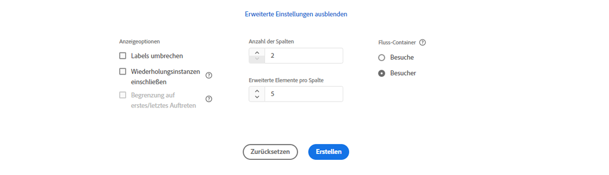
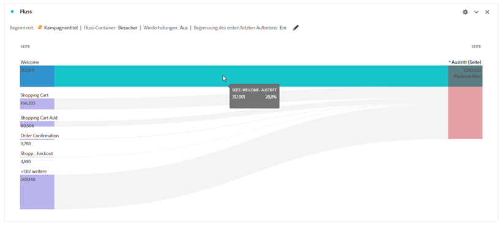
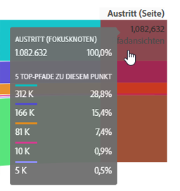

# Flussvisualisierung konfigurieren

>[!NOTE]
>
>Diese neue Version der [!UICONTROL Fluss] Die Visualisierung befindet sich derzeit in der privaten Beta-Phase. Siehe [diese Seite](/help/analyze/analysis-workspace/visualizations/c-flow/creating-flow-report.md) für die aktuelle Funktion.

Mit der aktualisierten Flussvisualisierung können Sie die Journey verstehen, die von einem bestimmten Konversionsereignis auf Ihrer Website oder in Ihrer App ausgehen oder dazu führen. Sie verfolgt einen Pfad durch Ihre Dimensionen (und Dimensionselemente) oder Metriken. Mit &quot;Fluss&quot;können Sie den Anfang oder das Ende des Pfades konfigurieren, an dem Sie interessiert sind, oder alle Pfade analysieren, die durch eine Dimension oder ein Dimensionselement fließen.

Die neue [!UICONTROL Fluss] Erlebnis verbessert Ihren Workflow auf verschiedene Weise:

* Sie können jetzt Ihren Pfad mit der Kombination aus einer Metrik und einer Pfaddimension starten oder beenden.
* Enthält [!UICONTROL Erweiterte Einstellungen] , damit Sie die [!UICONTROL Fluss].
* Mit der neuen Schaltfläche &quot;Erstellen&quot;sparen Sie Zeit in der Analyse, indem Sie die Journey alle gleichzeitig konfigurieren, dann Abfragen und dann automatisch mehrere Spalten und Knoten gleichzeitig &#x200B; erstellen können.

## Konfigurationsschritte {#configure}

1. Um ein Flussdiagramm zu erstellen, fügen Sie ein leeres Bedienfeld zu Ihrem Projekt hinzu und klicken Sie in der linken Leiste auf das Symbol für Visualisierungen . Ziehen Sie dann die Flussvisualisierung in das Bedienfeld. Oder ziehen Sie die [!UICONTROL Fluss] Visualisierung in ein vorhandenes Projekt.

1. Sie können Ihre Flussvisualisierung mit einer von drei Optionen verankern:

   * [!UICONTROL Beginnt mit] (Metriken, Dimensionen oder Elemente) oder
   * [!UICONTROL Enthält] (Dimensionen oder Elemente) oder
   * [!UICONTROL Endet in] (Metriken, Dimensionen oder Elemente)

   Jede dieser Kategorien wird auf dem Bildschirm als eine „Dropzone“ (Ablagebereich) angezeigt. Ziehen Sie Elemente aus der Dimensionen- oder Metrikliste und legen Sie sie in der gewünschten Dropzone ab.

   Nehmen wir beispielsweise an, Sie möchten alles nachverfolgen, was zu einem Checkout-Ereignis führt. Sie würden eine mit dem Checkout zusammenhängende Dimension oder Metrik ziehen (z. B. [!UICONTROL Reihenfolge vorhanden]) in die **[!UICONTROL Endet in]** Dropzone.

1. Wenn Sie eine Metrik auswählen, müssen Sie auch eine [!UICONTROL Pathing-Dimension], wie hier gezeigt, verwenden Sie zum Erstellen des Pfads. Der Standardwert ist [!UICONTROL Seite].

   

1. (Optional) Klicken Sie auf **[!UICONTROL Erweiterte Einstellungen anzeigen]** zum Konfigurieren der erweiterten Einstellungen:

   

   | Einstellung | Beschreibung |
   | --- | --- |
   | **[!UICONTROL Wiederholungsinstanzen einschließen]** | Flussvisualisierungen basieren auf Instanzen einer Dimension. Diese Einstellung gibt Ihnen die Möglichkeit, wiederholte Instanzen ein- oder auszuschließen, z. B. Seitenneuladungen. Wiederholungen können jedoch nicht aus Flussvisualisierungen entfernt werden, die Dimensionen mit mehreren Werten enthalten, wie listVars, listProps, s.product, Merchandising-eVars usw. Standard = deaktiviert. |
   | **[!UICONTROL Umbruch-Bezeichnungen]** | Die Bezeichnungen der Flusselemente werden üblicherweise aus Platzgründen auf dem Bildschirm abgeschnitten. Aktivieren Sie dieses Kontrollkästchen, um die gesamte Bezeichnung anzuzeigen.  Standard = deaktiviert. |
   | **[!UICONTROL Auf das erste/letzte Vorkommen beschränken]** | Begrenzen Sie Pfade auf Pfade, die mit dem ersten/letzten Vorkommen einer Dimension/eines Elements/einer Metrik beginnen/enden. |
   | **[!UICONTROL Anzahl der Spalten]** | Legt fest, wie viele Spalten Sie in Ihrem Flussdiagramm anzeigen möchten. |
   | **[!UICONTROL Elemente pro Spalte erweitert]** | Wie viele Elemente Sie in jeder Spalte anzeigen möchten. |
   | **[!UICONTROL Fluss-Container]** | <ul><li>Besuch</li><li>Besucher.</li></ul> Hiermit können Sie bei der Analyse der Besucherpfade zwischen Besuch und Besucher wechseln. Mithilfe dieser Einstellungen können Sie Einblicke in Besucheraktivitäten auf der Besucherebene (besuchsübergreifend) erhalten oder die Analyse auf einen einzelnen Besuch einschränken. |

1. Klicken Sie auf **[!UICONTROL Erstellen]**.

## Flussausgabe anzeigen und ändern {#output}

Eine Zusammenfassung der Flusskonfiguration wird oben im Diagramm angezeigt. Die Pfade in dem Diagramm sind proportional. Pfade mit mehr Aktivität werden dicker dargestellt.

Um die Daten weiter zu untersuchen, haben Sie mehrere Möglichkeiten:

* Das Flussdiagramm ist interaktiv. Wenn Sie den Mauszeiger über das Diagramm halten, werden jeweils andere Details angezeigt.

* Wenn Sie auf einen Knoten in dem Diagramm klicken, werden die zugehörigen Details zu diesem Knoten angezeigt. Klicken Sie erneut auf den Knoten, um ihn zu reduzieren.

   

* Sie können eine Spalte so filtern, dass nur bestimmte Ergebnisse angezeigt werden, z. B. das Ein- und Ausschließen, die Angabe von Kriterien usw.

* Klicken Sie links auf das Pluszeichen (+), um eine Spalte zu erweitern.

* Verwenden Sie die unten erläuterten Rechtsklickoptionen, um die Ausgabe weiter anzupassen.

* Klicken Sie auf das Stiftsymbol neben der Konfigurationsübersicht, um den Fluss weiter zu bearbeiten oder ihn mit verschiedenen Optionen neu zu erstellen.

* Sie können Ihr Flussdiagramm als Teil der .CSV-Datei eines Projekts auch exportieren und weiter analysieren, indem Sie **[!UICONTROL Projekt]** > **[!UICONTROL CSV herunterladen]** aufrufen.

## Rechtsklick-Optionen {#right-click}

| Option | Beschreibung |
|--- |--- |
| [!UICONTROL Auf diesen Knoten fokussieren] | Wechselt den Fokus auf den ausgewählten Knoten. Der Fokusknoten wird in der Mitte des Flussdiagramms angezeigt. |
| [!UICONTROL Neu starten] | Bringt Sie wieder zurück in den Freiform-Diagramm-Builder, in dem Sie ein neues Flussdiagramm erstellen können. |
| [!UICONTROL Segment von diesem Punkt im Fluss aus erstellen] | Erstellen eines Segments. Hiermit gelangen Sie in den Segment Builder, in dem Sie das neue Segment einrichten können. |
| [!UICONTROL Aufschlüsselung] | Hiermit können Sie den Knoten nach verfügbaren Dimensionen, Metriken oder Zeiten aufschlüsseln. |
| [!UICONTROL Trend] | Mit dieser Option erstellen Sie ein Trenddiagramm für den Knoten. |
| [!UICONTROL Gesamte Spalte erweitern] | Hiermit erweitern Sie eine Spalte so, dass alle Knoten angezeigt werden. In der Standardeinstellung werden nur die obersten fünf Knoten angezeigt. |
| [!UICONTROL Gesamte Spalte reduzieren] | Diese Option blendet alle Knoten in einer Spalte aus. |
