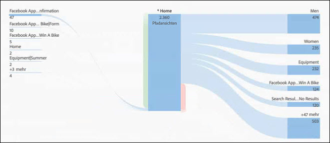
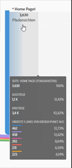
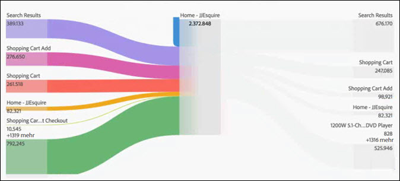
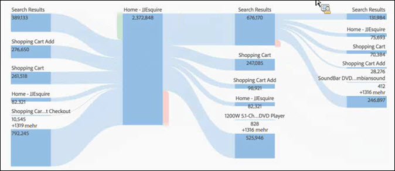

# Flussvisualisierung konfigurieren

Mithilfe der Flussfunktion können Sie einen Pfad durch Ihre Seiten oder Dimensionen verfolgen (z. B. eVars):

* Einstieg (nur Dimensionen)
* Dimensionen oder Elemente
* Ausstieg (nur Dimensionen)

Jede dieser Kategorien wird auf dem Bildschirm als eine „Dropzone“ (Ablagebereich) angezeigt. Ziehen Sie Elemente aus der Liste, und legen Sie sie in der gewünschten Dropzone ab. Seiten und andere Elemente, die keine Dimensionen sind, können nur in der mittleren Dropzone abgelegt werden. Wenn Sie eine Dimension in der mittleren Dropzone ablegen, wird automatisch ein Bericht ausgeführt, der die obersten Elemente für diese Dimension einfügt.

Wenn Sie ein Element in einer Dropzone ablegen, wird das Flussdiagramm geöffnet. Die Inhalte des Flussdiagramms hängen von der Dropzone ab, in der Sie eine Dimension oder ein Element abgelegt haben. „Ausstieg“ und „Einstieg“ zeigen alle Elemente für die Dimension an (wie beispielsweise Seiten), die Sie in der Einstiegs- oder Ausstiegs-Dropzone ablegen. Wenn Sie zum Beispiel eine Dimension in der zentralen Dropzone ablegen, wird das Flussdiagramm für diese Dimension geöffnet.

Wenn Sie den Mauszeiger über den Fokusknoten in der Mitte des Diagramms halten, werden Informationen zu diesem Knoten angezeigt.

Das Flussdiagramm ist interaktiv. Wenn Sie den Mauszeiger über das Diagramm halten, werden jeweils andere Details angezeigt.

Die Pfade in dem Diagramm sind proportional. Pfade mit mehr Aktivität werden dicker dargestellt.

Wenn Sie auf einen Knoten in dem Diagramm klicken, werden die zugehörigen Details zu diesem Knoten angezeigt. Beispiel: Wenn Sie im oben gezeigten Diagramm rechts oben auf **[!UICONTROL Suchergebnisse]** klicken, wird das Diagramm um weitere Details zum Suchergebnisknoten erweitert. Klicken Sie erneut auf den Knoten, um ihn wieder zu reduzieren.

In der Standardeinstellung zeigt das Diagramm die obersten fünf Flüsse an. Wenn Sie unten im Diagramm auf den Knoten **[!UICONTROL Mehr]** klicken, wird das Diagramm um fünf weitere Flüsse erweitert. Wenn Sie weiterhin auf **[!UICONTROL Mehr]** klicken, wird das Diagramm zunehmend erweitert, bis keine weiteren Flüsse mehr zur Anzeige vorhanden sind.

Es gibt keine Einschränkungen dafür, wie tief Sie in das Flussdiagramm navigieren können.

Sie können Ihr Flussdiagramm als Teil der .CSV-Datei eines Projekts auch exportieren und weiter analysieren, indem Sie **[!UICONTROL Projekt]** > **[!UICONTROL CSV herunterladen]** aufrufen.
