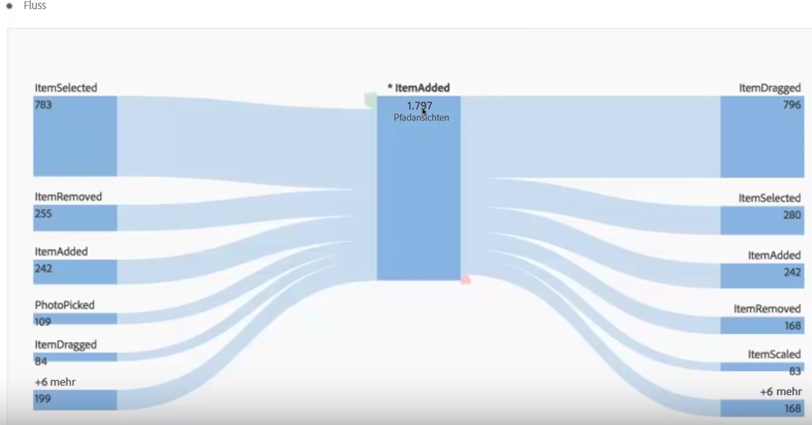
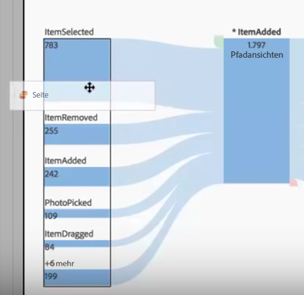
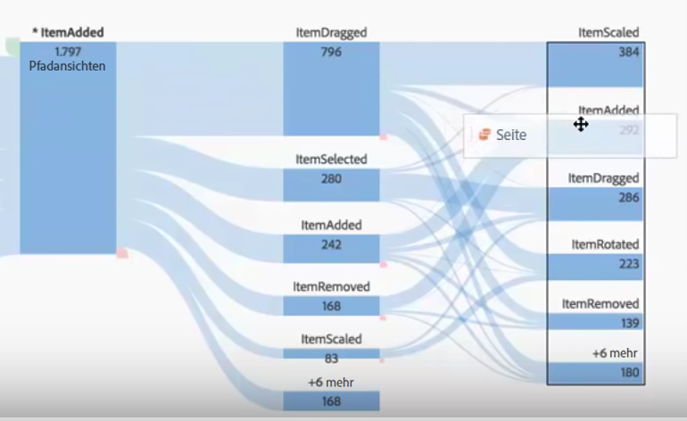
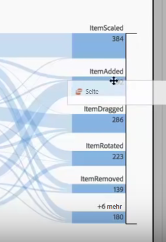
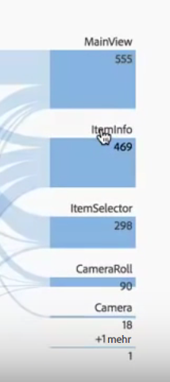
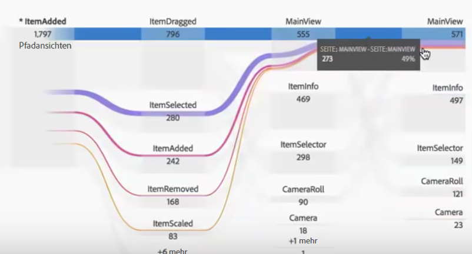
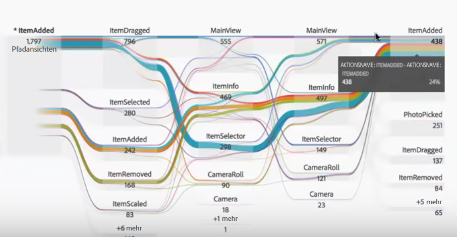
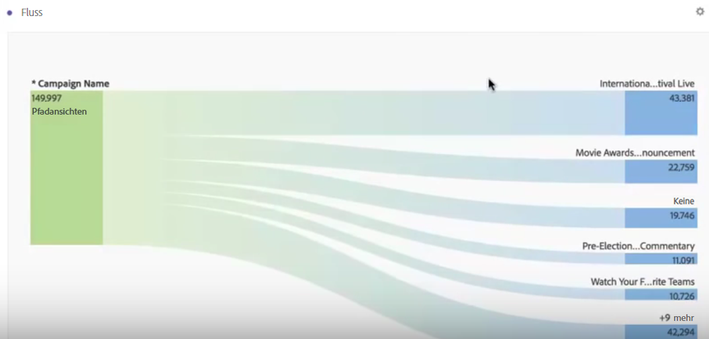
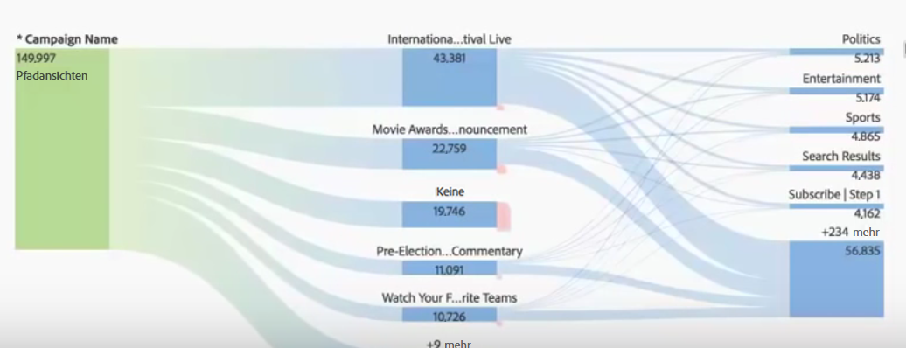

# Interdimensionale Flüsse

Mithilfe eines interdimensionalen Flusses können Sie Benutzerpfade über verschiedene Dimensionen hinweg untersuchen.

Eine Dimensionsbezeichnung jeweils oben in der Spalte „Fluss“ vereinfacht die Verwendung mehrerer Dimensionen in einer Flussvisualisierung:

Sehen wir uns 2 Anwendungsfälle an: einen App-Anwendungsfall und einen Web-Anwendungsfall.

## Anwendungsfall 1: App {#section_3D31D37B9C9F4134AE46C96291E41294}

Die Dimension [!UICONTROL Aktionsname] wurde dem Fluss hinzugefügt, wobei das oberste zurückgegebene Element [!UICONTROL ItemAdded] ist:

Um die Interaktion zwischen Bildschirmen/Seiten und Aktionen in dieser App zu untersuchen, können Sie die Dimension „Seite“ an mehrere Stellen ziehen (je nachdem, was genau Sie untersuchen möchten):

* Ziehen Sie die Dimension an eines der Enden der Dropzone (innerhalb der schwarz umrandeten rechteckigen Zone, die eingeblendet wird), um die obersten Ergebnisse an den Enden zu **ersetzen**:

    

* Ziehen Sie die Dimension auf die weiße Fläche an dem Ende (beachten Sie die schwarze Klammer), um sie **der Visualisierung hinzuzufügen**:

   

Falls Sie sich enschieden haben, das Element „ItemScaled“ in der rechten Spalte mit der Dimension „Seite“ zu ersetzen, sieht das Ergebnis so aus. Das oberste Ergebnis ändert sich nun so, dass es das oberste Ergebnis für die Dimension „Seite“ ist.

Nun können Sie erkennen, wie Ihre Kunden durch die Aktionen und Seiten navigieren. Per Klick auf die verschiedenen Knoten können Sie den Fluss noch weiter untersuchen:

Wenn Sie eine weitere Dimension Aktionsname am Ende der Visualisierung hinzufügen, geschieht Folgendes:

Dies gibt Ihnen tiefere Einblicke in die App, die Sie analysieren möchten, und erlaubt geeignete Änderungen.

## Anwendungsfall 2: Web {#section_8D55983FA0C84926995270052AE01CD8}

Dieser Verwendungsfall zeigt, wie Sie anaysieren können, welche Kampagnen die meisten Einstiege auf einer Website einbringen.

Ziehen Sie die Dimension „Kampagnenname“ in einen neuen Fluss:

Nun möchte ich wissen, auf welche Seiten diese Kampagnen Traffic leiten. Daher ziehe ich die Dimension „Seite“ nach rechts von den Flussergebnissen, um sie in der Visualisierung hinzuzufügen:

