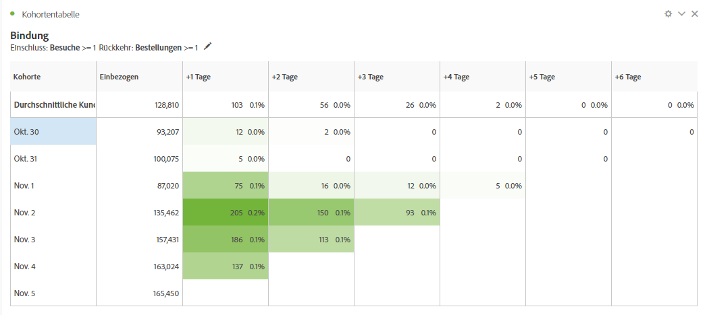
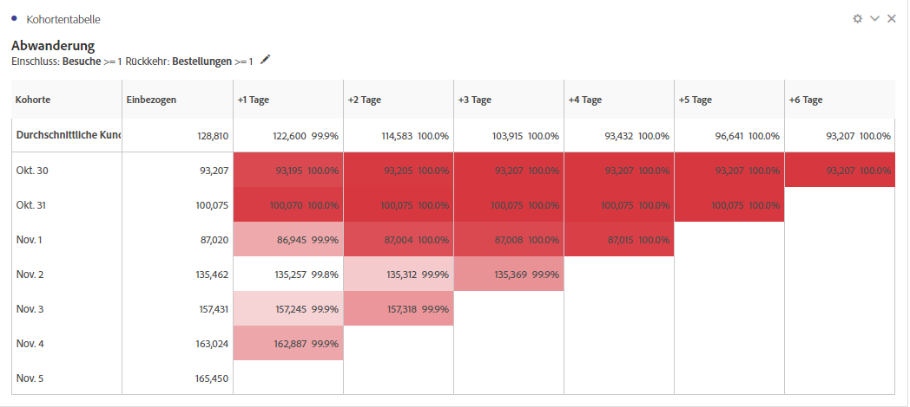
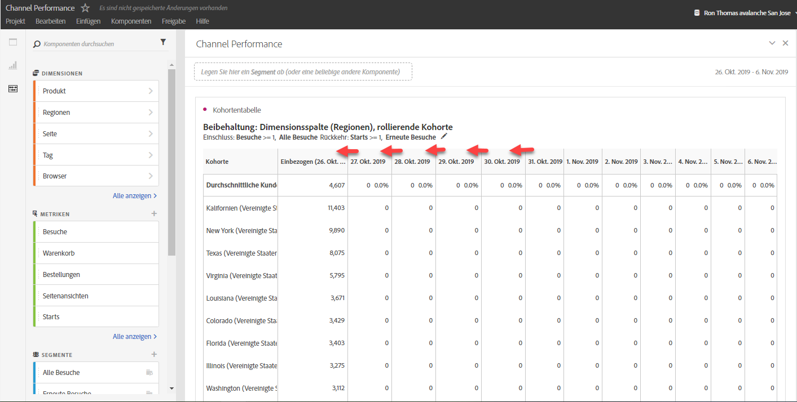
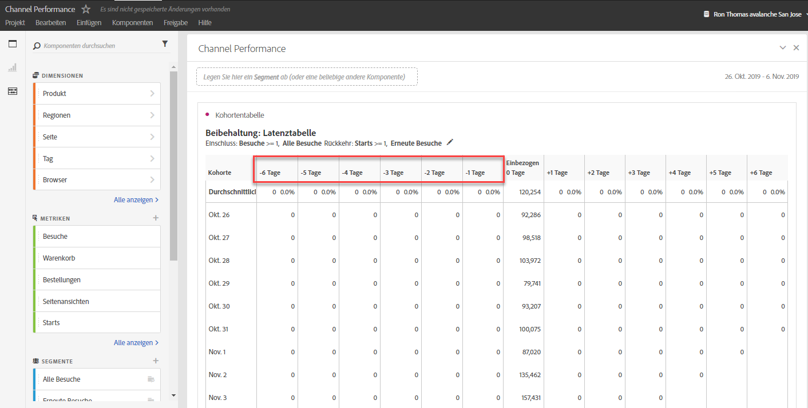
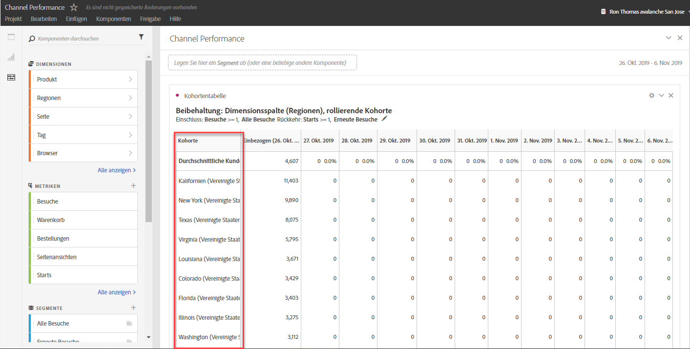

# Was ist eine Kohortenanalyse?

A *`cohort`* is a group of people sharing common characteristics over a specified period. Cohort Analysis is useful, for example, when you want to learn how a cohort engages with a brand. Sie können problemlos Trendänderungen offenlegen und entsprechend reagieren. (Explanations of Cohort Analysis are available on the web, such as at [Cohort Analysis 101](https://en.wikipedia.org/wiki/Cohort_analysis).)

Nachdem Sie einen Kohortenbericht erstellt haben, können Sie dessen Komponenten (bestimmte Dimensionen, Metriken und Segmente) kuratieren und den Kohortenbericht dann für andere freigeben. Weitere Informationen finden Sie unter [Curate and Share](../../../../analyze/analysis-workspace/curate-share/curate.md#concept_4A9726927E7C44AFA260E2BB2721AFC6).

Examples of what you can do with Cohort Analysis:

* Starten Sie Kampagnen, die dafür ausgelegt sind, eine erwünschte Aktion anzuregen.
* Erhöhen Sie das Marketingbudget genau zum richtigen Zeitpunkt im Kundenlebenszyklus.
* Erkennen Sie, wann eine Testphase oder ein Angebot beendet werden sollte, um den Wert zu maximieren.
* Gewinnen Sie Ideen für A/B-Tests in Bereichen wie Preisstruktur, Upgradepfad usw.
* Zeigen Sie einen Kohortenanalysebericht mit einem angeleiteten Analysebericht an.
* Erkennen Sie, wann eine Testphase oder ein Angebot beendet werden sollte, um den Wert zu maximieren.
* Gewinnen Sie Ideen für A/B-Tests in Bereichen wie Preisstruktur, Upgradepfad usw.

Die Kohortenanalyse steht allen Analytics-Kunden mit Zugriffsrechten auf Analysis Workspace zur Verfügung.

[Cohort Analysis on YouTube](https://www.youtube.com/watch?v=kqOIYrvV-co&index=45&list=PL2tCx83mn7GuNnQdYGOtlyCu0V5mEZ8sS) (4:36)

>[!IMPORTANT]
>
>Cohort Analysis does not support calculated metrics.

## Cohort Analysis capabilities

In January 2019, Adobe released a new and significantly enhanced version of Cohort Analysis. Sie erhalten damit eine sehr viel feinere Steuerung der Kohorten, die Sie erstellen. Dies sind die Verbesserungen:

### Bindungstabelle

Ein Bericht zur Aufbewahrungskohorte gibt Besucher zurück: Jede Datenzelle zeigt die Rohanzahl und den Prozentsatz der Besucher in der Kohorte, die die Aktion während dieses Zeitraums durchgeführt haben. Sie können bis zu 3 Kennzahlen und bis zu 10 Segmente einschließen.

### Abwanderungstabelle

Eine Churn-Kohorte ist das Gegenteil einer Retentionstabelle und zeigt die Besucher an, die im Laufe der Zeit die Rückgabekriterien für Ihre Kohorte überschritten haben oder nicht erfüllt haben. Sie können bis zu 3 Kennzahlen und bis zu 10 Segmente einschließen.

### Rollierende Berechnung

Ermöglicht es Ihnen, die Bindung oder die Abwanderung auf Grundlage der vorherigen Spalte und nicht der Aufnahmespalte zu berechnen.

### Latenztabelle

Misst die Zeit, die vor und nach dem Aufnahmeereignis verstrichen ist. Ein hervorragendes Tool für die Vor- und Nachanalyse. Die Spalte „Aufnahme“ befindet sich in der Mitte der Tabelle und die Zeiträume vor und nach dem Aufnahmeereignis werden auf beiden Seiten angezeigt.

### Angepasste Dimensionskohorte

Erstellen Sie Kohorten auf Grundlage einer ausgewählten Dimension und nicht auf Grundlage zeitbasierter Kohorten, die Standardeinstellung sind. Verwenden Sie Dimensionen wie Marketing-Kanal, Kampagne, Produkt, Seite, Region oder jede andere Dimension in Adobe Analytics, um anzuzeigen, wie die Bindung sich basierend auf verschiedenen Werten dieser Dimensionen verändert.

Anweisungen zum Einrichten und Durchführen eines Kohortenberichts finden Sie unter [Konfigurieren eines Kohortenanalyseberichts](/help/analyze/analysis-workspace/visualizations/cohort-table/t-cohort.md).

