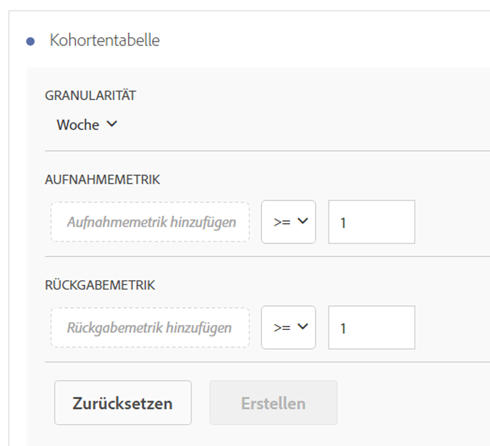
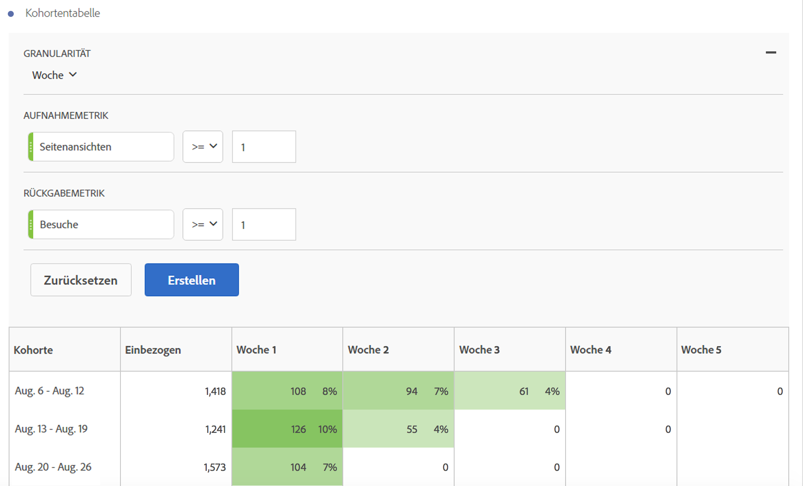

# Konfigurieren eines [!UICONTROL Kohortenanalyseberichts]

Erstellen Sie in Analysis Workspace eine Kohorte und führen Sie einen [!UICONTROL Kohortenanalysebericht] aus.

1. Klicken Sie in Analysis Workspace in der linken Leiste auf das Symbol **[!UICONTROL Visualisierungen]** und ziehen Sie eine **[!UICONTROL Kohortentabelle]** auf die Arbeitsfläche.

   

1. Bestimmen Sie die **[!UICONTROL Aufnahmekriterien]**, die **[!UICONTROL Rückkehrkriterien]**, den **[!UICONTROL Kohortentyp]** und die **[!UICONTROL Einstellungen]** wie in der Tabelle unten definiert.

| Element | Beschreibung |
|--- |--- |
| **[!UICONTROL Aufnahmekriterien]** | Sie können bis zu 10 Aufnahmesegmente und bis zu 3 Aufnahmekennzahlen anwenden. Die Kennzahl bestimmt, durch welche Kennzahl ein Benutzer in einer Kohorte platziert wird. Wenn die Aufnahmekennzahl z. B. die Bestellungen sind, werden nur Benutzer, die innerhalb des Zeitraums der Kohortenanalyse bestellt haben, in den anfänglichen Kohorten platziert. Der Standardoperator zwischen den Kennzahlen ist AND, kann aber in OR geändert werden. Außerdem können Sie diesen Metriken numerische Filter hinzufügen. Beispielsweise: „Besuche >= 1“.  |
| **[!UICONTROL Rückkehrkriterien]** | Sie können bis zu 10 Rückkehrsegmente und bis zu 3 Rückkehrkennzahlen anwenden. Die Kennzahl gibt an, ob ein Benutzer gewonnen wurde (Bindung) oder nicht (Abwanderung). Wenn die Rückkehrmetrik z. B. die Videoansichten sind, werden nur Benutzer, die in nachfolgenden Zeiträumen (nach dem Zeitraum, in dem sie zu einer Kohorte hinzugefügt wurden) Videos angesehen haben, als zurückgekehrt dargestellt. Eine weitere Metrik, die die Treue quantifiziert, sind die Besuche. |
| **[!UICONTROL Granularität]** | Die Zeitgranularität: Tag, Woche, Monat, Quartal oder Jahr. |
| **[!UICONTROL Typ]** | **[!UICONTROL Bindung]**: Durch die Bindungskohorte wird gemessen, wie die Besucherkohorte im Laufe der Zeit zu Ihnen zurückkehrt. Dabei handelt es sich um die Standardkohorte, die schon immer vorhanden war. Sie zeigt die Rückkehr und wiederkehrendes Benutzerverhalten an. In der Tabelle wird die [!UICONTROL Bindungskohorte] grün angezeigt. **[!UICONTROL Abwanderung ]**: Bei einer Abwanderungskohorte (auch „Abbruch“ oder „Fallout“) wird gemessen, wie Ihre Besucher im Laufe der Zeit abwandern. Abwanderung = 1 - Bindung. Die [!UICONTROL Abwanderung] ist ein guter Messwert für die Treue und Chancen, da Ihnen gezeigt wird, wie häufig Kunden nicht zurückkehren. Sie können die Abwanderung nutzen, um Fokusbereiche zu analysieren und zu identifizieren, um herauszufinden, welche Kohortensegmente etwas Aufmerksamkeit erfordern. Die [!UICONTROL Abwanderungskohorte] wird in der Tabelle durch die Farbe Rot angezeigt (ähnlich wie Fallout in unserer **[!UICONTROL  Flussvisualisierung ]**).  |
| **[!UICONTROL Einstellungen]** | **[!UICONTROL Rollierende Berechnung]**: Ermöglicht es Ihnen, die Bindung oder die Abwanderung auf Grundlage der vorherigen Spalte und nicht der Aufnahmespalte zu berechnen (Standard). Durch [!UICONTROL Rollierende Berechnung] wird die Berechnungsmethode für Ihre „Rückkehr“-Zeiten verändert. Die Normalberechnung findet eigenständig Benutzer, die die „Rückkehr“-Kriterien erfüllen und Teil des Aufnahmezeitraums waren, unabhängig davon, ob sie in der Kohorte des vorherigen Zeitraums waren oder nicht. Im Gegensatz dazu findet [!UICONTROL Rollierende Berechnung] Benutzer, die die „Rückkehr“-Kriterien erfüllen und Teil des vorherigen Zeitraums waren. Daher filtert [!UICONTROL Rollierende Berechnung] Benutzer, die die „Rückkehr“-Kriterien kontinuierlich in jedem Zeitraum erfüllen, und trichtert sie. [!UICONTROL Rückkehrkriterien] werden auf jeden Zeitraum bis zum ausgewählten Zeitraum angewendet.   **[!UICONTROL Latenztabelle ]**: Eine [!UICONTROL Latenztabelle] misst die Zeit, die vor und nach dem Aufnahmeereignis verstrichen ist. Die [!UICONTROL Latenz] eignet sich ideal vor/nach der Analyse. Wenn beispielsweise ein Produkt- oder Kampagnen-Lauch bevorsteht und Sie das Verhalten vorher verfolgen und sehen möchten, wie es danach ist, zeigt die [!UICONTROL Latenztabelle] das Verhalten vorher und danach nebeneinander an, um die direkten Auswirkungen darzustellen. Die Zellen in der [!UICONTROL Latenztabelle] vor der Aufnahme werden von Benutzern berechnet, die die [!UICONTROL Aufnahmekriterien] für den Aufnahmezeitraum und anschließend die [!UICONTROL Rückkehrkriterien] in den Zeiträumen vor dem Aufnahmezeitraum erfüllen.[!UICONTROL Latenztabellen] und die Kohorte [!UICONTROL Benutzerspezifische Dimension] können nicht zusammen verwendet werden.  **[!UICONTROL Angepasste Dimensionskohorte]**: Erstellen Sie Kohorten auf Grundlage der ausgewählten Dimension und nicht auf Grundlage zeitbasierter Kohorten (Standard). Viele Kunden möchten ihre Kohorten nach etwas anderem als der Zeit analysieren und die neue Funktion der angepassten Dimensionskohorte bietet Ihnen die Flexibilität, Kohorten basierend auf Dimensionen ihrer Wahl zu erstellen. Verwenden Sie Dimensionen wie Marketing-Kanal, Kampagne, Produkt, Seite, Region oder jede andere Dimension in Adobe Analytics, um anzuzeigen, wie die Bindung sich basierend auf verschiedenen Werten dieser Dimensionen verändert. Die Segmentdefinition für die Kohorte [!UICONTROL Benutzerspezifische Dimension] wendet das Dimensionselement nur als Teil des Aufnahmezeitraums an, nicht als Teil der Rückgabedefinition.  Nach Auswahl der Option [!UICONTROL Angepasste Dimensionskohorte] können Sie jede beliebige Dimension in die Dropzone ziehen. Auf diese Weise können Sie ähnliche Dimensionselemente über den gleichen Zeitraum hinweg miteinander vergleichen. Sie können beispielsweise die Leistung von Städten, Produkten, Kampagnen usw. nebeneinander vergleichen. Dabei werden Ihre 14 wichtigsten Dimensionselemente ausgegeben. Sie können jedoch einen Filter verwenden (auf den Sie zugreifen können, indem Sie mit der Maus über den Bereich rechts von der gezogenen Dimension fahren), um nur die gewünschten Dimensionselemente anzuzeigen. Eine Kohorte [!UICONTROL Benutzerspezifische Dimension] kann nicht mit der Funktion [!UICONTROL Latenztabelle] verwendet werden.  |

1. Passen Sie die **[!UICONTROL Kohortentabelleneinstellungen]** an, indem Sie auf das Zahnradsymbol klicken.

| Einstellung | Beschreibung |
| Nur Prozentwert anzeigen | Entfernt den Zahlenwert und zeigt nur den Prozentsatz an. |
| Prozentwert auf nächste Ganzzahl runden | Rundet den Prozentwert auf den nächsten ganzzahligen Wert, anstatt den Dezimalwert anzuzeigen. |
| Zeile mit durchschnittlichem Porzentwert anzeigen | Fügt oben in der Tabelle eine neue Zeile ein und fügt dann den Durchschnitt der Werte in jeder Spalte hinzu. |

## Erstellen des Berichts [!UICONTROL Kohortenanalyse]

1. Klicken Sie auf **[!UICONTROL Erstellen]**.

   

   Der Bericht zeigt Besucher an, die eine Bestellung aufgegeben haben (Spalte *`Included`*) und die bei nachfolgenden Besuchen zu Ihrer Website zurückkehrten. Über den Rückgang der Besuche im Laufe der Zeit können Sie Probleme erkennen und Maßnahmen ergreifen.
1. (Optional) Erstellen Sie ein Segment aus einer Auswahl.

   Wählen Sie Zellen aus (fortlaufende oder nicht fortlaufende) und klicken Sie mit der rechten Maustaste auf **[!UICONTROL Segment aus Auswahl erstellen]**.

1. Bearbeiten Sie das Segment im [Segment Builder](/help/components/segmentation/segmentation-workflow/seg-build.md) weiter und klicken Sie anschließend auf **[!UICONTROL Speichern]**.

   Das gespeicherte Segment kann in [!UICONTROL Analysis Workspace] im Bereich [!UICONTROL Segment] verwendet werden.
1. Geben Sie Ihrem Kohortenprojekt einen Namen und speichern Sie es.
1. (Optional) [Kuratieren Sie die Projektkomponenten und geben Sie sie frei](/help/analyze/analysis-workspace/curate-share/curate.md).

   >[!NOTE]
   >
   >Sie müssen Ihr Projekt speichern, damit das Kuratieren verfügbar wird.

