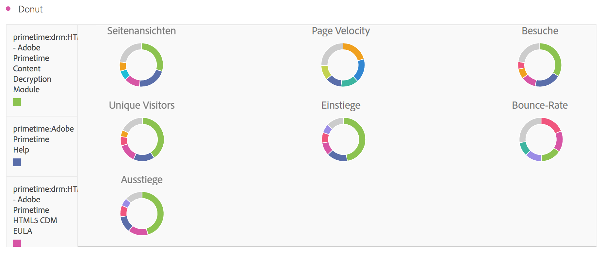

# Ringdiagramm

Ähnlich einem Tortendiagramm zeigt diese Visualisierung die Daten als Teile oder Segmente eines Ganzen. Ein Ringdiagramm kann für den Vergleich der prozentualen Anteile eines Ganzen verwendet werden, typischerweise bei einer geringen Anzahl an Werten.

