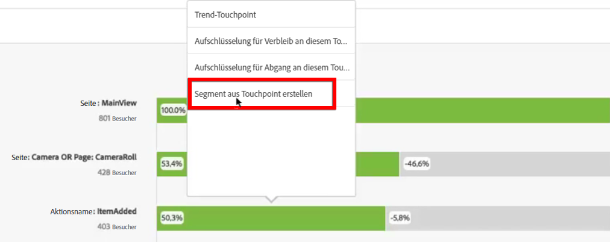
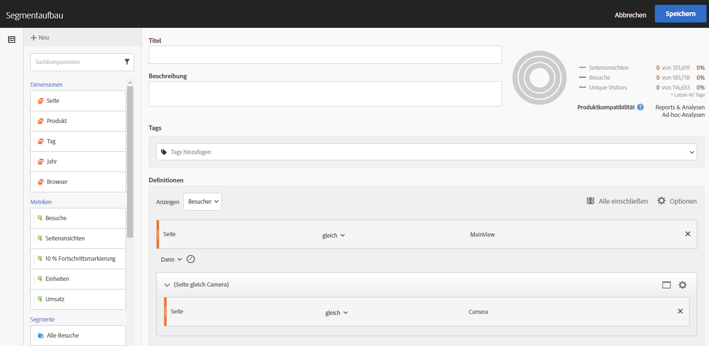
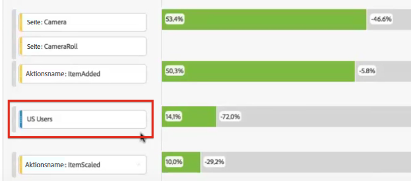
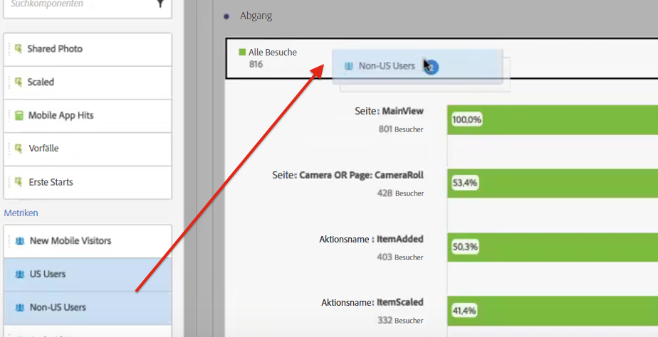
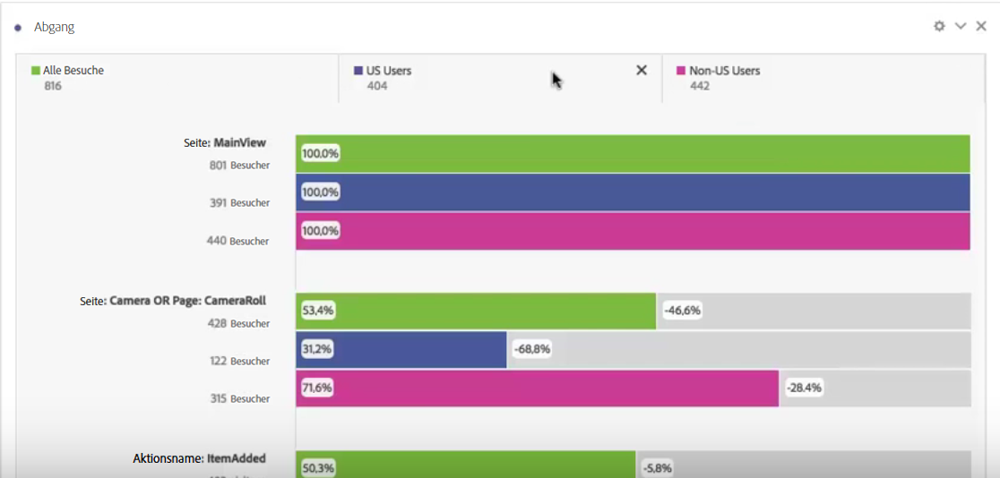

# Segmente in der Fallout-Analyse anwenden

Sie können in Analysis Workspace Segmente aus einem Touchpoint erstellen, Segmente als Touchpoints hinzufügen und wichtige Workflows über verschiedene Segmente hinweg vergleichen.

>[!IMPORTANT]
>
>Segmente, die als Checkpoints in Fallout verwendet werden, müssen einen Container verwenden, der auf einer niedrigeren Ebene liegt als der Gesamtkontext der Fallout-Visualisierung. Bei einem Besucherkontext-Fallout müssen Segmente, die als Checkpoints verwendet werden, besuchsbasierte oder Hit-basierte Segmente sein. Bei einem besuchskontextbezogenen Fallout müssen Segmente, die als Checkpoint verwendet werden, Hit-basierte Segmente sein. Wenn Sie eine ungültige Kombination verwenden, beträgt der Fallout 100 %. Wir haben eine Warnung zur Fallout-Visualisierung hinzugefügt, die angezeigt wird, wenn Sie ein inkompatibles Segment als Touchpoint hinzufügen. Bestimmte ungültige Segment-Container-Kombinationen führen zu ungültigen Fallout-Diagrammen, z. B.:

* Verwenden eines besucherbasierten Segments als Touchpoint innerhalb einer Fallout-Visualisierung des Besuchers
* Verwenden eines besucherbasierten Segments als Touchpoint innerhalb einer Fallout-Visualisierung eines Besuches
* Verwenden eines besuchbasierten Segments als Touchpoint innerhalb einer Fallout-Visualisierung eines Besuches

## Erstellen eines Segments aus einem Touchpoint {#section_915E8FBF35CD4F34828F860C1CCC2272}

1. Als Erstes erstellen Sie ein Segment aus einem bestimmten Touchpoint, an dem Sie interessiert sind und der sich möglicherweise lohnt, auch in andere Berichte übernommen zu werden. Klicken Sie dazu mit der rechten Maustaste auf den Touchpoint und wählen Sie dann **[!UICONTROL Segment aus Touchpoint erstellen aus]**.

   

   Der Segment Builder wird geöffnet und enthält das vorab erstellte sequenzielle Segment, das zu dem von Ihnen ausgewählten Touchpoint passt:

   

1. Geben Sie einen Titel und eine Beschreibung für das Segment ein, und speichern Sie es.

   Nun können Sie dieses Segment in jedem gewünschten Bericht verwenden.

## Hinzufügen eines Segments als Touchpoint {#section_17611C1A07444BE891DC21EE8FC03EFC}

Wenn Sie zum Beispiel wissen möchten, wie der Trend bei Ihren Benutzern aus den USA aussieht und wie sich dies in der Fallout-Analyse auswirkt, ziehen Sie einfach das Segment „USA-Benutzer“ in den Trichter:

Oder Sie erstellen einen AND-Touchpoint, indem Sie das Segment „USA-Benutzer“ auf einen anderen Checkpoint ziehen.

## Vergleichen von Segmenten im Fallout {#section_E0B761A69B1545908B52E05379277B56}

In der Fallout-Visualisierung können Sie eine unbegrenzte Anzahl von Segmenten miteinander vergleichen.

1. Wählen Sie die zu vergleichenden Segmente links in der Leiste [!UICONTROL Segmente] aus. Im vorliegenden Beispiel haben wir 2 Segmente ausgewählt: „USA-Benutzer“ und „Benutzer außerhalb der USA“.
1. Ziehen Sie sie nach oben in die Ablegezone „Segmente“.

   

1. Optional: Sie können „Alle Besuche“ als Standardcontainer belassen oder löschen.

   

1. Sie können nun den Fallout über zwei Segmente hinweg vergleichen (z. B. an welcher Stelle ein Segment eine bessere Leistung als das andere hat) oder sonstige Einblicke erhalten.
