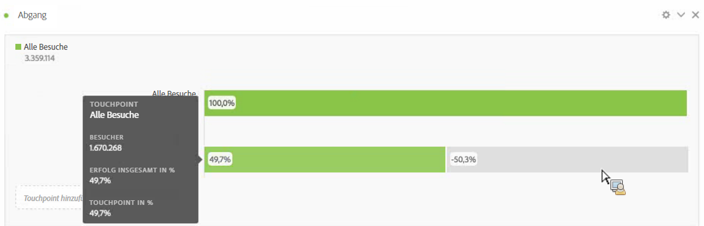
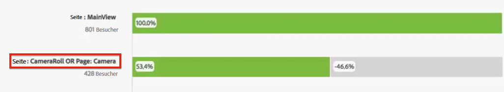
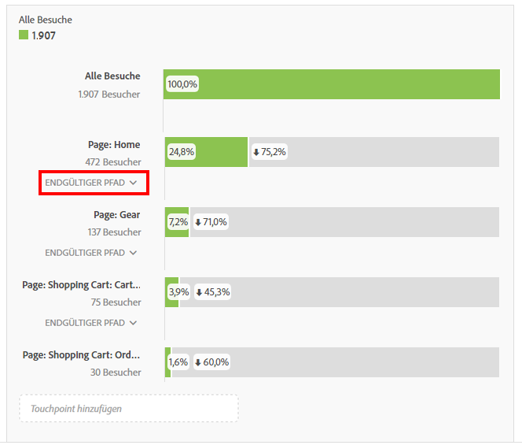

# Fallout-Visualisierung konfigurieren

Sie können die Touchpoints angeben, um eine mehrdimensionale Fallout-Sequenz zu erstellen. Ein Touchpoint ist im Allgemeinen eine Seite auf Ihrer Website. Touchpoints sind jedoch nicht auf Webseiten eingeschränkt. So können Sie zum Beispiel Ereignisse (z. B. Einheiten) sowie Unique Visitors und erneute Besuche hinzufügen. Auch Dimensionen können Sie hinzufügen (wie Kategorie, Browsertyp oder interner Suchbegriff).

Sogar Segmente können Sie innerhalb eines Touchpoints hinzufügen. Vielleicht möchten Sie zum Beispiel Segmente vergleichen (wie iOS- und Android-Benutzer). Wenn Sie die gewünschten Segmente an die Oberseite des Trichters ziehen, werden Informationen über diese Segmente zum Fallout-Bericht hinzugefügt. Wenn Sie möchten, dass nur diese Segmente angezeigt werden, können Sie die Grundlinie „Alle Besuche“ entfernen.

Bezüglich der Anzahl der Schritte, die hinzugefügt, oder der Dimensionen, die verwendet werden können, gibt es keine Einschränkungen.

Sie können Pathing an eVars vornehmen, inklusive Merchandising-eVars und [listVars](https://marketing.adobe.com/resources/help/en_US/sc/implement/listN.html) (Variablen, die mehrere Werte pro Treffer haben können, wie Produkte, listVars, Merchandising-eVars und Listen-Props). Beispiel: Angenommen, jemand sucht auf der einen Seite nach „Schuhe,Shirt“ und auf der nächsten Seite nach „Schuhe,Socken“. Der nächste Produktflussbericht von Schuhe wird „Shirt und Socken“ lauten, NICHT „Shirt“.

1. Ziehen Sie eine [!UICONTROL Fallout]-Visualisierung aus dem Dropdownfeld „Visualisierung“ in eine [!UICONTROL Freiform-Tabelle].

1. Ziehen Sie die Dimension „Seite“ in die Freiform-Tabelle, und ziehen Sie von dort eine Seite (in diesem Fall „Startseite – JJEsquire“) als ersten Touchpoint in das Feld **[!UICONTROL TouchPoint hinzufügen].**

   

   Wenn Sie den Mauszeiger über einen Touchpoint halten, werden der Fallout und andere Informationen zu dieser Ebene (wie der Name des Touchpoints, die Anzahl der Besucher an diesem Punkt) sowie die Erfolgsrate für diesen Touchpoint angezeigt (und Sie können die Erfolgsrate mit anderen Touchpoints vergleichen).

   Die umkreisten Zahlen im grauen Abschnitt der Leiste zeigen den Fallout zwischen Touchpoints an (nicht den gesamten Fallout bis zu diesem Punkt). Der Touchpoint-Prozentsatz zeigt den erfolgreichen Fall-through vom vorherigen Schritt zum aktuellen Schritt im Fallout-Bericht an.

   Sie können auch eine einzelne Seite anstatt der gesamten Dimension zum Fallout-Bericht hinzufügen. Klicken Sie auf den rechten Pfeil „&gt;“ auf der Seitendimension, um die Seite auszuwählen, die Sie zum Fallout-Bericht hinzufügen möchten.

1. Fügen Sie weitere Touchpoints hinzu, bis Ihre Sequenz vollständig ist.

   Sie können **mehrere Touchpoints kombinieren**, indem Sie mindestens einen weiteren Touchpoint auf einen Touchpoint ziehen.

   >[!NOTE]
   >
   >Mehrere Segmente werden mit UND verbunden, aber mehrere Elemente wie Dimensionselemente und Metriken werden mit ODER verbunden.

   

1. Einzelne Touchpoints können nun auch **auf den nächsten Treffer** (statt am Ende) im Pfad eingegrenzt werden. Jedem Touchpoint unterliegen die Auswahlmöglichkeiten „Pfad am Ende“ und „Nächster Treffer“:

   

<table id="table_A91D99D9364B41929CC5A5BC907E8985"> 
 <tbody> 
  <tr> 
   <td colname="col1"> 
Pfad am Ende 
 
(Standardeinstellung) 
 </td> 
   <td colname="col2"> 
Die Besucher, die „am Ende“ auf der nächsten Seite im Pfad, aber nicht notwendigerweise beim nächsten Treffer landen, werden gezählt. 
 </td> 
  </tr> 
  <tr> 
   <td colname="col1"> 
Nächster Treffer 
 </td> 
   <td colname="col2"> 
Die Besucher, die auf der nächsten Seite im Pfad, genau beim nächsten Treffer landen, werden gezählt. 
 </td> 
  </tr> 
 </tbody> 
</table>

## Fallout settings {#section_0C7C89D72F0B4D6EB467F278AC979093}

| Einstellung | Beschreibung |
|--- |--- |
| Fallout-Container <ul><li>Besuch</li><li>Besucher</li></ul> | Hiermit können Sie bei der Analyse der Besucherpfade zwischen Besuch und Besucher wechseln. Die Standardeinstellung lautet „Besucher“.  Mithilfe dieser Einstellungen können Sie Einblicke in Besucheraktivitäten auf der Besucherebene (besuchsübergreifend) erhalten oder die Analyse auf einen einzelnen Besuch einschränken. |
| " Alle Besucher" als ersten Touchpoint anzeigen | Diese Option können Sie deaktivieren, wenn Sie nicht möchten, dass „Alle Besucher“ der erste Touchpoint ist. |

When you **right-click a touchpoint**, the following options appear:

| Option | Beschreibung |
|--- |--- |
| Trend-Touchpoint | Zeigt Trenddaten für einen Touchpoint in einem Liniendiagramm mit einigen vorab definierten Anomalieerkennungsdaten an. |
| Trend-Touchpoint (%) | Trends für den gesamten Fallout-Prozentsatz |
| Trenderstellung aller Touchpoints (%) | Trends für alle Touchpoint-Prozentsätze im Fallout (außer „Alle Besuche“, falls vorhanden) im selben Diagramm. |
| Aufschlüsselung für Verbleib an diesem Touchpoint | Zeigt die Aktivitäten von Besuchern zwischen zwei Touchpoints, wenn diese zum nächsten Touchpoint übergegangen sind. Diese Option erstellt eine Freiform-Tabelle, die Ihre Dimensionen enthält. Dimensionen und andere Elemente der Tabelle können Sie austauschen. |
| Aufschlüsselung für Abgang an diesem Touchpoint | Zeigt an, was Besucher, die nicht im Trichter verblieben sind, unmittelbar nach dem ausgewählten Schritt getan haben. |
| Segment aus Touchpoint erstellen | Erstellen Sie ein Segment aus dem ausgewählten Touchpoint. |