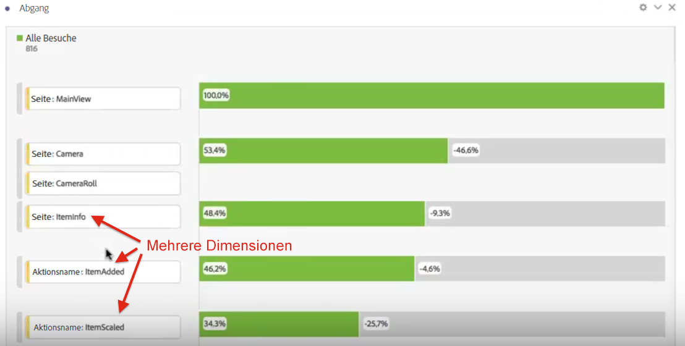
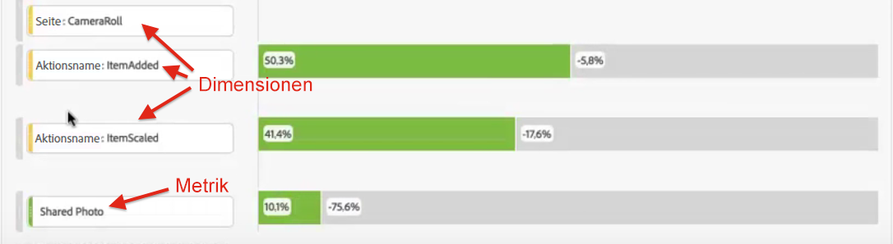
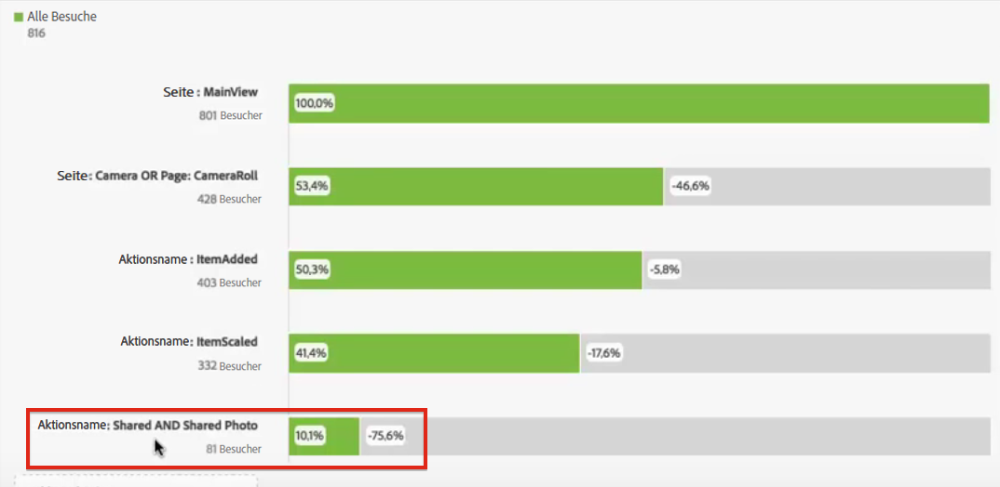

# Interdimensionaler Fallout

Mithilfe der Fallout-Funktion in Analysis Workspace können Sie Dimensionen und Metriken als Touchpoints in Trichtern und Workflows kombinieren. Das gibt Ihnen mehr Flexibilität beim Definieren der Benutzerschritte, die Sie näher untersuchen möchten.

**Beispiel**: So können Sie einer Fallout-Visualisierung zusätzlich zu einer Dimension vom Typ „Seite“ auch aktionsbasierte Dimensionselemente hinzufügen. Dadurch können Sie visuell darstellen, welche Zusammenhänge es zwischen Seiten und bestimmten Aktionen auf dem Weg gibt, den Besucher einschlagen.

Der Fallout wird dynamisch aktualisiert und zeigt Ihnen den Fallout über mehrere Dimensionen hinweg an.

Dieser Kombination können auch Metriken hinzugefügt werden. In diesem Beispiel haben wir die Metrik „Geteiltes Foto“ hinzugefügt, um den Pfad zu konkretisieren, den Besucher eingeschlagen haben:

Außerdem können Sie auch unterschiedliche Dimensionen und Metriken in AND-Checkpoints kombinieren. Ziehen Sie dazu einfach eine weitere Dimension oder Metrik auf eine bereits vorhandene:

