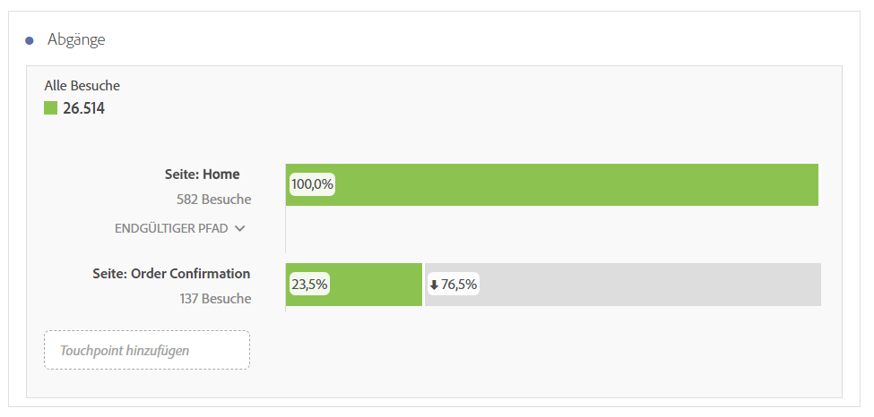
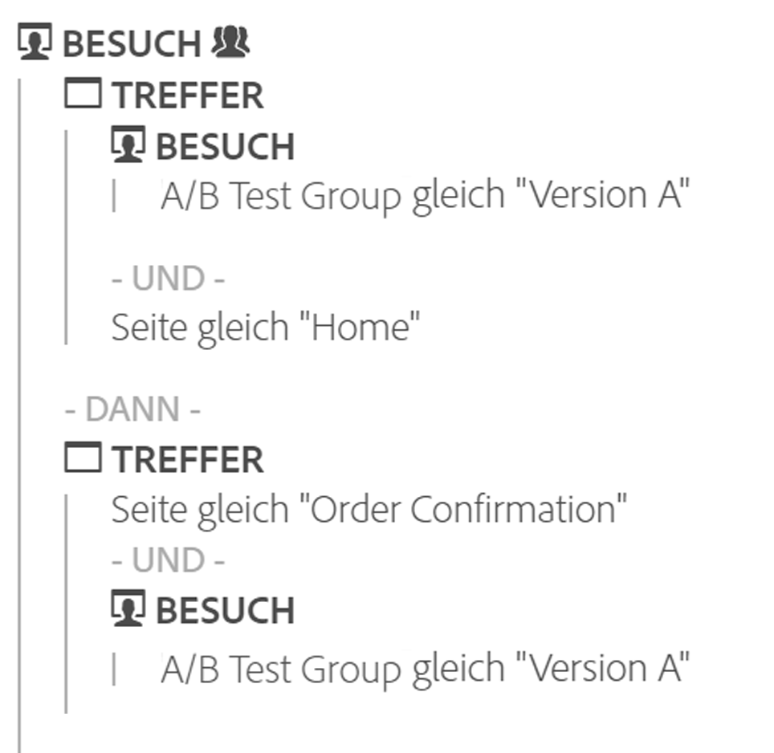

# Fallout-Übersicht

Fallout-Visualisierungen bieten mehr Optionen zum Erstellen Ihrer Fallout-Berichte. Fallout-Berichte zeigen, wo Besucher eine Site verlassen haben (wo sie „ausgefallen“ sind) und wo sie eine vorab definierte Folge von Seiten passiert haben (d. h., wo sie verblieben sind).

Mit Fallout-Visualisierungen können Sie:

* eine Gegenüberstellung zweier verschiedener Segmente im gleichen Bericht vornehmen
* Trichterschritte (Touchpoints) ziehen, ablegen und neu anordnen.
* Werte aus unterschiedlichen Dimensionen und Metriken mischen und kombinieren
* Einen multidimensionalen Fallout-Bericht erstellen
* Feststellen, wohin Kunden unmittelbar nach dem Ausstieg navigieren

Die Fallout-Funktion zeigt Konversions- und Fallout-Raten zwischen den einzelnen Schritten oder Touchpoints in einer Sequenz an.

So können Sie beispielsweise die Fallout-Punkte eines Besuchers während eines Kaufprozesses nachverfolgen. Wählen Sie einfach einen Start-Touchpoint und einen End-Touchpoint aus und fügen Sie Zwischen-Touchpoints hinzu, um einen Website-Navigationspfad zu erstellen. Sie können aber auch multidimensionale Fallouts vornehmen.

Eine Fallout-Visualisierung ist zur Analyse der folgenden Punkte nützlich:

* Konversionssätze durch bestimmte Abläufe auf Ihrer Site (wie z. B. ein Kauf- oder Registrierungsablauf).
* Allgemeiner, breiter gefasster Trafficfluss: Dieser Fluss zeigt, wie viele Personen, die sich die Homepage ansahen, anschließend eine Suche durchführten und dann ein bestimmtes Element anzeigten.
* Korrelationen zwischen Ereignissen auf Ihrer Site. Korrelationen zeigen, welcher Prozentsatz von Personen, die die Datenschutzrichtlinien durchlasen, ein Produkt kauften.

[Videoschulung](https://experienceleague.adobe.com/docs/analytics-learn/tutorials/analysis-workspace/analyzing-customer-journeys/fallout-visualization.html?lang=de-DE)  zur Fallout-Visualisierung (4:15)

## Segmentierung als Grundlage für Fluss und Fallout {#section_654F37A398C24DDDB1552A543EE29AA9}

Segmente, die auf Workspace-Bereiche angewendet werden, funktionieren etwas anders als Segmente, die in Reports &amp; Analysen auf Trichteranalysen- und Flussberichte angewendet werden. In den meisten Fällen liefern beide genau dieselben Ergebnisse. Der Hauptunterschied besteht darin, dass Reports &amp; Analysen das Segment bei jedem Schritt der Sequenz anwendet. Dies kann zu leichten Abweichungen bei den Ergebnissen führen.

Hier ist ein Beispiel eines Fallouts mit zwei Schritten:

Wenn Sie dann ein Segment auf Workspace-Bedienfeld-Ebene anwenden, kombiniert das Segment den Fallout folgendermaßen:

Bei der Berechnung des Segments durch Reports &amp; Analysen wird das Segment dagegen folgendermaßen kombiniert:

Reports &amp; Analysen kombiniert das Segment mit jedem Schritt. Wenn sich die Container auf derselben Ebene wie der Fallout befinden (z. B. Besuch- oder Besucherebene), führt dies zu einem Angleich an die Anzahl an Besuchen oder Besuchern.

Wenn sich das auf das Feld angewandte Segment jedoch unterhalb der Fallout-Ebene (d. h. Hit-Ebene) befindet, werden für das Segment je nach Kombination durch den Bericht unterschiedliche Ergebnisse angezeigt. Um dies zu wiederholen, stimmen die Zahlen in Analysis Workspace in den meisten Fällen mit denen in Reports &amp; Analysen überein. Nur wenn alle folgenden Punkte zutreffen, stimmen sie **nicht** überein:

* Das Segment befindet sich nicht auf derselben Ebene wie der Fallout.
* Das Segment weist eine Variable auf, bei der der Besucher/Besuch während eines Besuchs/Besuchers mehrere Werte besitzen kann.

Im seltenen Fall, dass Sie in Analysis Workspace Segmente auf dieselbe Weise wie in Reports &amp; Analytics auf Fallout/Fluss anwenden müssen, legen Sie das Segment einfach in jedem Fallout-Schritt in Workspace ab und erhalten dieselben Zahlen.
