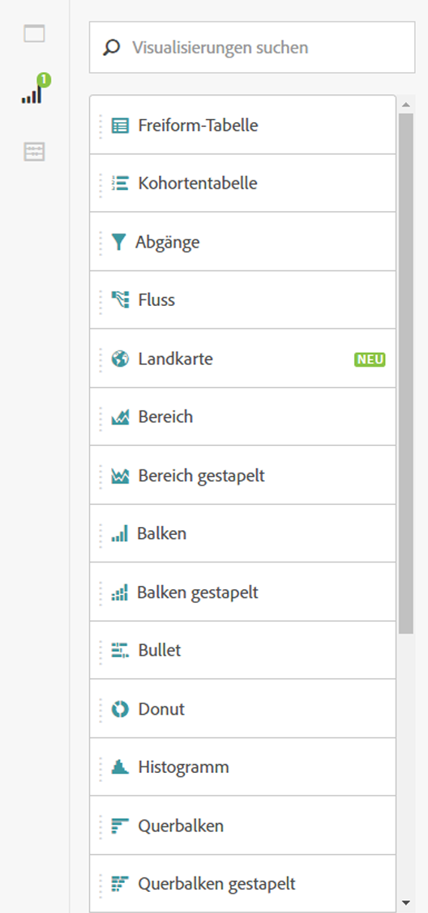
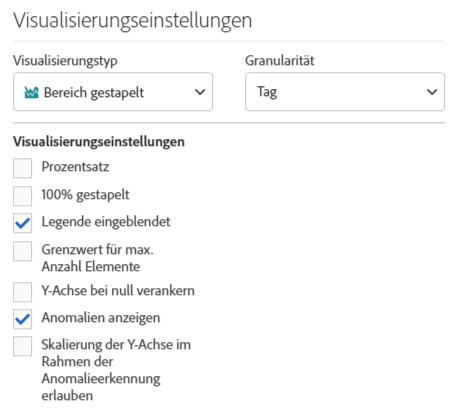
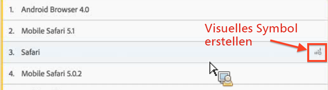
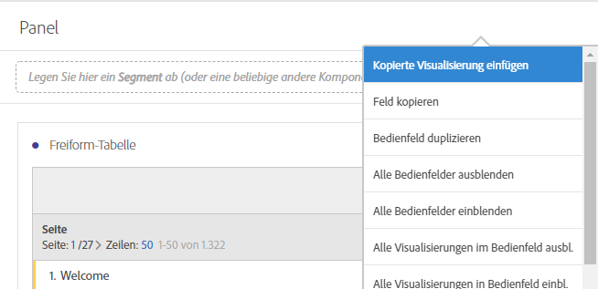

# Visualisierungsübersicht

Workspace bietet eine Reihe von Visualisierungen, mit denen Sie visuelle Darstellungen Ihrer Daten generieren können, wie beispielsweise Balkendiagramme, Donutdiagramme, Histogramme, Liniendiagramme, Karten und Streudiagramme. Jede Visualisierung verfügt über eigene Einstellungen, die Sie verwalten können. Klicken Sie auf den Namen der Visualisierung, um weitere Informationen anzuzeigen.

Video tutorial: [Visualization Types in Analysis Workspace](https://docs.adobe.com/content/help/en/analytics-learn/tutorials/analysis-workspace/visualizations/visualization-types.html) (2:57)

| Name der Visualisierung | Beschreibung |
|---|---|
| [Bereich](/help/analyze/analysis-workspace/visualizations/area.md) | entspricht einem Kantengraphen, bei dem der Bereich unter der Linie farbig dargestellt ist. Verwenden Sie ein Flächendiagramm, wenn Sie mehrere Metriken darstellen und den Bereich visualisieren möchten, der durch die Schnittmenge von zwei oder mehr Metriken gebildet wird. |
| [Balken](/help/analyze/analysis-workspace/visualizations/bar.md) | zeigt vertikale Balken, die verschiedene Werte aus einer oder mehreren Metriken darstellen. |
| [Lineardiagramm](/help/analyze/analysis-workspace/visualizations/bullet-graph.md) | zeigt, wie ein Wert, der Sie interessiert, im Vergleich zu anderen Leistungsbereichen (Zielen) liegt oder ausfällt. |
| [Kohortentabelle](/help/analyze/analysis-workspace/visualizations/cohort-table/cohort-analysis.md) | Eine *`cohort`* ist eine Personengruppe mit gemeinsamen Merkmalen innerhalb eines vorgegebenen Zeitraums. Die Kohortenanalyse ist z. B. dann nützlich, wenn Sie wissen möchten, wie eine Kohorte mit einer Marke interagiert. Sie können problemlos Trend-Änderungen offenlegen und entsprechend reagieren. |
| [Ringdiagramm](/help/analyze/analysis-workspace/visualizations/donut.md) | Ähnlich einem Tortendiagramm zeigt diese Visualisierung die Daten als Teile oder Segmente eines Ganzen. |
| [Trichteranalyse](/help/analyze/analysis-workspace/visualizations/fallout/fallout-flow.md) | Fallout-Berichte zeigen, wo Besucher eine Site verlassen haben (wo sie „ausgefallen“ sind) und wo sie eine vorab definierte Folge von Seiten passiert haben (d. h., wo sie verblieben sind). |
| [Fluss](/help/analyze/analysis-workspace/visualizations/c-flow/flow.md) | Zeigt Kundenpfade durch Ihre Websites und Apps. |
| [Freiformtabelle](/help/analyze/analysis-workspace/visualizations/freeform-table/freeform-table.md) | Eine Freiformtabelle ist nicht nur eine Datentabelle, sondern auch eine interaktive Visualisierung. |
| [Histogramm](/help/analyze/analysis-workspace/visualizations/histogram.md) | Ein Histogramm ähnelt einem Balkendiagramm, fasst jedoch Zahlen zu Bereichen (Behältern) zusammen. |
| [Horizontalbalken](/help/analyze/analysis-workspace/visualizations/horizontal-bar.md) | zeigt horizontale Balken, die verschiedene Werte aus einer oder mehreren Metriken darstellen. |
| [Linie](/help/analyze/analysis-workspace/visualizations/line.md) | stellt Metriken anhand einer Linie dar, die den Wertverlauf über einen bestimmten Zeitraum hinweg zeigt. Ein Liniendiagramm kann nur verwendet werden, wenn die Zeit als Dimension verwendet wird. |
| [Zuordnung](/help/analyze/analysis-workspace/visualizations/map-visualization.md) | Ermöglicht die Erstellung einer visuellen Zuordnung einer beliebigen Metrik (einschließlich berechneter Metriken). |
| [Streudiagramm](/help/analyze/analysis-workspace/visualizations/scatterplot.md) | zeigt die Beziehung zwischen Dimensionselementen und bis zu drei Metriken. |
| [Zusammenfassungszahl](/help/analyze/analysis-workspace/visualizations/summary-number-change.md) | Je nachdem, welche Zelle ausgewählt ist, zeigt diese Visualisierung die Summen und Zusammenfassungen an. |
| [Zusammenfassungsänderung](/help/analyze/analysis-workspace/visualizations/summary-number-change.md) | Je nachdem, welche Zellen ausgewählt sind, werden bei dieser Visualisierung Zellen miteinander verglichen. |
| [Text](/help/analyze/analysis-workspace/visualizations/text.md) | Sie können benutzerdefinierten Text zu Ihrem Workspace hinzufügen. |
| [Treemap](/help/analyze/analysis-workspace/visualizations/treemap.md) | Zeigt hierarchische Daten (Baumstruktur) als Gruppe verschachtelter Rechtecke an. |
| [Venn](/help/analyze/analysis-workspace/visualizations/venn.md) | hier können Sie bis zu 3 Segmente (aus Komponenten) und eine Metrik einfügen, um ein Venn-Diagramm zu erstellen. |

## Visualisierungsbereich {#section_DC07F032FBEF4046A40F7B95C28DA018}

Klicken Sie im seitlichen Bedienfeld auf **[!UICONTROL Visualisierungen]**, um den Visualisierungsbereich zu öffnen.

Wenn Sie Adobe Analytics verwenden, werden Sie mit den meisten Visualisierungsarten (z. B. Flächen-, Balken-, Donut- und Liniendiagramme) bereits vertraut sein. Analysis Workspace verfügt jedoch über Visualisierungseinstellungen sowie viele neue und einzigartige Visualisierungsarten mit interaktiven Funktionen.

## Visualisierungseinstellungen {#section_D3BB5042A92245D8BF6BCF072C66624B}

Um auf die [!UICONTROL Visualisierungseinstellungen] zuzugreifen, ziehen Sie eine Visualisierung in das [!UICONTROL Freiformfeld] und klicken Sie dann auf das Zahnrad-Symbol [!UICONTROL Visualisierungseinstellungen].

>[!IMPORTANT]
>
>Welche Visualisierungseinstellungen sichtbar sind, ist von der jeweiligen Visualisierung abhängig. Nicht alle Einstellungen gelten für alle Visualisierungen. Zudem treten einige erweiterte Einstellungen **nur** bei bestimmten Visualisierungen in Erscheinung. Dies ist z. B. bei den [Histogrammeinstellungen](/help/analyze/analysis-workspace/visualizations/histogram.md#section_09D774C584864D4CA6B5672DC2927477) der Fall.

| Einstellung | Beschreibung |
|--- |--- |
| Prozentsatz | Zeigt Werte als Prozentzahlen an. |
| 100 % gestapelt | Mit dieser Einstellung für die Visualisierungen „Bereich gestapelt“, „Balken gestapelt“ und „Horizontalbalken gestapelt“ wandeln Sie Diagramme in zu „100 % gestapelte“ Visualisierungen um. Beispiel:   |
| Legende sichtbar | Hiermit können Sie den Text zu Filterdetails für die Visualisierung „Zusammenfassungsnummer/Zusammenfassungsänderung“ ausblenden. |
| Grenzwert für max. Anzahl Elemente | Hiermit können Sie die Anzahl der Elemente begrenzen, die in einer Visualisierung angezeigt werden. |
| Y-Achse bei null verankern | Wenn alle im Diagramm dargestellten Werte deutlich größer als null sind, wird der untere Teil der Y-Achse standardmäßig zu NICHT-NULL gemacht. Wenn Sie dieses Kontrollkästchen aktivieren, wird die Y-Achse zwangsweise auf null gesetzt (und das Diagramm neu gezeichnet). |
| Normalisierung | Erzwingt Metriken für gleiche Anteile. |
| Zwei Achsen anzeigen | Gilt nur, wenn Sie zwei Metriken haben – möglich sind eine Y-Achse links (für die eine Metrik) und eine rechts (für die andere). |
| Anomalien anzeigen | Reichert Kantengraphen und Freiformtabellen so an, dass sie auch Datenanomalien anzeigen. |

## Symbol „Visualisierung erstellen“ {#section_9C11D9DEDC42413AA53E69A71A509DFC}

Wenn Sie nicht sicher sind, welche Visualisierung Sie auswählen sollen, klicken Sie in einer beliebigen Tabellenzeile auf das Symbol **[!UICONTROL Visualisierung erstellen]**. Dieses Symbol wird angezeigt, wenn Sie den Mauszeiger auf die Tabellenzeile bewegen. Wenn Sie darauf klicken, sucht Analysis Workspace nach der Visualisierung, die aufgrund der vorhandenen Fakten am besten zu Ihren Daten passt. Wenn Sie z. B. bis zu 3 Segmente ausgewählt haben, wird ein Venn-Diagramm erstellt. Bei mehr als 3 Segmenten wird ein Balkendiagramm erstellt. Für andere Datentypen wird eventuell ein Kantengraph erstellt usw.

## Rechtsklick auf das Visualierungs-/Feldmenü {#section_05B7914D4C9E443F97E2BFFDEC70240C}

Auf Einstellungen, die sich auf eine Grafik beziehen, können Sie per Rechtsklick neben der Überschrift einer Visualisierung oder eines Felds zugreifen. Einige oder alle der folgenden Einstellungen sind dann verfügbar:

| Einstellung | Beschreibung |
|--- |--- |
| Kopierte Visualisierung/Kopiertes Feld einfügen | Sie können das kopierte Element an einer anderen Stelle innerhalb des Projekts oder in ein ganz anderes Projekt einfügen. |
| Visualisierung/Fenster kopieren | Sie können per Rechtsklick eine Visualisierung oder ein Fenster kopieren. |
| Visualisierung/Fenster duplizieren | Fertigt ein exaktes Duplikat der aktuellen Visualisierung an, das Sie dann bearbeiten können. |
| Alle Leisten ausblenden | Alle Projektleisten werden ausgeblendet. |
| Alle Darstellungen in Leiste ausblenden | Alle Visualisierungen in dieser Projektleiste werden ausgeblendet. |
| Alle Leisten einblenden | Alle Projektleisten werden eingeblendet. |
| Alle Visualisierungen in Leiste einblenden | Alle Visualisierungen in dieser Projektleiste werden eingeblendet. |
| Beschreibung bearbeiten | Hiermit können Sie einen Text zur Beschreibung der Visualisierung oder des Bedienfeldes hinzufügen (oder bearbeiten). Diese Beschreibung wird in „Projekt“ > „Projektinfo und Einstellungen“ angezeigt. |
| Bereichslink abrufen | Sie können Personen zu einem bestimmten Bereich innerhalb eines Projekts leiten. |
| Visualisierungslink anfordern | Hiermit können Sie diesen Link kopieren und freigeben, um andere Personen direkt zu dieser Visualisierung zu leiten. Benutzer müssen sich hierzu anmelden. |
| Neu starten | (Funktioniert bei Fluss, Venn, Histogramm) Löscht die Konfiguration für die aktuelle Visualisierung und öffnet ein neues Bedienfeld, in dem Sie diese neu konfigurieren können. |

## Bearbeiten von Legendenbeschriftungen {#section_94F1988CB4B9434BA1D9C6034062C3DE}

Sie können Seriennamen in Visualisierungslegenden (Fallout, Bereich, Bereich gestapelt, Balken, Balken gestapelt, Ringdiagramm, Histogramm, Horizontalbalken, Horizontalbalken gestapelt, Linie, Streuung, Venn) umbenennen, um die Visualisierungen zugänglicher zu gestalten.

Die Legendenbearbeitung ist für die folgenden Elemente **nicht** möglich: Treemap, Linear, Zusammenfassungsänderung oder -nummer, Text, Freiform, Histogramm, Kohorte oder Fluss-Visualisierungen.

Wenn Sie beispielsweise eine Legendenbeschriftung für ein Liniendiagramm bearbeiten möchten,

1. klicken Sie mit der rechten Maustaste auf die Legendenbeschriftungen.
1. Klicken Sie auf **[!UICONTROL Bezeichnung bearbeiten]**.

   

1. Geben Sie den neuen Beschriftungstext ein.
1. Drücken Sie zum Speichern die **[!UICONTROL Eingabetaste]**.

Hier finden Sie einen [Link zu einem Video](https://docs.adobe.com/content/help/en/analytics-learn/tutorials/analysis-workspace/visualizations/series-label-editing.html) zu diesem Thema.
