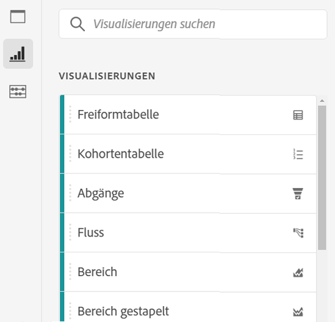
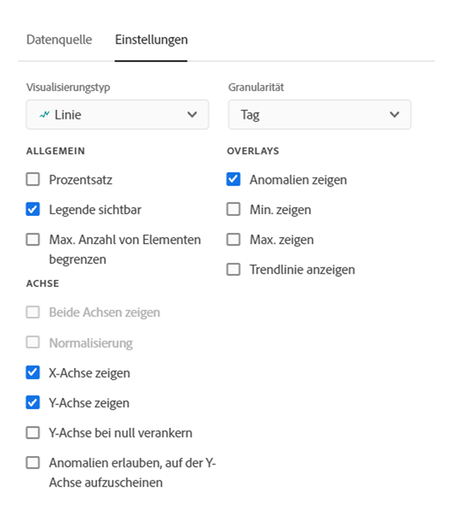
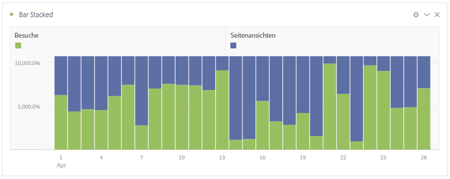
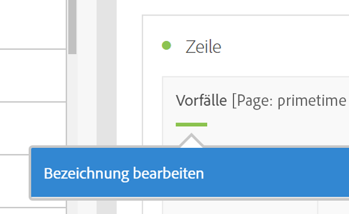
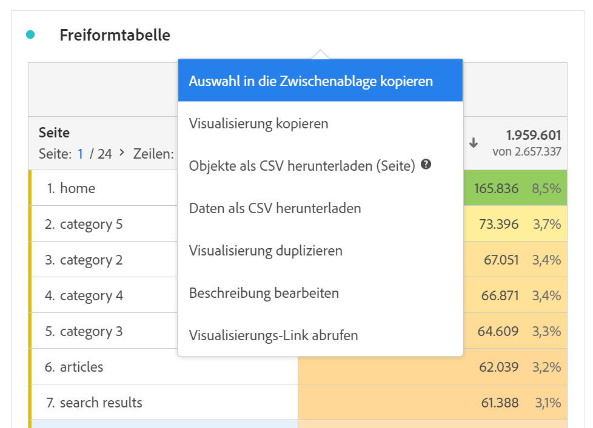
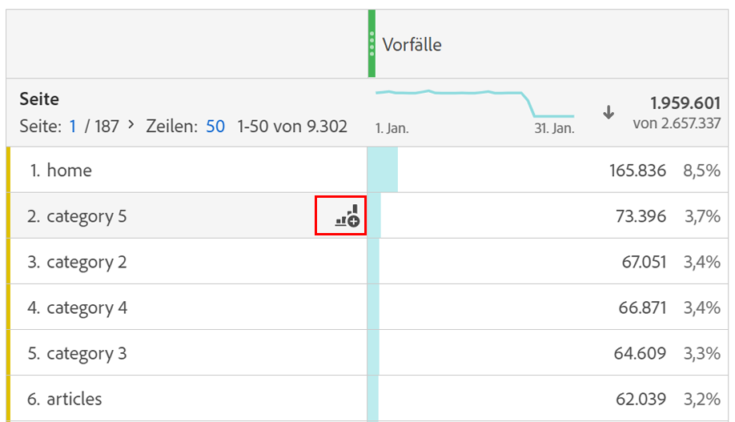

# Visualisierungsübersicht

Workspace bietet eine Reihe von Visualisierungen, mit denen Sie visuelle Darstellungen Ihrer Daten generieren können, wie beispielsweise Balkendiagramme, Donutdiagramme, Histogramme, Liniendiagramme, Karten und Streudiagramme. Die meisten Visualisierungstypen sind Ihnen bekannt, wenn Sie Adobe Analytics verwenden. Analysis Workspace verfügt jedoch über Visualisierungseinstellungen sowie viele neue und einzigartige Visualisierungsarten mit interaktiven Funktionen.

Sie können auf Visualisierungen von oben links in Workspace, von einem [leeren Bereich](https://experienceleague.adobe.com/docs/analytics/analyze/analysis-workspace/panels/blank-panel.html?lang=de) oder über das Kontextmenü im Workflow zugreifen.

Die folgenden Visualisierungstypen sind in Analysis Workspace verfügbar:

| Name der Visualisierung | Beschreibung |
| --- | --- |
| [Bereich](/help/analyze/analysis-workspace/visualizations/area.md) | Wie ein Liniendiagramm, aber mit einem farbigen Bereich unterhalb der Linie. Verwenden Sie ein Flächendiagramm, wenn Sie mehrere Metriken darstellen und den Bereich visualisieren möchten, der durch die Schnittmenge von zwei oder mehr Metriken gebildet wird. |
| [Balken](/help/analyze/analysis-workspace/visualizations/bar.md) | zeigt vertikale Balken, die verschiedene Werte aus einer oder mehreren Metriken darstellen. |
| [Lineardiagramm](/help/analyze/analysis-workspace/visualizations/bullet-graph.md) | zeigt, wie ein Wert, der Sie interessiert, im Vergleich zu anderen Leistungsbereichen (Zielen) liegt oder ausfällt. |
| [Kohortentabelle](/help/analyze/analysis-workspace/visualizations/cohort-table/cohort-analysis.md) | Eine *`cohort`* ist eine Personengruppe mit gemeinsamen Merkmalen innerhalb eines vorgegebenen Zeitraums. Die Kohorte-Analyse eignet sich für die Analyse von Retentionen, Kürzen oder Latenzzeiten. |
| [Ringdiagramm](/help/analyze/analysis-workspace/visualizations/donut.md) | Ähnlich einem Tortendiagramm zeigt diese Visualisierung die Daten als Teile oder Segmente eines Ganzen. |
| [Trichteranalyse](/help/analyze/analysis-workspace/visualizations/fallout/fallout-flow.md) | Fallout-Berichte zeigen, wo Besucher eine Site verlassen haben (wo sie „ausgefallen“ sind) und wo sie eine vorab definierte Folge von Seiten passiert haben (d. h., wo sie verblieben sind). Kann auf mögliche oder exakte Sequenzen eingestellt werden |
| [Fluss](/help/analyze/analysis-workspace/visualizations/c-flow/flow.md) | Zeigt genaue Kundenpfade durch Ihre Websites und Apps an. |
| [Freiformtabelle](/help/analyze/analysis-workspace/visualizations/freeform-table/freeform-table.md) | Eine Freiformtabelle ist nicht nur eine Datentabelle, sondern auch eine interaktive Visualisierung. Es bildet die Grundlage für die Analyse von Daten in Workspace. |
| [Histogramm](/help/analyze/analysis-workspace/visualizations/histogram.md) | Ein Histogramm fasst Besucher, Besuche oder Treffer basierend auf einem Metrikvolumen in Behälter zusammen. |
| [Horizontalbalken](/help/analyze/analysis-workspace/visualizations/horizontal-bar.md) | zeigt horizontale Balken, die verschiedene Werte aus einer oder mehreren Metriken darstellen. |
| [Linie](/help/analyze/analysis-workspace/visualizations/line.md) | stellt Metriken anhand einer Linie dar, die den Wertverlauf über einen bestimmten Zeitraum hinweg zeigt. Ein Liniendiagramm verwendet die Zeit entlang der X-Achse. |
| [Zuordnung](/help/analyze/analysis-workspace/visualizations/map-visualization.md) | Ermöglicht die Erstellung einer visuellen Zuordnung einer beliebigen Metrik (einschließlich berechneter Metriken). |
| [Streudiagramm](/help/analyze/analysis-workspace/visualizations/scatterplot.md) | zeigt die Beziehung zwischen Dimensionselementen und bis zu drei Metriken. |
| [Zusammenfassungszahl](/help/analyze/analysis-workspace/visualizations/summary-number-change.md) | Zeigt die ausgewählte Zelle als 1 große Zahl an. |
| [Zusammenfassungsänderung](/help/analyze/analysis-workspace/visualizations/summary-number-change.md) | Zeigt die Änderung zwischen den ausgewählten Zellen als 1 große Zahl/Prozent an. |
| [Text](/help/analyze/analysis-workspace/visualizations/text.md) | Sie können benutzerdefinierten Text zu Ihrem Workspace hinzufügen. Hilfreich zum Hinzufügen zusätzlicher Kontexte zu Ihrer Analyse und zu Einblicken, zusätzlich zu den Bedienfeld-/Visualisierungsbeschreibungen |
| [Treemap](/help/analyze/analysis-workspace/visualizations/treemap.md) | Zeigt hierarchische Daten (Baumstruktur) als Gruppe verschachtelter Rechtecke an. |
| [Venn](/help/analyze/analysis-workspace/visualizations/venn.md) | Verwendet Kreise zur Darstellung der Metriküberschneidung von bis zu 3 Segmenten. |

## Einstellungen {#settings}

Jede Visualisierung verfügt über eigene Einstellungen, die Sie verwalten können. Um auf [!UICONTROL Visualisierungseinstellungen] zuzugreifen, klicken Sie auf das Zahnradsymbol [!UICONTROL Visualisierungseinstellungen].

| Einstellung | Beschreibung |
| --- | --- |
| Visualisierungstyp | Ändern Sie den visuellen Typ, der zur Darstellung der Daten verwendet wird. |
| Granularität | Für Trendvisualisierungen können Sie die Zeitgranularität (Tag, Woche, Monat usw.) ändern. aus dieser Dropdownliste. Diese Änderung gilt auch für die Datenquelle-Tabelle. |
| Prozentsatz | Zeigt Werte als Prozentzahlen an. |
| 100 % gestapelt | Diese Einstellung für gestapelte Flächen, gestapelte Balken oder gestapelte horizontale Balken-Visualisierungen verwandelt das Diagramm in eine &quot;100% gestapelte&quot;Visualisierung. Beispiel:  |
| Legende sichtbar | Ermöglicht das Ausblenden des detaillierten Legende-Textes für die Visualisierung der Zusammenfassungsnummer/Zusammenfassungsänderung. |
| Grenzwert für max. Anzahl Elemente | Hiermit können Sie die Anzahl der Elemente begrenzen, die in einer Visualisierung angezeigt werden. |
| Y-Achse bei null verankern | Wenn alle im Diagramm dargestellten Werte deutlich größer als null sind, wird der untere Teil der Y-Achse standardmäßig zu NICHT-NULL gemacht. Wenn Sie dieses Kontrollkästchen aktivieren, wird die Y-Achse zwangsweise auf null gesetzt (und das Diagramm neu gezeichnet). |
| Normalisierung | Erzwingt Metriken für gleiche Anteile. Dies ist hilfreich, wenn gezeichnete Metriken sehr unterschiedliche Größenordnungen aufweisen. |
| Zwei Achsen anzeigen | Gilt nur, wenn Sie zwei Metriken haben – möglich sind eine Y-Achse links (für die eine Metrik) und eine rechts (für die andere). Dies ist hilfreich, wenn gezeichnete Metriken sehr unterschiedliche Größenordnungen aufweisen. |
| Anomalien anzeigen | Verbessert Liniendiagramme und Freiformtabellen durch Anzeige der Anomalieerkennung. Die Anomalieerkennung in Linienvisualisierungen umfasst einen erwarteten Wert (gestrichelte Linie) und einen erwarteten Bereich (schattiertes Band). |

## Legende {#legend}

Eine Visualisierungslegende hilft Ihnen, das Datum in einer Ausgangstabelle mit der gezeichneten Serie in der Visualisierung zu verknüpfen. Die Legende ist interaktiv - Sie können auf ein Legende-Element klicken, um eine Reihe in der Visualisierung ein-/auszublenden. Dies ist hilfreich, wenn Sie die visualisierten Daten vereinfachen möchten.

Darüber hinaus können Sie Legende-Beschriftungen umbenennen, um Visualisierungen benutzerfreundlicher zu gestalten. Hinweis: Die Bearbeitung der Legende gilt nicht für: Treemap-, Aufzählungs-, Zusammenfassungs-/Zahlenvisualisierungen, Text-, Freiform-, Histogramm-, Kohorte- oder Flussvisualisierungen.****

So bearbeiten Sie eine Legende-Bezeichnung:

1. klicken Sie mit der rechten Maustaste auf die Legendenbeschriftungen.
1. Klicken Sie auf **[!UICONTROL Bezeichnung bearbeiten]**.

   

1. Geben Sie den neuen Beschriftungstext ein.
1. Drücken Sie zum Speichern die **[!UICONTROL Eingabetaste]**.

Hier finden Sie einen [Link zu einem Video](https://docs.adobe.com/content/help/en/analytics-learn/tutorials/analysis-workspace/visualizations/series-label-editing.html) zu diesem Thema.

## Rechtsklick auf Menü {#right-click}

Zusätzliche Funktionen für eine Visualisierung sind verfügbar, wenn Sie mit der rechten Maustaste auf den Visualisierungskopf klicken. Die Einstellungen variieren je nach Visualisierung. Einige der verfügbaren Einstellungen sind:

| Einstellung | Beschreibung |
| --- | --- |
| Kopiertes Bedienfeld/kopierte Visualisierung einfügen | Sie können das kopierte Bedienfeld oder die kopierte Visualisierung an einer anderen Stelle innerhalb des Projekts oder in ein ganz anderes Projekt einfügen. |
| Visualisierung kopieren | Hiermit können Sie mit der rechten Maustaste auf eine Visualisierung klicken und diese an eine andere Stelle im Projekt oder in ein komplett anderes Projekt kopieren. |
| [Objekte als CSV herunterladen.](https://experienceleague.adobe.com/docs/analytics/analyze/analysis-workspace/curate-share/download-send.html?#download-items) | Laden Sie bis zu 50.000 Dimensionselemente für die ausgewählte Dimension als CSV herunter. |
| [Daten als CSV herunterladen](https://experienceleague.adobe.com/docs/analytics/analyze/analysis-workspace/curate-share/download-send.html?#download-data) | Laden Sie die Visualisierungsdatenquelle als CSV herunter. |
| Visualisierung duplizieren | Fertigt ein exaktes Duplikat der aktuellen Visualisierung an, das Sie dann bearbeiten können. |
| Beschreibung bearbeiten | hinzufügen (oder bearbeiten) Sie eine Textbeschreibung für die Visualisierung. |
| Visualisierungslink anfordern | Ermöglicht die Anleitung einer Person zu einer bestimmten Visualisierung innerhalb eines Projekts. Wenn auf den Link geklickt wird, muss sich der Empfänger anmelden, bevor er zu der exakten Visualisierung weitergeleitet wird, mit der er verknüpft ist. |
| Neu starten | (Funktioniert für Fluss, Venn, Histogramm) Löscht die Konfiguration für die aktuelle Visualisierung, damit Sie sie von Grund auf neu konfigurieren können. |

## Symbol „Visualisierung erstellen“ {#quick-viz}

Wenn Sie nicht sicher sind, welche Visualisierung ausgewählt werden soll, klicken Sie auf das Symbol **[!UICONTROL Visualisierung erstellen]** in einer Tabellenzeile (verfügbar beim Bewegen der Maus). Dies ist die schnellste Möglichkeit, eine Visualisierung hinzuzufügen. Wenn Sie darauf klicken, sucht Analysis Workspace nach der Visualisierung, die aufgrund der vorhandenen Fakten am besten zu Ihren Daten passt. Wenn Sie beispielsweise eine Zeile ausgewählt haben, wird ein Trendliniendiagramm erstellt. Wenn Sie drei Segmentzeilen ausgewählt haben, wird ein Venn-Diagramm erstellt.

