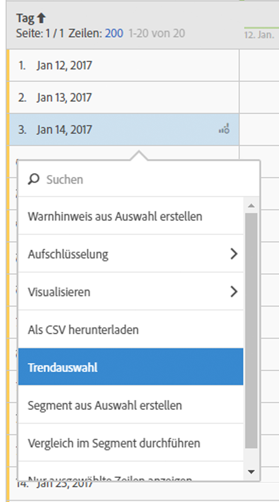

# Freiform-Tabelle

Im Analysis Workspace ist eine Datentabelle (Freiform-Tabelle) nicht nur eine Berichtstabelle, sondern auch eine interaktive Visualisierung. Sie können mit einzelnen Zeilen, mehreren ausgewählten Zeilen oder der gesamten Tabelle interagieren.

In einer Tabelle können bis zu 400 Zeilen angezeigt werden.

Sie können mit der Tabelle einzigartig interagieren:

* Einen [Warnhinweis aus einer Tabellenauswahl erstellen](/help/components/c-alerts/alert-builder.md)
* Ausführen [Aufschlüsselungen](../../../analyze/analysis-workspace/components/dimensions/t-breakdown-fa.md#task_B594DA2476E84DFDA8279E831F0BD9C4) ausführen und Inline-Segmente erstellen (Rechtsklick)
* [Visualisierungen](../../../analyze/analysis-workspace/visualizations/freeform-analysis-visualizations.md#concept_09242627629147A88A68F1506954C276) für bestimmte Zellen ausführen
* Export rows to [CSV](../../../analyze/analysis-workspace/curate-share/download-send.md#concept_BB548979F47F45739679B830428C3025)
* [Trend](../../../analyze/analysis-workspace/analysis-workspace-features.md#section_34930C967C104C2B9092BA8DCF2BF81A)-Visualisierungen für ausgewählte Zellen durchführen
* Erstellung     [von Segmenten](../../../analyze/analysis-workspace/components/t-freeform-project-segment.md#task_11C6A2C7717B48049E5750B9D20FEC80) anhand der Auswahl
* Perform a [segment comparison](../../../analyze/analysis-workspace/c-panels/c-segment-comparison/segment-comparison.md#concept_74FAC1C6D0204F9190A110B0D9005793)
* Nur ausgewählte Zeilen anzeigen

See [Create an Analysis Workspace project](../../../analyze/analysis-workspace/build-workspace-project/t-freeform-project.md#task_C2C698ACC7954062A28E4784911E6CF2) for more information.
