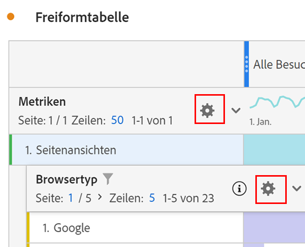

# Zeileneinstellungen

Die Zeileneinstellungen variieren je nachdem, welche Komponente Sie in die Tabelle gezogen haben. Um auf die Tabellenzeileneinstellungen zuzugreifen, klicken Sie auf das Einstellungs-Symbol neben einer Dimension, einem Segment, einer Metrik, einem Zeitraum oder einer Aufschlüsselung im jeweiligen Element:

| Einstellung | Beschreibung |
|--- |--- |
| Datum ausrichten | Mit dieser Einstellung auf Tabellenebene können Sie die Daten in allen Spalten so ausrichten, dass sie alle in derselben Zeile beginnen. Die Datumsausrichtung ist standardmäßig aktiviert, wenn eine Zeitdimension in den Tabellenzeilen verwendet wird und unterschiedliche Datumsbereiche in den Spalten angewendet werden. In einer täglichen Tabelle, bei der Oktober und September auf die Spalten angewendet werden, beginnt beispielsweise die linke Spalte mit dem 1. Oktober und die rechte Spalte mit dem 1. September. |
| Aufschlüsselung nach Position | Standardmäßig ist diese Einstellung deaktiviert und die Aufschlüsselungen sind auf statische Zeilenelemente festgelegt. Angenommen, Sie schlüsseln die drei oberen Elemente der Dimension „Seite“ (Startseite, Suchergebnisse, Checkout) nach Marketing-Kanälen auf. Dann verlassen Sie das Projekt und kehren zwei Wochen später zurück. Beim erneuten Öffnen des Projekts haben sich die drei oberen Seiten geändert, und jetzt sind Startseite, Suchergebnisse und Checkout stattdessen die oberen Seiten vier bis sechs. Standardmäßig werden Ihre Marketing-Kanal-Aufschlüsselungen weiterhin unter Startseite, Suchergebnisse und Checkout angezeigt, auch wenn sie sich jetzt in den Zeilen 4-6 befinden.   Im Gegensatz dazu werden bei einer **Aufschlüsselung nach Position** immer die drei oberen Elemente aufgeschlüsselt, unabhängig davon, was sie sind. Um auf unser Beispiel zurückzukommen: Wenn Sie Ihr Projekt erneut öffnen, werden die Aufschlüsselungen der Marketing-Kanäle an die ersten 3 Seiten in der Tabelle gebunden, nicht an  Startseite, Suchergebnisse und Checkout, die sich jetzt in den Zeilen 4-6 befinden. |
| Prozentsatz | **Prozentsätze pro Spalte berechnen**: Ist die Standardeinstellung. Die in einer Spalte sichtbaren Prozentsätze werden auf der Grundlage der Spaltensumme berechnet.  **Prozentsätze pro Zeile berechnen**: Erzwingt, dass in der Freiform-Tabelle die Zellprozentsätze über die Zeile anstatt für die Spalte berechnet werden. Dabei sit die Gesamtsumme der Nenner. Dies ist besonders nützlich für die Trend-Darstellung von Prozentangaben. Diese Einstellung ist standardmäßig aktiviert, wenn Sie das Symbol „Visualisieren“ verwenden. |
| Spaltensummen | Diese Einstellungen sind nur für [statische Zeilen](manual-vs-dynamic-rows.md) verfügbar.   **Als Summe der aktuellen Zeilen anzeigen**: Zeigt eine Client-seitige Summe der Zeilen in der Tabelle, was bedeutet, dass die Gesamtsumme die Metriken wie „Besuche“ oder „Besucher“ *nicht* dedupliziert.   **Gesamtsumme anzeigen**: Zeigt eine Server-seitige Summe an, d. h. die Gesamtsumme dedupliziert die Metriken. |
