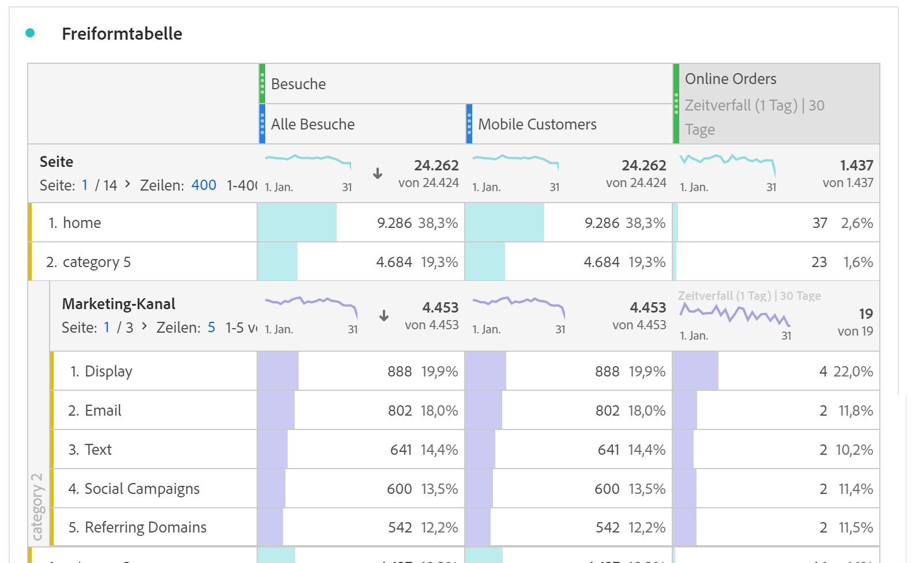
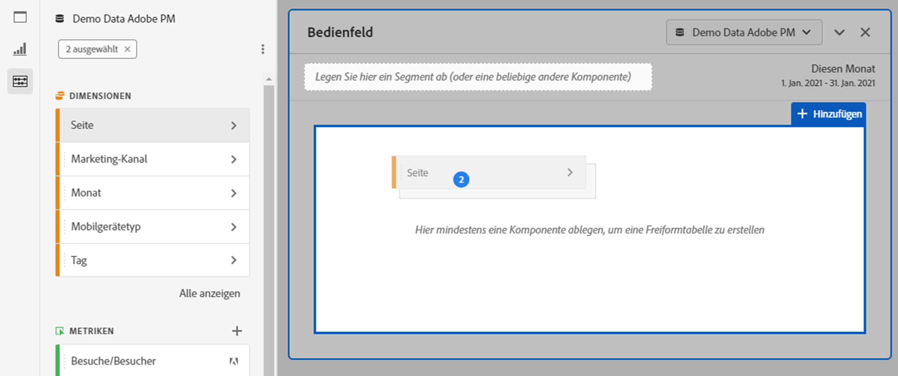
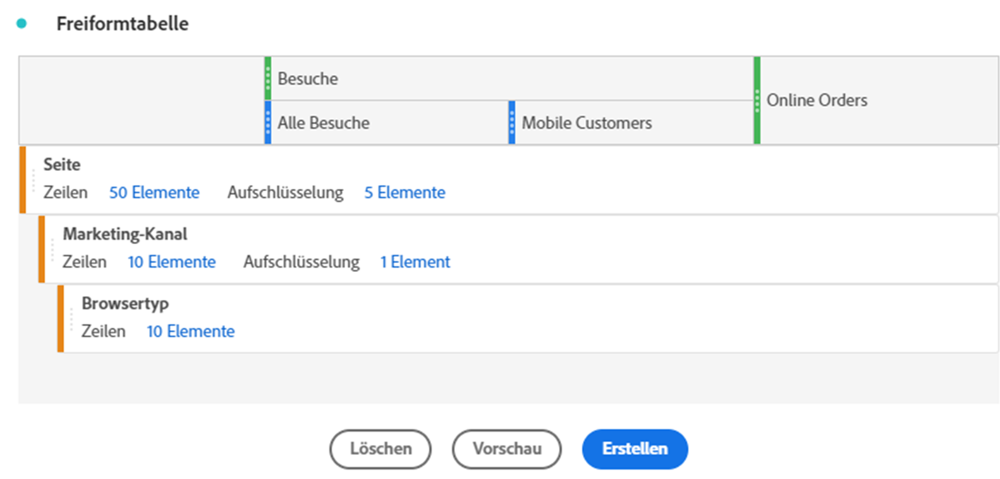
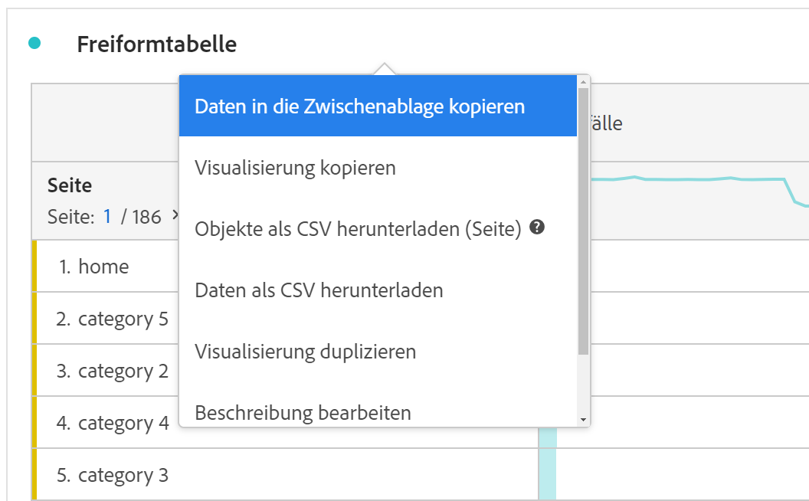

# Freiformtabelle

In Analysis Workspace bildet eine Freiformtabelle die Grundlage für die interaktive Analyse von Daten. You can drag and drop a combination of [components](https://docs.adobe.com/content/help/de-DE/analytics/analyze/analysis-workspace/components/analysis-workspace-components.html) into rows and columns to create a custom table for your analysis. Während jede Komponente abgelegt wird, wird die Tabelle sofort aktualisiert, damit Sie schnell analysieren und tiefer graben können.

## Automatisierte Tabellen

Am schnellsten können Sie eine Tabelle erstellen, indem Sie Komponenten direkt in ein leeres Projekt, einen leeren Bereich oder eine Freiformtabelle ablegen. Eine Freiform-Tabelle wird automatisch in einem empfohlenen Format erstellt. [Sehen Sie sich das Tutorial](https://experienceleague.adobe.com/docs/analytics-learn/tutorials/analysis-workspace/building-freeform-tables/auto-build-freeform-tables-in-analysis-workspace.html)an.

## Freiform-Tabellenaufbau

Wenn Sie Ihrer Tabelle lieber zuerst mehrere Komponenten hinzufügen und dann die Daten rendern möchten, können Sie Freiformtabellen-Builder aktivieren. Wenn der Tabellen-Builder aktiviert ist, können Sie für komplexe Fragen Tabellen mit vielen Dimensionen, Unterteilungen, Metriken und Segmenten per Drag &amp; Drop erstellen. Daten werden nicht sofort aktualisiert. Sie werden erst aktualisiert, wenn Sie auf **[!UICONTROL Erstellen]** klicken.

## Tabelleninteraktionen

Sie können mit Freiform-Tabellen auf verschiedene Arten interagieren und sie anpassen:

* **Zeilen**
   * Sie können mehr Zeilen in einen einzigen Bildschirm einpassen, indem Sie die [Anzeigedichte](https://docs.adobe.com/content/help/de-DE/analytics/analyze/analysis-workspace/build-workspace-project/view-density.html) des Projekts anpassen.
   * Jede Dimensionsreihe kann bis zu 400 Zeilen anzeigen, bevor die Paginierung erfolgt. Klicken Sie auf die Zahl neben &quot;Zeilen&quot;, um weitere Zeilen auf einer Seite anzuzeigen. Navigieren Sie zu einer anderen Seite mit dem Pfeil in der Kopfzeile.
   * Zeilen können nach zusätzlichen Komponenten aufgeschlüsselt werden. Um mehrere Zeilen gleichzeitig zu aufzuschlüsseln, wählen Sie einfach mehrere Zeilen aus und ziehen dann die nächste Komponente auf die ausgewählten Zeilen. Weitere Informationen zu [Aufschlüsselungen](https://docs.adobe.com/content/help/de-DE/analytics/analyze/analysis-workspace/components/dimensions/t-breakdown-fa.html).
   * Zeilen können [gefiltert](https://experienceleague.adobe.com/docs/analytics/analyze/analysis-workspace/visualizations/freeform-table/pagination-filtering-sorting.html?lang=de-DE) werden, um einen reduzierte Anzahl von Elementen anzuzeigen. Weitere Einstellungen finden Sie unter [Zeileneinstellungen](https://docs.adobe.com/content/help/en/analytics/analyze/analysis-workspace/visualizations/freeform-table/column-row-settings/table-settings.html).

* **Spalten**
   * Komponenten können innerhalb von Spalten gestapelt werden, um segmentierte Metriken, tabellenübergreifende Analysen und mehr zu erstellen.
   * Die Ansicht jeder Spalte kann unter den [Spalteneinstellungen](https://docs.adobe.com/content/help/de-DE/analytics/analyze/analysis-workspace/build-workspace-project/column-row-settings/column-settings.html) angepasst werden.
   * Über das [Kontextmenü](https://docs.adobe.com/content/help/en/analytics-learn/tutorials/analysis-workspace/building-freeform-tables/using-the-right-click-menu.html) sind verschiedene Aktionen verfügbar. Das Menü enthält verschiedene Aktionen, je nachdem, ob Sie auf die Tabellenüberschrift, die Zeilen oder die Spalten klicken.

## Exportieren von Freiformtabellendaten

Erfahren Sie mehr über alle Datenexportoptionen [für](https://experienceleague.adobe.com/docs/analytics/analyze/analysis-workspace/curate-share/download-send.html) Analysis Workspace.

* Klicken Sie mit der rechten Maustaste > Daten in die Zwischenablage **[!UICONTROL kopieren]** , um die angezeigten Tabellendaten zu exportieren. Wenn eine Tabellenauswahl vorgenommen wurde, lautet diese Option Auswahl in Zwischenablage **[!UICONTROL kopieren]**. Der **Hotkey Strg+C** kopiert auch ausgewählte Daten.
* Klicken Sie mit der rechten Maustaste > Daten als CSV **[!UICONTROL herunterladen]** , um die angezeigten Tabellendaten als CSV herunterzuladen. Wenn eine Tabellenauswahl vorgenommen wurde, wird bei dieser Option die Option &quot; **[!UICONTROL Herunterladen&quot;als CSV]** ausgewählt.
* Klicken Sie mit der rechten Maustaste auf > **[!UICONTROL Projekt > Elemente als CSV]** herunterladen, um bis zu 50.000 Dimensionselemente für die ausgewählte Dimension zu exportieren.

Erfahren Sie mehr über alle Datenexportoptionen [für](https://experienceleague.adobe.com/docs/analytics/analyze/analysis-workspace/curate-share/download-send.html) Analysis Workspace.

