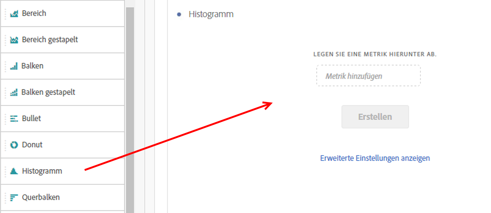
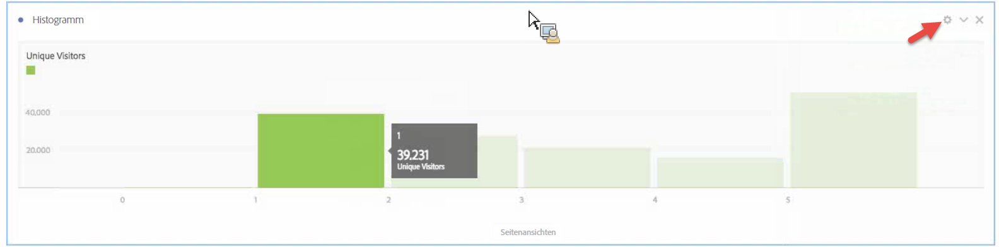
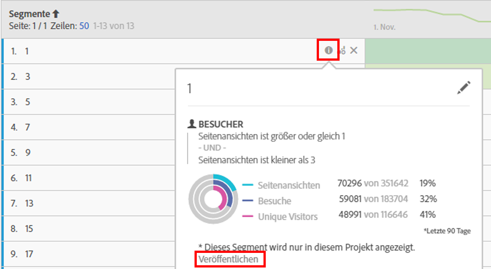

# Histogramm

Ein Histogramm ähnelt einem Balkendiagramm, fasst jedoch Zahlen zu Bereichen (Behältern) zusammen. Analytics automatisiert diese Zusammenfassung von Zahlen zu Bereichen, wobei Sie jedoch die Einstellungen unter [Erweiterte Einstellungen](#section_09D774C584864D4CA6B5672DC2927477) ändern können.

## Erstellen eines Histogramms {#section_74647707CC984A1CB6D3097F43A30B45}

So erstellen Sie ein Histogramm:

1. Klicken Sie in der linken Leiste auf **[!UICONTROL Visualisierungen]**.
1. Ziehen Sie **[!UICONTROL Histogramm]** in das Bedienfeld.
1. Wählen Sie eine Metrik zum Ziehen der Visualisierung „Histogramm“ aus und klicken Sie dann auf **[!UICONTROL Erstellen]**.

>[!NOTE]
>
>Histogramme unterstützen nur Standardmetriken, keine berechneten Metriken.

Hier haben wir die Metrik „Seitenansichten pro Unique Visitors“ verwendet. Das erste Paket (links) bezieht sich auf 1 Seitenansicht pro Unique Visitor, das zweite auf 2 Seitenansichten usw.

## Erweiterte Einstellungen {#section_09D774C584864D4CA6B5672DC2927477}

Wenn Sie die Einstellungen für Ihr Histogramm ändern möchten, klicken Sie auf das Einstellungssymbol (Zahnrad) in der Ecke oben rechts. Die folgenden Einstellungen können Sie ändern:

| Histogramm-Einstellungen | Dient dem folgenden Zweck |
|---|---|
| Startpaket | Bestimmt, mit welchem Paket das Histogramm beginnt. Die Standardeinstellung lautet 1. Sie können Startwerte von null bis unendlich festlegen, jedoch keine negativen Zahlen. |
| Metrische Behälter | Hiermit können Sie die Anzahl der Datumsbereiche (Behälter) erhöhen/verringern. Maximal 50 Behälter sind möglich. |
| Metrische Behältergröße | Hiermit können Sie die Größe der einzelnen Behälter festlegen. So könnten Sie zum Beispiel die Behältergröße von 1 Seitenansicht zu 2 Seitenansichten ändern. |
| Zählmethode | Sie können [Besucher](/help/components/metrics/unique-visitors.md), [Besuch](/help/components/metrics/visits.md) oder [Treffertyp](/help/components/dimensions/hit-type.md) auswählen, z. B. Seitenansichten pro Besuch, Seitenansichten pro Besucher oder Seitenansichten pro Hit. Für Hits wird „Vorkommen“ in der Freiformtabelle als Metrik der Y-Achse verwendet. |

<!--Russ or Meike - Check Hit Type link above. -->

**Beispiele**:

* Startpaket: 1; Metrische Behälter: 5; Metrische Behältergröße: 2 – Diese Werte würden zu dem folgenden Histogramm führen: 1-2, 3-4, 5-6, 7-8, 9-10.
* Startpaket: 0; Metrische Behälter: 3; Metrische Behältergröße: 5 – Diese Werte würden zu dem folgenden Histogramm führen: 0-4, 5-9, 10-14.

## Anzeigen und Bearbeiten von Histogrammdaten {#section_B2CD7CDF0F6B432F928103AE7AAA3617}

Wenn Sie die Datenquelle für das Histogramm-Diagramm anzeigen oder ändern möchten, klicken Sie auf den Punkt neben der Histogramm-Überschrift, und navigieren Sie zu **[!UICONTROL Datenquelleneinstellungen]** > **[!UICONTROL Datenquelle anzeigen]**.

Vorab erstellte Segmente, die in der Tabelle angezeigt werden, sind interne Segmente und werden in der Segmentauswahl nicht angezeigt. Klicken Sie auf das Symbol „i“ neben dem Segmentnamen und klicken Sie dann auf **[!UICONTROL Veröffentlichen]**, um das Segment öffentlich zu machen.

Weitere Möglichkeiten zum Verwalten von Freiform-Datentabellen und anderen Visualisierungen (wie zum Beispiel Datenaufschlüsselungen) finden Sie [hier](https://docs.adobe.com/content/help/de-DE/analytics/analyze/analysis-workspace/visualizations/freeform-analysis-visualizations.html).
