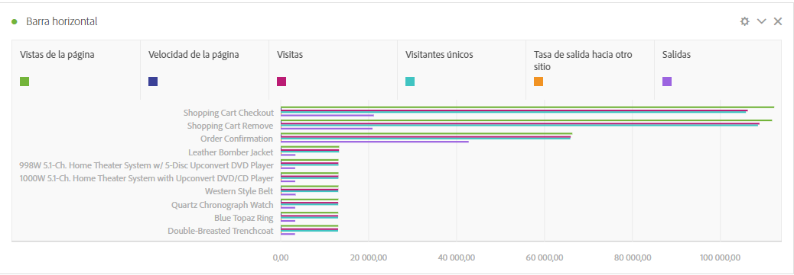
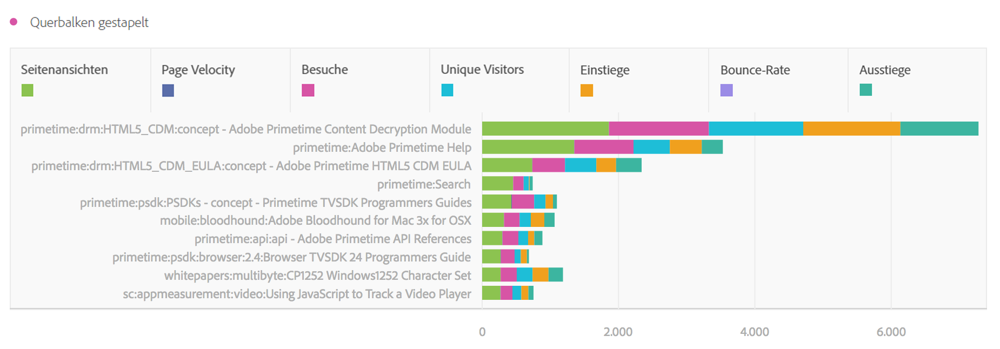
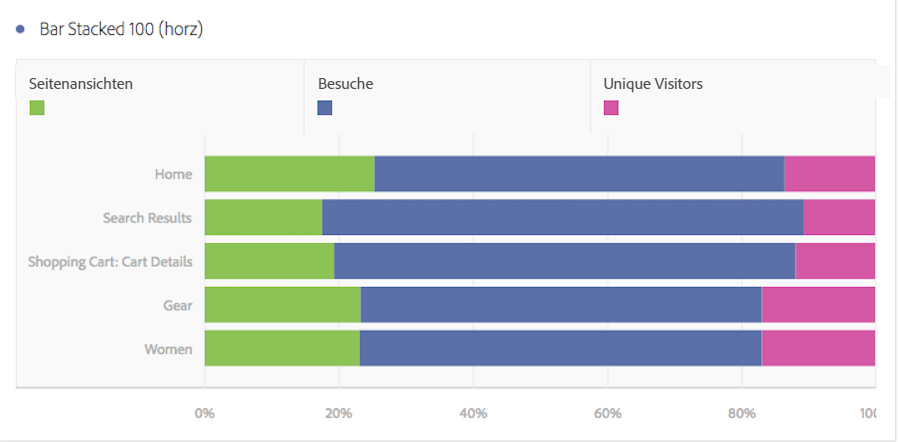

# Horizontalbalken und Horizontalbalken gestapelt

## Horizontalbalken {#section_73A4D6F6C8864045A97B0B32B5FFFEDB}

Diese Visualisierung zeigt Horizontalbalken, die verschiedene Werte aus einer oder mehreren Metriken darstellen.

## Horizontalbalken gestapelt {#section_50C08E9E20A94024A6553BC352ADB597}

Diese Visualisierung entspricht dem [!UICONTROL horizontalen Balkendiagramm], die Serien sind hier jedoch gestapelt.

Mit der neuen Einstellung [!UICONTROL Horizontalbalken gestapelt] erhalten Sie eine zu „100 % gestapelte“ Visualisierung.

